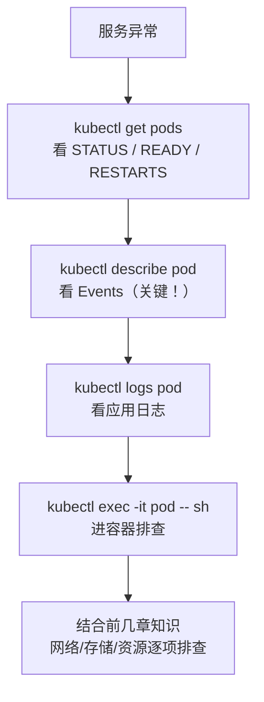

# 运维排障实战

「服务挂了，怎么快速定位」是 K8s 工作中最值钱的能力。本章给出一套**可复用的排查套路**：从 `get` 看状态 → `describe` 看事件 → `logs` 看日志 → `exec` 进容器，配合各异常状态的对照表，让你遇到问题不慌。

## 排查的黄金顺序 {#golden-order}



**永远先看 `describe` 里的 Events**，80% 的问题答案就在那里。

## 常用排查命令全家桶 {#toolkit}

```bash
# 1. 看 Pod 状态
kubectl get pods -n <namespace>
kubectl get pods -o wide                    # 带 IP 和节点
kubectl get pods --show-labels              # 带标签

# 2. 看详细信息与事件（最关键）
kubectl describe pod <pod-name>
kubectl describe deployment <deploy-name>
kubectl describe node <node-name>

# 3. 看日志
kubectl logs <pod-name>                     # 单容器
kubectl logs <pod-name> -c <container>      # 多容器指定
kubectl logs <pod-name> --tail=100          # 最后 100 行
kubectl logs <pod-name> -f                  # 跟踪
kubectl logs <pod-name> --previous          # 看上一个崩溃容器的日志
kubectl logs -l app=web --all-containers    # 按标签看所有

# 4. 进入容器
kubectl exec -it <pod-name> -- sh
kubectl exec <pod-name> -- <command>        # 执行单条命令

# 5. 看事件
kubectl get events --sort-by=.metadata.creationTimestamp
kubectl get events -n <namespace> -w        # 实时看

# 6. 看资源使用
kubectl top pods
kubectl top nodes

# 7. 复制文件
kubectl cp <pod-name>:/path/file ./file
kubectl cp ./file <pod-name>:/path/file
```

## Pod 异常状态定位 {#pod-status-troubleshooting}

### 1. Pending（一直调度不上去）{#pending}

```bash
kubectl describe pod <pod-name>
# 看 Events 里常见原因：
# - 0/3 nodes are available: 3 Insufficient cpu.  → 资源不足
# - 0/3 nodes are available: 3 node(s) had taint... → 污点排斥
# - 0/3 nodes are available: 3 pod has unbound PVC  → PVC 没绑定
```

| 原因 | 解决 |
|------|------|
| `Insufficient cpu/memory` | 降低 requests，或扩容节点 |
| `node(s) had taint` | 加 toleration，或换节点 |
| `pod has unbound PVC` | 检查 PVC 是否 Bound、StorageClass 是否存在 |
| `didn't match node selector` | 检查 nodeSelector/affinity 与节点标签 |

### 2. CrashLoopBackOff（反复重启）{#crashloop}

```bash
kubectl describe pod <pod-name>      # 看 Last State: Terminated 的原因
kubectl logs <pod-name> --previous   # 看崩溃前日志

# 常见原因：
# - OOMKilled：内存超 limits，调大 limits 或优化内存
# - Error：容器启动命令报错
# - Exit Code 1/137/139
```

| Exit Code | 含义 |
|-----------|------|
| `0` | 正常退出 |
| `1` | 应用错误 |
| `137` | 被 SIGKILL（通常是 OOM 或手动 kill） |
| `139` | 段错误（segfault） |
| `143` | 被 SIGTERM（优雅终止） |

> 看到 `Exit Code 137` + 状态 `OOMKilled`，基本就是内存超限，调大 `limits.memory` 或查内存泄漏。

### 3. ImagePullBackOff / ErrImagePull {#imagepull}

```bash
kubectl describe pod <pod-name>
# 常见原因：
# - 镜像名/标签写错
# - 私有仓库没配 imagePullSecrets
# - 仓库网络不通
```

```yaml
# 私有仓库需配 imagePullSecrets
spec:
  imagePullSecrets:
    - name: my-registry-secret
```

```bash
# 创建 docker-registry secret
kubectl create secret docker-registry my-registry-secret \
  --docker-server=registry.example.com \
  --docker-username=user \
  --docker-password=pass
```

### 4. 一直 Running 但 READY 是 0/1 {#not-ready}

```bash
kubectl describe pod <pod-name>
# 看 Conditions 里的 Ready: False 和 readinessProbe 报错
```

几乎都是 **readinessProbe 失败**（探针路径/端口配错，或应用还没就绪）。

### 5. Evicted（被驱逐）{#evicted}

```bash
kubectl get pods | grep Evicted
# 节点磁盘/内存压力导致的驱逐
```

```bash
# 清理 Evicted 的 Pod
kubectl get pods --all-namespaces | grep Evicted | awk '{print $2" -n "$1}' | xargs -n 3 kubectl delete pod
```

## 网络排障 {#network-troubleshoot}

```bash
# 1. 服务通不通：看 Endpoints 是否为空
kubectl get endpoints <svc-name>
# 空 ENDPOINTS → selector 没匹配到 Pod

# 2. 用 netshoot 测试
kubectl run netshoot --rm -it --image=nicolaka/netshoot -- sh
# 进去后：
nslookup <service>            # 测 DNS
curl http://<service>:<port>  # 测 Service
nc -zv <pod-ip> <port>        # 测端口

# 3. 看 kube-proxy / 网络组件
kubectl get pods -n kube-system | grep -E "kube-proxy|calico|cilium|flannel"

# 4. 端口转发本地调试
kubectl port-forward pod/<pod-name> 8080:80
```

## 存储排障 {#storage-troubleshoot}

```bash
# PVC 一直 Pending
kubectl describe pvc <pvc-name>
# 常见：StorageClass 不存在、没有可用的 PV

kubectl get storageclass
kubectl get pv

# Pod 挂载失败
kubectl describe pod <pod-name>   # 看 Events 里的 mount 错误
```

## 进入容器调试技巧 {#debug}

### 容器没有 shell / 工具怎么办

```bash
# 用临时 debug 容器（K8s 1.23+ 的 ephemeral container）
kubectl debug -it <pod-name> --image=nicolaka/netshoot --target=<container-name>

# 或者复制文件出来看
kubectl cp <pod-name>:/etc/config ./config

# 看进程
kubectl exec <pod-name> -- ps aux
```

### 快速改配置验证

```bash
# 用 edit 临时改（验证后记得改回 YAML 源文件）
kubectl edit deployment web

# 或者 dry-run 生成 YAML 检查
kubectl create deployment web --image=nginx --dry-run=client -o yaml
```

## 日志与事件管理 {#logs-events}

```bash
# 看最近事件
kubectl get events --sort-by='.lastTimestamp' -n <namespace>

# 事件保留时间有限（通常 1 小时），长期要接日志系统
# 生产环境：EFK/ELK、Loki、云日志服务

# 快速统计重启次数多的 Pod
kubectl get pods -A -o jsonpath='{range .items[*]}{.metadata.namespace}{"/"}{.metadata.name}{"  restarts="}{.status.containerStatuses[0].restartCount}{"\n"}{end}' | sort -t= -k2 -rn | head
```

## 高频问题速查表 {#cheatsheet}

| 症状 | 快速定位 | 常见根因 |
|------|---------|---------|
| Pod Pending | `describe pod` Events | 资源不足 / 污点 / PVC 未绑定 |
| CrashLoopBackOff | `logs --previous` + Exit Code | OOM / 启动命令错误 |
| ImagePullBackOff | `describe pod` | 镜像名错误 / 私有仓库凭据 |
| READY 0/1 | `describe pod` Conditions | readinessProbe 失败 |
| 服务访问不通 | `get endpoints` | selector 不匹配 |
| 域名解析失败 | Pod 里 `nslookup` | CoreDNS 问题 / 写错服务名 |
| 磁盘满 | `df -h` + `get events` | 日志没轮转 / 数据卷满 |
| 节点 NotReady | `describe node` | kubelet 异常 / 磁盘压力 |

## 排查思路总结 {#summary}

排障的核心是一套**顺序化的检查流程**：

1. **`get` 看现象**（状态、重启次数、IP）
2. **`describe` 看原因**（Events 是最快的线索源）
3. **`logs` 看日志**（含 `--previous` 看崩溃前）
4. **`exec` 进现场**（验证、测网络、看配置）

配合本章的「异常状态对照表」，90% 的线上问题都能在几分钟内定位到根因。下一章讲 Helm——当你要交付一整套应用（而非单个 Deployment）时，它是标准方案。
