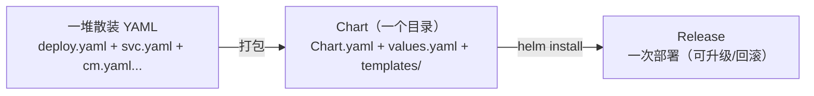

# Helm 包管理

当你要交付的不再是单个 Deployment，而是「一个应用 + 它的 ConfigMap + Secret + Service + Ingress + PVC」一整套资源时，手写一堆 YAML 又难维护又难复用。**Helm** 是 K8s 的「包管理器」（类似 apt/yum/npm），把一组 K8s 资源打包成 **Chart**，支持参数化、版本化、复用与升级回滚。

## 为什么用 Helm {#why}



| 传统 YAML | Helm |
|-----------|------|
| 多环境要复制粘贴改 YAML | 一套 Chart + 不同 values 文件 |
| 没有版本概念 | Chart 有版本号，Release 可回滚 |
| 每次部署手动 apply 多个文件 | 一条 `helm install/upgrade` |
| 无法复用他人成果 | 从仓库拉现成 Chart（nginx、mysql、prometheus） |

## 安装 Helm {#install}

```bash
# macOS
brew install helm

# Linux
curl https://raw.githubusercontent.com/helm/helm/main/scripts/get-helm-3 | bash

# 验证
helm version
```

## 基本概念 {#concepts}

| 术语 | 含义 |
|------|------|
| **Chart** | 打包好的应用模板（一个目录或 .tgz 包） |
| **Release** | Chart 在集群的一次实例化（每次 install 产生一个 release） |
| **Repository** | Chart 仓库（类似镜像仓库） |
| **values.yaml** | 默认配置值 |
| **模板** | templates/ 下的 YAML 模板（用 Go template 语法） |

## 使用现成 Chart {#use-chart}

### 添加仓库并安装

```bash
# 添加官方仓库
helm repo add bitnami https://charts.bitnami.com/bitnami
helm repo add prometheus-community https://prometheus-community.github.io/helm-charts

# 更新仓库索引
helm repo update

# 搜索 Chart
helm search repo nginx
helm search repo mysql

# 安装
helm install my-nginx bitnami/nginx

# 查看已安装的 release
helm list
# NAME      NAMESPACE  REVISION  UPDATED  STATUS    CHART          APP VERSION
# my-nginx  default    1         ...      deployed  nginx-15.x.x   1.27.x
```

### 用 values 定制

```bash
# 查看 Chart 的可配置项
helm show values bitnami/nginx

# 用 --set 覆盖
helm install my-nginx bitnami/nginx --set replicaCount=3

# 用 values 文件覆盖（推荐）
cat > my-values.yaml <<'EOF'
replicaCount: 3
service:
  type: LoadBalancer
resources:
  limits:
    cpu: 500m
    memory: 512Mi
EOF
helm install my-nginx bitnami/nginx -f my-values.yaml
```

### 升级与回滚 {#upgrade-rollback}

```bash
# 升级（改 values 或版本）
helm upgrade my-nginx bitnami/nginx -f my-values.yaml
helm upgrade my-nginx bitnami/nginx --version 15.1.0

# 查看历史
helm history my-nginx
# REVISION  UPDATED  STATUS     CHART         DESCRIPTION
# 1         ...      superseded nginx-15.0.0  Install complete
# 2         ...      deployed   nginx-15.1.0  Upgrade complete

# 回滚到上一个版本
helm rollback my-nginx

# 回滚到指定 revision
helm rollback my-nginx 1

# 卸载
helm uninstall my-nginx
```

## 创建自己的 Chart {#create-chart}

```bash
# 脚手架生成
helm create my-app

# 生成的目录结构
my-app/
├── Chart.yaml          # Chart 元数据（名称、版本、描述）
├── values.yaml         # 默认配置值
├── charts/             # 依赖的子 Chart
├── templates/          # 模板文件
│   ├── deployment.yaml
│   ├── service.yaml
│   ├── hpa.yaml
│   ├── ingress.yaml
│   ├── serviceaccount.yaml
│   ├── _helpers.tpl    # 模板辅助函数（命名约定等）
│   └── tests/          # 测试
└── .helmignore
```

### Chart.yaml 关键字段

```yaml
apiVersion: v2
name: my-app
description: 我的应用
type: application        # application 或 library
version: 0.1.0           # Chart 版本（Helm 管理）
appVersion: "1.16.0"     # 应用版本（业务管理）
```

### values.yaml 定义默认值

```yaml
replicaCount: 2

image:
  repository: nginx
  tag: "1.27"
  pullPolicy: IfNotPresent

service:
  type: ClusterIP
  port: 80

ingress:
  enabled: false

resources:
  limits:
    cpu: 500m
    memory: 512Mi
  requests:
    cpu: 250m
    memory: 256Mi
```

### 模板语法（Go template）{#templating}

```yaml
# templates/deployment.yaml
apiVersion: apps/v1
kind: Deployment
metadata:
  name: {{ .Release.Name }}-my-app      # release 名 + 应用名
  labels:
    app: {{ .Chart.Name }}
spec:
  replicas: {{ .Values.replicaCount }}  # 引用 values
  selector:
    matchLabels:
      app: {{ .Chart.Name }}
  template:
    metadata:
      labels:
        app: {{ .Chart.Name }}
    spec:
      containers:
        - name: {{ .Chart.Name }}
          image: "{{ .Values.image.repository }}:{{ .Values.image.tag }}"
          imagePullPolicy: {{ .Values.image.pullPolicy }}
          ports:
            - containerPort: {{ .Values.service.port }}
          resources:
            {{- toYaml .Values.resources | nindent 12 }}   # 整块注入
```

常用模板函数：

| 语法 | 作用 |
|------|------|
| `{{ .Values.xxx }}` | 引用 values |
| `{{ .Release.Name }}` | release 名 |
| `{{ .Chart.Name }}` | Chart 名 |
| `{{ if }} {{ else }} {{ end }}` | 条件判断 |
| `{{ range }} {{ end }}` | 循环 |
| `{{ default "x" .Values.y }}` | 默认值 |
| `{{ toYaml .Values.x | nindent 12 }}` | 整块 YAML 注入并缩进 |
| `{{ include "fullname" . }}` | 引用 _helpers.tpl 的模板 |
| `{{- ` / `-}}` | 去掉空白 |

### 验证模板渲染 {#render-check}

```bash
# 渲染出最终 YAML（不实际部署），排查模板问题
helm template my-app ./my-app -f values-prod.yaml

# 或 dry-run 安装
helm install my-app ./my-app --dry-run --debug

# 语法检查
helm lint ./my-app
```

## 多环境管理：不同 values 文件 {#multi-env}

企业最常见做法：**一套 Chart + 多套 values**。

```bash
my-app/
├── Chart.yaml
├── values.yaml            # 默认（开发）
├── values-staging.yaml    # 预发布
└── values-prod.yaml       # 生产
```

```yaml
# values-prod.yaml
replicaCount: 5
image:
  repository: registry.example.com/my-app
  tag: "1.16.0"
resources:
  limits:
    cpu: "2"
    memory: 2Gi
ingress:
  enabled: true
  hosts:
    - host: app.example.com
```

```bash
# 部署到不同环境
helm install my-app ./my-app -f values-staging.yaml -n staging
helm install my-app ./my-app -f values-prod.yaml -n production
```

## 私有 Chart 仓库 {#private-repo}

```bash
# 1. 打包 Chart 成 .tgz
helm package ./my-app
# 生成 my-app-0.1.0.tgz

# 2. 推送到私有仓库（如 Harbor / OCI 仓库）
# Harbor 支持 OCI 协议：
helm registry login harbor.example.com
helm push my-app-0.1.0.tgz oci://harbor.example.com/my-project

# 或自建 ChartMuseum / 用 GitHub Pages 托管 index.yaml

# 3. 添加私有仓库
helm repo add my-repo https://harbor.example.com/chartrepo/my-project
helm install my-app my-repo/my-app -f values-prod.yaml
```

## 企业 Chart 组织最佳实践 {#enterprise-chart}

1. **一个应用一个 Chart**，不要把所有服务塞进一个大 Chart。
2. **values 分层**：`values.yaml`（默认）+ 环境专属 values（staging/prod）。
3. **Chart 版本化**：每次改动 bump `version`，配合 Git tag。
4. **敏感信息不进 Chart**：密码用 Secret + 外部管理（External Secrets），或 install 时 `--set` 注入。
5. **用 `_helpers.tpl` 统一命名**：避免 release 名 + 应用名拼接出超长名字（K8s 名称限 63 字符）。
6. **写测试**：templates/tests 下放测试 Pod，`helm test` 验证部署。

```bash
# 运行 Chart 测试
helm test my-app
```

## Helm 与 Kustomize 的对比 {#helm-vs-kustomize}

| 维度 | Helm | Kustomize |
|------|------|-----------|
| 定位 | 包管理 + 模板化 | 原生 YAML 配置叠加 |
| 模板 | Go template（可编程） | 无模板（基于 patch 覆盖） |
| 复用 | Chart 打包分发 | 基础 YAML + overlay |
| 复杂逻辑 | 支持（if/range/函数） | 有限 |
| 内置 | 需单独安装 | kubectl 内置（`kubectl apply -k`） |
| 适用 | 交付可复用的应用包 | 多环境配置管理 |

> 两者常**配合使用**：Helm 打包应用、Kustomize 做环境差异化覆盖。企业也常用 Argo CD + Helm 做 GitOps。

## 小结 {#summary}

Helm 是 K8s 应用交付的标准工具：**用 Chart 打包一组资源 + values 参数化 + Release 管理生命周期**。工作中重点掌握三件事——**用现成 Chart 快速部署中间件**（`helm repo add` + `install`）、**给自己的应用写 Chart**（`helm create` + 模板语法 + 多环境 values）、**升级回滚**（`upgrade` / `rollback`）。下一章收尾：企业级落地要关注的 Namespace、RBAC、GitOps、监控、备份等治理能力。
