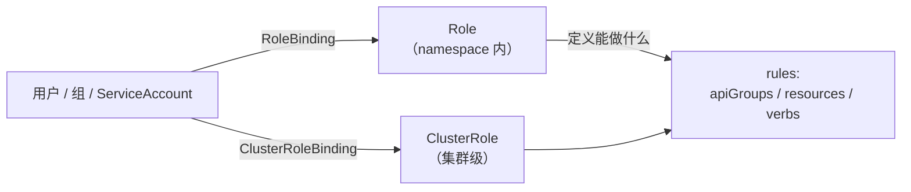
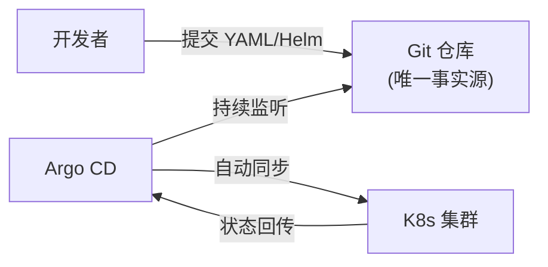
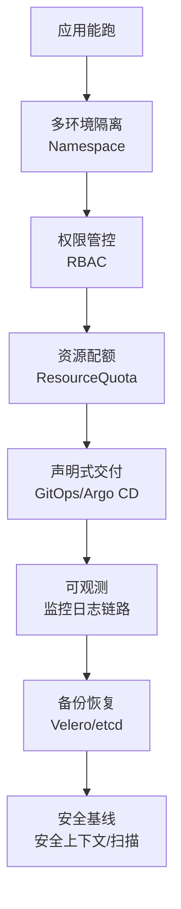

# 企业级落地实践

前面七章解决了「怎么跑起来」，本章解决「怎么**规范地、安全地、可观测地**跑起来」——这是个人项目与企业生产环境的分水岭。涵盖多租户隔离（Namespace）、权限（RBAC）、配额（ResourceQuota）、GitOps 交付（Argo CD）、可观测性、备份恢复与发布策略。

## Namespace：多租户隔离 {#namespace}

Namespace 是 K8s 的资源逻辑分组，企业用它隔离环境/团队。

```bash
# 创建 namespace
kubectl create namespace dev
kubectl create namespace staging
kubectl create namespace production

# 查看
kubectl get namespaces

# 指定 namespace 操作
kubectl get pods -n production

# 设置默认 namespace（减少 -n 重复）
kubectl config set-context --current --namespace=dev
```

```yaml
# ns.yaml
apiVersion: v1
kind: Namespace
metadata:
  name: production
  labels:
    env: prod
```

### 常见命名规范

| Namespace | 用途 |
|-----------|------|
| `dev` / `staging` / `prod` | 按环境 |
| `team-a` / `team-b` | 按团队 |
| `monitoring` / `logging` / `ingress-nginx` | 按基础设施 |
| `kube-system` | K8s 自身组件（勿动） |

> 注意：Namespace **不提供网络隔离**（除非配 NetworkPolicy），主要是资源与权限的边界。

## RBAC：权限控制 {#rbac}

生产环境**绝不能人人都是 cluster-admin**。RBAC 用 **Role/ClusterRole** 定义权限，用 **RoleBinding/ClusterRoleBinding** 绑定到用户/组/ServiceAccount。



### 一个最小权限的只读角色

```yaml
# 只读角色：只能 get/list/watch
apiVersion: rbac.authorization.k8s.io/v1
kind: Role
metadata:
  namespace: dev
  name: dev-readonly
rules:
  - apiGroups: [""]              # 核心组
    resources: ["pods", "services", "configmaps", "logs"]
    verbs: ["get", "list", "watch"]
---
# 绑定给某个用户/组
apiVersion: rbac.authorization.k8s.io/v1
kind: RoleBinding
metadata:
  namespace: dev
  name: dev-readonly-binding
subjects:
  - kind: User
    name: alice@example.com
    apiGroup: rbac.authorization.k8s.io
roleRef:
  kind: Role
  name: dev-readonly
  apiGroup: rbac.authorization.k8s.io
```

```bash
kubectl apply -f rbac.yaml

# 检查权限
kubectl auth can-i get pods -n dev --as alice@example.com
kubectl auth can-i delete pods -n dev --as alice@example.com
```

### 常用 verb 与 resource

| verb | 含义 |
|------|------|
| `get` / `list` / `watch` | 读取 |
| `create` / `update` / `patch` | 写入 |
| `delete` | 删除 |
| `*` | 全部 |

### 最小权限原则

1. **按团队/角色建 Role**，不要给个人直接绑 cluster-admin。
2. **服务用 ServiceAccount**（每个应用一个），不共享。
3. 定期审计：`kubectl get clusterrolebindings` 看谁有高权限。

```yaml
# 给应用创建一个 ServiceAccount
apiVersion: v1
kind: ServiceAccount
metadata:
  name: my-app-sa
  namespace: production
```

```yaml
# Pod 使用该 ServiceAccount
spec:
  serviceAccountName: my-app-sa
```

## ResourceQuota 与 LimitRange {#quota}

防止某个团队/应用占满集群资源：

```yaml
# ResourceQuota：限制 namespace 总量
apiVersion: v1
kind: ResourceQuota
metadata:
  name: dev-quota
  namespace: dev
spec:
  hard:
    requests.cpu: "10"
    requests.memory: 20Gi
    limits.cpu: "20"
    limits.memory: 40Gi
    persistentvolumeclaims: "10"
    pods: "100"
```

```yaml
# LimitRange：给 Pod/容器设默认 requests/limits（防止有人不设）
apiVersion: v1
kind: LimitRange
metadata:
  name: dev-limits
  namespace: dev
spec:
  limits:
    - default:
        cpu: 500m
        memory: 512Mi
      defaultRequest:
        cpu: 100m
        memory: 128Mi
      type: Container
```

```bash
kubectl apply -f quota.yaml
kubectl describe resourcequota dev-quota -n dev
```

## GitOps：声明式交付（Argo CD）{#gitops}

**GitOps** 核心理念：**Git 是唯一事实源，集群状态自动对齐 Git 仓库**。Argo CD 是最主流的实现。



### Argo CD 核心概念

| 概念 | 含义 |
|------|------|
| **Application** | 一个应用的声明（指向哪个 Git 仓库 + 哪个路径） |
| **Sync** | 把集群实际状态同步到 Git 期望状态 |
| **Health** | 应用健康状态（Healthy/Degraded） |
| **Auto-sync** | 自动同步（Git 一变就自动部署） |

```yaml
# argocd application 示例
apiVersion: argoproj.io/v1alpha1
kind: Application
metadata:
  name: my-app
  namespace: argocd
spec:
  project: default
  source:
    repoURL: https://github.com/team/my-app-deploy.git
    path: overlays/production
    targetRevision: main
  destination:
    server: https://kubernetes.default.svc
    namespace: production
  syncPolicy:
    automated:
      prune: true            # 删除 Git 里已移除的资源
      selfHeal: true         # 自动纠正手动改动
```

```bash
# 安装 Argo CD
kubectl create namespace argocd
kubectl apply -n argocd -f https://raw.githubusercontent.com/argoproj/argo-cd/stable/manifests/install.yaml

# 访问 Argo CD 控制台
kubectl port-forward svc/argocd-server -n argocd 8080:443
```

### GitOps 的价值

- **可审计**：所有变更都在 Git 里，谁改了什么一目了然
- **可回滚**：回滚 = `git revert` + 重新 sync
- **防漂移**：手动改集群会被自动纠正（selfHeal）
- **灾难恢复快**：新集群从 Git 一键重建

## 可观测性：监控、日志、链路 {#observability}

### 监控：Prometheus + Grafana

```bash
# 用 Helm 一键部署 kube-prometheus-stack
helm repo add prometheus-community https://prometheus-community.github.io/helm-charts
helm install monitoring prometheus-community/kube-prometheus-stack \
  --namespace monitoring --create-namespace
```

监控四个黄金指标（每个服务都应关注）：

| 指标 | 含义 | 告警示例 |
|------|------|------|
| **延迟（Latency）** | 请求耗时 | P99 > 500ms |
| **流量（Traffic）** | 请求量/QPS | 突降 |
| **错误（Errors）** | 错误率 | 5xx > 1% |
| **饱和度（Saturation）** | 资源使用率 | CPU > 80% |

### 日志：Loki 或 EFK

```bash
# Loki + Grafana（轻量）
helm repo add grafana https://grafana.github.io/helm-charts
helm install loki grafana/loki-stack --namespace logging --create-namespace
```

### 链路追踪：OpenTelemetry

生产微服务排查跨服务调用，用 OpenTelemetry 采集 + Jaeger/Tempo 存储。

## 备份与恢复 {#backup}

### etcd 备份（集群状态）

```bash
# 备份 etcd（在控制面节点执行）
ETCDCTL_API=3 etcdctl snapshot save /backup/etcd-$(date +%F).db \
  --endpoints=https://127.0.0.1:2379 \
  --cacert=/etc/kubernetes/pki/etcd/ca.crt \
  --cert=/etc/kubernetes/pki/etcd/server.crt \
  --key=/etc/kubernetes/pki/etcd/server.key

# 恢复
ETCDCTL_API=3 etcdctl snapshot restore /backup/etcd-2026-09-06.db --data-dir /var/lib/etcd-restored
```

### 应用数据备份

- **Velero**：K8s 原生备份工具，支持备份资源 + PV 快照到对象存储。

```bash
# 安装 Velero（配合云厂商对象存储）
velero install --provider aws \
  --plugins velero/velero-plugin-for-aws:v1.9.0 \
  --bucket my-backup-bucket \
  --secret-file ./credentials-velero

# 备份整个 namespace
velero backup create prod-backup --include-namespaces production

# 恢复
velero restore create --from-backup prod-backup
```

## 发布策略 {#release-strategy}

| 策略 | 原理 | 适用 |
|------|------|------|
| **滚动更新** | 逐步替换旧 Pod | 默认，最常用 |
| **蓝绿部署** | 两套环境切换流量 | 需要秒级回滚 |
| **金丝雀/灰度** | 少量流量切到新版本 | 谨慎发布、A/B 测试 |

### 滚动更新（K8s 默认）

```yaml
spec:
  strategy:
    type: RollingUpdate
    rollingUpdate:
      maxSurge: 1
      maxUnavailable: 0
```

### 金丝雀发布（用 Ingress 切流量）

```yaml
# 用 Ingress 把 10% 流量切到新版本
apiVersion: networking.k8s.io/v1
kind: Ingress
metadata:
  name: web-canary
  annotations:
    nginx.ingress.kubernetes.io/canary: "true"
    nginx.ingress.kubernetes.io/canary-weight: "10"
spec:
  rules:
    - host: app.example.com
      http:
        paths:
          - path: /
            pathType: Prefix
            backend:
              service:
                name: web-v2
                port: { number: 80 }
```

## 安全基线（Security Checklist）{#security}

```yaml
# 1. 不以 root 运行
spec:
  securityContext:
    runAsNonRoot: true
    runAsUser: 1000
    fsGroup: 2000

# 2. 禁止特权容器
    allowPrivilegeEscalation: false
    capabilities:
      drop: ["ALL"]

# 3. 只读文件系统（如适用）
    readOnlyRootFilesystem: true
```

| 安全项 | 做法 |
|--------|------|
| 镜像安全 | 用受信任基础镜像、扫描漏洞（Trivy/Clair） |
| 不以 root 跑 | `runAsNonRoot: true` |
| 最小权限 | 每个应用独立 ServiceAccount + 最小 Role |
| 网络隔离 | NetworkPolicy 限制东西向流量 |
| 密钥管理 | Secret + External Secrets，不入 Git |
| 准入控制 | 用 PodSecurity/Polaris/OPA 拦截不合规 Pod |

## 企业落地清单总结 {#checklist}

从「个人玩具」到「企业生产」的进阶路径：



## 小结 {#summary}

本章补全了企业级 K8s 的「软实力」：**Namespace 分环境、RBAC 控权限、ResourceQuota 限资源、Argo CD 做 GitOps、Prometheus/Loki 做可观测、Velero 做备份、安全上下文做基线**。到这里，K8s 教程八章全部完成——从集群接入、应用发布、网络、存储、调度、排障、Helm 到企业治理，覆盖了「入职到熟练」的完整技能链。建议结合真实集群多动手，排障能力尤其需要实战积累。
