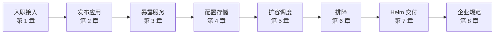

# Kubernetes 使用教程

Kubernetes（简称 **K8s**）是当下容器编排的事实标准。本教程**不从概念堆砌出发，而从「你入职后第一天会用到什么」切入**——如何连接集群、如何发布应用、如何排查线上问题、如何用 Helm 交付，每一步都配可直接复制到生产/测试环境的命令与 YAML。

## 章节 {.cards}

- [第一章：架构与集群接入](/docs/kubernetes/01-architecture-setup/) — 控制面/节点组件、kubectl 与 kubeconfig、本地 kind 集群、多集群 context 切换
- [第二章：Pod 与工作负载](/docs/kubernetes/02-workloads/) — Pod 生命周期、Deployment 滚动更新回滚、StatefulSet/DaemonSet/Job、探针
- [第三章：服务暴露与网络](/docs/kubernetes/03-service-ingress/) — Service 四种类型、Ingress、CoreDNS、NetworkPolicy
- [第四章：配置与存储](/docs/kubernetes/04-config-storage/) — ConfigMap/Secret、环境变量注入、Volume、PV/PVC/StorageClass
- [第五章：资源调度与弹性伸缩](/docs/kubernetes/05-scheduling-scaling/) — requests/limits、QoS、亲和性、污点容忍、HPA
- [第六章：运维排障实战](/docs/kubernetes/06-troubleshooting/) — kubectl 排查全家桶、Pod 异常状态定位、日志/事件/exec、速查表
- [第七章：Helm 包管理](/docs/kubernetes/07-helm/) — Chart 结构、values、模板、release 生命周期、私有仓库
- [第八章：企业级落地实践](/docs/kubernetes/08-enterprise-practices/) — Namespace/RBAC/Quota、GitOps、监控告警、备份恢复、发布策略

## 学习路线（按工作场景）

- **只想快速跑起来**：1 → 2 → 3 → 6
- **要接手生产环境**：再加 4 → 5 → 8
- **要负责应用交付**：加 7
