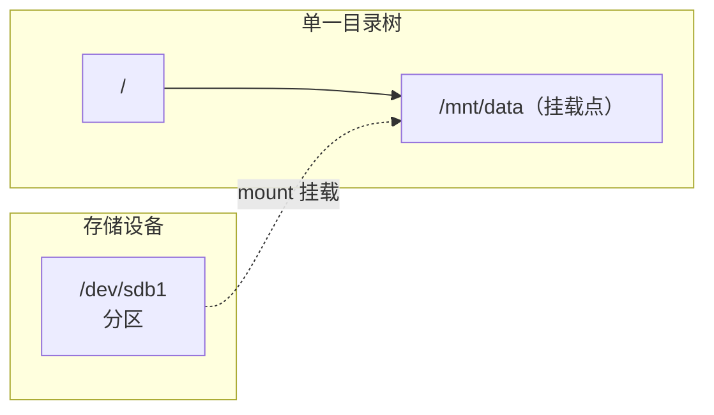

# mount 磁盘挂载

Linux 采用**单一目录树**结构，所有存储设备（磁盘、分区、U 盘、网络盘）都要「挂载（mount）」到某个目录后，才能通过该目录访问。`mount` 就是完成这个挂载的命令。

## 一、挂载的基本概念



- **设备**：如 `/dev/sdb1`（第二块磁盘第一个分区）、`/dev/sr0`（光驱）。
- **挂载点（mount point）**：目录树中用于接入设备的目录，通常是空目录。
- 挂载后，访问挂载点目录就等于访问该设备的内容。

## 二、查看当前挂载

```bash
mount                      # 查看所有已挂载的文件系统
mount | grep sdb           # 过滤某个设备
df -h                      # 查看磁盘使用情况（人类可读）
lsblk                      # 查看块设备和分区树状结构
lsblk -f                   # 含文件系统类型和 UUID
blkid                      # 查看设备的 UUID 和类型
```

## 三、挂载与卸载

```bash
# 基本挂载：把 /dev/sdb1 挂载到 /mnt/data
sudo mount /dev/sdb1 /mnt/data

# 指定文件系统类型
sudo mount -t ext4 /dev/sdb1 /mnt/data
sudo mount -t ntfs /dev/sdb1 /mnt/data     # Windows 分区

# 挂载 ISO 镜像
sudo mount -o loop ubuntu.iso /mnt/iso

# 卸载
sudo umount /mnt/data           # 按挂载点卸载
sudo umount /dev/sdb1           # 或按设备卸载
```

> 卸载前确保没有进程占用该目录（否则报 `target is busy`），可用 `lsof /mnt/data` 或 `fuser -m /mnt/data` 查看是谁在占用。

## 四、常用挂载选项（-o）

```bash
sudo mount -o ro /dev/sdb1 /mnt/data       # 只读挂载
sudo mount -o rw /dev/sdb1 /mnt/data       # 读写（默认）
sudo mount -o noexec /dev/sdb1 /mnt/data   # 禁止执行程序
sudo mount -o nosuid /dev/sdb1 /mnt/data   # 禁用 suid（安全）
sudo mount -o remount,rw / /               # 重新挂载根分区为读写
```

多个选项用逗号分隔：`-o ro,noexec`。

## 五、开机自动挂载：/etc/fstab

`mount` 手动挂载在重启后失效。要开机自动挂载，需写入 `/etc/fstab`。

### fstab 格式

每行 6 个字段，空格分隔：

```
设备/UUID   挂载点   文件系统   选项   dump  fsck
```

```bash
# 查看设备的 UUID（推荐用 UUID，比 /dev/sdX 稳定）
sudo blkid /dev/sdb1

# 编辑 fstab
sudo vim /etc/fstab

# 示例：用 UUID 自动挂载
UUID=xxxx-xxxx-xxxx  /mnt/data  ext4  defaults  0  2
```

字段说明：

| 字段 | 含义 | 常见值 |
| --- | --- | --- |
| 1. 设备 | 设备路径或 UUID | `UUID=...`、`/dev/sdb1` |
| 2. 挂载点 | 目录 | `/mnt/data` |
| 3. 文件系统 | 类型 | `ext4`、`xfs`、`ntfs`、`nfs` |
| 4. 选项 | 挂载选项 | `defaults`、`ro`、`noatime` |
| 5. dump | 是否备份 | 0 不备份 |
| 6. fsck | 启动检查顺序 | 0 不检查，1 根分区，2 其他 |

### 修改后验证

```bash
# 验证 fstab 语法（不实际挂载）
sudo mount -a
# 若报错说明配置有问题，务必先修正再重启，否则可能无法启动
```

> [!WARNING]
> 修改 `/etc/fstab` 后**必须**先 `mount -a` 验证无报错，否则配置错误会导致系统下次无法正常启动。

## 六、常见文件系统

| 文件系统 | 适用场景 |
| --- | --- |
| `ext4` | Linux 默认，稳定成熟 |
| `xfs` | 大容量、高性能（CentOS 7+ 默认） |
| `ntfs` / `vfat` | Windows 分区 / U 盘（`vfat` 即 FAT32） |
| `nfs` | 网络文件系统 |
| `cifs` / `smbfs` | Samba/Windows 共享 |
| `tmpfs` | 内存文件系统（重启即清空） |

```bash
# 挂载 U 盘（FAT32）
sudo mount -t vfat /dev/sdb1 /mnt/usb

# 挂载网络共享（NFS）
sudo mount -t nfs 192.168.1.10:/data /mnt/nfs

# 挂载 Windows 共享（CIFS，需安装 cifs-utils）
sudo mount -t cifs //192.168.1.10/share /mnt/share -o username=user,password=pass
```

## 七、排错

```bash
# 报 "mount: /mnt/data: mount point does not exist" —— 挂载点不存在
sudo mkdir -p /mnt/data

# 报 "target is busy" —— 有进程占用
lsof /mnt/data            # 找占用进程
fuser -m /mnt/data        # 同上
sudo umount -l /mnt/data  # 懒卸载（强制）

# 报 "unknown filesystem type 'ntfs'" —— 缺驱动
sudo apt install ntfs-3g    # Debian/Ubuntu
sudo yum install ntfs-3g    # CentOS

# 挂载后无权限 —— 挂载选项或权限问题
sudo mount -o uid=1000,gid=1000 /dev/sdb1 /mnt/usb
```

## 小结

- Linux 单一目录树，设备需 `mount` 到挂载点才能访问。
- 基本：`mount 设备 挂载点`、`umount 挂载点`；查看用 `df -h`、`lsblk`、`blkid`。
- 自动挂载写 `/etc/fstab`（6 字段），改后必须 `mount -a` 验证。
- 常用选项：`-o ro/rw`、`noexec`、`nosuid`、`remount`。
- 推荐用 `UUID` 而非 `/dev/sdX`（后者在重启后可能变化）。
