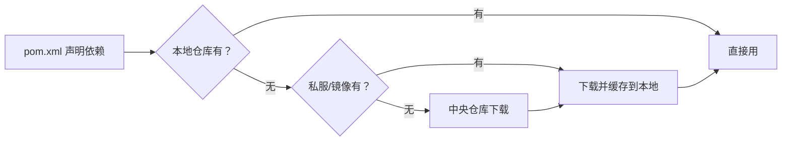
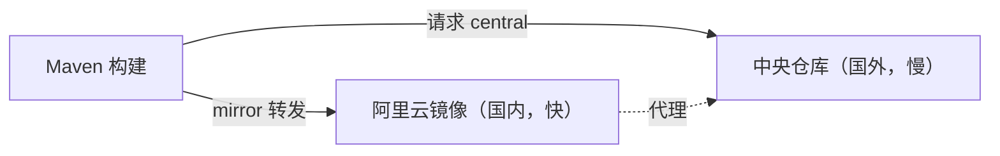

# 基础与坐标

Maven 的核心思想是「**约定优于配置**」：只要按约定放置代码、声明坐标，Maven 就能自动完成编译、测试、打包、发布。先理解它最基本的几个概念，后面的依赖与生命周期才谈得上。

## 为什么需要 Maven {#why-maven}

在 Maven 出现前，Java 项目依赖管理靠「手动下载 jar 包放进 lib 目录」，构建靠 Ant 脚本，每个项目结构五花八门。这带来三大痛点：

1. **依赖混乱**：jar 版本冲突、传递依赖无从追踪、少一个包运行时才报 `ClassNotFoundException`。
2. **构建不统一**：每个团队一套 Ant 脚本，新人上手成本高。
3. **结构各异**：源码目录、测试目录没有规范，工具链难以复用。

Maven 用「统一的目录结构 + 声明式 POM + 约定好的生命周期」一次性解决了这些问题。

## 安装与验证 {#install}

Maven 依赖 JDK。安装后验证：

```bash
mvn -v
# Apache Maven 3.9.x
# Java version: 17.x, vendor: ...
# OS name: windows 11, arch: amd64
```

> [!NOTE]
> Maven 3.9+ 需要 JDK 8 以上；Maven 3.9 要求 Java 8，Maven 4.x 要求 Java 17。构建时的编译目标由 `<maven.compiler.source/target>` 或 `maven-compiler-plugin` 的 release 控制，与运行 Maven 本身的 JDK 版本无关。

## 标准目录约定 {#directory-convention}

Maven 约定了一套固定目录结构，这是「约定优于配置」最直观的体现：

```text
my-project/
├── pom.xml                 # 项目描述文件（核心）
└── src/
    ├── main/
    │   ├── java/           # 主代码（默认源目录）
    │   └── resources/      # 主资源（配置文件等，打包进 classpath）
    └── test/
        ├── java/           # 测试代码
        └── resources/      # 测试资源
```

> [!TIP]
> 只要遵守这套目录，Maven 无需任何配置就能找到源码与资源。这也是为什么打开一个 Maven 项目，往往能立刻猜到它是什么结构。

## POM 与 GAV 坐标 {#gav}

每个项目根目录的 `pom.xml` 是 Maven 的「说明书」。其中最重要的三要素构成项目的唯一坐标 **GAV**：

| 坐标 | 含义 | 示例 |
|------|------|------|
| **groupId** | 组织/团队标识（常用反域名） | `com.example` |
| **artifactId** | 项目/模块名 | `order-service` |
| **version** | 版本号 | `1.0.0` |

最小 `pom.xml`：

```xml
<project xmlns="http://maven.apache.org/POM/4.0.0">
    <modelVersion>4.0.0</modelVersion>

    <groupId>com.example</groupId>
    <artifactId>order-service</artifactId>
    <version>1.0.0</version>
    <packaging>jar</packaging>
</project>
```

> [!NOTE]
> GAV 三要素在 Maven 仓库中确定了一个 jar 的**唯一位置**，等价于「命名空间：项目名：版本」。依赖某库、或发布自己的库，本质都是在引用/声明这套坐标。

### 版本号规范 {#version}

- 发布版：`1.0.0`（三段式，主.次.修订）
- 快照版：`1.0.0-SNAPSHOT`（开发中，每次构建可覆盖，用于团队内部迭代）

> [!WARNING]
> 正式环境**不要依赖 SNAPSHOT**：它不稳定、可被覆盖、且 Maven 会频繁检查远程仓库，导致构建变慢且结果不可复现。发布时要把版本改为正式版。

## 仓库（Repository） {#repository}

Maven 从「仓库」下载依赖、也向仓库发布产物。仓库分三类：

| 类型 | 说明 |
|------|------|
| **本地仓库** | 本机缓存，默认 `~/.m2/repository` |
| **远程（中央）仓库** | Maven Central（`repo.maven.apache.org`），默认从这里拉依赖 |
| **私服/镜像** | 公司内网 Nexus/Artifactory，或阿里云等镜像 |

依赖解析顺序：**本地仓库 → 私服/镜像 → 中央仓库**。找到即停，并缓存到本地。



## settings.xml 配置 {#settings}

Maven 有两份配置：项目级 `pom.xml`（随项目走），用户级 `settings.xml`（本机环境，默认 `~/.m2/settings.xml`）。后者主要配**镜像、私服认证、本地仓库路径、profile**。

### 镜像 mirror 详解 {#mirror}

**镜像（mirror）** 是对某个远程仓库的「替代地址」：Maven 原本要去中央仓库拉依赖，通过 mirror 可以把请求**转发到一个更近、更快的仓库**（国内常用阿里云镜像）。



#### 基本配置

```xml
<settings>
    <mirrors>
        <mirror>
            <id>aliyun</id>                                    <!-- 唯一标识 -->
            <name>Aliyun Maven</name>                          <!-- 描述，可随意 -->
            <url>https://maven.aliyun.com/repository/public</url>
            <mirrorOf>central</mirrorOf>                       <!-- 拦截哪些仓库 -->
        </mirror>
    </mirrors>
</settings>
```

#### mirrorOf：拦截规则的灵魂

`mirrorOf` 决定**哪些仓库的请求被这个镜像接管**，取值很灵活：

| 写法 | 含义 |
| --- | --- |
| `central` | 只拦截中央仓库（最常用） |
| `*` | 拦截**所有**仓库（含私服，慎用） |
| `external:*` | 拦截除 localhost/文件路径外的所有远程仓库 |
| `*,!repo1` | 拦截所有，但排除 `repo1` |
| `repo1,repo2` | 只拦截这两个仓库 |

```xml
<!-- 拦截所有远程仓库，但放行公司私服 -->
<mirror>
    <id>aliyun</id>
    <url>https://maven.aliyun.com/repository/public</url>
    <mirrorOf>*,!my-nexus</mirrorOf>
</mirror>
```

#### 常见国内镜像

| 镜像 | URL |
| --- | --- |
| 阿里云（推荐） | `https://maven.aliyun.com/repository/public` |
| 腾讯云 | `https://mirrors.cloud.tencent.com/nexus/repository/maven-public/` |
| 华为云 | `https://repo.huaweicloud.com/repository/maven/` |

#### 配置位置与作用域

- **全局**：`${MAVEN_HOME}/conf/settings.xml`，对所有用户生效（CI 服务器常用）。
- **用户级**：`~/.m2/settings.xml`，只对当前用户生效（日常开发常用，优先改这个）。

> 配置镜像后，本地仓库里已有的依赖不受影响；新依赖会优先走镜像地址下载。

#### 常见坑

1. **`mirrorOf` 写 `*` 把私服也拦截了**：公司私服（Nexus）的依赖会被错误转发到公共镜像，导致「找不到私有构件」。要用 `*,!私服id` 排除。
2. **镜像没有你要的构件**：某些冷门/私有构件镜像没同步，会下载失败。此时要么换 `mirrorOf` 精确匹配，要么临时 `-Dmaven.repo.remote` 指定。
3. **配置改了不生效**：确认改的是 Maven 实际读取的那份 `settings.xml`（可用 `mvn help:effective-settings` 查看合并后的生效配置）。

### 配置私服认证 {#server}

发布到私服需要账号密码，放在 `settings.xml`（不随项目提交，避免泄露）：

```xml
<settings>
    <servers>
        <server>
            <id>my-nexus</id>              <!-- 对应 pom 里 distributionManagement 的 id -->
            <username>deployer</username>
            <password>***</password>
        </server>
    </servers>
</settings>
```

### 自定义本地仓库路径 {#local-repository}

```xml
<settings>
    <localRepository>D:/maven-repo</localRepository>
</settings>
```

> [!TIP]
> `settings.xml` 里放「环境相关」的敏感配置（账号、镜像、本地路径），`pom.xml` 放「项目相关」的声明。这个边界清晰，才能安全地开源项目而不泄露密码。

## 小结 {#summary}

本章建立了 Maven 的心智模型：统一目录结构是「约定」，GAV 坐标是「唯一标识」，仓库体系是「依赖与产物的存储与流转」。理解这三个基础概念后，下一章进入 Maven 最核心的价值——依赖管理。
