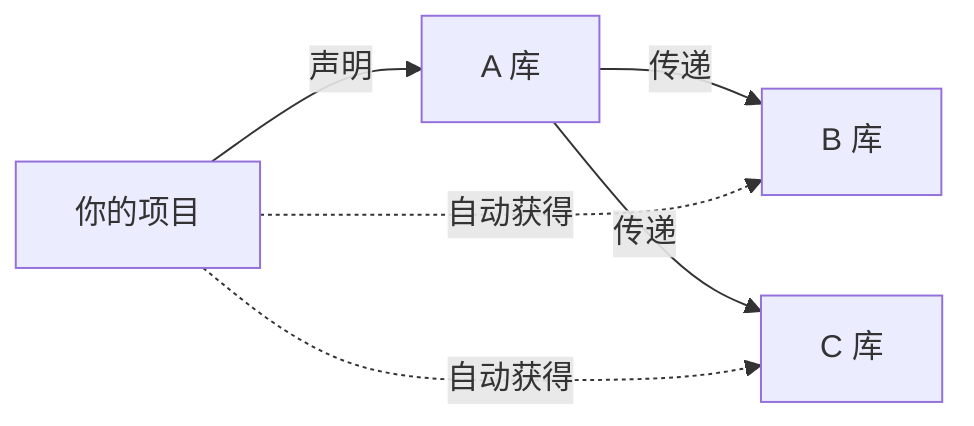
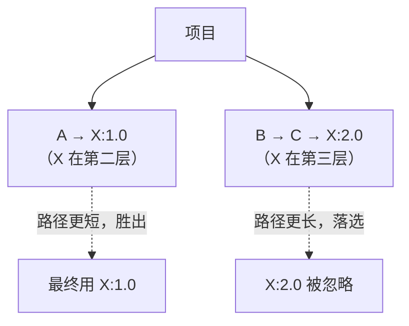

# 依赖管理

依赖管理是 Maven 最核心的价值——只要在 `pom.xml` 里声明坐标，Maven 自动下载依赖及它依赖的库（传递依赖），并解决版本冲突。本章把这一套机制讲透。

## 声明依赖 {#declare}

在 `<dependencies>` 里添加坐标即可引入一个库：

```xml
<dependencies>
    <dependency>
        <groupId>org.springframework.boot</groupId>
        <artifactId>spring-boot-starter-web</artifactId>
        <version>3.2.0</version>
    </dependency>
</dependencies>
```

声明后执行 `mvn dependency:resolve` 或直接 `mvn compile`，Maven 会把它及传递依赖下载到本地仓库。

## scope 作用域 {#scope}

`scope` 决定依赖**在什么阶段可用**、是否传递。这是最常被忽略却极重要的概念：

| scope | 编译 | 测试 | 运行 | 打包进产物 | 是否传递 |
|-------|:---:|:---:|:---:|:---------:|:-------:|
| `compile`（默认） | ✓ | ✓ | ✓ | ✓ | ✓ |
| `provided` | ✓ | ✓ | — | ✗ | ✗ |
| `runtime` | ✗ | ✓ | ✓ | ✓ | ✓ |
| `test` | ✗ | ✓ | ✗ | ✗ | ✗ |
| `system` | ✓ | ✓ | — | 视配置 | ✗ |

典型用法：

```xml
<!-- compile：业务核心依赖，如 Spring、工具库 -->
<dependency>
    <groupId>com.google.guava</groupId>
    <artifactId>guava</artifactId>
    <version>33.0.0-jre</version>
</dependency>

<!-- provided：编译/测试需要，但运行时由容器提供，如 Servlet API -->
<dependency>
    <groupId>javax.servlet</groupId>
    <artifactId>javax.servlet-api</artifactId>
    <version>4.0.1</version>
    <scope>provided</scope>
</dependency>

<!-- runtime：编译不需要，运行时才需要，如 JDBC 驱动 -->
<dependency>
    <groupId>com.mysql</groupId>
    <artifactId>mysql-connector-j</artifactId>
    <version>8.3.0</version>
    <scope>runtime</scope>
</dependency>

<!-- test：仅测试用，如 JUnit -->
<dependency>
    <groupId>org.junit.jupiter</groupId>
    <artifactId>junit-jupiter</artifactId>
    <version>5.10.0</version>
    <scope>test</scope>
</dependency>
```

> [!WARNING]
> `provided` 最经典的坑：Servlet API、Tomcat 等容器自带的库若用默认 `compile`，会把它们也打进 war 包，导致与容器版本冲突。Web 项目里这些库务必标 `provided`。
>
> `system` 依赖要求用绝对路径 `<systemPath>` 指定本地 jar，**强烈不推荐**（破坏可移植性），现代工程应改用本地仓库 `install:install-file` 或私服。

## 传递依赖 {#transitive}

Maven 最省心之处：你依赖 A，A 依赖 B 和 C，B/C 会被**自动传递**进来，无需逐个声明。



> [!NOTE]
> 传递依赖同样受 scope 影响：`compile` 依赖会传递，`test`/`provided` 不会。这就是为什么 A 的测试依赖不会「污染」你的项目。

查看完整依赖树（排查冲突利器）：

```bash
mvn dependency:tree
# 输出类似：
# [INFO] com.example:order-service:jar:1.0.0
# [INFO] +- org.springframework.boot:spring-boot-starter-web:jar:3.2.0:compile
# [INFO] |  \- org.springframework:spring-web:jar:6.1.0:compile
# [INFO] \- com.mysql:mysql-connector-j:jar:8.3.0:runtime
```

## 依赖冲突与仲裁 {#conflict}

当多个库传递了**同一个库的不同版本**时，Maven 需要「仲裁」到底用哪个版本。规则（重要，面试常考）：

1. **最短路径优先**：依赖层级越浅，优先级越高。
2. **同层级，先声明优先**：路径深度相同时，`pom.xml` 里先声明的那个版本胜出。



> [!WARNING]
> 「先声明优先」是常见坑：同一深度的两个库各自带不同版本的 X，**谁在 `<dependencies>` 里先出现，谁带的 X 就赢**——这个结果和直觉相反，容易踩雷。排查冲突先 `mvn dependency:tree`。

### 手动指定版本 {#explicit-version}

最可靠的解决方式：**在项目 `pom.xml` 里直接声明你想要的版本**，因为「显式声明」层级最短、优先级最高：

```xml
<dependencies>
    <!-- 直接声明，覆盖所有传递进来的版本 -->
    <dependency>
        <groupId>com.fasterxml.jackson.core</groupId>
        <artifactId>jackson-databind</artifactId>
        <version>2.15.3</version>
    </dependency>
</dependencies>
```

### 排除依赖 {#exclusion}

不想要某个传递依赖时，用 `<exclusions>` 排除：

```xml
<dependency>
    <groupId>com.example</groupId>
    <artifactId>some-lib</artifactId>
    <version>1.0.0</version>
    <exclusions>
        <exclusion>
            <groupId>org.slf4j</groupId>
            <artifactId>slf4j-log4j12</artifactId>  <!-- 去掉它自带的旧日志实现 -->
        </exclusion>
    </exclusions>
</dependency>
```

> [!TIP]
> `exclusion` 用「坐标」精确指定要排除的库。典型场景：某库自带了你不想要的日志实现或旧版 Jackson，排除后换成你统一管理的版本。

## dependencyManagement 与 BOM {#dependency-management}

`<dependencyManagement>` 用于**统一管理版本**：它只声明「版本」，不真正引入依赖。子模块（或当前模块）再声明依赖时，可以省略 `<version>`，版本从它这里继承。

```xml
<!-- 父 POM 中：只定版本，不引入 -->
<dependencyManagement>
    <dependencies>
        <dependency>
            <groupId>org.springframework.boot</groupId>
            <artifactId>spring-boot-dependencies</artifactId>
            <version>3.2.0</version>
            <type>pom</type>
            <scope>import</scope>   <!-- 导入一个 BOM -->
        </dependency>
    </dependencies>
</dependencyManagement>

<!-- 子模块中：无需写版本，自动用 BOM 里定义的 -->
<dependencies>
    <dependency>
        <groupId>org.springframework.boot</groupId>
        <artifactId>spring-boot-starter-web</artifactId>
        <!-- 省略 version -->
    </dependency>
</dependencies>
```

**BOM（Bill of Materials）** 是「一组依赖的版本清单」，用 `<scope>import</scope>` 导入后，即可省去大量版本号、并保证各组件版本互相兼容。Spring Boot、Spring Cloud 都提供了官方 BOM。

> [!NOTE]
> `dependencyManagement` 与 `dependencies` 的本质区别：
> - `dependencies`：**真正引入**依赖。
> - `dependencyManagement`：**只声明版本规则**，不引入；子模块仍需在 `dependencies` 里声明，只是能省略版本号。

## 小结 {#summary}

本章掌握了 Maven 依赖管理的完整闭环：声明依赖、用 `scope` 控制可用阶段与传递性、理解传递依赖与「最短路径/先声明」冲突仲裁规则、用 `exclusions` 排除、用 `dependencyManagement` + BOM 统一版本。日常开发中 `dependency:tree` 是排查依赖问题的第一工具。
