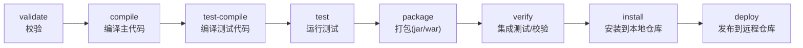
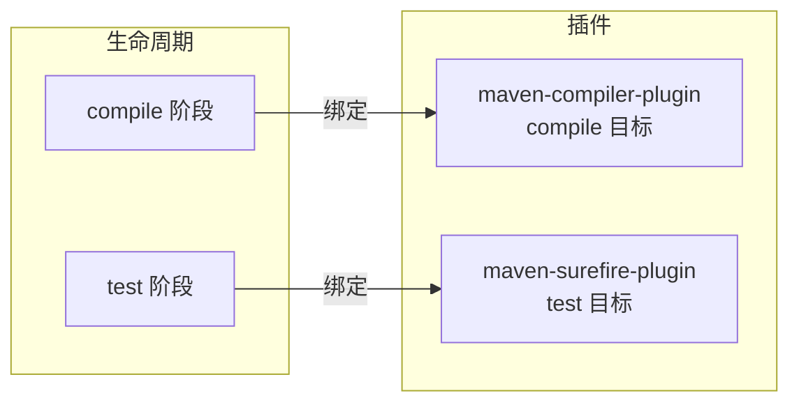

# 生命周期与插件

Maven 的构建过程被抽象成**生命周期（Lifecycle）**，由一系列有序的**阶段（Phase）**组成；每个阶段背后由**插件（Plugin）**的**目标（Goal）**来完成实际工作。理解「生命周期 → 阶段 → 插件目标」这套映射，才能看懂 `mvn` 命令到底在做什么。

## 三套生命周期 {#three-lifecycles}

Maven 内置三套相互独立的生命周期：

| 生命周期 | 作用 |
|---------|------|
| `clean` | 清理构建产物（`target/`） |
| `default` | 核心：编译、测试、打包、部署 |
| `site` | 生成项目站点文档 |

日常 99% 用 `default`，偶尔配 `clean`。三套生命周期**相互独立**，所以 `mvn clean package` 会先跑 `clean` 的清理、再跑 `default` 到 `package` 阶段。

## default 生命周期的关键阶段 {#default-phases}

`default` 生命周期阶段按顺序执行，执行后面的阶段会**自动依次执行前面所有阶段**：



各阶段含义：

| 阶段 | 作用 |
|------|------|
| `compile` | 编译 `src/main/java` 到 `target/classes` |
| `test-compile` | 编译 `src/test/java` |
| `test` | 用测试框架跑单元测试 |
| `package` | 按 `packaging` 打成 jar / war |
| `install` | 把产物装进**本地仓库**，供本机其他项目依赖 |
| `deploy` | 把产物发布到**远程仓库/私服** |

> [!NOTE]
> 阶段是「顺序触发」的：`mvn package` 会先 `compile` → `test-compile` → `test` → 再 `package`。所以 `package` 之前测试跑不过，就无法打包成功。

## 插件机制 {#plugin-mechanism}

生命周期只定义「**做什么的顺序**」，真正干活的是插件。每个插件有若干「目标（goal）」，一个阶段绑定一个或多个目标。

- 插件的坐标同样用 GAV，但 **groupId 默认是 `org.apache.maven.plugins` 或 `org.codehaus.mojo`**，可省略。
- 命令格式：`mvn 插件前缀:目标`，如 `mvn compiler:compile`、`mvn surefire:test`。



### 核心插件一览 {#core-plugins}

| 插件 | 作用 |
|------|------|
| `maven-compiler-plugin` | 编译 Java 源码，控制 JDK 版本 |
| `maven-surefire-plugin` | 运行单元测试 |
| `maven-jar-plugin` | 打普通 jar 包 |
| `maven-war-plugin` | 打 war 包 |
| `maven-resources-plugin` | 拷贝资源文件 |
| `maven-install-plugin` / `maven-deploy-plugin` | 安装 / 发布 |
| `spring-boot-maven-plugin` | Spring Boot 打可执行 fat jar |

### 配置插件 {#configure-plugin}

在 `<build><plugins>` 下配置插件参数。最典型的是指定 JDK 编译版本：

```xml
<build>
    <plugins>
        <plugin>
            <groupId>org.apache.maven.plugins</groupId>
            <artifactId>maven-compiler-plugin</artifactId>
            <version>3.13.0</version>
            <configuration>
                <release>17</release>   <!-- 编译到 Java 17 字节码（推荐，等价 -source/-target） -->
            </configuration>
        </plugin>
    </plugins>
</build>
```

> [!TIP]
> 指定编译版本三种方式：`<release>17</release>`（推荐，等价 `--release`，会自动约束 API）、`<source>/<target>`（旧写法，但可能误用高版本 API）、`<maven.compiler.source/target>` 属性。用 `release` 最严谨。

### 显式绑定自定义执行 {#execution}

可在某阶段额外执行某插件的目标。例如把「源码打包」绑定到 `package`：

```xml
<plugin>
    <groupId>org.apache.maven.plugins</groupId>
    <artifactId>maven-source-plugin</artifactId>
    <version>3.3.0</version>
    <executions>
        <execution>
            <id>attach-sources</id>
            <phase>package</phase>       <!-- 在 package 阶段执行 -->
            <goals>
                <goal>jar-no-fork</goal>  <!-- 目标：生成 sources.jar -->
            </goals>
        </execution>
    </executions>
</plugin>
```

## 常用命令速查 {#commands}

```bash
mvn clean                    # 清理 target/
mvn compile                  # 编译
mvn test                     # 跑测试
mvn package                  # 打包
mvn install                  # 安装到本地仓库
mvn deploy                   # 发布到远程仓库
mvn clean package            # 先清理再打包（最常用）
mvn compile -DskipTests      # 跳过测试
```

## 小结 {#summary}

本章理清了 Maven 最核心的执行模型：三套生命周期、`default` 生命周期各阶段的有序执行、以及「阶段绑定插件目标」的机制。记住「生命周期定顺序、插件干实事」，配置插件就是在 `build/plugins` 里调整参数或绑定目标。下一章学习多模块工程的组织方式。
