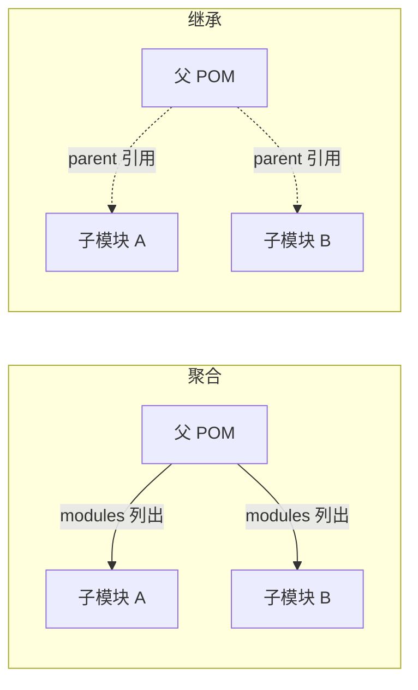

# 多模块工程

当项目越来越大，一个 `pom.xml` 会变得臃肿难维护。Maven 提供**多模块（multi-module）**能力，把项目拆成多个子模块，用一个父 POM 统一管理。这需要理解两个容易混淆的概念：**聚合（modules）** 与 **继承（parent）**。

## 为什么拆多模块 {#why-split}

拆分的收益：

- **边界清晰**：`api`、`service`、`dao`、`web` 各管一摊，职责分离。
- **独立复用**：公共模块可被其他项目单独依赖。
- **按需构建**：只改一个模块时，可以只构建它（`-pl`）。
- **统一版本**：所有子模块共享父 POM 里的依赖版本，避免版本漂移。

典型结构：

```text
my-project/                  # 父（聚合）模块
├── pom.xml                  # packaging 为 pom，声明子模块
├── common/                  # 公共工具模块
│   └── pom.xml
├── dao/                     # 数据访问模块
│   └── pom.xml
├── service/                 # 业务逻辑模块
│   └── pom.xml
└── web/                     # Web 入口模块
    └── pom.xml
```

## 聚合：modules {#aggregation}

聚合解决「**一次构建所有模块**」。父 POM 用 `<modules>` 列出所有子模块，`packaging` 必须是 `pom`：

```xml
<!-- 父 pom.xml -->
<project>
    <modelVersion>4.0.0</modelVersion>
    <groupId>com.example</groupId>
    <artifactId>my-project</artifactId>
    <version>1.0.0</version>
    <packaging>pom</packaging>   <!-- 父模块必须为 pom -->

    <modules>
        <module>common</module>
        <module>dao</module>
        <module>service</module>
        <module>web</module>
    </modules>
</project>
```

在父目录执行 `mvn install`，会按依赖关系依次构建所有子模块。

> [!NOTE]
> `<module>` 的值是**相对路径**（指向子模块目录），不是 artifactId。模块顺序 Maven 会根据依赖关系自动调整，无需手动排序。

## 继承：parent {#inheritance}

继承解决「**共享配置**」。子模块声明 `<parent>`，继承父 POM 的坐标、属性、依赖、插件配置等：

```xml
<!-- 子模块 pom.xml -->
<project>
    <modelVersion>4.0.0</modelVersion>

    <parent>
        <groupId>com.example</groupId>
        <artifactId>my-project</artifactId>
        <version>1.0.0</version>
        <relativePath>../pom.xml</relativePath>  <!-- 指向父 POM 位置 -->
    </parent>

    <artifactId>web</artifactId>   <!-- groupId/version 从 parent 继承，可省略 -->
</project>
```

### 聚合 vs 继承 的区别 {#aggregation-vs-inheritance}

这是最容易混淆的点，务必分清：



| 维度 | 聚合（`modules`） | 继承（`parent`） |
|------|------------------|-----------------|
| 方向 | 父 → 子（父列出子） | 子 → 父（子指向父） |
| 作用 | 一次构建全部模块 | 共享版本与配置 |
| 关键字 | `<modules>` | `<parent>` |
| 是否必须同时 | 否 | 否（可单独用） |

> [!TIP]
> 实践中两者**通常一起用**：父 POM 既是聚合模块（列出所有 `modules`），又作为所有子模块的 `parent`（共享依赖与插件版本）。

## dependencyManagement 统一版本 {#unify-version}

父 POM 用 `<dependencyManagement>` 集中声明版本，子模块依赖时省略 `<version>`（详见第二章）：

```xml
<!-- 父 POM -->
<dependencyManagement>
    <dependencies>
        <dependency>
            <groupId>org.projectlombok</groupId>
            <artifactId>lombok</artifactId>
            <version>1.18.30</version>
        </dependency>
        <!-- 或用 scope=import 导入 Spring Boot BOM -->
        <dependency>
            <groupId>org.springframework.boot</groupId>
            <artifactId>spring-boot-dependencies</artifactId>
            <version>3.2.0</version>
            <type>pom</type>
            <scope>import</scope>
        </dependency>
    </dependencies>
</dependencyManagement>
```

```xml
<!-- 子模块：版本号全省略 -->
<dependencies>
    <dependency>
        <groupId>org.projectlombok</groupId>
        <artifactId>lombok</artifactId>
        <scope>provided</scope>
    </dependency>
</dependencies>
```

### pluginManagement {#plugin-management}

`<pluginManagement>` 与 `dependencyManagement` 同理，统一管理**插件版本**，子模块使用插件时可省略版本：

```xml
<!-- 父 POM -->
<build>
    <pluginManagement>
        <plugins>
            <plugin>
                <groupId>org.apache.maven.plugins</groupId>
                <artifactId>maven-compiler-plugin</artifactId>
                <version>3.13.0</version>
                <configuration>
                    <release>17</release>
                </configuration>
            </plugin>
        </plugins>
    </pluginManagement>
</build>
```

> [!NOTE]
> `pluginManagement` 里的插件**不会自动生效**，只定义了「版本和默认配置」；子模块若真正要用某个插件，仍需在 `<plugins>` 里声明（可省版本）。

## 按需构建子模块 {#selective-build}

只想构建某个子模块，用 `-pl`（projects）指定，配合 `-am`（also-make，同时构建其依赖的模块）：

```bash
# 只构建 web 模块
mvn install -pl web

# 构建 web 及其依赖的模块（common、dao、service）
mvn install -pl web -am

# 排除某模块
mvn install -pl '!common'
```

## 小结 {#summary}

本章讲清了多模块工程的两大支柱：**聚合**（父列出子模块，一次全构建）与**继承**（子指向父，共享配置），以及用 `dependencyManagement`/`pluginManagement` 统一版本、`-pl/-am` 按需构建。多模块是大型 Java 项目的标准组织方式，理解「聚合 vs 继承」这一对概念就抓住了核心。
