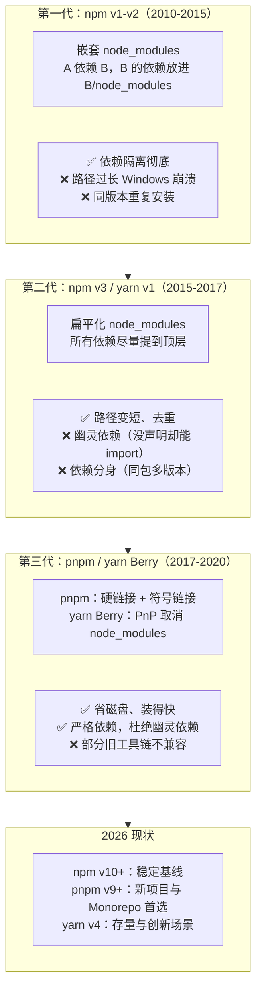
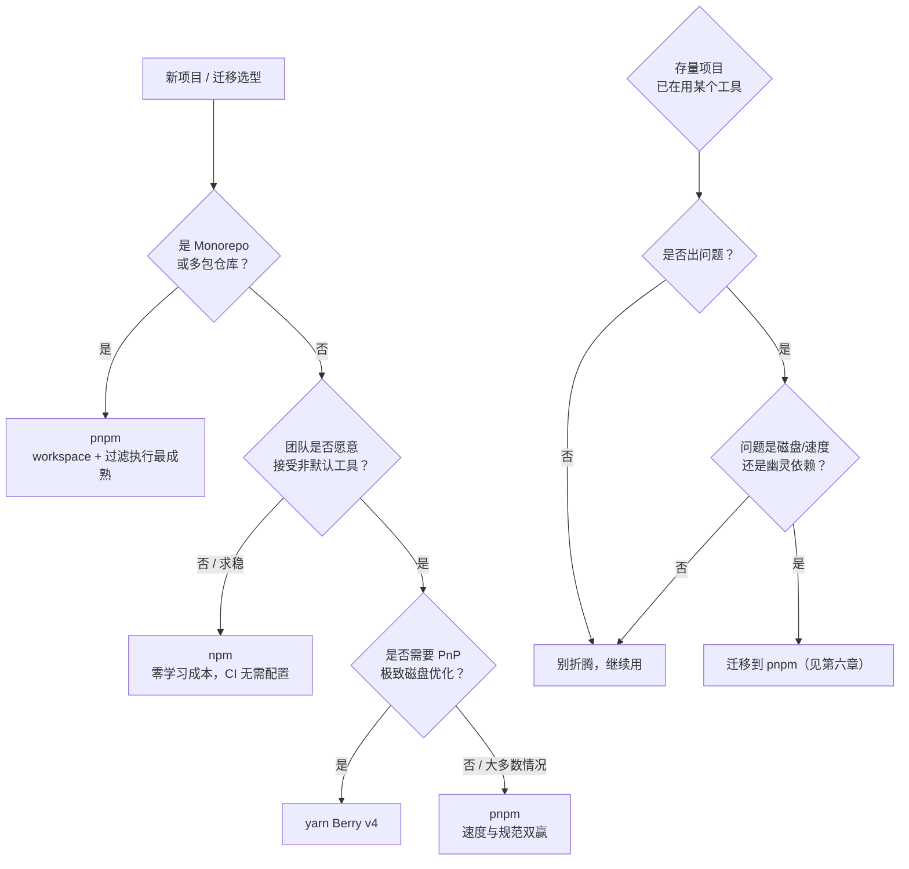

# 第一章：包管理器全景与环境配置

在敲下第一条 `npm install` 之前，先搞清楚三件事：**为什么需要包管理器**、**有哪些可选**、**环境怎么配**。这三件事没搞明白，后面遇到依赖冲突就只能靠删 `node_modules` 碰运气。

## 一、为什么需要包管理器 {#why}

### 没有包管理器的年代

早期前端引入一个库是这样的：

```html
<!-- 手动下载 jquery.min.js 放进项目，还要自己记版本 -->
<script src="./lib/jquery-1.11.3.min.js"></script>
<!-- A 库依赖 jQuery 1.x，B 库依赖 jQuery 3.x —— 冲突，无解 -->
```

痛点非常明确：

1. **版本靠人记**：jQuery 1.11.3 和 3.6.0 到底有什么区别？没人说得清。
2. **依赖关系靠人肉传递**：装 A 库要先装 B 库，B 库又要 C 库，装完发现版本不兼容。
3. **没有卸载概念**：删文件时不知道它依赖什么，也不知道谁依赖它。
4. **没有可复现性**：今天能跑，明天同事 clone 下来跑不起来，因为本地的库版本可能早就不一样了。

### 包管理器解决的四个问题

| 问题 | 解法 | 对应产物 |
| --- | --- | --- |
| 怎么声明我依赖什么 | 清单文件 | `package.json` |
| 依赖的依赖怎么自动装 | 递归解析 | `node_modules/` |
| 怎么保证每次装的一样 | 锁定版本 | `package-lock.json` / `pnpm-lock.yaml` / `yarn.lock` |
| 怎么执行项目脚本 | 脚本运行器 | `npm run <script>` |

> **一句话理解**：`package.json` 是「我要什么」，`lockfile` 是「实际装了什么」，两者缺一不可。

## 二、包管理器的演进史 {#history}

理解演进史，就能理解为什么今天会同时存在四套工具、以及各自的取舍。



### 三个阶段的典型现象

**第一阶段（嵌套）**——目录深不见底：

```
node_modules/
└── a/
    └── node_modules/
        └── b/
            └── node_modules/
                └── c/
                    └── ...  # Windows 260 字符路径上限直接爆炸
```

**第二阶段（扁平）**——所有包提到顶层，于是出现了 **幽灵依赖**：

```
node_modules/
├── a/
├── b/        # b 是 a 的依赖，被提到顶层
└── c/
```

```js
// 你的 package.json 里从未声明过 b
import b from 'b';   // 但这段代码能跑！因为它恰好被提升到顶层了
```

这非常危险：一旦 `a` 换版本不再依赖 `b`，你的代码就突然崩了，而 `package.json` 看不出任何问题。

**第三阶段（严格隔离）**——pnpm 的做法是让你**只能 import 自己声明过的包**：

```
node_modules/
├── .pnpm/          # 真正的包文件，硬链接到全局 store
│   ├── a@1.0.0/
│   └── b@2.0.0/
├── a -> .pnpm/a@1.0.0/node_modules/a    # 符号链接
└── .modules.yaml
```

注意顶层没有 `b`——你没声明 `b`，就 import 不到 `b`。这就是 pnpm 严格的地方。

## 三、四大工具对比 {#comparison}

### 功能对比表

| 维度 | npm | yarn (Berry v4) | pnpm |
| --- | --- | --- | --- |
| 安装速度 | 中等 | 快 | **最快**（硬链接，二次安装近乎瞬时） |
| 磁盘占用 | 每项目一份完整副本 | 有全局缓存但仍复制 | **最省**（跨项目共享同一份文件） |
| `node_modules` 结构 | 扁平 | 默认 PnP（无 node_modules） | 符号链接 + 严格隔离 |
| 幽灵依赖 | 存在 | **杜绝** | **杜绝** |
| Monorepo workspace | 支持（v7+） | 支持（成熟） | **最强** |
| 生态兼容性 | **最好** | PnP 模式需适配 | 好（少数工具需配置） |
| lockfile | `package-lock.json` | `yarn.lock` | `pnpm-lock.yaml` |
| 强制覆盖版本 | `overrides` | `resolutions` | `overrides` / `pnpm.overrides` |

### 安装速度实测参考

以安装一个含 1000+ 依赖的中型项目为例（冷缓存 / 热缓存）：

| 场景 | npm | yarn | pnpm |
| --- | --- | --- | --- |
| 全新安装（无缓存） | ~45s | ~35s | ~30s |
| 二次安装（有缓存） | ~20s | ~8s | **~3s** |
| 删除 lockfile 重装 | ~50s | ~40s | ~32s |
| 磁盘占用（每项目） | ~350MB | ~350MB（PnP 下 ~120MB） | **~120MB**（跨项目共享） |

> pnpm 的「二次安装 3s」不是噱头：它不需要复制文件，只在全局 store 里建硬链接。装 100 个项目，实际磁盘上只存了一份。

### 怎么选



**一句话结论**：

- **新项目** → pnpm
- **不确定 / 团队保守** → npm（完全没问题，npm 10 已经很快）
- **存量项目没出问题** → 不要为了换而换
- **yarn v1 项目** → 有机会就迁 pnpm，yarn 1 已进入维护模式

## 四、Node.js 版本与环境 {#node-env}

### 为什么 Node 版本很关键

包管理器本身是 Node 程序，不同版本对 `package.json` 字段的支持也不同。常见的坑：

- `exports` 字段需要 Node 12.7+
- `workspace:` 协议需要 pnpm/yarn 支持，npm 不支持
- `packageManager` 字段需要 Corepack

### 查看与安装 Node

```bash
# 查看版本（包管理器版本也一起看）
node -v          # v22.14.0
npm -v           # 10.9.0
corepack --version

# npm 自身升级（npm 可以自己更新自己）
npm install -g npm@latest

# 或者指定版本
npm install -g npm@10.9.0
```

### 用版本管理器管理 Node（强烈推荐）

直接在官网装 Node 会导致多个项目需要不同 Node 版本时非常痛苦。用版本管理器：

```bash
# ---------- nvm（macOS / Linux） ----------
curl -o- https://raw.githubusercontent.com/nvm-sh/nvm/v0.40.1/install.sh | bash

nvm install 22          # 安装 Node 22
nvm use 20              # 切到 Node 20
nvm ls                  # 看已装版本
nvm alias default 22    # 设默认

# 项目里固定版本（.nvmrc 文件）
echo "22" > .nvmrc
nvm use                 # 读取 .nvmrc 自动切换

# ---------- fnm（更快，Rust 写的，跨平台） ----------
curl -fsSL https://fnm.vercel.app/install | bash
fnm install 22
fnm use 22
fnm default 22          # 设默认
# fnm 也支持 .nvmrc / .node-version 自动切换

# ---------- nvm-windows（Windows） ----------
# 下载安装包：https://github.com/coreybutler/nvm-windows/releases
nvm install 22.14.0
nvm use 22.14.0
```

> **团队实践**：在项目根目录放一个 `.nvmrc`（内容就一行版本号，如 `22`），并在 README 里写明。配合 fnm 的 `--use-on-cd` 可以做到 `cd` 进目录自动切版本。

### Corepack：Node 官方的包管理器版本管理器

Corepack 随 Node 一起分发，作用是**按项目锁定包管理器的版本**，避免「你是 pnpm 8、我是 pnpm 9，装出来的 lockfile 格式不一样」。

```bash
# 启用（Node 16.9+ 自带，但默认未启用）
corepack enable

# Windows 上需要管理员权限的 PowerShell
corepack enable

# 在 package.json 里声明包管理器与版本
```

```json
{
  "packageManager": "pnpm@9.15.0"
}
```

之后：

```bash
# 在项目里执行 pnpm 时，Corepack 会自动下载并使用 pnpm@9.15.0
pnpm install      # 实际调用的是 9.15.0，不管你全局装的是几

# 如果版本不匹配会直接报错，而不是悄悄用错版本
# Usage Error: This project is configured to use pnpm@9.15.0
```

```bash
# 手动准备某个版本
corepack prepare pnpm@9.15.0 --activate

# 临时绕过校验（不推荐，但排查时有用）
COREPACK_ENABLE_STRICT=0 pnpm install
```

> **团队实践**：新项目建议启用 Corepack + 写 `packageManager` 字段。这是成本最低的「所有人装出来都一样」的保证。CI 里也要加 `corepack enable`。

## 五、.npmrc 配置与镜像源 {#npmrc}

### 配置文件的位置与优先级

npm 会按以下顺序读取配置，**后面的覆盖前面的**：

| 优先级 | 位置 | 用途 |
| --- | --- | --- |
| 1（最低） | `/usr/local/etc/npmrc`（npm 内置） | 全局默认 |
| 2 | `$HOME/.npmrc`（用户级） | **个人常用配置放这里** |
| 3 | `项目根/.npmrc`（项目级） | 项目特定配置，随仓库提交 |
| 4（最高） | 命令行 `--flag` | 临时覆盖 |

```bash
# 查看当前生效的所有配置
npm config list

# 查看完整配置（含默认值，很长）
npm config ls -l

# 查看某个配置的来源
npm config get registry

# 直接编辑用户级配置
npm config edit
```

### 常用配置命令

```bash
# 设置值
npm config set registry https://registry.npmmirror.com

# 读取值
npm config get registry

# 删除配置（恢复到默认）
npm config delete registry

# 只在本次命令生效
npm install --registry=https://registry.npmmirror.com
```

### 国内镜像源加速

默认源 `registry.npmjs.org` 在国内访问较慢，换源是最立竿见影的优化：

```bash
# ===== npmmirror（阿里云，推荐）=====
npm config set registry https://registry.npmmirror.com

# ===== 其他可选 =====
# 腾讯云
npm config set registry https://mirrors.cloud.tencent.com/npm/
# 华为云
npm config set registry https://repo.huaweicloud.com/repository/npm/
# 官方源（恢复）
npm config set registry https://registry.npmjs.org
```

有些包的二进制文件（如 `node-sass`、`sharp`、`puppeteer`）不走 registry，需要单独配：

```bash
# 在 .npmrc 里加（这是最常见的坑）
# node-sass 二进制
sass_binary_site=https://npmmirror.com/mirrors/node-sass/
# sharp 图像处理库
sharp_binary_host=https://npmmirror.com/mirrors/sharp
sharp_libvips_binary_host=https://npmmirror.com/mirrors/sharp-libvips
# puppeteer Chromium
puppeteer_download_host=https://npmmirror.com/mirrors
# Electron
electron_mirror=https://npmmirror.com/mirrors/electron/
# node 源码（node-gyp 编译时用）
disturl=https://npmmirror.com/mirrors/node
```

> **用 nrm 管理多源**（频繁切换时很方便）：
> ```bash
> npm i -g nrm
> nrm ls              # 列出所有源
> nrm use taobao      # 切换
> nrm test            # 测速，选最快的
> ```

### 私有包 / Scope 单独指定源

企业里常见：公共包走镜像，公司私有包走内网。

```ini
# 项目 .npmrc
registry=https://registry.npmmirror.com/

# @company 开头的包走内网源
@company:registry=https://npm.internal.company.com/

# 内网源需要认证（token 不要提交到 Git！）
//npm.internal.company.com/:_authToken=${NPM_TOKEN}
```

`${NPM_TOKEN}` 会从环境变量读取，避免把凭据写进仓库。

> **安全提醒**：`.npmrc` 里**不要**直接写明文 token。用 `${NPM_TOKEN}` 环境变量，并在 CI 里通过 secrets 注入。同时确保 `.gitignore` 忽略 `.npmrc`（若含敏感信息）。

### 一份实用的用户级 .npmrc

```ini
# ~/.npmrc

# 镜像源
registry=https://registry.npmmirror.com/

# 遇到网络错误自动重试
fetch-retries=5
fetch-retry-maxtimeout=120000
fetch-timeout=300000

# 保存依赖时精确锁定版本，不加 ^
save-exact=false

# 安装时显示进度条（CI 里设 false 可提速）
progress=true

# 全局安装路径（避免权限问题，可选）
# prefix=${HOME}/.npm-global

# 安装前自动执行 audit（可选，会慢一些）
# audit=false

# 二进制包镜像
disturl=https://npmmirror.com/mirrors/node
sass_binary_site=https://npmmirror.com/mirrors/node-sass/
electron_mirror=https://npmmirror.com/mirrors/electron/
```

## 六、缓存机制与离线安装 {#cache}

### 缓存位置

```bash
# 查看缓存目录
npm config get cache
# macOS/Linux: ~/.npm
# Windows:     %LocalAppData%\npm-cache

pnpm store path
# macOS/Linux: ~/.local/share/pnpm/store
# Windows:     %LocalAppData%\pnpm\store

yarn cache dir
# macOS/Linux: ~/.cache/yarn 或 ~/.yarn/berry/cache
# Windows:     %LocalAppData%\yarn
```

### 缓存命令

```bash
# ===== npm =====
npm cache verify                 # 校验缓存完整性并清理垃圾
npm cache clean --force          # 强制清空缓存（排查神器）
npm cache ls                     # 列出缓存内容

# ===== pnpm =====
pnpm store path                  # 查看 store 路径
pnpm store status                # 检查 store 状态
pnpm store prune                 # 清理未被任何项目引用的包

# ===== yarn =====
yarn cache list                  # 列出缓存
yarn cache clean                 # 清空缓存
```

### 离线安装

```bash
# npm：优先用缓存，拿不到再联网（不是严格离线）
npm install --prefer-offline

# npm：严格离线，拿不到就失败
npm install --offline

# pnpm：严格离线
pnpm install --offline

# 配置级别的离线模式
npm config set prefer-offline true
```

> **注意**：`--offline` 要求缓存里有**所有**需要的包且 lockfile 完整。CI 里一般用 `--prefer-offline`，配合 CI 缓存目录，能显著缩短安装时间。

### CI 缓存配置示例（GitHub Actions）

```yaml
- name: 获取 pnpm store 路径
  id: pnpm-cache
  shell: bash
  run: echo "STORE_PATH=$(pnpm store path)" >> $GITHUB_OUTPUT

- name: 缓存 pnpm store
  uses: actions/cache@v4
  with:
    path: ${{ steps.pnpm-cache.outputs.STORE_PATH }}
    key: ${{ runner.os }}-pnpm-store-${{ hashFiles('**/pnpm-lock.yaml') }}
    restore-keys: |
      ${{ runner.os }}-pnpm-store-

- name: 安装依赖
  run: pnpm install --frozen-lockfile
```

## 七、全局安装与前缀配置 {#global}

### 全局安装路径

```bash
# 查看全局安装位置
npm root -g
# macOS/Linux (Node 官方安装): /usr/local/lib/node_modules
# Windows:                     %AppData%\npm\node_modules

npm bin -g          # 全局可执行文件目录
npm prefix -g       # 全局前缀
```

### 避免 sudo 权限问题（macOS/Linux）

直接用系统 Node 装全局包常会遇到 `EACCES` 权限错误。**不要**用 `sudo npm i -g`，正确做法是改全局路径到用户目录：

```bash
# 方案一：改 npm prefix
mkdir -p ~/.npm-global
npm config set prefix '~/.npm-global'

# 把下面这行加进 ~/.bashrc 或 ~/.zshrc
export PATH=~/.npm-global/bin:$PATH

source ~/.zshrc

# 方案二（推荐）：用版本管理器，nvm/fnm 装的 Node 天然在用户目录
nvm install 22     # 之后的 -g 安装都在 ~/.nvm 下，无需 sudo
```

### 全局包管理

```bash
# 安装
npm i -g pnpm
npm i -g typescript eslint @vue/cli

# 查看已装的全局包
npm ls -g --depth=0

# 更新
npm update -g
npm update -g pnpm

# 卸载
npm uninstall -g @vue/cli

# 查看某个全局包的可执行文件路径
which pnpm          # /Users/xxx/.nvm/versions/node/v22.14.0/bin/pnpm
```

> **原则**：全局只装**命令行工具**（如 pnpm、typescript、eslint、vercel）。项目依赖永远装到项目里，否则换台机器就跑不起来。

## 八、package.json 是怎么来的 {#package-json}

### 初始化

```bash
# 交互式创建（会问一堆问题）
npm init

# 跳过所有提问，全部用默认值（最常用）
npm init -y
npm init --yes

# 用某个模板初始化
npm create vite@latest my-app
npm create next-app@latest
# 等价于 npx create-vite@latest my-app
```

`npm init -y` 生成的默认文件：

```json
{
  "name": "my-project",
  "version": "1.0.0",
  "description": "",
  "main": "index.js",
  "scripts": {
    "test": "echo \"Error: no test specified\" && exit 1"
  },
  "keywords": [],
  "author": "",
  "license": "ISC"
}
```

### 设置默认值（省去每次改）

```bash
npm config set init-author-name "张三"
npm config set init-author-email "zhangsan@example.com"
npm config set init-license "MIT"
npm config set init-version "0.1.0"

# 之后 npm init -y 就会用这些默认值
```

### 关键字段速览

完整的字段详解在第二章，这里先看最常用的几个：

```json
{
  "name": "my-app",              // 包名，小写、不能有空格
  "version": "1.2.3",            // 遵循 SemVer
  "private": true,               // 设为 true 防止误发布
  "type": "module",              // "module" 用 ESM，"commonjs" 用 CJS
  "main": "dist/index.cjs",      // CJS 入口
  "module": "dist/index.mjs",    // ESM 入口（打包器约定，非官方标准）
  "exports": {                   // 现代入口声明，推荐
    ".": {
      "types": "./dist/index.d.ts",
      "import": "./dist/index.mjs",
      "require": "./dist/index.cjs"
    }
  },
  "files": ["dist"],             // 发布时只包含哪些文件
  "engines": {                   // Node 版本约束
    "node": ">=18"
  },
  "scripts": {
    "dev": "vite",
    "build": "vite build"
  },
  "dependencies": {},            // 生产依赖
  "devDependencies": {}          // 开发依赖
}
```

> **`private: true` 很重要**：业务项目务必加上，避免因误执行 `npm publish` 把公司代码传到公网。加上之后 `npm publish` 会直接拒绝。

## 九、常见环境问题排查 {#env-troubleshooting}

| 现象 | 原因 | 解决 |
| --- | --- | --- |
| `EACCES: permission denied` | 用了系统 Node 装全局包 | 改 `npm prefix` 到用户目录，或用 nvm/fnm |
| `command not found: pnpm` | 全局 bin 目录不在 PATH | 检查 `npm bin -g` 输出的路径是否在 `$PATH` 里 |
| `ENOTFOUND registry.npmjs.org` | 网络不通 / 被墙 | 换国内镜像源 |
| `Certificate has expired` | 公司代理证书过期 | `npm config set strict-ssl false`（临时）或配 CA 证书 |
| `node-gyp` 编译失败 | 缺 Python / C++ 构建工具 | 装 `python3` + 构建工具；Windows 用 `npm i -g windows-build-tools` |
| 安装卡在某个包不动 | 某个源响应慢 | 换源，或 `npm cache clean --force` 后重试 |
| `pnpm: command not found` 但装过了 | Corepack 未启用 | `corepack enable` |
| lockfile 版本不一致警告 | 团队包管理器版本不同 | 用 Corepack + `packageManager` 字段锁定 |

```bash
# 排查网络问题的利器
npm ping                        # 测试与 registry 的连通性
npm config get proxy            # 检查代理设置
npm config get https-proxy

# 需要代理时
npm config set proxy http://127.0.0.1:7890
npm config set https-proxy http://127.0.0.1:7890

# 取消代理
npm config delete proxy
npm config delete https-proxy
```

## 小结 {#summary}

本章建立了包管理的全局认知：

- **包管理器解决四件事**：声明依赖（`package.json`）、递归安装（`node_modules`）、可复现（lockfile）、跑脚本（`npm run`）。
- **演进三个阶段**：嵌套 → 扁平 → 严格隔离。扁平化带来便利但也带来幽灵依赖，pnpm 用符号链接 + 硬链接同时解决了速度与规范问题。
- **选型**：新项目用 pnpm；求稳用 npm；存量项目没毛病别乱换。
- **环境**：用 nvm/fnm 管 Node 版本，用 Corepack + `packageManager` 字段锁定包管理器版本，这是团队协作的基石。
- **配置**：`.npmrc` 分四级（内置/用户/项目/命令行），国内务必换源，token 用 `${NPM_TOKEN}` 环境变量而非明文。

下一章进入 npm 的命令详解——这是日常用得最多的一块，会把 `install` 的每一个变体、`npm ci` 与 `npm install` 的区别讲清楚。
