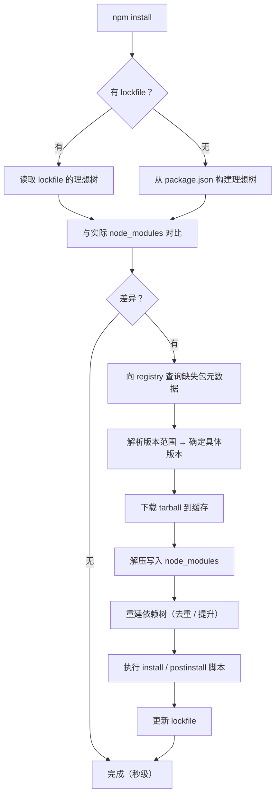

# 第二章：npm 命令详解

npm 是 Node 自带的包管理器，也是整个生态的兼容基线。即使你最终选择 pnpm 或 yarn，npm 的概念也完全通用。本章按**使用频率**而非字母顺序组织。

## 一、install：最核心的命令 {#install}

### 基本形态

```bash
# 按 package.json + lockfile 安装全部依赖
npm install
npm i                       # 简写

# 安装指定包（默认进 dependencies）
npm install lodash
npm i lodash

# 装开发依赖
npm i -D typescript
npm i --save-dev typescript

# 装生产依赖（显式，等于默认）
npm i -S lodash
npm i --save lodash

# 装精确版本
npm i lodash@4.17.21

# 装某个大版本的最新
npm i lodash@4              # 4.x.x 最新

# 装预发布版本
npm i vue@next              # 走 dist-tag
npm i vue@3.5.0-beta.1

# 全局安装
npm i -g pnpm

# 可选依赖（装失败不阻塞）
npm i -O fsevents
npm i --save-optional fsevents

# 不写入 package.json（临时试试）
npm i lodash --no-save
```

### 依赖类型速查

| 参数 | 写入字段 | 用途 |
| --- | --- | --- |
| 默认 / `-S` / `--save` | `dependencies` | 运行时需要 |
| `-D` / `--save-dev` | `devDependencies` | 只在开发、构建时需要 |
| `-O` / `--save-optional` | `optionalDependencies` | 装不上也无所谓（如平台特定包） |
| `--save-peer` | `peerDependencies` | 插件声明宿主版本 |
| `--no-save` | 不写入 | 临时安装 |

### npm install 与 npm ci 的区别（面试常考）

这是**最重要的一组对比**，用错会导致 CI 出问题：

| 维度 | `npm install` | `npm ci` |
| --- | --- | --- |
| 依据 | `package.json` + lockfile（可更新 lockfile） | **只用 lockfile** |
| 是否改 lockfile | **会**（解析出新版本就写回） | **绝不修改** |
| lockfile 缺失 | 会生成一个 | **直接报错退出** |
| `package.json` 与 lockfile 不一致 | 以 package.json 为准并更新 lockfile | **直接报错退出** |
| node_modules 处理 | 增量（保留已有） | **先整个删除再装** |
| 速度 | 快（增量） | 通常更快（无需解析，无增量判断） |
| 适用场景 | 本地开发 | **CI / 生产构建 / 需要完全可复现** |

```bash
# CI 里的标准姿势
npm ci

# Docker 构建里的标准姿势
RUN npm ci --omit=dev
```

> **为什么 CI 必须用 `npm ci`**：`npm install` 会「自作主张」更新 lockfile，导致 CI 装出来的依赖和你本地不一样，出现「本地能跑、CI 挂了」的经典问题。`npm ci` 保证装出来的一字不差。

### 安装策略参数

```bash
# 只装生产依赖，跳过 devDependencies（生产环境/构建产物）
npm ci --omit=dev
npm install --omit=dev
npm install --production       # 旧写法，等价于 --omit=dev

# 跳过可选依赖
npm install --omit=optional

# 两者都跳过
npm install --omit=dev --omit=optional

# 不执行包的 install 脚本（安全加固，防止恶意脚本）
npm install --ignore-scripts

# 强制重新解析，忽略 lockfile
npm install --no-package-lock

# 严格按 lockfile，不做任何解析
npm install --frozen-lockfile  # pnpm 的叫法；npm 用 npm ci

# legacy peer deps：遇到 peer 冲突不报错（npm 7+ 常见应急手段）
npm install --legacy-peer-deps

# 强制：忽略所有冲突（危险）
npm install --force
```

> **`--legacy-peer-deps` vs `--force`**：
> - `--legacy-peer-deps`：忽略 peerDependencies 冲突，**不改变**已解析的版本。相对安全，应急首选。
> - `--force`：强行拉取最新、忽略本地已装版本，可能装出与 lockfile 完全不同的树。**尽量别用**。

### 安装流程内部发生了什么



理解这个流程后，就能解释：
- 为什么第二次 `npm install` 很快（没有差异，直接结束）
- 为什么删了 lockfile 会变慢（要走完整解析）
- 为什么 `npm ci` 能更快（跳过对比，直接按 lockfile 铺开）

## 二、卸载与更新 {#uninstall-update}

```bash
# 卸载包（同时从 package.json 移除）
npm uninstall lodash
npm un lodash
npm rm lodash

# 卸载但不改 package.json
npm uninstall lodash --no-save

# 卸载全局包
npm uninstall -g @vue/cli

# ===== 更新 =====
npm update                  # 更新所有包（在 package.json 允许范围内）
npm update lodash           # 只更新 lodash

# 更新到最新版，无视范围限制（会改 package.json 里的版本号）
npm install lodash@latest

# 查看哪些包可以更新
npm outdated
npm outdated --long
```

`npm outdated` 的输出解读：

```text
Package    Current  Wanted  Latest  Location            Depended by
lodash      4.17.20  4.17.21 4.17.21 node_modules/lodash  my-app
typescript   4.9.5    5.3.3   5.7.2  node_modules/typescript my-app
```

- **Current**：当前装的版本
- **Wanted**：`package.json` 里范围允许的**最高**版本（`npm update` 会升到这）
- **Latest**：registry 上的最新（`npm i xxx@latest` 会升到这）
- 红色 = 落后较多，黄色 = 有可用更新

```bash
# 用 npm-check-updates 批量升级（交互式，比手动改方便）
npx npm-check-updates
npx ncu                     # 简写
npx ncu -u                  # 直接改写 package.json
npx ncu -i                  # 交互式选择要升哪些（推荐）
npx ncu --target minor      # 只升 minor，不升 major
```

> **升级原则**：minor/patch 可以放心升（SemVer 保证兼容），**major 必须人工验证**。批量升 major 前务必先看 CHANGELOG。

## 三、npm run：脚本执行器 {#run-scripts}

### 基本用法

```bash
# 执行 package.json scripts 里的脚本
npm run dev
npm run build
npm run test

# 内置简写（这几个可以省略 run）
npm start        # = npm run start
npm stop
npm test         # = npm run test
npm restart

# 列出所有可用脚本
npm run

# 传参（用 -- 分隔）
npm run build -- --mode production
npm run test -- --watch
```

### scripts 里的 PATH 机制

**关键知识**：`npm run` 执行时，会自动把 `node_modules/.bin` 加入 `PATH`。这就是为什么：

```json
{
  "scripts": {
    "build": "vite build"       // 直接写 vite，不用写 ./node_modules/.bin/vite
  }
}
```

```bash
# 等价关系
npm run build
# 实际执行的是（PATH 里多了 node_modules/.bin）
PATH="$PWD/node_modules/.bin:$PATH" sh -c "vite build"
```

**因此在 shell 里直接敲 `vite` 会 command not found，但在 scripts 里能跑。**

如果你想在命令行直接跑本地安装的工具：

```bash
npx vite build          # 方式一：npx（见第三章）
./node_modules/.bin/vite build   # 方式二：直接路径
```

### 生命周期钩子（pre / post）

npm 对任意脚本都支持 `pre<script>` 和 `post<script>` 钩子：

```json
{
  "scripts": {
    "prebuild": "rimraf dist",        // build 之前自动执行
    "build": "vite build",
    "postbuild": "node scripts/notify.js",  // build 之后自动执行

    "pretest": "npm run lint",
    "test": "vitest run"
  }
}
```

执行 `npm run build` 时，实际顺序是：`prebuild` → `build` → `postbuild`。

**npm 内置的生命周期脚本**（在特定时机自动执行）：

| 脚本 | 触发时机 |
| --- | --- |
| `prepublish` / `prepare` | `npm publish` 前；`prepare` 还在 `npm install`（本地无参数）时执行 |
| `preinstall` / `install` / `postinstall` | 安装依赖时 |
| `preuninstall` / `postuninstall` | 卸载包时 |
| `preversion` / `version` / `postversion` | `npm version` 时 |
| `pretest` / `test` / `posttest` | 测试时 |
| `prestart` / `start` / `poststart` | 启动时 |
| `prepublishOnly` | 只在 `npm publish` 时（`npm install` 不触发） |

```json
{
  "scripts": {
    // 包发布前自动构建 + 测试（用 publishOnly 而非 publish，避免 install 时也跑）
    "prepublishOnly": "npm run test && npm run build",
    // 本地 clone 下来 npm install 后自动准备环境
    "prepare": "husky install"
  }
}
```

> **安全提示**：`postinstall` 脚本会在你 `npm install` 时**自动执行任意代码**。这也是供应链攻击的常见入口。CI 或不确定来源的项目可用 `npm install --ignore-scripts` 禁用。

### 脚本里的环境变量

npm 会注入以 `npm_package_` 开头的变量：

```json
{
  "name": "my-app",
  "version": "1.2.3",
  "scripts": {
    "show": "echo $npm_package_name@$npm_package_version"
  }
}
```

```bash
npm run show
# 输出：my-app@1.2.3
```

常用内置变量：

| 变量 | 含义 |
| --- | --- |
| `npm_package_name` | 包名 |
| `npm_package_version` | 版本 |
| `npm_package_json` | `package.json` 的绝对路径 |
| `npm_config_*` | 任意 npm 配置（如 `npm_config_registry`） |
| `npm_lifecycle_event` | 当前执行的脚本名 |

自定义变量：

```json
{
  "config": {
    "port": 3000
  },
  "scripts": {
    "dev": "node server.js --port $npm_package_config_port"
  }
}
```

### 并行 / 串行执行

```bash
# 串行（&&）：前一个成功才执行下一个
npm run lint && npm run test && npm run build

# 并行（&）：同时跑（Linux/macOS）
npm run dev & npm run watch

# 跨平台并行：用 concurrently
npm i -D concurrently
```

```json
{
  "scripts": {
    "dev": "concurrently \"npm:dev:*\"",
    "dev:web": "vite",
    "dev:api": "nodemon server.js",
    "dev:worker": "node worker.js"
  }
}
```

```bash
npm run dev     # 三个同时跑，输出带前缀区分
```

### 脚本执行失败与退出码

```bash
npm run build
echo $?         # 查看退出码，非 0 表示失败

# 忽略失败继续执行
npm run build || true

# CI 里常用：任何一步失败就退出
npm run lint && npm run test && npm run build || exit 1
```

## 四、查看与查询 {#query}

### npm ls：查看依赖树

```bash
# 查看顶层依赖
npm ls
npm ls --depth=0              # 只看直接依赖（最常用）

# 查看某包被谁依赖（找幽灵依赖来源）
npm ls lodash
npm why lodash                # npm 7+，更友好

# 全局包
npm ls -g --depth=0

# 只看生产依赖
npm ls --omit=dev

# JSON 输出（给脚本用）
npm ls --json
```

`npm why` 输出示例：

```text
lodash@4.17.21
node_modules/lodash
  peer lodash@"^4.17.21" from @types/lodash@4.17.13
  node_modules/@types/lodash
    dev @types/lodash@"^4.17.0" from the root project
```

### npm view：查看 registry 上的包信息

```bash
# 查看包的最新版本
npm view lodash version
npm view lodash versions          # 所有版本列表

# 查看完整信息（描述、依赖、仓库地址等）
npm view lodash

# 查看特定字段
npm view lodash dependencies
npm view lodash dist-tags
npm view react peerDependencies

# 查看特定版本的信息
npm view lodash@4.17.21 dependencies

# 时间信息
npm view lodash time              # 各版本发布时间
npm view lodash time.4.17.21

# 下载量相关（需另装工具）
npx npm-stat lodash
```

### npm search

```bash
# 搜索包
npm search "http client"

# 按条件过滤
npm search axios --json
```

> 实际使用中，直接在 [npmjs.com](https://www.npmjs.com) 或 [npmmirror.com](https://npmmirror.com) 网站搜索体验更好。

### npm doctor：环境自检

```bash
npm doctor
```

会检查：npm 版本、Node 版本、registry 连通性、缓存权限、PATH 配置等。环境有问题时第一步就跑它。

## 五、npm audit：安全审计 {#audit}

```bash
# 扫描依赖漏洞
npm audit

# JSON 输出（CI 里用）
npm audit --json

# 只看生产依赖
npm audit --omit=dev

# 按严重级别过滤
npm audit --audit-level=high       # 只报 high 及以上

# 自动修复（能修的就修）
npm audit fix

# 允许修 major 版本（可能破坏兼容）
npm audit fix --force

# 不修，只看报告
npm audit --dry-run
```

报告解读：

```text
# npm audit report

lodash  <4.17.21
Severity: high
Prototype Pollution in lodash - https://github.com/advisories/GHSA-p6mc-m468-83gg
fix available via `npm audit fix --force`
Will install lodash@4.17.21, which is a breaking change
node_modules/lodash
  my-app  *
  Depends on vulnerable versions of lodash
```

要点：
- **Severity**：`low` / `moderate` / `high` / `critical`
- **fix available**：是否可自动修
- **breaking change**：修了可能不兼容，需要测试

> **实践建议**：
> 1. `npm audit fix` 可以放心跑（只升兼容版本）
> 2. `npm audit fix --force` **慎跑**，它会强升 major，可能把项目搞崩。跑之前先提交代码。
> 3. 很多 devDependencies 的漏洞**不影响生产**（构建工具只在本地跑），用 `npm audit --omit=dev` 看真实风险。
> 4. CI 里用 `npm audit --audit-level=high` 作为闸门，低危不阻塞。

## 六、npm cache：缓存管理 {#cache}

```bash
# 查看缓存目录
npm config get cache

# 校验并清理（安全，推荐）
npm cache verify

# 强制清空（遇到诡异安装问题时用）
npm cache clean --force

# 列出缓存内容
npm cache ls

# 离线安装
npm install --prefer-offline      # 优先缓存
npm install --offline             # 严格离线
```

> **什么时候清缓存**：安装报 `integrity checksum failed`、`EINTEGRITY`、或某个包装出来就是坏的——先 `npm cache clean --force` 再 `rm -rf node_modules` 重装。这能解决 80% 的疑难杂症。

## 七、npm config：配置管理 {#config}

```bash
# 列出当前生效配置
npm config list
npm config ls

# 列出全部配置（含默认）
npm config ls -l

# 读 / 写 / 删
npm config get registry
npm config set registry https://registry.npmmirror.com
npm config delete registry

# 打开编辑器编辑用户配置
npm config edit

# 设置的位置
npm config set key value --location=user      # ~/.npmrc（默认）
npm config set key value --location=project   # 项目 .npmrc（需 npm 9+）
npm config set key value --location=global    # 全局
```

## 八、npm version 与 dist-tags {#version}

```bash
# 按 SemVer 自动升版本并打 git tag
npm version patch       # 1.2.3 → 1.2.4
npm version minor       # 1.2.3 → 1.3.0
npm version major       # 1.2.3 → 2.0.0

# 预发布
npm version prerelease --preid=beta    # 1.2.3 → 1.2.4-beta.0
npm version 2.0.0-beta.1               # 直接指定

# 不自动打 git tag
npm version patch --no-git-tag-version

# 自定义提交信息
npm version patch -m "chore: bump to %s"
```

`npm version` 做了三件事：改 `package.json` 的 version → `git commit` → `git tag`。

### dist-tags：版本标签

```bash
# 查看某个包的所有标签
npm view react dist-tags
# { latest: '19.0.0', beta: '19.1.0-beta.x', next: '19.1.0-canary.x' }

# 安装特定标签
npm i react@latest
npm i react@beta

# 给自己的包打标签（发布时用）
npm publish --tag beta
npm dist-tag add my-pkg@1.0.0-beta.1 beta
npm dist-tag ls my-pkg
npm dist-tag rm my-pkg beta
```

> **`latest` 是默认标签**，用户 `npm i my-pkg` 装的就是它。发 beta 版务必用 `--tag beta`，否则会把不稳定版本推给所有用户。

## 九、package.json 字段完整说明 {#package-json-fields}

### 基础信息字段

| 字段 | 说明 | 示例 |
| --- | --- | --- |
| `name` | 包名，小写无空格，可带 scope | `"my-app"` / `"@company/utils"` |
| `version` | SemVer 版本 | `"1.2.3"` |
| `description` | 描述，会显示在 npm 搜索结果 | `"一个工具库"` |
| `keywords` | 关键词数组，影响搜索 | `["utils", "lodash"]` |
| `homepage` | 主页 | `"https://github.com/x/y"` |
| `repository` | 仓库地址 | `{ "type": "git", "url": "..." }` |
| `bugs` | issue 地址 | `{ "url": "..." }` |
| `author` / `contributors` | 作者 | `"张三 <a@b.com>"` |
| `license` | 许可证 | `"MIT"` / `"ISC"` / `"UNLICENSED"` |
| `private` | 为 `true` 时禁止发布 | `true` |

### 入口字段（重要且易混淆）

```json
{
  "main": "./dist/index.cjs",         // CJS 入口，Node require 时走这
  "module": "./dist/index.mjs",       // ESM 入口（打包器约定，Node 不认）
  "browser": "./dist/index.browser.js",  // 浏览器专用（打包器约定）
  "types": "./dist/index.d.ts",       // TS 类型（也写作 typings）
  "bin": {
    "my-cli": "./bin/cli.js"          // 安装后生成可执行命令
  },
  "exports": {                        // 现代方案，优先级最高，推荐
    ".": {
      "types": "./dist/index.d.ts",
      "import": "./dist/index.mjs",
      "require": "./dist/index.cjs"
    },
    "./utils": {
      "import": "./dist/utils.mjs",
      "require": "./dist/utils.cjs"
    },
    "./package.json": "./package.json"
  }
}
```

> **`exports` 的封装效应**：一旦定义了 `exports`，**未在其中声明的路径就无法被 import**。这是有意为之——包作者明确暴露哪些入口。如果你的包突然报 `ERR_PACKAGE_PATH_NOT_EXPORTED`，就是 exports 没配全。
>
> 记得始终加 `"./package.json": "./package.json"`，否则很多工具读不到你的包信息。

### 条件导出（exports 的进阶）

```json
{
  "exports": {
    ".": {
      // 顺序很重要：从具体到通用
      "node": {
        "import": "./dist/node.mjs",
        "require": "./dist/node.cjs"
      },
      "browser": "./dist/browser.mjs",
      "worker": "./dist/worker.mjs",
      "default": "./dist/index.mjs"
    }
  }
}
```

### 依赖字段

| 字段 | 用途 | 是否随包安装 |
| --- | --- | --- |
| `dependencies` | 运行时依赖 | ✅ 用户 `npm i` 你的包时会装 |
| `devDependencies` | 开发/构建依赖 | ❌ 只在开发本包时需要 |
| `peerDependencies` | 宿主依赖（插件场景） | ⚠️ npm 7+ 自动装，npm 6 需手动 |
| `peerDependenciesMeta` | 标记 peer 为可选 | — |
| `optionalDependencies` | 可选依赖，装失败不阻塞 | ✅ 但失败不报错 |
| `bundledDependencies` | 发布时打包进 tarball | ✅ 随 tarball 分发 |
| `overrides` | 强制覆盖传递依赖版本 | — |

详细解释见第四章。

### 其他重要字段

```json
{
  "type": "module",                   // "module"=ESM / "commonjs"=CJS（默认）
  "files": ["dist", "README.md"],     // 发布白名单
  "engines": {
    "node": ">=18.0.0",
    "npm": ">=9.0.0"
  },
  "os": ["darwin", "linux"],          // 限制操作系统
  "cpu": ["x64", "arm64"],            // 限制 CPU 架构
  "packageManager": "pnpm@9.15.0",    // Corepack 用
  "sideEffects": false,               // 给打包器做 tree-shaking 的提示
  "publishConfig": {
    "registry": "https://npm.internal.company.com/",
    "access": "public"
  },
  "workspaces": ["packages/*"],       // Monorepo 配置
  "scripts": {}
}
```

- **`files`**：只写白名单，`dist` + `README.md` + `LICENSE` 通常够了。`.npmignore` 也能用但容易出错（推荐 `files`）。
- **`engines`**：默认只警告不阻止。想强制就配 `.npmrc` 的 `engine-strict=true`。
- **`sideEffects: false`**：告诉 webpack/rollup 「这包没副作用，可以安全删掉没用到的导出」，显著减小打包体积。如果你的包有全局副作用（如 polyfill 自动注入），要改成数组列出有副作用的文件。

## 十、npm 命令速查表 {#cheatsheet}

| 命令 | 作用 |
| --- | --- |
| `npm init -y` | 快速初始化 |
| `npm i` / `npm install` | 安装全部依赖 |
| `npm ci` | 严格按 lockfile 安装（CI 用） |
| `npm i <pkg>` | 装生产依赖 |
| `npm i -D <pkg>` | 装开发依赖 |
| `npm i -g <pkg>` | 全局安装 |
| `npm un <pkg>` | 卸载 |
| `npm update` | 更新（范围内） |
| `npm outdated` | 查看可更新 |
| `npm run <script>` | 跑脚本 |
| `npm run` | 列出所有脚本 |
| `npm ls --depth=0` | 看直接依赖 |
| `npm why <pkg>` | 查某包为什么存在 |
| `npm view <pkg> versions` | 查看所有版本 |
| `npm audit` | 安全扫描 |
| `npm audit fix` | 自动修漏洞 |
| `npm cache clean --force` | 清缓存 |
| `npm config list` | 看配置 |
| `npm version patch` | 升版本号 |
| `npm doctor` | 环境自检 |
| `npm ping` | 测 registry 连通性 |

## 小结 {#summary}

- **`npm ci` vs `npm install`**：CI/生产用 `ci`（严格、可复现、不改 lockfile）；本地开发用 `install`。
- **`npm run` 的 PATH 魔法**：自动注入 `node_modules/.bin`，所以脚本里能直接写 `vite` 而不是完整路径。
- **生命周期钩子**：`pre`/`post` 任意组合，加上 `prepare`、`prepublishOnly`、`postinstall` 等内置时机，能串起完整的自动化流程。注意 `postinstall` 的安全风险。
- **依赖类型**：`dependencies`（生产）/ `devDependencies`（开发）/ `peerDependencies`（插件宿主）/ `optionalDependencies`（可失败）。
- **`exports` 是现代入口标准**，一旦使用就形成封装，未声明的路径不可访问。
- **排障三板斧**：`npm doctor` 查环境 → `npm cache clean --force` 清缓存 → 删 `node_modules` 重装。

下一章讲 npx——这个每天被无数人使用、但大多数人只知其然不知其所以然的命令。
