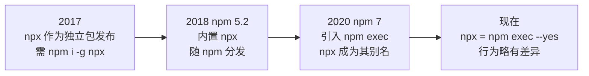
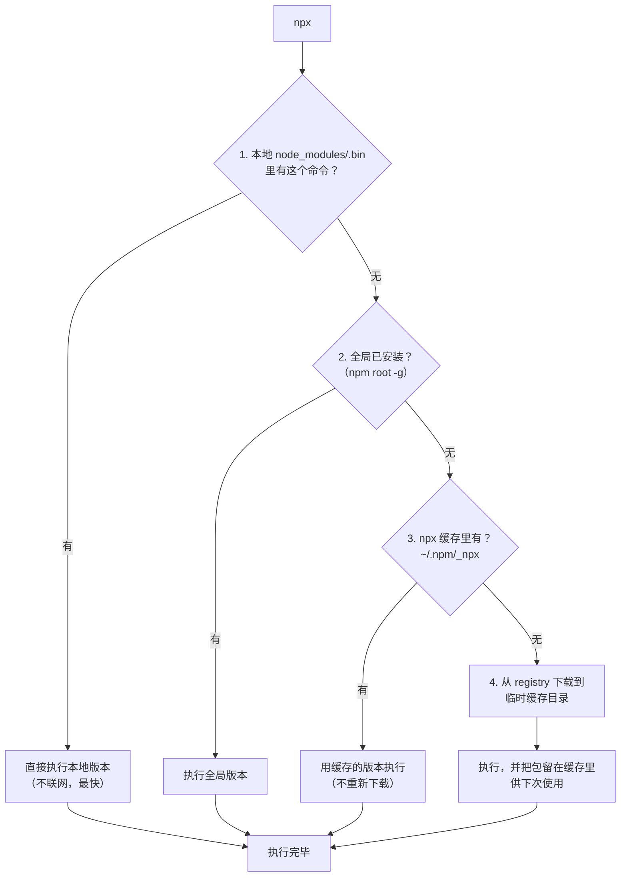

# 第三章：npx 深度解析

`npx` 大概是 npm 生态里被使用最多、也被误解最多的命令。多数人知道「用它不用先全局安装」，但说不清它到底做了什么。本章彻底讲透。

## 一、npx 是什么 {#what-is-npx}

### 一句话定义

**npx 是一个「包命令执行器」**：它能运行一个 npm 包提供的命令行工具，且**不需要你事先安装那个包**。

```bash
# 传统方式：先装，再用（全局装会污染环境，且版本固定）
npm i -g create-vite
create-vite my-app

# npx 方式：临时下载、用完即走
npx create-vite@latest my-app
```

### 历史沿革



| 时间 | 事件 |
| --- | --- |
| 2017 | npx 由 Kat Marchán 发布为独立包，需单独安装 |
| npm 5.2（2017.7） | npm 内置 npx，从此随 Node 一起分发 |
| npm 7（2020.10） | 引入 `npm exec`，npx 变成它的一个封装 |
| 现在 | `npx` 等价于 `npm exec --yes`（交互提示行为不同） |

> 所以严格来说，**今天你用的 `npx` 实际上是 `npm exec`**。理解这一点，很多奇怪行为就解释得通了。

### npx 与 npm exec 的差异

```bash
npm exec vite build
npx vite build
```

两者基本等价，但有一个关键区别：

| 行为 | `npm exec` | `npx` |
| --- | --- | --- |
| 包不存在时 | **交互式询问**是否要安装（CI 里会卡住） | **自动加 `--yes`**，直接装 |
| 适用场景 | 需要确认的交互环境 | 脚本、CI、日常使用 |

```bash
# 在 CI 里想用 npm exec，必须显式加 --yes
npm exec --yes create-vite@latest my-app

# 或者
npm exec -- create-vite@latest my-app
```

> **实践建议**：脚本和 CI 里统一用 `npx`（自带 `--yes` 不会卡住），或者 `npm exec --yes`。

## 二、执行原理与查找顺序 {#how-it-works}

这是本章的核心。npx 执行一个命令时，**按固定顺序查找**：



**关键点**：npx **优先用本地的**。这意味着：

```bash
npm i -D typescript@5.3.3
npx tsc --version     # 输出 5.3.3，用的是本地的，不会去下载最新版
```

这是很多人误以为「npx 总是用最新版」的反例。npx 只在**本地没有**时才去下载。

### 验证查找过程

```bash
# 查看 npx 实际执行了什么（-- 后面是传给命令的参数）
npx --no-install tsc --version
# --no-install：禁止联网安装，本地没有就直接失败
# 用它可以确认「到底用的是不是本地版本」

npx eslint --version
# 如果本地装了 eslint，用的就是本地的
```

### 临时安装的包去哪了

下载的包存放在 npm 缓存的 `_npx` 目录下：

```bash
# 查看 npx 缓存目录
npm config get cache
# macOS/Linux: ~/.npm/_npx
# Windows:     %LocalAppData%\npm-cache\_npx

# 实际查看
ls ~/.npm/_npx
# 每个包一个哈希命名的目录
```

```bash
# 清空 npx 缓存（想强制重新下载时）
rm -rf ~/.npm/_npx
# Windows PowerShell
Remove-Item -Recurse -Force "$env:LocalAppData\npm-cache\_npx"
```

> **这也是 npx 第二次执行很快的原因**——包已经缓存在本地，直接复用。

## 三、基本用法 {#basic-usage}

### 场景一：运行本地已安装的命令

```bash
# 项目装了 vite，但命令行敲 vite 不识别
vite              # ❌ command not found

npx vite          # ✅ 用本地 node_modules/.bin/vite
npx vite build
npx vite --port 3000
```

> 这是 npx 最日常的用途：**不用配 PATH，直接跑项目里的 CLI**。

### 场景二：临时使用，用完即走

```bash
# 项目脚手架（最经典场景）
npx create-vite@latest my-app
npx create-next-app@latest
npx create-react-app my-app

# 一次性工具
npx http-server -p 8080          # 起个静态服务器
npx serve dist                   # 预览构建产物
npx json-server db.json          # mock API
npx npm-check-updates            # 检查依赖更新
npx sort-package-json            # 整理 package.json 字段顺序
npx depcheck                     # 找出没用到的依赖
npx license-checker              # 检查依赖许可证
```

**好处**：
- 不污染全局环境（用完不占地方）
- 永远是新版本
- 不需要 `npm i -g` 的 sudo 权限

### 场景三：指定版本运行

```bash
# 运行特定版本
npx typescript@5.3.3 tsc --version
npx eslint@8.57.0 src/

# 用 dist-tag
npx typescript@latest tsc --version
npx vue@next --version

# 版本范围
npx typescript@">4.0" tsc --version

# 测试不同版本的行为差异（超实用）
npx node@18 -e "console.log(process.version)"
npx node@22 -e "console.log(process.version)"
```

> **多版本对比神器**：想验证某段代码在 Node 18 和 Node 22 下的行为差异，不用装两个 Node，`npx node@18 xxx` 就行。

### 场景四：包名与命令名不一致

有些包的命令名和包名不一样，用 `-p` 指定包、`-c` 指定命令：

```bash
# 包叫 @babel/cli，命令叫 babel
npx -p @babel/cli babel src --out-dir dist

# 一次用多个包
npx -p node@18 -p npm@9 npm ci

# -c 把整串当 shell 命令执行（管道、重定向才能生效）
npx -p cowsay -c "cowsay hello | lolcatjs"
```

```bash
# 注意：不加 -c 时，管道会被 shell 解析，npx 只收到前半段
npx cowsay hello | lolcatjs       # ❌ lolcatjs 可能不是 npx 装的
npx -p cowsay -p lolcatjs -c "cowsay hello | lolcatjs"   # ✅
```

### 场景五：执行 GitHub / 远程代码

```bash
# 直接跑 GitHub 上的包（危险，慎用）
npx github:user/repo
npx https://gist.github.com/user/xxx

# 跑某个 gist（CI 里偶尔用）
npx https://gist.github.com/xxx/yyy
```

> **安全警告**：运行远程代码等于执行他人任意代码。只在完全信任来源时使用。

## 四、常用参数 {#options}

| 参数 | 作用 |
| --- | --- |
| `-p, --package <pkg>` | 指定要安装的包（可多次） |
| `-c, --call <cmd>` | 把参数当作完整 shell 命令执行 |
| `--no-install` | 禁止联网安装，本地没有就报错 |
| `--yes, -y` | 自动同意安装（npx 默认行为） |
| `--no` | 不自动安装，本地没有就失败 |
| `--ignore-existing` | 忽略本地已装的，强制用远程最新版 |
| `--registry <url>` | 指定 registry |
| `--offline` | 离线模式 |
| `--prefer-offline` | 优先缓存 |
| `--quiet` | 静默输出 |
| `-v, --version` | npx 自身版本 |

### --ignore-existing：强制用最新版

```bash
# 本地装了 eslint 8，但想用 9 试一下
npx --ignore-existing eslint@9 --version

# 等价于
npx eslint@9 --version   # 其实指定版本时通常已足够
```

### --no-install：确保只用本地的

```bash
# CI 里防止意外联网下载
npx --no-install jest --coverage
# 如果本地没装 jest，直接失败并提示，而不是偷偷下载
```

> **CI 最佳实践**：用 `--no-install` 可以把「忘了装依赖」变成显式失败，而不是静默下载一个可能版本不对的工具。

## 五、npx 与 package.json scripts {#vs-scripts}

### 该用哪个

```json
{
  "scripts": {
    "build": "vite build",
    "lint": "eslint src --ext .ts,.tsx",
    "format": "prettier --write ."
  }
}
```

```bash
npm run build     # ✅ 推荐：团队统一入口
npx vite build    # ⚠️ 可以，但绕过了项目约定
```

**判断标准**：

| 场景 | 用哪个 |
| --- | --- |
| 项目里已定义的常规任务（build/test/lint） | `npm run` |
| 一次性、临时的命令 | `npx` |
| 想试个工具但不想装 | `npx` |
| 写入文档/CI 让所有人执行 | `npm run`（保证一致） |
| 需要传复杂参数的一次性操作 | `npx` |

**原因**：`npm run` 的脚本定义在 `package.json` 里，是**项目约定**的一部分，所有人执行的是同一套命令。`npx xxx` 则依赖执行者自己输入，容易不一致。

### 在 scripts 里用 npx

```json
{
  "scripts": {
    // 不需要 npx，scripts 里 PATH 已含 node_modules/.bin
    "build": "vite build",           // ✅ 直接写
    "bad": "npx vite build",         // ⚠️ 多余，且稍慢

    // 需要 npx 的场景：跑一个项目里没装的工具
    "docs": "npx typedoc src"        // ✅ typedoc 没装，用 npx 临时拉
  }
}
```

## 六、shell 自动回退（shell auto-fallback） {#shell-fallback}

npx 提供了一个 shell 集成，让你**直接敲命令**（不加 npx 前缀），找不到时自动调用 npx。

```bash
# 安装（bash）
npx sh -c 'echo "source <(npx --shell-auto-fallback bash)" >> ~/.bashrc'

# zsh
npx --shell-auto-fallback zsh

# fish
npx --shell-auto-fallback fish
```

配置后：

```bash
$ create-vite my-app
# create-vite 未找到，正在尝试 npx create-vite...
# 直接用，不用敲 npx
```

> **这个功能很少有人用**，因为它会让「命令未找到」变得不确定（可能触发网络请求），且拖慢 shell 响应速度。了解即可，一般不建议开启。

## 七、npx 的常见使用场景实战 {#recipes}

### 场景 1：项目初始化

```bash
# 前端框架
npx create-vite@latest my-app --template react-ts
npx create-next-app@latest my-blog --typescript --tailwind --app
npx create-nuxt-app my-nuxt

# 后端
npx create-nestjs-app my-api
npx express-generator my-api
```

### 场景 2：免安装运行工具

```bash
# 起静态服务器预览
npx serve dist -l 8080
npx http-server ./public -p 8080 -c-1    # -c-1 禁用缓存

# 格式化 / 检查
npx prettier --write "src/**/*.{ts,tsx}"
npx eslint src --fix

# 分析打包体积
npx source-map-explorer dist/assets/*.js
npx vite-bundle-visualizer

# 检查未使用依赖
npx depcheck

# 生成 LICENSE 清单
npx license-checker --summary

# 查看一个包的内容（不用装）
npx npm-explorer lodash@4.17.21
```

### 场景 3：跨 Node 版本测试

```bash
# 在不同 Node 版本下跑同一段代码
npx node@16 -e "console.log(typeof structuredClone)"   # undefined
npx node@18 -e "console.log(typeof structuredClone)"   # function

# 用不同 npm 版本跑安装（排查 lockfile 版本差异）
npx npm@8 install --package-lock-only
npx npm@10 install --package-lock-only
```

### 场景 4：CI 里执行工具

```yaml
# GitHub Actions
- name: 检查依赖更新
  run: npx npm-check-updates --target minor

- name: 生成许可证报告
  run: npx license-checker --json > licenses.json

- name: 语义化发布
  run: npx semantic-release
```

> **CI 建议**：对**关键步骤**最好把工具写进 `devDependencies` 并用 `npm run` 调用，避免某天 registry 上一个工具更新导致 CI 挂掉（npx 默认拉最新版，不可控）。

### 场景 5：快速验证一个 API

```bash
# 试一下某个库的行为，不用建项目
npx node -e "console.log(require('lodash').chunk([1,2,3,4,5], 2))"

# 交互式的 Node REPL + 某个包
npx --package=lodash -- node -e "console.log(_.VERSION)"
```

## 八、安全注意事项 {#security}

### 风险点

`npx` 会**下载并执行远程代码**，这本身就是风险。具体的攻击面：

1. **包名抢注 / 拼写混淆（typosquatting）**
   ```bash
   npx cross-env        # ✅ 正确
   npx crossenv         # ❌ 恶意包，已被 npm 下架但仍有镜像缓存
   npx lodahs           # 拼写错误，可能是恶意包
   ```

2. **被入侵的合法包**：包本身没问题，但维护者账号被盗发布了恶意版本。

3. **postinstall 脚本**：安装过程自动执行代码。

### 防护措施

```bash
# 1. 核对包名：先在 npm 官网确认包名与下载量
npm view <pkg>          # 看版本、维护者、最后发布时间

# 2. 执行前看看要装什么（--dry-run 不适用于 npx，但可以先用 npm view）
npm view create-vite dist-tags version

# 3. 用 --no-install 避免脚本里意外下载
npx --no-install <cmd>

# 4. 企业环境锁定 registry 到内网镜像（只含审计过的包）
npm config set registry https://npm.internal.company.com/

# 5. 用 --ignore-scripts 禁止安装脚本（npm exec 支持）
npm exec --ignore-scripts <pkg>
```

**团队规范建议**：

- `npx` 只用于**知名的、官方的**脚手架和工具
- CI 里优先把工具装进 `devDependencies`，版本锁定
- 企业环境配私有 registry + 包审计
- 从 README 复制命令时，**自己敲一遍包名**而不是直接粘贴（防止文档里被植入恶意包名）

## 九、npx 疑难问题 {#troubleshooting}

| 现象 | 原因 | 解决 |
| --- | --- | --- |
| `npx: command not found` | Node 未装或 PATH 不对 | 重装 Node，或检查 PATH |
| 用的一直是旧版本 | 本地已装该包，npx 优先用本地 | 显式指定版本 `npx pkg@latest` |
| 一直卡在「installing」 | registry 慢 | 换镜像源 |
| CI 里卡住等待输入 | 用了 `npm exec` 而非 `npx` | 改用 `npx` 或 `npm exec --yes` |
| 管道命令不生效 | 管道被 shell 解析了 | 用 `-c "cmd1 | cmd2"` |
| 权限错误 EACCES | 缓存目录权限问题 | 检查 `~/.npm` 权限，或改 `npm prefix` |
| 每次都重新下载 | 缓存在临时目录被清 | 检查 `npm config get cache` 指向 |

```bash
# 终极排查
npx --version                    # 确认 npx 可用
npm config get cache             # 确认缓存位置
ls $(npm config get cache)/_npx  # 看 npx 缓存内容
npm ping                         # 确认网络
```

## 十、npx / npm exec / pnpm dlx / yarn dlx 对照 {#compare}

各包管理器都有对应的「临时执行」命令：

| 工具 | 命令 | 特点 |
| --- | --- | --- |
| npm | `npx <cmd>` | 优先本地，缓存到 `_npx` |
| npm | `npm exec --yes <cmd>` | 同上，更明确 |
| pnpm | `pnpm dlx <cmd>` | 类似 npx，用 pnpm 的 store |
| pnpm | `pnpm exec <cmd>` | 只执行本地已装的（等价 `--no-install`） |
| yarn v1 | `yarn dlx <cmd>` | 临时执行 |
| yarn Berry | `yarn dlx <cmd>` | 临时执行 |

```bash
# 各工具等价写法
npx create-vite@latest my-app
pnpm dlx create-vite@latest my-app
yarn dlx create-vite@latest my-app

# 只跑本地已装的（各工具）
npx --no-install vite
pnpm exec vite
yarn exec vite
```

> **pnpm 的小优势**：`pnpm exec` 天然只用本地，语义比 `npx --no-install` 更清晰。这也是 pnpm 设计上更严格的体现。

## 小结 {#summary}

- **npx 本质是 `npm exec --yes`**：npm 7 之后 npx 就是 exec 的封装，区别只在是否自动确认安装。
- **查找顺序是固定的**：本地 `.bin` → 全局 → npx 缓存 → 联网下载。**本地优先**，所以 `npx tsc` 用的可能是项目里的旧版 tsc。
- **缓存位置**：`~/.npm/_npx`，第二次执行不用重新下载。
- **核心参数**：`-p` 指定包、`-c` 执行完整 shell 命令、`--no-install` 禁止联网、`@version` 指定版本。
- **与 `npm run` 的分工**：项目约定任务用 `npm run`，一次性操作用 `npx`。
- **安全**：npx 会执行远程代码，注意拼写混淆攻击，企业环境用私有 registry + 审计。

下一章进入整份教程的理论核心——**SemVer、依赖类型与依赖解析原理**。理解了这一章，`ERESOLVE` 报错、幽灵依赖、lockfile 冲突这些头疼问题都会变得可解释、可预测。
