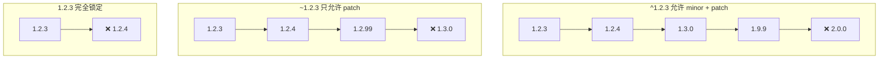
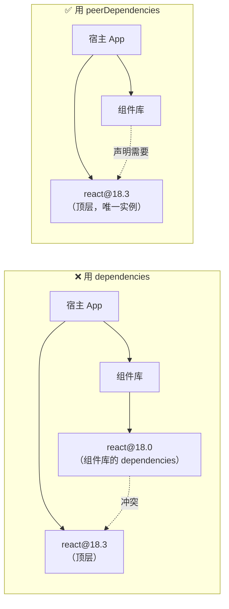
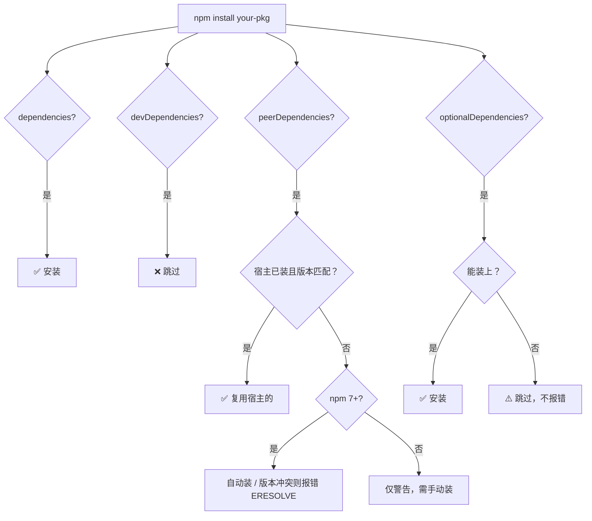
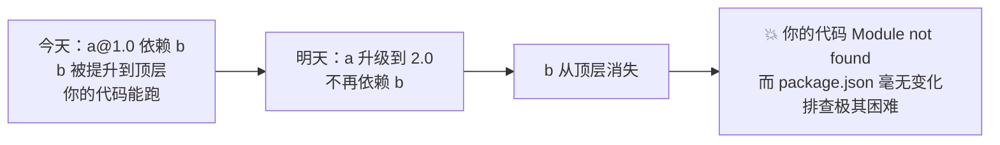
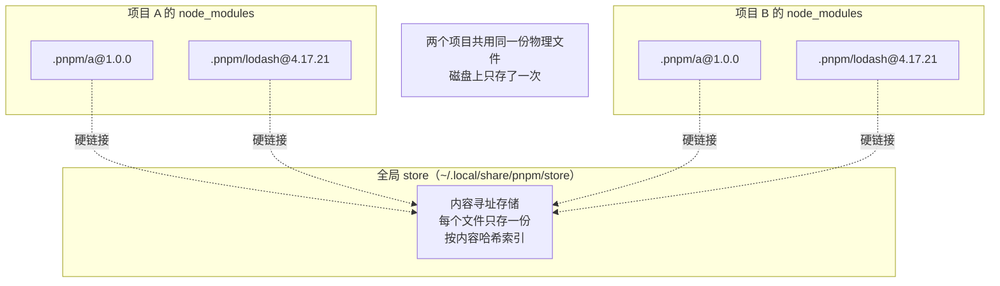
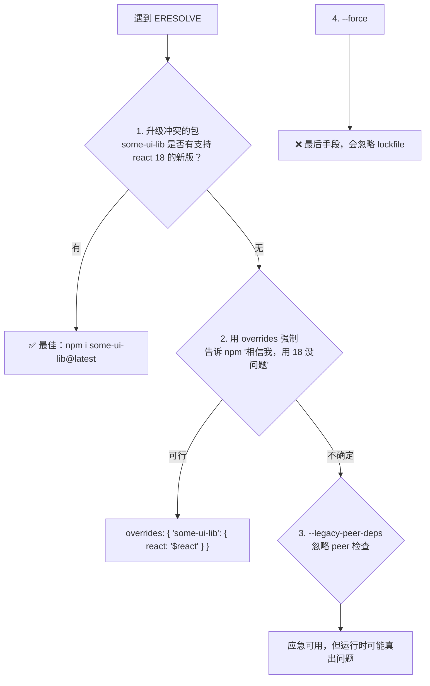

# 第四章：SemVer、依赖类型与依赖解析原理

这一章是整份教程的**理论核心**。前面三章讲的是「怎么用」，这一章讲的是「为什么」。搞懂之后，你会获得三个能力：

1. 看到 `ERESOLVE unable to resolve dependency tree` 不再慌，能读懂它到底在说什么
2. 知道 `package-lock.json` 里那一堆嵌套结构代表什么
3. 理解 pnpm 为什么「更严格」，以及这种严格带来的好处和代价

## 一、SemVer 语义化版本 {#semver}

### 格式定义

```
主版本号.次版本号.修订号[-预发布版本][+构建元数据]
   MAJOR . MINOR . PATCH  [-prerelease] [+build]
```

例如：`1.2.3`、`2.0.0-beta.1`、`1.0.0-alpha+001`

### 什么时候升哪一位

| 位 | 何时递增 | 含义 | 示例 |
| --- | --- | --- | --- |
| **MAJOR** | 做了**不兼容**的 API 修改 | 破坏性变更，升级需人工验证 | `1.9.0` → `2.0.0` |
| **MINOR** | 做了**向下兼容**的功能新增 | 新增功能，理论上可直接升 | `1.2.3` → `1.3.0` |
| **PATCH** | 做了**向下兼容**的问题修正 | 修 bug，可放心升 | `1.2.3` → `1.2.4` |

> **SemVer 是一个「契约」而非「保证」**：它要求包作者自律。现实中不遵守 SemVer 的包比比皆是（尤其在 minor 里塞破坏性变更），所以升级 major 要看 CHANGELOG，升级 minor 也建议跑测试。

### 预发布版本

```text
1.0.0-alpha      // 内部测试
1.0.0-alpha.1    // 带序号的预发布
1.0.0-beta       // 公开测试
1.0.0-rc.1       // 发布候选（Release Candidate）
1.0.0            // 正式版
```

**优先级规则**：`1.0.0-alpha` < `1.0.0-alpha.1` < `1.0.0-beta` < `1.0.0-rc.1` < `1.0.0`

```bash
# 安装预发布版本
npm i vue@next
npm i vue@3.5.0-beta.1
npm i typescript@rc
```

> **注意**：默认情况下 `^1.2.3` **不会**匹配 `1.3.0-beta.1` 这类预发布版本。想装预发布必须显式指定，或范围里带上（如 `^1.2.3-beta`）。这是有意设计——避免意外把不稳定版推给用户。

### 0.x 版本的特殊性

**`0.x.y` 被视为「不稳定期」**，SemVer 规范建议：此时 MINOR 的变化也可能不兼容。

```text
^0.2.3  →  只匹配 0.2.x（等价于 ~0.2.3），不会升到 0.3.0
^0.0.3  →  只匹配 0.0.3（完全锁定）
~0.2.3  →  匹配 0.2.x
```

这就是为什么很多还在 `0.x` 的库（早期 vite、esbuild 等）升级时容易出问题。

## 二、版本范围语法 {#range-syntax}

### 五种范围符号

| 符号 | 名称 | 示例 | 匹配范围 | 说明 |
| --- | --- | --- | --- | --- |
| `^` | 插入符（caret） | `^1.2.3` | `>=1.2.3 <2.0.0` | **最常用**，允许 minor + patch |
| `~` | 波浪符（tilde） | `~1.2.3` | `>=1.2.3 <1.3.0` | 只允许 patch |
| 无符号 | 精确 | `1.2.3` | 只有 `1.2.3` | 完全锁定 |
| `*` / `x` | 通配 | `1.x` / `1.2.*` | `1.x.x` / `1.2.x` | 少用 |
| `>=` `<` | 比较 | `>=1.2.3 <2.0.0` | 区间 | 精确控制 |

### 图解对比



### 各符号详细规则

```text
^1.2.3    :=  >=1.2.3 <2.0.0        # 最左边的非零位不变
^0.2.3    :=  >=0.2.3 <0.3.0        # 0.x 特殊：锁到 minor
^0.0.3    :=  >=0.0.3 <0.0.4        # 0.0.x 特殊：锁到 patch
^1.2.x    :=  >=1.2.0 <2.0.0
^1.x      :=  >=1.0.0 <2.0.0

~1.2.3    :=  >=1.2.3 <1.3.0
~1.2      :=  >=1.2.0 <1.3.0
~1        :=  >=1.0.0 <2.0.0

1.2.3     :=  只有 1.2.3
=1.2.3    :=  同上（显式写法）

>=1.2.3   :=  1.2.3 及以上，无上限（危险）
>1.2.3 <2.0.0  :=  区间
1.2.3 || >=2.0.0  :=  或关系

*         :=  任意版本（等于 >=0.0.0）
latest    :=  dist-tag，拉最新
next      :=  dist-tag
```

### 保存安装时用哪种

```bash
# 默认是 ^（package.json 里写成 "^1.2.3"）
npm i lodash

# 改成 ~
npm i lodash --save-prefix="~"
npm config set save-prefix "~"

# 精确锁定（不加任何符号）
npm i lodash --save-exact
npm i lodash -E
npm config set save-exact true
```

**团队建议**：

- **应用项目**（业务代码）：`^` 默认即可，lockfile 保证可复现性
- **库/SDK**：考虑 `~` 或精确版本，减少对用户的意外影响；更重要是用宽松的 `peerDependencies`
- **安全敏感**：`--save-exact`，配合 Dependabot 显式审查每次升级

> **关键认知**：`^` 带来的不确定性由 **lockfile 兜底**。只要你提交了 lockfile 并在 CI 用 `npm ci`，那么实际安装的永远是 lockfile 里记录的确切版本，`^` 只是「允许更新到哪」的边界。

## 三、五种依赖类型 {#dependency-types}

### 对比总览

| 类型 | 安装时机（作为依赖被安装时） | 典型例子 | 常见误用 |
| --- | --- | --- | --- |
| `dependencies` | ✅ 总是安装 | react、lodash、axios | 把构建工具放这里 |
| `devDependencies` | ❌ 不安装（生产模式） | typescript、eslint、vite | 把运行时库放这里 |
| `peerDependencies` | ⚠️ npm 7+ 自动装 | 插件声明宿主（react 版本） | 写错版本范围引发冲突 |
| `optionalDependencies` | ✅ 但失败不阻塞 | fsevents（仅 macOS） | 滥用导致静默降级 |
| `bundledDependencies` | ✅ 随 tarball 分发 | 需要离线交付的包 | 与 dependencies 混淆 |

### 1. dependencies（生产依赖）

运行时真正需要的包。

```bash
npm i lodash axios react
```

```json
{
  "dependencies": {
    "react": "^18.3.1",
    "axios": "^1.7.7",
    "lodash": "^4.17.21"
  }
}
```

**判断标准**：用户 `npm i your-pkg` 之后，运行时会不会 `require` 它？会 → `dependencies`。

### 2. devDependencies（开发依赖）

只在开发、构建、测试时需要。

```bash
npm i -D typescript @types/node eslint vite vitest
```

```json
{
  "devDependencies": {
    "typescript": "^5.6.0",
    "vite": "^5.4.0",
    "eslint": "^9.12.0"
  }
}
```

**常见 devDependencies 分类**：

| 类别 | 例子 |
| --- | --- |
| 类型 | `typescript`、`@types/*` |
| 构建 | `vite`、`webpack`、`rollup`、`esbuild` |
| 测试 | `vitest`、`jest`、`playwright` |
| 规范 | `eslint`、`prettier`、`husky`、`lint-staged` |
| 提交/发布 | `commitlint`、`semantic-release`、`changesets` |

**生产安装时排除**：

```bash
npm ci --omit=dev
npm install --omit=dev
```

> **典型错误**：把 `typescript` 放到 `dependencies`。用户装你的包时会连带装上一整套 TS，白白增加体积和时间。

### 3. peerDependencies（同伴依赖）

**这是最容易理解错的一个。** 它的语义是：

> "我这个包需要**宿主环境**提供 XXX，我不自己装，由使用者提供。"

**典型场景**：React 组件库。

```json
{
  "name": "my-react-components",
  "peerDependencies": {
    "react": ">=17.0.0",
    "react-dom": ">=17.0.0"
  }
}
```

为什么不能直接写进 `dependencies`？因为会导致**装两份 React**：

```text
# 如果写进 dependencies：
node_modules/
├── my-react-components/
│   └── node_modules/
│       └── react/      # ← 组件库自带的 React 18.0
└── react/              # ← 用户项目的 React 18.3
# 两份 React 实例 → Hooks 报错："Invalid hook call"
```

用 `peerDependencies`，组件库就复用用户的那一份 React。



**npm 7+ 的行为变化**：

```text
npm 6 及以前：peerDependencies 不自动安装，只给警告，需用户手动装
npm 7+：      自动安装 peerDependencies（缺失时补装）
              —— 这也是 ERESOLVE 报错变多的原因
```

**peerDependenciesMeta 标记可选**：

```json
{
  "peerDependencies": {
    "typescript": ">=4.0.0"
  },
  "peerDependenciesMeta": {
    "typescript": {
      "optional": true      // TS 不是必需的，没装也不报错
    }
  }
}
```

### 4. optionalDependencies（可选依赖）

安装失败不会导致整个安装失败。

```json
{
  "optionalDependencies": {
    "fsevents": "^2.3.3"    // 只在 macOS 上工作，Linux 装不上无所谓
  }
}
```

```bash
npm i -O fsevents
npm i --save-optional fsevents
```

**代码里要处理缺失的情况**：

```js
let chokidar;
try {
  chokidar = require('chokidar');   // 依赖 fsevents，可能不存在
} catch (e) {
  // 降级方案：用轮询
  chokidar = require('./fallback-poll');
}
```

> 注意：`optionalDependencies` 里的包**同时**会被当作 dependencies 处理（不需要重复声明）。它只是多了「失败不阻塞」的特性。

### 5. bundledDependencies（打包依赖）

发布时把依赖**整个打包进 tarball**，用户安装时不联网拉取。

```json
{
  "bundledDependencies": ["some-internal-pkg"]
}
```

**使用场景**：离线交付、私有包随主包分发。日常很少用。

### 依赖类型的安装行为图



## 四、lockfile 深度解析 {#lockfile}

### 三种 lockfile

| 工具 | 文件名 | 格式 | lockfileVersion |
| --- | --- | --- | --- |
| npm | `package-lock.json` | JSON | v3（npm 7+） |
| yarn | `yarn.lock` | 自定义文本 | — |
| pnpm | `pnpm-lock.yaml` | YAML | v9（pnpm 9） |

### package-lock.json 结构（v3）

```json
{
  "name": "my-app",
  "version": "1.0.0",
  "lockfileVersion": 3,
  "requires": true,
  "packages": {
    "": {                                  // 根项目自己
      "name": "my-app",
      "version": "1.0.0",
      "dependencies": { "lodash": "^4.17.21" },
      "devDependencies": { "typescript": "^5.6.0" }
    },
    "node_modules/lodash": {
      "version": "4.17.21",
      "resolved": "https://registry.npmjs.org/lodash/-/lodash-4.17.21.tgz",
      "integrity": "sha512-qv...==",      // ← 内容校验哈希
      "dev": false,                        // 是否是 dev 依赖
      "license": "MIT"
    },
    "node_modules/typescript": {
      "version": "5.6.3",
      "resolved": "https://registry.npmjs.org/typescript/-/typescript-5.6.3.tgz",
      "integrity": "sha512-U2...==",
      "dev": true,
      "bin": { "tsc": "bin/tsc", "tsserver": "bin/tsserver" },
      "engines": { "node": ">=14.17" }
    },
    "node_modules/@babel/core/node_modules/semver": {
      "version": "6.3.1",                  // ← 嵌套：此处的 semver 是 6.x
      "resolved": "https://...",
      "integrity": "sha512-..."
    }
  }
}
```

**关键字段解读**：

- **`resolved`**：tarball 的完整下载地址。换 registry 时这里会变（常见 lockfile 冲突源）。
- **`integrity`**：内容的 SHA-512 哈希。**这是安全的核心**——即使 registry 被劫持返回了篡改的包，哈希不对就会安装失败。
- **`dev: true`**：标记这是开发依赖，`npm ci --omit=dev` 时跳过。
- **嵌套 key**（如 `node_modules/@babel/core/node_modules/semver`）：表示这个位置装了**不同版本**的包（依赖分身）。

### lockfileVersion 的演进

```text
v1 (npm 5/6)：只有 dependencies 字段，树形嵌套结构，冗长
v2 (npm 7)  ：同时包含 packages（新）和 dependencies（旧，向后兼容），文件变大
v3 (npm 7+) ：只有 packages，去掉冗余，推荐
```

```bash
# 查看当前 lockfile 版本
head -5 package-lock.json | grep lockfileVersion

# 生成 v2（兼容 npm 6）
npm install --lockfile-version 2

# 生成 v3
npm install --lockfile-version 3
```

> **团队冲突高发点**：有人用 npm 6、有人用 npm 9，lockfile 版本来回跳，Git diff 巨大。**解法**：用 Corepack + `packageManager` 字段锁定（见第一章）。

### lockfile 要不要提交

**必须提交。** 这是可复现性的唯一保证。

```gitignore
# ✅ 正确：提交 lockfile
package-lock.json
yarn.lock
pnpm-lock.yaml

# ❌ 错误：忽略 lockfile
# 早期有些文章建议库项目不提交 lockfile，这是过时的建议
```

**唯一例外**：如果你就是要持续测试最新依赖（如某些 CI 矩阵测试），可以单独配不提交，但常规项目一律提交。

### lockfile 冲突怎么解

多人协作时 `package-lock.json` 冲突是家常便饭：

```bash
# ❌ 错误做法：手动编辑 JSON 解决冲突（几乎必然出错）

# ✅ 正确做法：放弃本地 lockfile，重新生成
git checkout --theirs package-lock.json   # 或 --ours
npm install                               # 重新解析，生成一致的 lockfile
git add package-lock.json

# 或者更干净：删掉重装
rm package-lock.json
npm install
git add package-lock.json
```

> **原则**：lockfile 是**机器生成的产物**，不是给人读的。冲突时不要手工合并，让工具重新生成。

## 五、node_modules 结构与依赖解析 {#node-modules}

### npm 的解析算法：扁平化提升（hoisting）

npm 3+ 采用「尽量扁平」的策略：所有依赖尽量装到顶层 `node_modules/`，只有版本冲突时才嵌套。

**例子**：

```json
{
  "dependencies": {
    "a": "^1.0.0",     // a 依赖 b@^1.0.0
    "c": "^1.0.0"      // c 依赖 b@^2.0.0
  }
}
```

解析结果：

```
node_modules/
├── a/                  # a@1.0.0
├── c/                  # c@1.0.0
├── b/                  # b@1.0.0（a 的依赖，被提升到顶层）
└── c/node_modules/
    └── b/              # b@2.0.0（与顶层的 1.0.0 冲突，只能嵌套）
```

**提升规则**：
1. 遍历依赖树，把能放到顶层的都放顶层
2. 顶层已有同名包且版本不兼容 → 在当前包下嵌套一份
3. 谁先被遍历到，谁的版本占顶层（**依赖遍历顺序会影响结果**）

### 由此产生的两大问题

#### 问题一：幽灵依赖（Phantom Dependencies）

**定义**：代码里 import 了一个**没有在 package.json 中声明**的包，但它恰好因为提升而存在于顶层 `node_modules/`。

```json
{
  "dependencies": {
    "a": "^1.0.0"      // a 依赖 b
  }
}
```

```js
// 你的代码
import b from 'b';     // ⚠️ 能跑！但 package.json 里没声明 b
```

**为什么危险**：



**如何检测**：

```bash
# 用 depcheck 找出未声明的依赖
npx depcheck

# pnpm 天然杜绝（没声明的 import 不到）
```

#### 问题二：依赖分身（Doppelgangers）

**定义**：同一个包的不同版本在 `node_modules` 里存在多份。

```
node_modules/
├── lodash/              # 4.17.21
├── a/node_modules/
│   └── lodash/          # 4.17.20
└── b/node_modules/
    └── lodash/          # 3.10.1
```

**影响**：

1. **体积膨胀**：同一份代码装了 3 次
2. **instanceof 失效**：`a` 里的 lodash 和顶层 lodash 不是同一个实例
3. **类型冲突**：TS 里同名类型来自不同版本，报奇怪的类型错误

```bash
# 查看某个包装了几份
npm ls lodash
npm ls lodash --all

# 找出重复的包
npx npm-dedupe-check
npm dedupe              # 尝试去重
```

### pnpm 的结构：符号链接 + 硬链接

pnpm 用完全不同的思路，同时解决了幽灵依赖和磁盘占用：

```
node_modules/
├── .pnpm/                              # 所有包的真实位置
│   ├── a@1.0.0/
│   │   └── node_modules/
│   │       ├── a/                      # a 的真实文件（硬链接到 store）
│   │       └── b -> ../../b@1.0.0/node_modules/b    # a 的依赖，符号链接
│   ├── b@1.0.0/
│   │   └── node_modules/b/
│   └── lodash@4.17.21/
│       └── node_modules/lodash/
├── a -> .pnpm/a@1.0.0/node_modules/a   # 顶层只放你声明过的包
└── .modules.yaml
```



三个关键点：

1. **顶层只有你声明的包**：`node_modules/a` 是符号链接，指向 `.pnpm/a@1.0.0/`。你没声明 `b`，顶层就没有 `b`，import 不到 → **杜绝幽灵依赖**。
2. **每个包的依赖通过嵌套符号链接找到**：`.pnpm/a@1.0.0/node_modules/b` 指向 `b` 的真实位置。不同版本的 `b` 各自独立 → **依赖分身也不冲突**。
3. **硬链接到全局 store**：`.pnpm/` 里的文件是到 `~/.local/share/pnpm/store` 的硬链接，不是复制。100 个项目用同一个 lodash，磁盘上只有 1 份。

> **硬链接 vs 符号链接**：
> - **硬链接**：多个文件名指向同一份磁盘数据，删除一个不影响其他。修改内容会互相影响（所以 pnpm 视 store 为只读）。
> - **符号链接**：类似快捷方式，指向另一个路径。
>
> pnpm 用硬链接共享文件内容（省空间），用符号链接组织目录结构（严格隔离）。

### 三种结构对比

| 维度 | npm（扁平） | pnpm（链接） | yarn PnP（无 node_modules） |
| --- | --- | --- | --- |
| 幽灵依赖 | 存在 | 杜绝 | 杜绝 |
| 依赖分身 | 存在 | 不冲突 | 不存在 |
| 磁盘占用 | 每项目一份 | 跨项目共享 | 最小（zip 缓存） |
| 兼容性 | 最好 | 好 | 需工具适配 |
| 启动速度 | 快 | 快 | 略快（无需文件查找） |
| 调试直观性 | 高（能直接看文件） | 中（要理解链接） | 低（没有实体文件） |

## 六、overrides：强制覆盖依赖版本 {#overrides}

### 什么时候需要

- 传递依赖有安全漏洞，但上游没更新
- 某个深层依赖的版本范围太严，导致装不出统一版本
- 需要统一某个包的版本（如所有地方都用同一个 React）

### npm：overrides

```json
{
  "overrides": {
    "lodash": "4.17.21"                    // 所有 lodash 都用这个版本
  }
}
```

更精细的控制：

```json
{
  "overrides": {
    // 只覆盖 a 的依赖树里的 lodash
    "a": {
      "lodash": "4.17.21"
    },
    // 嵌套指定：a → b → c 用特定版本
    "a": {
      "b": {
        "c": "1.0.0"
      }
    },
    // 用另一个包替换（类似别名）
    "webpack": "npm:@types/webpack@^5"
  }
}
```

**`.` 语法**（覆盖自己的直接依赖）：

```json
{
  "dependencies": { "foo": "^1.0.0" },
  "overrides": {
    "foo": "$foo"      // 引用 dependencies 里的声明
  }
}
```

### yarn：resolutions

```json
{
  "resolutions": {
    "lodash": "4.17.21",
    "a/lodash": "4.17.21",       // 只覆盖 a 下的
    "**/lodash": "4.17.21"       // 所有层级
  }
}
```

### pnpm：pnpm.overrides

```json
{
  "pnpm": {
    "overrides": {
      "lodash": "4.17.21",
      "a>lodash": "4.17.21"      // pnpm 用 > 表示层级
    }
  }
}
```

### 三者对照

| 工具 | 字段 | 层级语法 |
| --- | --- | --- |
| npm | `overrides` | 嵌套对象 |
| yarn | `resolutions` | `"a/b"` 或 `"**/b"` |
| pnpm | `pnpm.overrides` | `"a>b"` |

```bash
# 修改 overrides 后必须重新安装才会生效
rm -rf node_modules package-lock.json
npm install
```

> **谨慎使用**：overrides 是「强行篡改」依赖树，可能引入不兼容。只在明确知道后果时使用，并**写注释说明原因**，否则半年后没人记得为什么要锁这个版本。

## 七、ERESOLVE 报错完全解读 {#eresolve}

### 典型报错

```text
npm error code ERESOLVE
npm error ERESOLVE unable to resolve dependency tree
npm error
npm error While resolving: my-app@1.0.0
npm error Found: react@18.3.1
npm error node_modules/react
npm error   react@"^18.3.1" from the root project
npm error
npm error Could not resolve dependency:
npm error peer react@"^17.0.0" from some-ui-lib@2.0.0
npm error node_modules/some-ui-lib
npm error   some-ui-lib@"^2.0.0" from the root project
npm error
npm error Fix the upstream dependency conflict, or retry
npm error this command with --force or --legacy-peer-deps
```

### 逐行解读

```
Found: react@18.3.1                       ← 当前解析出的 react 是 18.3.1
  react@"^18.3.1" from the root project   ← 因为你项目里声明了 ^18.3.1

Could not resolve dependency:
  peer react@"^17.0.0" from some-ui-lib@2.0.0   ← 但 some-ui-lib@2.0.0 要求 react 是 17.x
  some-ui-lib@"^2.0.0" from the root project    ← 而它是你装的
```

**翻译成人话**：你要 react 18，但 `some-ui-lib@2.0.0` 只支持 react 17，两者无法同时满足。

### 解决方案（按推荐顺序）



#### 方案 1：升级/降级冲突的包（最正确）

```bash
npm view some-ui-lib versions
npm view some-ui-lib@3 peerDependencies    # 看新版是否支持 react 18
npm i some-ui-lib@latest
```

#### 方案 2：overrides 声明「我知道，就这样」

```json
{
  "dependencies": {
    "react": "^18.3.1",
    "some-ui-lib": "^2.0.0"
  },
  "overrides": {
    "some-ui-lib": {
      "react": "$react"      // 用项目里的 react 版本
    }
  }
}
```

```bash
npm install
```

#### 方案 3：--legacy-peer-deps（应急）

```bash
npm install --legacy-peer-deps

# 或者写进 .npmrc（项目级，团队共享）
echo "legacy-peer-deps=true" >> .npmrc
```

> 这个参数让 npm 回到 npm 6 的行为：**不自动安装 peerDependencies，也不检查冲突**。装出来的树可能运行时有问题，但能装上。

#### 方案 4：--force（不推荐）

```bash
npm install --force
```

会忽略 lockfile、忽略冲突，强行拉取。可能装出与预期完全不同的树。**仅在排查问题时临时用**。

### 排错辅助命令

```bash
# 看清楚是谁要求什么版本
npm ls react
npm why react

# 看某个包的 peer 声明
npm view some-ui-lib@2.0.0 peerDependencies

# 打印完整解析过程（很详细的调试信息）
npm install --loglevel=verbose

# 只看依赖树，不实际安装（快速验证）
npm install --package-lock-only --dry-run
```

## 八、tree-shaking 与 sideEffects {#side-effects}

`package.json` 里的 `sideEffects` 字段影响打包器的 tree-shaking：

```json
{
  "sideEffects": false           // 这个包没有副作用，可安全删除未使用的导出
}
```

```json
{
  "sideEffects": [
    "./src/polyfill.js",         // 只有这些文件有副作用
    "*.css"                      // CSS 引入也算副作用
  ]
}
```

**什么是副作用**：模块被 import 时，除了导出东西之外还做了别的事（修改全局对象、注入样式、注册 polyfill）。

```js
// 有副作用
import './styles.css';           // 引入就生效，没导出任何东西
Array.prototype.myMethod = ...;  // 修改原型

// 无副作用
export function add(a, b) { return a + b; }
```

> **库作者必配**：填了 `sideEffects: false`，用户的打包体积可能减少 30%+。填错了会导致功能丢失（该执行的样式没引入），所以用数组精确列出更安全。

## 九、依赖解析实战案例 {#case-study}

### 案例：monorepo 里 React 版本不一致

**现象**：Hooks 报 `Invalid hook call`，或者样式莫名其妙不生效。

**排查**：

```bash
npm ls react
# 输出：
# ├─┬ @company/ui@1.0.0
# │ └── react@17.0.2     ← 组件库自己装了一份
# └── react@18.3.1       ← 项目用的是 18
```

**解决**：

```json
{
  "peerDependencies": { "react": ">=17" },   // 组件库改 peer
  "devDependencies": { "react": "^18.3.1" }  // 开发时用 18 测试
}
```

```json
{
  "overrides": { "react": "^18.3.1" }        // 主项目强制统一
}
```

### 案例：依赖装了但 import 不到（pnpm）

**现象**：从 npm 迁移到 pnpm 后，大量 `Module not found`。

**原因**：之前在 npm 下依赖了幽灵依赖。

**解决**：

```bash
# 方案 A：把用到的包显式加进 package.json（正确做法）
npm i the-missing-pkg

# 方案 B：临时放开（不推荐，掩盖问题）
# .npmrc
shamefully-hoist=true      # 把依赖提升到顶层，模拟 npm 行为
```

> `shamefully-hoist` 是 pnpm 迁移期的权宜之计，会失去严格性。迁移完成后应逐步移除。

## 小结 {#summary}

- **SemVer**：`MAJOR.MINOR.PATCH`，破坏性升 major、功能升 minor、修 bug 升 patch。`0.x` 阶段特殊，minor 也可能不兼容。
- **范围符号**：`^1.2.3` 允许 minor+patch（最常用），`~1.2.3` 只允许 patch，无符号精确锁定。**不确定性由 lockfile 兜底**。
- **五种依赖**：`dependencies`（运行时）、`devDependencies`（构建/测试）、`peerDependencies`（插件声明宿主，避免装两份）、`optionalDependencies`（可失败）、`bundledDependencies`（随包分发）。
- **lockfile**：记录确切版本 + `integrity` 哈希，是安全与可复现的基石。必须提交，冲突时让工具重新生成而非手工合并。
- **node_modules 两大坑**：幽灵依赖（没声明却能 import）、依赖分身（同包多版本）。npm 扁平化导致，pnpm 用符号链接 + 硬链接彻底解决。
- **overrides**：篡改依赖树的最后手段，用时要写注释。
- **ERESOLVE**：先读懂「谁要什么、实际是什么」，优先升级包，其次 overrides，最后才 `--legacy-peer-deps`。

下一章进入 Yarn——它是第一个向 npm 发起挑战的工具，其中 Berry 版本的 PnP 模式是一次非常激进的创新，值得单独理解。
