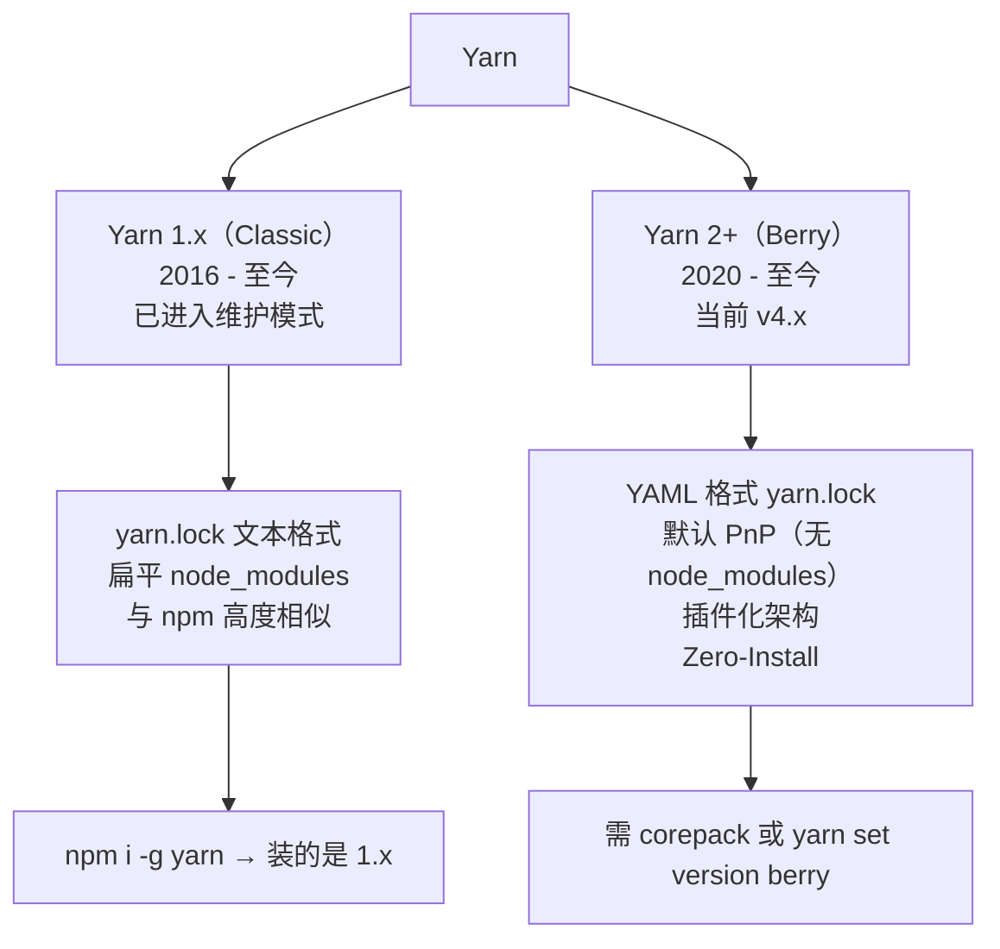
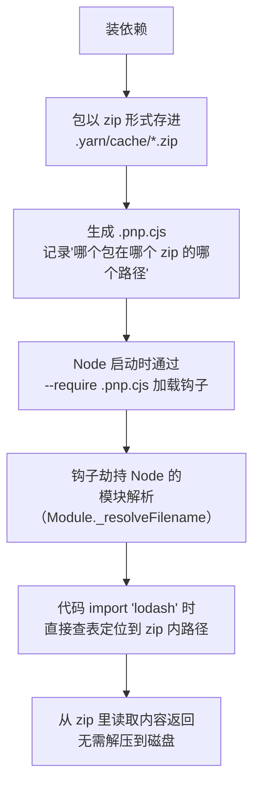
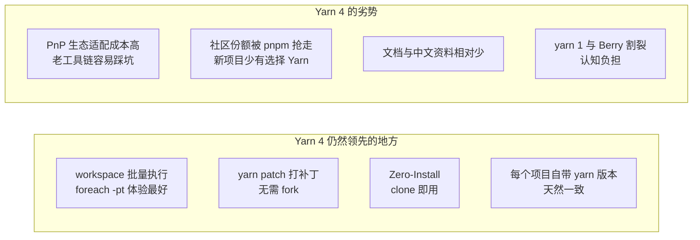

# 第五章：Yarn 深度解析

Yarn 是第一个真正撼动 npm 地位的工具。它带来了 lockfile、并行下载、离线缓存这些今天习以为常的能力。而 Yarn Berry（v2+）更是做了一次激进的实验——**彻底取消 `node_modules`**。

本章会讲清楚：Yarn 1 和 Yarn Berry 为什么几乎是两个工具、PnP 是怎么做到没有 `node_modules` 还能正常 `import` 的、以及今天该不该用 Yarn。

## 一、Yarn 的两个世界 {#two-worlds}

### 版本分支



**这是最容易踩的坑**：

```bash
npm i -g yarn
yarn --version
# 输出：1.22.22    ← 你装的是 Classic，不是 Berry！

# 想装 Berry 必须显式切换
yarn set version berry
yarn --version
# 输出：4.5.0
```

> **关键认知**：`yarn` 这个命令在不同项目里可能是完全不同的两个程序。进项目第一件事应该是 `yarn --version`，看是 1.x 还是 4.x。

### 核心差异对比

| 维度 | Yarn 1 (Classic) | Yarn Berry (2+) |
| --- | --- | --- |
| 发布时间 | 2016 | 2020 |
| 当前状态 | 维护模式（不再新增特性） | 活跃开发（v4） |
| lockfile 格式 | 自定义文本 | YAML |
| `node_modules` | 扁平化（同 npm） | 默认 PnP（无实体目录） |
| 安装方式 | `npm i -g yarn` | `corepack` 或 `yarn set version` |
| 配置文件 | `.yarnrc` | `.yarnrc.yml` |
| 缓存 | `~/.cache/yarn` | 项目内 `.yarn/cache`（可提交） |
| 插件系统 | 无 | 有 |
| 命令集 | 与 npm 类似 | 有增删（`yarn up`、`yarn dlx` 等） |
| 兼容性 | 与 npm 生态高度兼容 | PnP 模式需工具适配 |

## 二、安装与版本管理 {#install}

### Yarn 1（Classic）

```bash
# 全局安装
npm i -g yarn

# macOS 用 brew
brew install yarn

# 验证
yarn --version        # 1.22.22
```

### Yarn Berry（推荐用 Corepack）

```bash
# 方式一：Corepack（Node 16.10+ 自带，推荐）
corepack enable
corepack prepare yarn@4.5.0 --activate

# 在 package.json 里锁定
```

```json
{
  "packageManager": "yarn@4.5.0"
}
```

```bash
# 方式二：在已有项目里切换
yarn set version berry     # 升到最新稳定版
yarn set version 4.5.0     # 指定版本
yarn set version stable

# 方式三：npm 全局装（不推荐，因为会污染）
npm i -g yarn@berry
```

**版本切换做了什么**：

```bash
yarn set version berry
# 会在项目里生成：
#   .yarn/releases/yarn-4.5.0.cjs    ← Yarn 本体，随项目提交
#   .yarnrc.yml                       ← 配置 yarnPath 指向上面那个文件
```

这意味着**每个项目自带自己的 Yarn**，团队版本天然一致——这是 Berry 相比 npm/yarn1 的一大优势。

### 相关目录

```bash
# Yarn Berry 会生成这些
.yarn/
├── cache/              # 依赖缓存（Zero-Install 时提交到 Git）
├── releases/           # Yarn 本体
├── plugins/            # 插件
└── unplugged/          # 需要解包的依赖（含 postinstall 脚本的）
.yarnrc.yml
yarn.lock
.pnp.cjs                # PnP 运行时钩子
.pnp.loader.mjs
```

`.gitignore` 建议：

```gitignore
# Zero-Install 模式（提交缓存）
# 注释掉 .yarn/cache

# 常规模式（不提交缓存）
.yarn/*
!.yarn/patches
!.yarn/plugins
!.yarn/releases
!.yarn/sdks
!.yarn/versions
.pnp.*
```

## 三、命令详解与 npm 对照 {#commands}

### Yarn 1 命令对照表

| 操作 | npm | Yarn 1 |
| --- | --- | --- |
| 初始化 | `npm init -y` | `yarn init -y` |
| 安装全部 | `npm install` | `yarn` 或 `yarn install` |
| 严格按 lockfile | `npm ci` | `yarn install --frozen-lockfile` |
| 装生产依赖 | `npm i lodash` | `yarn add lodash` |
| 装开发依赖 | `npm i -D typescript` | `yarn add -D typescript` |
| 装精确版本 | `npm i lodash@4.17.21` | `yarn add lodash@4.17.21` |
| 全局安装 | `npm i -g pnpm` | `yarn global add pnpm` |
| 卸载 | `npm un lodash` | `yarn remove lodash` |
| 更新 | `npm update` | `yarn upgrade` |
| 更新到最新（无视范围） | `npm i lodash@latest` | `yarn upgrade lodash --latest` |
| 查看可更新 | `npm outdated` | `yarn outdated` |
| 跑脚本 | `npm run dev` | `yarn dev` 或 `yarn run dev` |
| 列出脚本 | `npm run` | `yarn run` |
| 查看依赖树 | `npm ls --depth=0` | `yarn list --depth=0` |
| 查某包来源 | `npm why lodash` | `yarn why lodash` |
| 临时执行 | `npx create-vite` | `yarn dlx create-vite` |
| 安全审计 | `npm audit` | `yarn audit` |
| 缓存清理 | `npm cache clean --force` | `yarn cache clean` |
| 发布 | `npm publish` | `yarn publish` |
| 升版本 | `npm version patch` | `yarn version --patch` |

**注意两点**：

1. `yarn add` 对应 `npm install <pkg>`
2. `yarn dev` 可以省略 `run`（Yarn 1 的特性）

### Yarn Berry 的命令变化

| Yarn 1 | Yarn Berry | 说明 |
| --- | --- | --- |
| `yarn install` | `yarn install` | 同 |
| `yarn add -D` | `yarn add -D` | 同 |
| `yarn upgrade` | `yarn up` | **改名** |
| `yarn upgrade pkg --latest` | `yarn up pkg` | 语义变了 |
| `yarn global add` | ❌ 移除 | 用 `yarn dlx` 代替 |
| `yarn dlx` | `yarn dlx` | 同 |
| 新增 | `yarn patch` | 给依赖打补丁 |
| 新增 | `yarn constraints` | 用 Prolog 声明约束 |
| 新增 | `yarn workspaces foreach` | workspace 批量执行 |
| 新增 | `yarn explain` | 解释某个现象 |

```bash
# Berry 特有：给某个依赖打补丁（修上游 bug 而不 fork）
yarn patch lodash
# → 生成一个临时目录，你改完后：
yarn patch-commit -s /tmp/xfs-xxxx/user
# → 生成 .yarn/patches/lodash.patch，并在 package.json 记录
```

```json
{
  "resolutions": {
    "lodash@npm:4.17.21": "patch:lodash@npm%3A4.17.21#./.yarn/patches/lodash.patch"
  }
}
```

> **这是 Yarn Berry 的杀手级功能之一**：上游包有 bug 时，不用 fork 整个仓库，本地打个补丁就行，且补丁随项目提交、可 review。

## 四、PnP 模式原理 {#pnp}

### PnP 要解决的问题

传统 `node_modules` 的三大问题：

1. **安装慢**：要创建几万个文件、几万次 I/O
2. **占用大**：每个项目一份完整副本
3. **幽灵依赖**：扁平化让未声明的包也能被 import

Yarn Berry 的答案是 **Plug'n'Play（PnP）**：**干脆不要 `node_modules`**。

### PnP 怎么工作



**关键技术点**：

1. **依赖存成 zip**：`.yarn/cache/lodash-npm-4.17.21-xxxx.zip`，不解压。
2. **`.pnp.cjs` 是解析表**：记录了每个包、每个版本的确切位置。
3. **劫持 Node 的模块解析**：通过 `.pnp.cjs` 里的钩子替换 Node 原生的 `require` 解析逻辑。
4. **`.pnp.loader.mjs`**：给 ESM 用的 loader。

```bash
# 生成的文件
.pnp.cjs          # CJS 钩子 + 解析表
.pnp.loader.mjs   # ESM loader
```

**Node 是怎么加载这个钩子的**：

Yarn 生成的命令包装器会自动注入：

```bash
# yarn node 实际上是
node --require ./.pnp.cjs --experimental-loader ./.pnp.loader.mjs your-script.js
```

所以你**必须用 `yarn node` 或 `yarn run` 来启动**，直接 `node index.js` 会找不到模块。

### PnP 的严格性

和 pnpm 一样，PnP **杜绝幽灵依赖**：

```js
// package.json 没声明 lodash
import _ from 'lodash';
// ❌ Error: Your application tried to access lodash, but it isn't declared in your dependencies
```

报错信息非常清晰，还会告诉你该执行什么命令修复。这是 PnP 相比 npm 的一大体验优势。

### PnP 的兼容性问题与解法

不是所有工具都支持 PnP（很多老工具假设 `node_modules` 一定存在）。Yarn 提供两种解法：

#### 解法一：nodeLinker 切回 node_modules

```yaml
# .yarnrc.yml
nodeLinker: node-modules    # 用传统 node_modules（放弃 PnP 优势）
```

可选值：

| 值 | 行为 |
| --- | --- |
| `pnp`（默认） | PnP 模式，无 node_modules |
| `node-modules` | 传统扁平 node_modules |
| `pnpm` | 用 pnpm 的链接结构 |

#### 解法二：SDK 让编辑器支持

```bash
# 生成编辑器 SDK（VSCode / IntelliJ 等）
yarn dlx @yarnpkg/sdks vscode

# 之后 TS/ESLint/Prettier 等能正确解析 PnP 依赖
```

这会生成 `.yarn/sdks/` 目录，里面是配好的 TypeScript/ESLint 包装版本。

### Zero-Install

PnP 的一个衍生特性：**把 `.yarn/cache` 提交到 Git**。

```bash
# 开启
yarn config set enableGlobalCache false
git add .yarn/cache
```

**好处**：

- clone 下来**不用 `yarn install`**，直接就能跑
- CI 里省掉安装步骤（甚至不需要网络）
- 完全可复现，不受 registry 影响

**代价**：

- 仓库体积巨大（几十到几百 MB）
- 每次依赖变动 diff 很大
- Git clone 变慢

> **实践建议**：小团队、依赖不多的项目可以试；大型项目一般不划算。CI 里用缓存目录是更常见的折中。

## 五、Workspace（Monorepo）{#workspace}

三个工具的 workspace 详细对比在第七章，这里先看 Yarn 的用法。

### 配置

```json
{
  "name": "my-monorepo",
  "private": true,
  "workspaces": ["packages/*", "apps/*"]
}
```

```bash
# 装全部 workspace 的依赖
yarn

# 给某个 workspace 加依赖
yarn workspace @company/ui add lodash
yarn workspace @company/ui add -D typescript

# 在所有 workspace 执行命令
yarn workspaces run build
yarn workspaces run test

# Berry 的更强版本
yarn workspaces foreach -ptv run build
#   -p  并行
#   -t  按拓扑顺序（依赖先执行）
#   -v  显示每个 workspace 的输出前缀
```

### workspace 协议

```json
{
  "dependencies": {
    "@company/ui": "workspace:*"      // 链接到本地 workspace
  }
}
```

| 写法 | 含义 |
| --- | --- |
| `workspace:*` | 任意版本，发布时替换为实际版本 |
| `workspace:^` | 发布时变成 `^1.2.3` |
| `workspace:~` | 发布时变成 `~1.2.3` |
| `workspace:1.2.3` | 发布时变成 `1.2.3` |

> Yarn 的 `workspace:` 协议在 `yarn publish` 时会自动替换为真实版本号，这是它比 npm 的 workspace 更成熟的地方之一（npm 需要手工处理或用第三方工具）。

## 六、.yarnrc.yml 配置 {#yarnrc}

Yarn Berry 用 YAML 配置文件：

```yaml
# .yarnrc.yml

# 包链接策略：pnp | node-modules | pnpm
nodeLinker: pnp

# 全局缓存还是项目缓存（false = 项目内 .yarn/cache，支持 Zero-Install）
enableGlobalCache: false

# 缓存目录
cacheFolder: ./.yarn/cache

# 全局目录
globalFolder: ~/.yarn/berry

# registry
npmRegistryServer: "https://registry.npmmirror.com"

# 私有 scope
npmScopes:
  company:
    npmRegistryServer: "https://npm.internal.company.com"
    npmAuthToken: "${NPM_TOKEN}"

# 是否启用 telemetry（建议关掉）
enableTelemetry: false

# 是否生成 .yarn/install-state.gz
enableInstallState: true

# 脚本执行（安全相关）
enableScripts: true

# 严格模式（PnP 下未声明依赖直接报错）
pnpEnableEsmLoader: true

# 压缩级别（0=不压缩最快，9=最小最慢）
compressionLevel: mixed

# 网络并发
networkConcurrency: 50

# 超时
httpTimeout: 60000
httpRetry: 3
```

### 常用配置命令

```bash
yarn config get nodeLinker
yarn config set nodeLinker node-modules
yarn config set npmRegistryServer https://registry.npmmirror.com
yarn config unset nodeLinker
```

## 七、Yarn 1 迁移到 Yarn Berry {#migration}

```bash
# 1. 切版本
yarn set version berry

# 2. 迁移配置（.npmrc / .yarnrc → .yarnrc.yml）
#    手动对照，或让 yarn 提示

# 3. 重新生成 lockfile
rm yarn.lock
yarn install

# 4. 生成编辑器 SDK
yarn dlx @yarnpkg/sdks vscode

# 5. 处理不兼容的工具
#    如果遇到问题，先切回 nodeLinker: node-modules 保证能跑
```

**常见迁移问题**：

| 问题 | 原因 | 解法 |
| --- | --- | --- |
| `Module not found` | 幽灵依赖 | 把缺失的包显式 add 进去 |
| 编辑器报类型错 | 未生成 SDK | `yarn dlx @yarnpkg/sdks vscode` |
| 某个 CLI 工具不工作 | 工具假设 node_modules 存在 | 切 `nodeLinker: node-modules` |
| `YARN_ENABLE_SCRIPTS` 相关报错 | 脚本被禁用 | 配 `enableScripts: true` |
| CI 里 `yarn install` 失败 | 缺少 immutable 检查配置 | CI 用 `yarn install --immutable` |

## 八、Yarn 4 现状与选型 {#selection}

### Yarn 生态现状（2026）



### 该怎么选

| 场景 | 建议 |
| --- | --- |
| **新项目** | 优先 pnpm（生态更热、Monorepo 更强、心智负担低） |
| **Yarn 1 存量项目，运行良好** | 不用动，Yarn 1 还在维护 |
| **Yarn 1 项目遇到性能/磁盘问题** | 迁 pnpm（比迁 Berry 平滑） |
| **需要 `yarn patch`、复杂 monorepo 约束** | 可以考虑 Yarn 4 |
| **想彻底消除 node_modules** | Yarn 4 PnP（但要评估工具链兼容性） |
| **团队保守求稳** | npm 或 Yarn 1 |

> **一句话**：Yarn 是一次伟大的创新，它逼着 npm 进步，也启发了 pnpm。但到 2026 年，**pnpm 在大多数维度上取代了 Yarn 的生态位**。Yarn 4 依然优秀，适合特定场景，但不再是默认推荐。

## 九、Yarn 常见问题 {#troubleshooting}

| 现象 | 原因 | 解决 |
| --- | --- | --- |
| `yarn --version` 是 1.x | 装的是 Classic | `yarn set version berry` |
| `The nearest package directory doesn't seem to be part of the project` | 在非项目目录执行 | `cd` 到项目根 |
| `Usage Error: The nearest package directory...` | Yarn 4 的严格检查 | 确认当前目录有 package.json |
| PnP 下编辑器报类型错 | 未生成 SDK | `yarn dlx @yarnpkg/sdks vscode` |
| `YN0001: No project found` | 缺少 package.json | `yarn init` |
| CI 报 `lockfile would have been modified` | lockfile 与 package.json 不一致 | 本地重新 `yarn install` 并提交 |
| `YN0060: peer dependency` 警告 | peer 未声明 | 补 peerDependencies 或忽略 |
| 安装慢 | registry 慢 | 配 `npmRegistryServer` 镜像 |

```bash
# 诊断命令
yarn --version
yarn config get nodeLinker
yarn explain peer-requirements        # 解释 peer 依赖警告
yarn explain                          # 列出所有可解释的诊断码
```

> **`yarn explain` 是 Yarn Berry 很贴心的功能**：报错时会给 `YN0001` 这类编码，用 `yarn explain <code>` 能看到详细解释和修复建议。

## 小结 {#summary}

- **Yarn 有两个世界**：Yarn 1（Classic，维护模式）和 Yarn Berry（2+，当前 v4）。`npm i -g yarn` 装的是 1.x，进项目先 `yarn --version` 确认。
- **PnP 原理**：依赖存成 zip，`.pnp.cjs` 作为解析表 + 劫持 Node 模块解析，从而彻底取消 `node_modules`。好处是快、省、无幽灵依赖；代价是工具链需要适配。
- **PnP 不兼容时**：`nodeLinker: node-modules` 切回传统模式，或 `yarn dlx @yarnpkg/sdks vscode` 生成编辑器 SDK。
- **`yarn patch`** 是 Berry 的杀手锏：不 fork 就能给上游依赖打补丁。
- **workspace 协议**：`workspace:*` 在发布时自动替换为真实版本，比 npm 成熟。
- **选型**：2026 年的新项目优先 pnpm；Yarn 4 适合需要 patch/Zero-Install/复杂约束的场景；Yarn 1 存量项目没毛病不用动。

下一章讲 pnpm——目前新项目的首选，看它如何用硬链接 + 符号链接在「兼容性」和「严格性」之间取得平衡。
