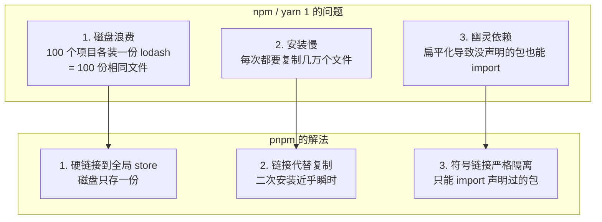
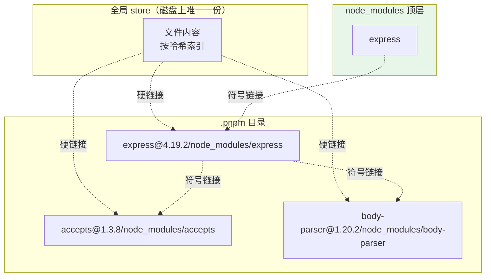

# 第六章：pnpm 深度解析

pnpm（**p**erformant **npm**）是目前新项目的首选包管理器。它的核心思路一句话概括：

> **同一个包的同一版本，在磁盘上永远只存一份，所有项目通过硬链接共享。**

这一章讲透它的存储原理、命令用法、Monorepo 能力，以及从 npm 迁移时会遇到的那些坑。

## 一、pnpm 解决了什么问题 {#problems}

### 三大痛点



### 实际数据

```bash
# 一个中型项目（1000+ 依赖）
npm install        # 首次 45s，二次 20s，占用 350MB
pnpm install       # 首次 30s，二次 3s，占用 120MB（且与其他项目共享）

# 装 10 个相似项目
npm:  3.5 GB
pnpm: 约 400 MB（共享部分只存一次）
```

## 二、存储原理：硬链接 + 符号链接 {#storage}

### 全局 store

```bash
# 查看 store 位置
pnpm store path
# macOS/Linux: ~/.local/share/pnpm/store/v3（或 ~/.pnpm-store）
# Windows:     %LocalAppData%\pnpm\store

# 查看 store 状态
pnpm store status

# 清理未被任何项目引用的包
pnpm store prune
```

**store 是内容寻址的（content-addressable）**：文件按内容哈希存储，相同内容只存一份。

```
~/.local/share/pnpm/store/v3/
├── files/
│   ├── 00/
│   │   ├── a1b2c3d4...     # 某个文件的硬链接源（内容哈希前两位做目录）
│   │   └── e5f6g7h8...
│   ├── 01/
│   └── ...
└── index/
    └── ...
```

### 项目内的 node_modules 结构

假设 `package.json` 只声明了 `express`：

```
node_modules/
├── .pnpm/                                    # 所有包的真实位置
│   ├── express@4.19.2/
│   │   └── node_modules/
│   │       ├── express/                      # 真实文件（硬链接到 store）
│   │       ├── accepts -> ../../accepts@1.3.8/node_modules/accepts
│   │       ├── body-parser -> ../../body-parser@1.20.2/node_modules/body-parser
│   │       └── ...                           # express 的所有依赖，符号链接
│   ├── accepts@1.3.8/
│   │   └── node_modules/accepts/
│   ├── body-parser@1.20.2/
│   │   └── node_modules/body-parser/
│   └── ...
├── express -> .pnpm/express@4.19.2/node_modules/express   # 顶层符号链接
└── .modules.yaml
```

**结构可视化**：



### 三层关系总结

| 层级 | 是什么 | 作用 |
| --- | --- | --- |
| **全局 store** | 真实文件内容（硬链接源） | 跨项目共享，磁盘只存一份 |
| **`.pnpm/<pkg>@<ver>/node_modules/<pkg>`** | 到 store 的**硬链接** | 每个版本一份，供符号链接指向 |
| **顶层 `node_modules/<pkg>`** | 到 `.pnpm/` 的**符号链接** | 只暴露你声明过的包 |

### 为什么这样能杜绝幽灵依赖

```
# 顶层只有 express
node_modules/
├── .pnpm/
└── express -> ...

# 你的代码
import accepts from 'accepts';
# ❌ Error: Cannot find module 'accepts'
#    因为 accepts 是 express 的依赖，只在 .pnpm/express@4.19.2/node_modules/ 里
#    顶层没有，你没声明就 import 不到
```

**Node 的解析规则**：`import 'accepts'` 会从当前目录向上查找 `node_modules/accepts`。你的代码在 `src/`，向上找到的是项目顶层 `node_modules/`——那里只有 `express`，没有 `accepts`。

### 依赖的版本冲突怎么办

```
node_modules/.pnpm/
├── a@1.0.0/node_modules/
│   ├── a/
│   └── lodash -> ../../lodash@4.17.21/node_modules/lodash
├── b@1.0.0/node_modules/
│   ├── b/
│   └── lodash -> ../../lodash@3.10.1/node_modules/lodash    # 不同版本，各指各的
├── lodash@4.17.21/node_modules/lodash/
└── lodash@3.10.1/node_modules/lodash/
```

两个版本的 lodash 物理上共存，各自被需要的地方引用，**不产生分身问题**（因为没有「提升」这一动作，也就不存在「谁占顶层」的竞争）。

## 三、安装与配置 {#install}

### 安装 pnpm

```bash
# 方式一：Corepack（推荐，Node 16.10+）
corepack enable
corepack prepare pnpm@9.15.0 --activate

# 方式二：npm 全局
npm i -g pnpm

# 方式三：官方脚本
curl -fsSL https://get.pnpm.io/install.sh | sh
# Windows PowerShell
iwr https://get.pnpm.io/install.ps1 -useb | iex

# 方式四：各平台包管理器
brew install pnpm                    # macOS
scoop install pnpm                   # Windows
winget install -e --id pnpm.pnpm     # Windows
apt install pnpm                     # Debian/Ubuntu（版本可能旧）

# 验证
pnpm --version
```

### 项目里锁定版本

```json
{
  "packageManager": "pnpm@9.15.0"
}
```

配合 Corepack，所有人用的都是 9.15.0。

```bash
# 自己升级 pnpm
pnpm self-update

# 或
corepack prepare pnpm@latest --activate
```

### .npmrc 配置

pnpm 读取 `.npmrc`（与 npm 兼容），另外支持 `pnpm-workspace.yaml` 里的 `pnpm` 字段。

```ini
# .npmrc

# registry
registry=https://registry.npmmirror.com/

# 私有 scope
@company:registry=https://npm.internal.company.com/
//npm.internal.company.com/:_authToken=${NPM_TOKEN}

# 严格检查 peer 依赖（默认 false，建议开发时 true）
strict-peer-dependencies=true

# 迁移期临时放开幽灵依赖（不推荐长期使用）
# shamefully-hoist=true

# 提升到 node_modules/.pnpm/node_modules（兼容老工具）
# hoist-pattern[]=*

# store 位置（默认在 home 下）
store-dir=/data/pnpm-store

# 是否需要 lockfile 的 side-effects 缓存
side-effects-cache=true

# 网络
network-concurrency=16
fetch-retries=5
fetch-timeout=60000

# 是否自动安装 peer（默认 true）
auto-install-peers=true

# 全局包的 bin 目录
global-bin-dir=~/.pnpm-global/bin
```

### 常用配置命令

```bash
pnpm config get registry
pnpm config set registry https://registry.npmmirror.com
pnpm config list

pnpm config get store-dir
pnpm config set store-dir /data/pnpm-store
```

## 四、命令详解 {#commands}

### 对照表

| 操作 | npm | pnpm |
| --- | --- | --- |
| 初始化 | `npm init -y` | `pnpm init` |
| 安装全部 | `npm install` | `pnpm install` / `pnpm i` |
| 严格按 lockfile | `npm ci` | `pnpm install --frozen-lockfile` |
| 装依赖 | `npm i lodash` | `pnpm add lodash` |
| 装开发依赖 | `npm i -D typescript` | `pnpm add -D typescript` |
| 装可选依赖 | `npm i -O fsevents` | `pnpm add -O fsevents` |
| 装 peer | `npm i --save-peer react` | `pnpm add --save-peer react` |
| 全局安装 | `npm i -g pnpm` | `pnpm add -g pnpm` |
| 卸载 | `npm un lodash` | `pnpm remove lodash` / `pnpm rm` |
| 更新 | `npm update` | `pnpm update` / `pnpm up` |
| 更新到最新 | `npm i lodash@latest` | `pnpm up lodash --latest` |
| 查看可更新 | `npm outdated` | `pnpm outdated` |
| 跑脚本 | `npm run dev` | `pnpm dev` / `pnpm run dev` |
| 列出脚本 | `npm run` | `pnpm run` |
| 查看依赖树 | `npm ls --depth=0` | `pnpm list --depth=0` |
| 查来源 | `npm why lodash` | `pnpm why lodash` |
| 临时执行 | `npx create-vite` | `pnpm dlx create-vite` |
| 只跑本地 | `npx --no-install vite` | `pnpm exec vite` |
| 安全审计 | `npm audit` | `pnpm audit` |
| 缓存/存储 | `npm cache clean` | `pnpm store prune` |
| 发布 | `npm publish` | `pnpm publish` |
| 升版本 | `npm version patch` | `pnpm version patch` |

> **注意**：`pnpm dev` 可以省略 `run`（和 Yarn 1 一样）。

### install 的常用参数

```bash
# 严格按 lockfile（CI 标配）
pnpm install --frozen-lockfile
# CI 环境下这是默认行为（检测到 CI 环境变量时）

# 只装生产依赖
pnpm install --prod
pnpm install --omit=dev

# 忽略脚本
pnpm install --ignore-scripts

# 离线
pnpm install --offline
pnpm install --prefer-offline

# 强制重新解析（忽略 lockfile）
pnpm install --no-frozen-lockfile

# 只更新 lockfile 不实际安装
pnpm install --lockfile-only

# 过滤：只装某个 workspace 的依赖
pnpm install --filter @company/ui
```

### add 的高级用法

```bash
# 指定版本 / 标签
pnpm add lodash@4.17.21
pnpm add vue@next
pnpm add typescript@">5.0"

# 从 Git 装
pnpm add github:user/repo
pnpm add github:user/repo#branch
pnpm add git+ssh://git@github.com:user/repo.git

# 从本地路径装
pnpm add ./local-package
pnpm add ../sibling-package

# 从 tarball 装
pnpm add https://example.com/pkg.tgz

# 别名（同一包装两个版本）
pnpm add lodash4@npm:lodash@4
pnpm add lodash3@npm:lodash@3
# 之后 import lodash4 / lodash3

# 装到指定 workspace
pnpm add lodash --filter @company/ui

# 装到 workspace 根
pnpm add -w typescript
pnpm add -Dw eslint
```

> **`alias` 功能很实用**：`pnpm add lodash4@npm:lodash@4` 让你同时用两个大版本，迁移期常用。

### 过滤执行（filter）

pnpm 的 `--filter` 是 Monorepo 利器：

```bash
# 只在某个包执行
pnpm --filter @company/ui run build

# 某个包及其依赖
pnpm --filter @company/ui... run build

# 某个包及其被依赖者（下游）
pnpm --filter ...@company/ui run test

# 排除
pnpm --filter '!@company/legacy' run build

# 按目录
pnpm --filter './packages/*' run test

# 自上次提交以来有改动的包
pnpm --filter '[origin/main]' run test

# 组合
pnpm --filter '@company/*' --filter '!@company/docs' run build
```

### 其他实用命令

```bash
# 查看 store 信息
pnpm store path
pnpm store status
pnpm store prune              # 清理无用包
pnpm store add lodash@4.17.21 # 手动把包装进 store（离线准备）

# 检查为什么有某个包
pnpm why lodash
pnpm why -r lodash            # 在整个 workspace 范围查

# 依赖去重检查
pnpm dedupe                   # 尽量统一版本
pnpm dedupe --check           # 只检查不修改

# 列出直接依赖
pnpm list --depth=0

# 列出所有（含传递）
pnpm list --depth=Infinity

# 查看某个包的完整信息
pnpm view lodash versions
pnpm view lodash dist-tags

# 交互式更新
pnpm up -i                    # 较新版本支持
pnpm up -r -i                 # 递归整个 workspace

# 修补依赖（类似 yarn patch，需 pnpm 7.4+）
pnpm patch lodash@4.17.21
pnpm patch-commit <dir>

# 审计
pnpm audit
pnpm audit --fix

# 检查 lockfile 是否最新
pnpm install --frozen-lockfile   # 不一致就报错
```

## 五、Workspace 与 Catalog {#workspace}

### 基础配置

`pnpm-workspace.yaml`：

```yaml
packages:
  - 'packages/*'
  - 'apps/*'
  - '!**/test/**'        # 排除
```

```bash
# 装全部
pnpm install

# 给某个包加依赖
pnpm --filter @company/ui add lodash
pnpm --filter @company/ui add -D typescript

# 加本地 workspace 依赖
pnpm --filter @company/app add @company/ui --workspace
# 生成 "workspace:^" 依赖

# 加根级依赖（所有包共用）
pnpm add -w typescript
```

### workspace 协议

```json
{
  "dependencies": {
    "@company/ui": "workspace:*",     // 链接到本地
    "@company/utils": "workspace:^",  // 发布时替换为 ^x.y.z
    "@company/core": "workspace:~"    // 发布时替换为 ~x.y.z
  }
}
```

**发布时自动替换**：pnpm publish 会把 `workspace:^` 转成实际版本号，不需要手工处理。

### Catalog（pnpm 9.5+ 新特性）

**解决的问题**：Monorepo 里 20 个包都依赖 react，版本散落在 20 个 `package.json` 里，升级要改 20 处。

```yaml
# pnpm-workspace.yaml
packages:
  - 'packages/*'

catalog:
  react: ^18.3.1
  react-dom: ^18.3.1
  typescript: ^5.6.3
  vite: ^5.4.10

# 也可以分组
catalogs:
  react17:
    react: ^17.0.2
    react-dom: ^17.0.2
```

然后在各包里引用：

```json
{
  "dependencies": {
    "react": "catalog:",           // 用默认 catalog
    "react-dom": "catalog:"
  },
  "devDependencies": {
    "typescript": "catalog:",
    "react-legacy": "catalog:react17"   // 用分组 catalog
  }
}
```

**升级时只改一处**：

```yaml
catalog:
  react: ^19.0.0      # 改这里，20 个包全跟着变
```

```bash
pnpm install   # 重新解析
```

> **这是 pnpm 相对 npm/yarn workspace 的一个明显优势**。npm 需要用 `overrides` 或第三方工具（如 syncpack）来达到类似效果。

## 六、从 npm / yarn 迁移 {#migration}

### 迁移步骤

```bash
# 1. 删除原有的 node_modules 和 lockfile
rm -rf node_modules package-lock.json
# 或 yarn
rm -rf node_modules yarn.lock

# 2. 用 pnpm 重新生成 lockfile
pnpm install

# 3. 尝试跑起来
pnpm dev
pnpm build
pnpm test
```

### 最常见的坑：幽灵依赖

**现象**：`Module not found: Can't resolve 'xxx'`

**原因**：npm 的扁平化让你之前一直在用没声明的包。

**解决（两个方案）**：

```bash
# ✅ 方案 A（正确）：把缺失的包显式装上
pnpm add xxx
pnpm add -D yyy

# ⚠️ 方案 B（临时）：放开提升
# .npmrc
shamefully-hoist=true
pnpm install
```

> `shamefully-hoist=true` 会把所有依赖提升到 `node_modules/.pnpm/node_modules`，模拟 npm 的扁平行为。**迁移期可以用，但应该逐步移除**——否则你就失去了 pnpm 最大的价值。

**更精细的提升控制**：

```ini
# .npmrc

# 只提升某些包（比 shamefully-hoist 温和）
hoist-pattern[]=*eslint*
hoist-pattern[]=*babel*
public-hoist-pattern[]=*types*
public-hoist-pattern[]=prettier

# 不提升某些包
# （默认行为）
```

- `hoist-pattern`：提升到 `node_modules/.pnpm/node_modules`（仅 pnpm 内部可见）
- `public-hoist-pattern`：提升到 `node_modules/` 顶层（你的代码也能 import 到）

### 其他迁移问题

| 问题 | 原因 | 解决 |
| --- | --- | --- |
| `Cannot find module` | 幽灵依赖 | 显式 add，或临时 `shamefully-hoist` |
| 某些老工具不工作 | 假设扁平结构 | `public-hoist-pattern` 或 `node-linker=hoisted` |
| CI 缓存失效 | 缓存路径不对 | 缓存 `pnpm store path` 而非 `node_modules` |
| peer 依赖警告多 | pnpm 对 peer 更严格 | 补 `peerDependencies`，或配 `strict-peer-dependencies=false` |
| Docker 构建失败 | lockfile 与 package.json 不一致 | 用 `--frozen-lockfile` 前确保本地已提交最新 lockfile |
| 磁盘没变小 | store 在其他盘/用户下 | 检查 `pnpm store path`，可以统一到一处 |

### 极端兼容模式

```ini
# .npmrc
node-linker=hoisted    # 完全用 npm 的扁平结构（放弃 pnpm 优势，仅作兜底）
```

> 这是最后的退路，用了就等于只用 pnpm 的速度，丢了严格性和省空间。能不用就不用。

## 七、Docker 与 CI 最佳实践 {#docker-ci}

### Dockerfile 多阶段构建

```dockerfile
# ---- 依赖安装阶段 ----
FROM node:22-alpine AS deps
RUN corepack enable && corepack prepare pnpm@9.15.0 --activate
WORKDIR /app

# 只复制清单文件，最大化利用 Docker 层缓存
COPY package.json pnpm-lock.yaml ./
# Monorepo 还要复制 workspace 配置
COPY pnpm-workspace.yaml ./

# 装依赖（--frozen-lockfile 在 CI 环境是默认的）
RUN --mount=type=cache,id=pnpm,target=/pnpm/store \
    pnpm config set store-dir /pnpm/store && \
    pnpm install --frozen-lockfile

# ---- 构建阶段 ----
FROM node:22-alpine AS builder
RUN corepack enable && corepack prepare pnpm@9.15.0 --activate
WORKDIR /app

COPY --from=deps /app/node_modules ./node_modules
COPY . .

RUN pnpm run build

# ---- 运行阶段 ----
FROM node:22-alpine AS runner
WORKDIR /app
ENV NODE_ENV=production

# 只装生产依赖
COPY --from=deps /app/package.json /app/pnpm-lock.yaml ./
RUN --mount=type=cache,id=pnpm,target=/pnpm/store \
    pnpm config set store-dir /pnpm/store && \
    pnpm install --frozen-lockfile --prod

COPY --from=builder /app/dist ./dist

CMD ["node", "dist/index.js"]
```

**关键点**：

1. **先复制清单文件再装依赖**：代码变了但依赖没变时，Docker 会复用依赖层，构建快很多
2. **`--mount=type=cache`**：pnpm store 用 Docker 缓存，跨构建复用
3. **生产阶段用 `--prod`**：不装 devDependencies，镜像更小

### 只提取生产依赖的技巧

```dockerfile
# pnpm 有专门的命令，比重新安装更快
RUN pnpm deploy --filter=./ --prod /deploy
# 把生产依赖提取到 /deploy 目录，可直接复制
```

### GitHub Actions

```yaml
name: CI

on: [push, pull_request]

jobs:
  build:
    runs-on: ubuntu-latest
    steps:
      - uses: actions/checkout@v4

      - uses: pnpm/action-setup@v4
        with:
          version: 9.15.0

      - uses: actions/setup-node@v4
        with:
          node-version: 22
          cache: 'pnpm'      # 自动缓存 store

      - name: 安装依赖
        run: pnpm install --frozen-lockfile

      - name: 类型检查
        run: pnpm run typecheck

      - name: 测试
        run: pnpm run test

      - name: 构建
        run: pnpm run build
```

> `pnpm/action-setup` 会自动从 `package.json` 的 `packageManager` 字段读版本，所以可以省略 `version`。

### 其他 CI 平台

```yaml
# GitLab CI
cache:
  key:
    files:
      - pnpm-lock.yaml
  paths:
    - .pnpm-store

before_script:
  - corepack enable
  - corepack prepare pnpm@9.15.0 --activate
  - pnpm config set store-dir .pnpm-store

build:
  script:
    - pnpm install --frozen-lockfile
    - pnpm run build
```

## 八、pnpm 常见问题 {#troubleshooting}

| 现象 | 原因 | 解决 |
| --- | --- | --- |
| `ERR_PNPM_NO_LOCKFILE` in CI | CI 里默认 `--frozen-lockfile` 但 lockfile 没提交 | 提交 `pnpm-lock.yaml` |
| `ERR_PNPM_OUTDATED_LOCKFILE` | package.json 改了但 lockfile 没更新 | 本地 `pnpm install` 后提交 lockfile |
| `Cannot find module` | 幽灵依赖 | 显式 add 或 `shamefully-hoist` |
| `ERR_PNPM_PEER_DEP_ISSUES` | peer 依赖不满足 | 补 peer，或配 `strict-peer-dependencies=false` |
| 磁盘占用没下降 | store 位置分散 | 统一 `store-dir`，定期 `pnpm store prune` |
| `EACCES` 创建符号链接失败 | Windows 无开发者模式 | 开启 Windows 开发者模式，或用管理员权限 |
| 移动项目后依赖失效 | 硬链接跨盘失效 | 删 `node_modules` 重装 |
| IDE 类型提示异常 | IDE 未识别符号链接 | WebStorm/VSCode 一般自动支持，必要时重启 |

```bash
# 终极排错
pnpm store path                 # 确认 store 位置
pnpm install --force            # 强制重新解析并重装
rm -rf node_modules pnpm-lock.yaml && pnpm install

# 查看详细日志
pnpm install --reporter=append-only    # 完整输出
pnpm install --loglevel=debug
```

### Windows 符号链接权限问题

pnpm 依赖符号链接，Windows 上创建符号链接默认需要管理员权限。

**解法**：

1. **开启开发者模式**（推荐）：设置 → 隐私和安全性 → 开发者选项 → 打开「开发人员模式」
2. 或者用管理员权限运行终端
3. 或者（不推荐）用 `node-linker=hoisted` 避免符号链接

## 九、pnpm 最佳实践清单 {#best-practices}

```ini
# 项目 .npmrc 推荐配置
registry=https://registry.npmmirror.com/
strict-peer-dependencies=false        # 开发期友好，CI 里可改 true
auto-install-peers=true
dedupe-peer-dependents=true
resolution-mode=highest               # 或 time-based（更保守，优先已验证版本）
```

```json
{
  "packageManager": "pnpm@9.15.0",
  "engines": { "node": ">=20" },
  "pnpm": {
    "overrides": {
      "lodash": "4.17.21"
    },
    "peerDependencyRules": {
      "ignoreMissing": ["webpack"],
      "allowedVersions": { "react": "18" }
    },
    "onlyBuiltDependencies": ["esbuild", "sharp"]
  }
}
```

- **`peerDependencyRules`**：精细控制 peer 警告，比全局关掉更好
- **`onlyBuiltDependencies`**（pnpm 10+）：只允许指定包执行 install 脚本，**安全加固**——防止依赖链里某个包偷偷执行脚本

**CI 检查清单**：

```bash
✅ 用 --frozen-lockfile
✅ 缓存 pnpm store（不是 node_modules）
✅ 用 Corepack 或 action-setup 锁定 pnpm 版本
✅ 生产构建用 --prod
✅ 定期 pnpm audit
✅ 定期 pnpm outdated 检查更新
```

## 小结 {#summary}

- **核心原理**：全局 store 用**内容寻址**存真实文件（磁盘唯一），项目 `.pnpm/` 用**硬链接**指向 store，顶层 `node_modules/` 用**符号链接**只暴露声明过的包。
- **三大收益**：省磁盘（跨项目共享）、装得快（链接代替复制）、无幽灵依赖（严格隔离）。
- **命令**：`pnpm add/remove/update` 对应 npm 的 `install/uninstall/update`；`pnpm dlx` 临时执行、`pnpm exec` 只跑本地；`--filter` 是 Monorepo 执行利器。
- **Catalog**（9.5+）：Monorepo 统一版本管理，改一处生效全局，是 pnpm 相比 npm/yarn 的明显优势。
- **迁移最大坑**：幽灵依赖。`shamefully-hoist` 是权宜之计，应逐步修复依赖声明后移除。
- **Docker/CI**：先复制清单文件装依赖（利用层缓存）、缓存 store 目录、`--frozen-lockfile` 保证一致、`--prod` 减小产物。

下一章进入 Monorepo——把 npm/yarn/pnpm 三家的 workspace 做一次横向对比，并讲清 Turborepo、Nx、Changesets 这些工程化工具怎么配合。
