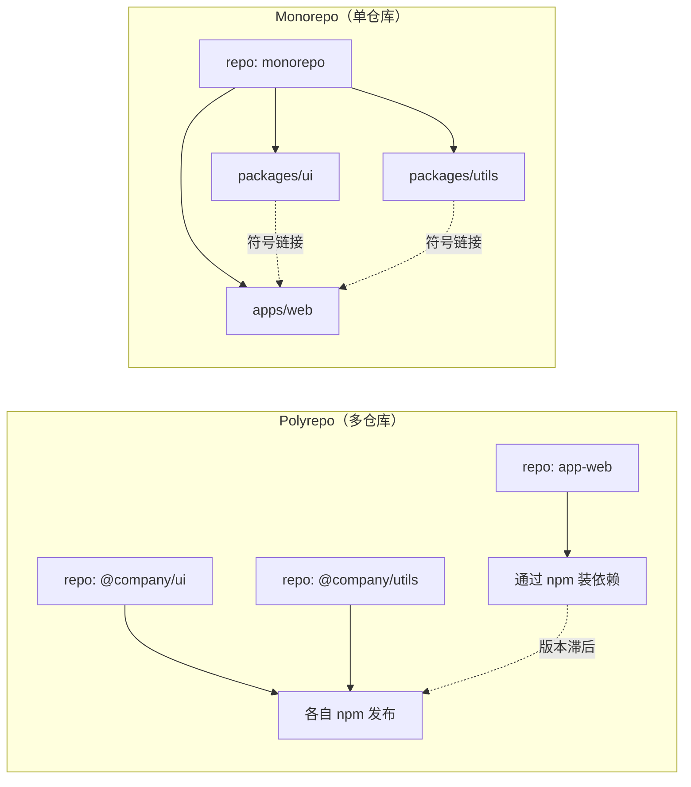
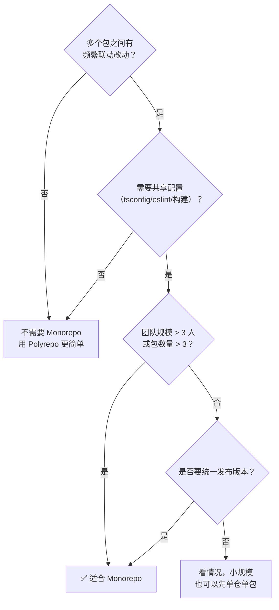
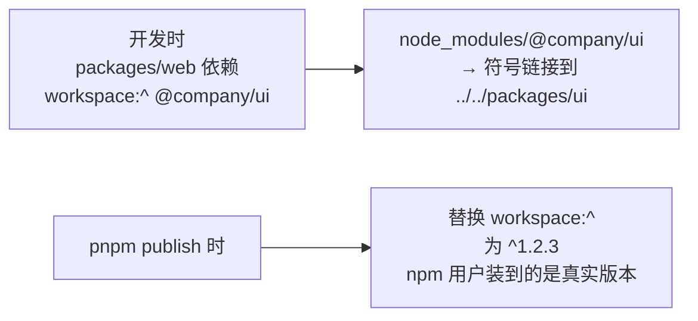
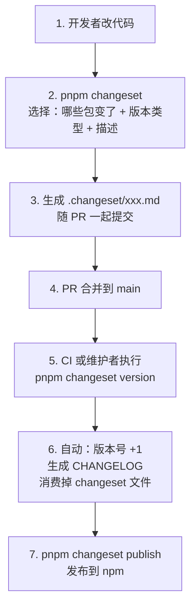

# 第七章：Monorepo 与 Workspaces

Monorepo（单仓多包）已经成为中大型前端团队的主流组织方式：Vue、React、Vite、Babel、NestJS 全部采用。本章讲清三件事：**workspace 怎么用**、**任务怎么编排**、**版本怎么发布**。

## 一、什么是 Monorepo {#what-is-monorepo}

### 与 Polyrepo 对比



| 维度 | Polyrepo | Monorepo |
| --- | --- | --- |
| 代码复用 | 发布成 npm 包再装 | **直接源码引用** |
| 跨包改动 | 多仓库多次 PR，顺序发布 | **一次 PR 改完** |
| 依赖版本 | 容易不一致 | 天然统一 |
| CI | 每仓库独立 | 统一编排，可只跑受影响部分 |
| 仓库体积 | 小 | 大（需要工具优化） |
| 权限控制 | 天然隔离 | 弱（需工具辅助） |
| 上手成本 | 低 | 中高（要学工具链） |

### 什么时候该用 Monorepo



**典型适用场景**：

- 组件库 + 配套工具 + 文档站
- 多个前端应用共享 UI/工具库
- SDK + 示例项目
- 微前端的多个子应用

**不适合的场景**：

- 完全独立的几个项目，毫无共享
- 需要严格的代码权限隔离（不同部门/客户）
- 团队还没有遇到「改一个包要发三次版本」的痛点

### 典型目录结构

```
my-monorepo/
├── packages/
│   ├── ui/                    # 组件库
│   │   ├── src/
│   │   ├── package.json       # name: @company/ui
│   │   └── tsconfig.json
│   ├── utils/                 # 工具库
│   │   ├── src/
│   │   └── package.json       # name: @company/utils
│   └── config/                # 共享配置
│       ├── eslint-config/
│       └── tsconfig/
├── apps/
│   ├── web/                   # 应用 A
│   │   └── package.json       # 依赖 @company/ui
│   └── admin/                 # 应用 B
├── tooling/                   # 可选：内部工具
├── package.json               # 根 package.json（private: true）
├── pnpm-workspace.yaml        # pnpm workspace 配置
├── turbo.json                 # Turborepo 配置
├── tsconfig.base.json
└── .changeset/                # Changesets 配置
```

## 二、三家 workspace 横向对比 {#workspace-comparison}

### 配置方式

```json
// ===== npm / yarn =====
{
  "name": "my-monorepo",
  "private": true,
  "workspaces": ["packages/*", "apps/*"]
}
```

```yaml
# ===== pnpm：pnpm-workspace.yaml =====
packages:
  - 'packages/*'
  - 'apps/*'
  - '!**/dist/**'
```

### 功能对比表

| 能力 | npm (v7+) | yarn (Berry) | pnpm |
| --- | --- | --- | --- |
| 配置位置 | `package.json` | `package.json` | `pnpm-workspace.yaml` |
| 支持嵌套 | ❌ | ✅ | ✅ |
| `workspace:` 协议 | ❌（部分支持） | ✅ | ✅ |
| 发布时替换版本 | ⚠️ 需工具 | ✅ 自动 | ✅ 自动 |
| 过滤执行 | `--workspace` / `-w` | `workspaces foreach` | `--filter`（最强） |
| 拓扑排序 | ❌ | `foreach -t` | `run -r` / 自动 |
| 并行执行 | ❌ | `foreach -p` | 自动 |
| 版本统一管理 | ❌ | ⚠️ | ✅ **Catalog** |
| 依赖去重优化 | 一般 | 好 | **最好** |
| 执行本地包的 bin | `npm run -w pkg cmd` | `yarn workspace pkg cmd` | `pnpm --filter pkg cmd` |

### 命令对照

```bash
# ===== 安装全部 =====
npm install
yarn install
pnpm install

# ===== 给某个包加依赖 =====
npm install lodash -w @company/ui
npm install lodash --workspace=@company/ui

yarn workspace @company/ui add lodash

pnpm --filter @company/ui add lodash

# ===== 给根加依赖 =====
npm install -D typescript --workspace-root      # 或用 -w .
yarn add -D typescript -W                        # -W = --ignore-workspace-root-check
pnpm add -Dw typescript                          # -w = --workspace-root

# ===== 在某个包里跑脚本 =====
npm run build -w @company/ui
yarn workspace @company/ui run build
pnpm --filter @company/ui run build

# ===== 所有包跑同一个脚本 =====
npm run build --workspaces                       # 串行
npm run build --workspaces --if-present          # 没这个脚本就跳过

yarn workspaces run build
yarn workspaces foreach -ptv run build           # Berry：并行+拓扑+前缀

pnpm -r run build                                # 递归，自动拓扑排序
pnpm -r --parallel run dev                       # 并行（适合 watch 类任务）

# ===== 列出所有 workspace =====
npm query ".workspace"                           # npm 8+
yarn workspaces list
pnpm list -r --depth=-1
```

### 过滤能力对比（pnpm 最强）

```bash
# pnpm 的 --filter 语法
pnpm --filter @company/ui run build              # 指定包
pnpm --filter '@company/*' run test              # 通配
pnpm --filter './packages/**' run test           # 按路径
pnpm --filter '!@company/legacy' run build       # 排除
pnpm --filter '@company/web...' run build        # 该包 + 它的依赖
pnpm --filter '...@company/utils' run test       # 该包 + 依赖它的包（下游）
pnpm --filter '...' run build                    # 全部，按拓扑顺序
pnpm --filter '[origin/main]' run test           # 自 main 以来有改动的
pnpm --filter '{packages/*}...' run build        # 组合
```

```bash
# yarn Berry 的等价写法
yarn workspaces foreach -ptv --include '@company/*' run build
yarn workspaces foreach --exclude '@company/legacy' run build
yarn workspaces foreach --changed run test        # 有改动的
```

```bash
# npm 的过滤能力最弱，主要靠 --workspace 指定
npm run build -w @company/ui -w @company/utils    # 多个
npm run build --workspaces --if-present           # 全部串行
```

> **结论**：Monorepo 的执行编排能力，**pnpm > yarn Berry > npm**。这也是大型 Monorepo 普遍选择 pnpm 的核心原因。

## 三、workspace 协议与本地链接 {#workspace-protocol}

### 本地包如何互相引用

```json
{
  "name": "@company/web",
  "dependencies": {
    "@company/ui": "workspace:*",
    "@company/utils": "workspace:^"
  }
}
```

安装后，`node_modules/@company/ui` 是一个**符号链接**指向 `packages/ui`，修改源码立即生效，无需发布。

```bash
# 用命令添加
pnpm --filter @company/web add @company/ui --workspace
# 生成 "workspace:^"
```

### 三种写法与发布行为

| 写法 | 开发时 | 发布时替换成 |
| --- | --- | --- |
| `workspace:*` | 链接本地 | 实际版本（如 `1.2.3`） |
| `workspace:^` | 链接本地 | `^1.2.3` |
| `workspace:~` | 链接本地 | `~1.2.3` |
| `workspace:1.2.3` | 链接本地 | `1.2.3` |



> **npm 的 workspace 也支持 `workspace:*`**，但对发布时的版本替换支持不如 pnpm/yarn 完善，复杂场景建议配合 Changesets 或 Lerna。

### 内部包的 package.json 最佳实践

```json
{
  "name": "@company/ui",
  "version": "1.2.3",
  "type": "module",
  "main": "./dist/index.cjs",
  "module": "./dist/index.mjs",
  "types": "./dist/index.d.ts",
  "exports": {
    ".": {
      "types": "./dist/index.d.ts",
      "import": "./dist/index.mjs",
      "require": "./dist/index.cjs"
    },
    "./styles.css": "./dist/styles.css"
  },
  "files": ["dist"],
  "sideEffects": ["*.css"],
  "scripts": {
    "build": "tsup src/index.ts --format cjs,esm --dts",
    "dev": "tsup --watch",
    "typecheck": "tsc --noEmit"
  }
}
```

**开发时如何直接引用源码（免构建）**：

```json
{
  "exports": {
    ".": {
      "development": "./src/index.ts",    // 自定义条件，开发时用源码
      "types": "./dist/index.d.ts",
      "import": "./dist/index.mjs",
      "require": "./dist/index.cjs"
    }
  }
}
```

配合 Vite 的 `resolve.conditions: ['development']`，可实现「改源码热更新，不需要先 build」。

## 四、任务编排：Turborepo 与 Nx {#task-orchestration}

### 为什么需要

原生 `pnpm -r run build` 已经能做拓扑排序，但缺少：

- **缓存**：没改动的包跳过构建
- **并行调度**：最大化利用 CPU
- **远程缓存**：团队/CI 共享构建产物

这就是 Turborepo / Nx 的价值。

### 对比

| 维度 | Turborepo | Nx |
| --- | --- | --- |
| 出品方 | Vercel | Nrwl（后被 Vercel 收购部分团队） |
| 学习成本 | **低**（配置简单） | 中（概念多） |
| 配置复杂度 | 一个 `turbo.json` | `nx.json` + project.json |
| 缓存 | 本地 + 远程 | 本地 + 远程（Nx Cloud） |
| 任务图可视化 | `--graph` | `--graph`（更强，有 Web UI） |
| 代码生成 | ❌（用脚手架） | ✅ 强大的 generator |
| 分布式执行 | ✅ | ✅ |
| 插件生态 | 一般 | **丰富** |
| 适用场景 | 想要简单快速的缓存与编排 | 大型仓库、需要代码生成与强治理 |

> **选型**：中小团队/想要快速上手 → **Turborepo**；大型仓库/需要强治理与代码生成 → **Nx**。

### Turborepo 实战

```bash
# 安装
pnpm add -Dw turbo
```

```json
// 根 package.json
{
  "private": true,
  "packageManager": "pnpm@9.15.0",
  "scripts": {
    "build": "turbo run build",
    "dev": "turbo run dev",
    "test": "turbo run test",
    "lint": "turbo run lint",
    "typecheck": "turbo run typecheck"
  },
  "devDependencies": {
    "turbo": "^2.2.0"
  }
}
```

```json
// turbo.json
{
  "$schema": "https://turbo.build/schema.json",
  "ui": "tui",
  "globalDependencies": [".env", "tsconfig.base.json"],
  "globalEnv": ["NODE_ENV"],
  "tasks": {
    "build": {
      "dependsOn": ["^build"],        // ^ 表示先构建依赖的包
      "outputs": ["dist/**", ".next/**", "!.next/cache/**"],
      "cache": true
    },
    "test": {
      "dependsOn": ["build"],
      "outputs": ["coverage/**"],
      "cache": true
    },
    "lint": {
      "outputs": [],
      "cache": true
    },
    "typecheck": {
      "dependsOn": ["^build"],
      "outputs": [],
      "cache": true
    },
    "dev": {
      "cache": false,                 // watch 任务不能缓存
      "persistent": true              // 长驻任务
    }
  }
}
```

**关键语法**：

- `"dependsOn": ["^build"]`：`^` 表示**上游依赖**的 build 先跑
- `"dependsOn": ["build"]`：同一个包内的 build 先跑
- `"outputs"`：需要缓存的产物目录
- `"cache": false`：不缓存（如 dev server）
- `"persistent": true`：任务不会自己退出

```bash
# 执行
turbo run build
pnpm build                    # 通过根 scripts

# 只跑某个包及其依赖
turbo run build --filter=@company/web

# 强制跳过缓存
turbo run build --force

# 只看会执行什么（不实际执行）
turbo run build --dry-run=json

# 可视化任务图
turbo run build --graph=graph.html

# 并行度控制
turbo run build --concurrency=4

# 输出日志格式
turbo run build --output-logs=errors-only
```

**缓存命中示例**：

```bash
$ turbo run build
• Packages in scope: @company/ui, @company/utils, @company/web
• Running build in 3 packages

@company/utils:build: cache miss, executing...
@company/ui:build: cache miss, executing...
@company/web:build: cache miss, executing...

 Tasks:    3 successful, 3 total
Cached:    0 cached, 3 total
  Time:    12.4s

# 第二次执行（无改动）
$ turbo run build
 Tasks:    3 successful, 3 total
Cached:    3 cached, 3 total       ← 全部命中缓存
  Time:    108ms                   ← 从 12.4s 降到 108ms
```

### 远程缓存

```bash
# Vercel 远程缓存（免费额度）
turbo login
turbo link

# 自建远程缓存（需要实现 Turbo Cache API）
# 或用社区方案：turbo-remote-cache
```

```yaml
# GitHub Actions 里启用
- name: Build
  run: turbo run build
  env:
    TURBO_TOKEN: ${{ secrets.TURBO_TOKEN }}
    TURBO_TEAM: ${{ vars.TURBO_TEAM }}
```

> 远程缓存的收益：CI 里只有改动的包需要真构建，其余直接下载缓存产物，构建时间可能从 10 分钟降到 1 分钟。

### Nx 简介

```bash
# 初始化
npx create-nx-workspace@latest myorg
```

```json
// nx.json
{
  "targetDefaults": {
    "build": {
      "dependsOn": ["^build"],
      "outputs": ["{projectRoot}/dist"],
      "cache": true
    },
    "test": {
      "dependsOn": ["build"],
      "cache": true
    }
  },
  "namedInputs": {
    "default": ["{projectRoot}/**/*", "sharedGlobals"],
    "production": ["default", "!{projectRoot}/**/*.spec.ts"]
  }
}
```

```bash
nx build @company/web
nx run-many -t build              # 所有包
nx affected -t test               # 只跑受影响的
nx graph                          # 可视化依赖图
nx generate @nx/react:component   # 代码生成
```

> Nx 的 `affected` 命令非常强大：它会分析 Git diff，只跑真正受影响的包。

## 五、版本管理与发布：Changesets {#changesets}

### 问题

Monorepo 里有 20 个包，改了 A 包，哪些包要跟着升版本？版本怎么定？CHANGELOG 谁写？

手工做会疯。Changesets 把这件事变成：**每个 PR 附带一个「变更描述文件」**。

### 工作流



### 使用

```bash
# 初始化
pnpm add -Dw @changesets/cli
pnpm changeset init
```

生成 `.changeset/config.json`：

```json
{
  "$schema": "https://unpkg.com/@changesets/config@3.0.0/schema.json",
  "changelog": ["@changesets/changelog-github", { "repo": "company/monorepo" }],
  "commit": false,
  "fixed": [],
  "linked": [],
  "access": "public",
  "baseBranch": "main",
  "updateInternalDependencies": "patch",
  "ignore": ["@company/docs"]
}
```

**添加一个变更**：

```bash
pnpm changeset
```

交互式选择后生成：

```md
# .changeset/lucky-pandas-jump.md
---
'@company/ui': minor
'@company/utils': patch
---

新增 Button 组件的 loading 状态
```

格式：**哪些包 + 版本类型（major/minor/patch）+ 描述**。

**消费变更、升版本**：

```bash
pnpm changeset version
```

自动完成：
- `@company/ui` 版本 `1.2.3` → `1.3.0`（minor）
- `@company/utils` 版本 `1.0.0` → `1.0.1`（patch）
- 依赖 `@company/ui` 的包，其依赖范围更新
- 各包生成/更新 `CHANGELOG.md`
- 删除 `.changeset/*.md`

**发布**：

```bash
pnpm changeset publish
# 只对版本有变化的包执行 npm publish
```

### 预发布（beta）

```bash
pnpm changeset pre enter beta
pnpm changeset version          # 生成 1.3.0-beta.0
pnpm changeset publish --tag beta

# 正式发布
pnpm changeset pre exit
pnpm changeset version
pnpm changeset publish
```

### CI 自动化（Changesets GitHub Action）

```yaml
# .github/workflows/release.yml
name: Release

on:
  push:
    branches: [main]

concurrency: ${{ github.workflow }}-${{ github.ref }}

jobs:
  release:
    runs-on: ubuntu-latest
    steps:
      - uses: actions/checkout@v4
      - uses: pnpm/action-setup@v4
      - uses: actions/setup-node@v4
        with:
          node-version: 22
          cache: 'pnpm'

      - run: pnpm install --frozen-lockfile

      - name: Create Release PR or Publish
        uses: changesets/action@v1
        with:
          version: pnpm changeset version
          publish: pnpm changeset publish
          commit: 'chore: version packages'
          title: 'chore: version packages'
        env:
          GITHUB_TOKEN: ${{ secrets.GITHUB_TOKEN }}
          NPM_TOKEN: ${{ secrets.NPM_TOKEN }}
```

**效果**：有 changeset 时自动开一个「version packages」PR；PR 合并后自动发布。

### 替代方案

| 工具 | 特点 | 适用 |
| --- | --- | --- |
| **Changesets** | 手工声明变更，PR 驱动，简单直观 | **推荐**，多数场景 |
| **semantic-release** | 从 commit message 自动推断版本 | 单包或简单 Monorepo，需规范 commit |
| **Lerna** | 老牌，自带版本管理 | 存量项目（新项目不建议） |
| **nx release** | 内置于 Nx | 已用 Nx 的项目 |

## 六、依赖治理 {#dependency-governance}

### 统一依赖版本

```yaml
# pnpm 的 catalog（推荐）
catalog:
  react: ^18.3.1
  typescript: ^5.6.3
```

```json
// npm / yarn：用 overrides 或 resolutions
{
  "overrides": {
    "react": "^18.3.1",
    "typescript": "^5.6.3"
  }
}
```

```bash
# 用 syncpack 检查并修复版本不一致
npx syncpack list-mismatches
npx syncpack fix-mismatches
```

### 检测未使用 / 缺失的依赖

```bash
# 每个包都跑一遍
pnpm -r exec depcheck

# 或用 knip（更强大）
npx knip
```

`knip` 能找出：未使用的依赖、未使用的导出、未使用的文件、缺失的依赖。

### 依赖图可视化

```bash
# pnpm
pnpm why -r lodash

# Nx
nx graph

# Turborepo
turbo run build --graph

# 生成依赖图（需要 graphviz）
pnpm -r exec -- echo
```

### 常见治理规则

```json
// .npmrc 或 package.json 中约束
{
  "pnpm": {
    "peerDependencyRules": {
      "ignoreMissing": ["@types/*"],
      "allowedVersions": { "react": "18" }
    }
  }
}
```

1. **所有内部包用 `workspace:*`**：保证本地链接
2. **公共依赖提到根或用 catalog**：避免版本分裂
3. **每个包只声明真正用到的依赖**：pnpm 的严格性会强制你做到
4. **定期 `pnpm outdated -r`**：批量检查更新
5. **CI 里跑 `pnpm install --frozen-lockfile`**：防止 lockfile 漂移

## 七、Monorepo 常见坑 {#pitfalls}

| 坑 | 现象 | 解法 |
| --- | --- | --- |
| 幽灵依赖 | 本地能跑，CI 挂 | pnpm 严格模式会暴露，显式补依赖 |
| 版本不一致 | 装了两份 React | catalog / overrides 统一 |
| 构建顺序错 | 依赖包还没构建就被引用 | `dependsOn: ["^build"]` |
| 缓存不生效 | 每次都全量构建 | 检查 `outputs` 配置、是否有时间戳/随机数写入产物 |
| CI 太慢 | 每次全量 | Turborepo/Nx 缓存 + `--filter '[origin/main]'` 只跑改动的 |
| 循环依赖 | A 依赖 B，B 依赖 A | 抽取公共部分成 C 包 |
| 编辑器类型解析慢 | TS 服务器卡 | 配置 path 映射 + project references |
| 发布漏包 | 某些包没发 | 用 Changesets，不要手工 publish |
| 根目录误装依赖 | 依赖装到根但子包用 | 明确 `-w` 的含义；子包依赖装到子包 |

### TypeScript 项目引用（加速类型检查）

```json
// tsconfig.base.json
{
  "compilerOptions": {
    "composite": true,          // 启用项目引用
    "declaration": true,
    "declarationMap": true,
    "paths": {
      "@company/ui": ["./packages/ui/src/index.ts"],
      "@company/utils": ["./packages/utils/src/index.ts"]
    }
  }
}
```

```json
// apps/web/tsconfig.json
{
  "extends": "../../tsconfig.base.json",
  "references": [
    { "path": "../../packages/ui" },
    { "path": "../../packages/utils" }
  ]
}
```

```bash
tsc --build    # 增量构建，只编译改动的
```

## 小结 {#summary}

- **Monorepo 的核心价值**：跨包改动一次 PR、依赖版本天然统一、共享配置容易。适合包之间频繁联动的场景。
- **三家 workspace**：pnpm 的 `--filter` 过滤语法最强大，yarn Berry 的 `foreach` 次之，npm 最弱。大型 Monorepo 优先 pnpm。
- **`workspace:` 协议**：开发时符号链接到本地，发布时自动替换为真实版本号（pnpm/yarn 支持完善）。
- **任务编排**：原生 `pnpm -r` 能做拓扑排序；需要缓存与增量构建则上 Turborepo（简单）或 Nx（强大）。`dependsOn: ["^build"]` 是关键语法。
- **版本发布**：Changesets 用「PR 附带变更描述文件」的方式，把版本决策交给开发者、把执行交给自动化。配合 GitHub Action 可全自动发布。
- **依赖治理**：catalog（pnpm）或 overrides 统一版本、`knip`/`depcheck` 检测冗余、CI 用 `--frozen-lockfile` 防漂移。

下一章是最后一章：包的发布流程、私有仓库搭建、供应链安全与常见故障排查——把「用包」这件事闭环到「发包」。
