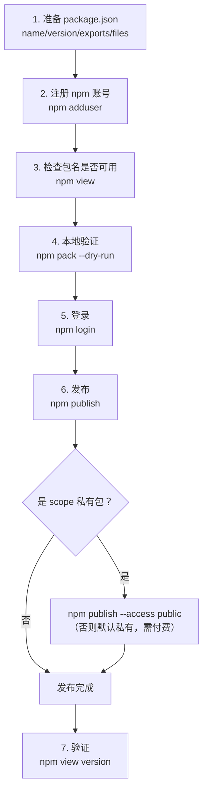
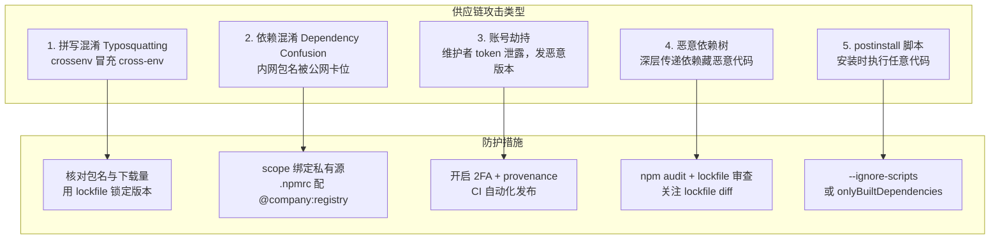
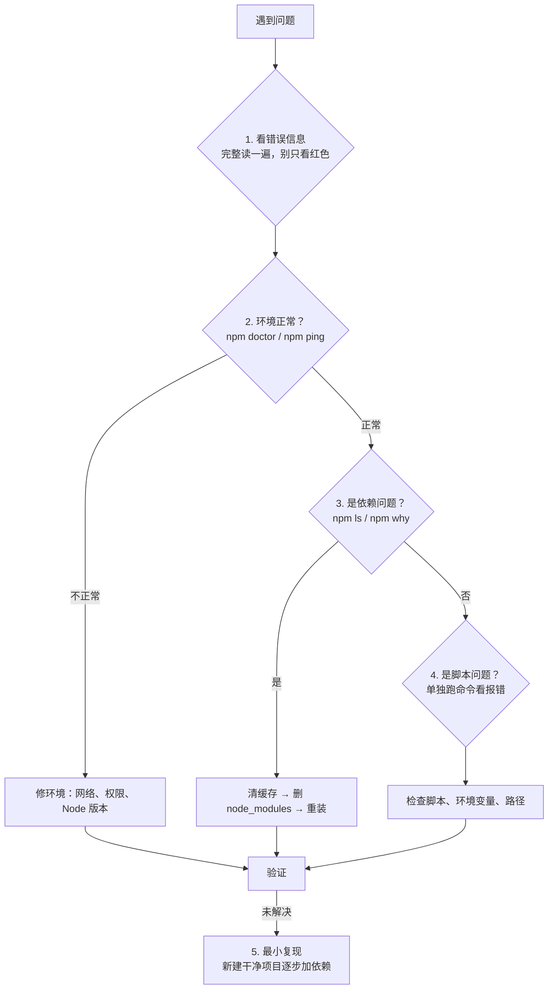
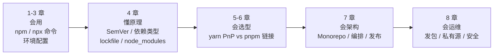

# 第八章：包发布、私有仓库、安全与排错

最后一章把「用包」闭环到「发包」：如何发布一个规范的 npm 包、企业如何搭私有仓库、如何防范供应链攻击，以及遇到问题时怎么系统排查。

## 一、发布一个 npm 包 {#publish}

### 完整流程



### 第一步：准备 package.json

```json
{
  "name": "@yourname/awesome-utils",     // 或普通名 awesome-utils
  "version": "1.0.0",
  "description": "一个好用的工具库",
  "type": "module",
  "main": "./dist/index.cjs",
  "module": "./dist/index.mjs",
  "types": "./dist/index.d.ts",
  "exports": {
    ".": {
      "types": "./dist/index.d.ts",
      "import": "./dist/index.mjs",
      "require": "./dist/index.cjs"
    },
    "./package.json": "./package.json"
  },
  "files": ["dist", "README.md", "LICENSE"],
  "sideEffects": false,
  "keywords": ["utils", "toolkit"],
  "author": "你的名字 <you@example.com>",
  "license": "MIT",
  "repository": {
    "type": "git",
    "url": "git+https://github.com/you/awesome-utils.git"
  },
  "bugs": { "url": "https://github.com/you/awesome-utils/issues" },
  "homepage": "https://github.com/you/awesome-utils#readme",
  "engines": { "node": ">=18" },
  "scripts": {
    "build": "tsup src/index.ts --format cjs,esm --dts",
    "prepublishOnly": "npm run test && npm run build"
  }
}
```

**发布前必检项**：

```bash
# 检查包名是否已被占用
npm view awesome-utils
# 404 说明可用；返回信息说明已占用

# 检查 scope 是否属于你
npm view @yourname/awesome-utils

# 模拟打包，看会包含哪些文件（最重要的一步！）
npm pack --dry-run
```

`npm pack --dry-run` 输出：

```text
npm notice
npm notice 📦  @yourname/awesome-utils@1.0.0
npm notice === Tarball Contents ===
npm notice 1.2kB  LICENSE
npm notice 4.5kB  README.md
npm notice 2.1kB  dist/index.cjs
npm notice 1.8kB  dist/index.d.ts
npm notice 1.9kB  dist/index.mjs
npm notice 856B   package.json
npm notice === Tarball Details ===
npm notice name:          @yourname/awesome-utils
npm notice version:       1.0.0
npm notice filename:      yourname-awesome-utils-1.0.0.tgz
npm notice package size:  3.2 kB
npm notice unpacked size: 12.4 kB
npm notice total files:   6
```

> **务必检查这个列表**：如果里面出现了 `src/`、`.env`、`node_modules`、测试文件，说明 `files` 或 `.npmignore` 配错了。

### 第二步：账号与登录

```bash
# 注册（会在浏览器打开注册页）
npm adduser

# 已注册则直接登录
npm login
# 会提示输入 username / password / email / OTP（如果开了 2FA）

# 查看当前登录用户
npm whoami

# 退出登录
npm logout

# CI 里用 token 登录（不交互）
# 在 ~/.npmrc 里
//registry.npmjs.org/:_authToken=${NPM_TOKEN}
```

**强烈建议开启 2FA**：

```bash
# 开启双因素认证
npm profile enable-2fa auth-and-writes
# auth-and-writes：登录和发布都需要 OTP（最安全）
# auth-only：仅登录需要

# 查看 2FA 状态
npm profile get
```

### 第三步：发布

```bash
# 普通发布
npm publish

# scope 包首次发布（必须显式声明 public，否则默认私有需要付费）
npm publish --access public

# 发布预发布版本（不影响 latest 标签）
npm publish --tag beta
npm publish --tag next

# 干跑，不实际发布
npm publish --dry-run

# 指定 registry 发布（私有仓库）
npm publish --registry https://npm.internal.company.com/

# 强制覆盖已存在的版本（不推荐，24 小时内可撤销）
npm publish --force
```

**发布后验证**：

```bash
npm view @yourname/awesome-utils version
npm view @yourname/awesome-utils dist-tags

# 实际装一次验证
npx @yourname/awesome-utils --version
npm i @yourname/awesome-utils && node -e "console.log(require('@yourname/awesome-utils'))"
```

### 发布检查清单

```text
✅ 包名未被占用 / scope 正确
✅ version 已按 SemVer 递增（不能重复发布同一版本！）
✅ npm pack --dry-run 检查了文件列表
✅ files 字段只包含必要文件（dist + README + LICENSE）
✅ 没有 .env / 密钥 / 测试文件
✅ main / module / types / exports 配置正确
✅ README 有安装和使用说明
✅ license 字段已填
✅ repository / homepage 地址正确
✅ prepublishOnly 里的测试与构建通过
✅ 已开启 2FA
✅ 预发布版本用了 --tag beta
```

> **重要**：npm **不允许**重复发布同一版本号。发了 `1.0.0` 之后想改，必须升到 `1.0.1`。

## 二、版本管理与 dist-tags {#dist-tags}

### dist-tag 是什么

dist-tag（distribution tag）是版本的可读别名，最常用的是 `latest`。

```bash
# 查看包的所有标签
npm view react dist-tags
# {
#   latest: '19.0.0',
#   canary: '19.1.0-canary-xxx',
#   experimental: '19.1.0-experimental-xxx'
# }

# 用户装 tag
npm i react              # 装 latest
npm i react@canary       # 装 canary
```

### 管理标签

```bash
# 给已有版本打标签
npm dist-tag add my-pkg@1.2.3 stable
npm dist-tag add my-pkg@2.0.0-beta.1 beta

# 列出
npm dist-tag ls my-pkg

# 删除
npm dist-tag rm my-pkg beta

# 发布时直接指定
npm publish --tag beta
```

**典型工作流**：

```bash
# 1. 发 beta 让用户试用
npm version prerelease --preid=beta    # 1.2.3 → 1.3.0-beta.0
npm publish --tag beta                 # 用户 npm i my-pkg@beta

# 2. 测试通过后转正式
npm version minor                      # 1.3.0-beta.0 → 1.3.0
npm publish                            # 打上 latest

# 3. 清理 beta 标签（可选）
npm dist-tag rm my-pkg beta
```

### 撤销发布

```bash
# 24 小时内可撤销整个版本
npm unpublish my-pkg@1.0.0

# 撤销整个包（72 小时内）
npm unpublish my-pkg --force

# 更温和：标记为废弃（推荐，不破坏已依赖它的项目）
npm deprecate my-pkg@1.0.0 "1.0.0 存在严重 bug，请升级到 1.0.1"
npm deprecate my-pkg "本包已废弃，请改用 @company/new-pkg"
```

> **优先用 `deprecate` 而非 `unpublish`**。unpublish 会让所有依赖该版本的项目立刻装不上（left-pad 事件），影响面极大。npm 官方对 unpublish 有严格限制。

## 三、Provenance：发布来源证明 {#provenance}

### 解决什么问题

用户怎么知道 `@company/ui@1.2.3` 真的是从 `github.com/company/monorepo` 的 CI 构建发布的，而不是攻击者拿到 token 后发布的恶意版本？

**Provenance（来源证明）** 就是答案：发布时附带一个可验证的「出生证明」，记录**哪个仓库、哪次提交、哪个 CI 工作流**产出了这个包。

### 启用方式

```json
{
  "publishConfig": {
    "provenance": true
  }
}
```

```yaml
# GitHub Actions 需要 id-token: write 权限
permissions:
  contents: read
  id-token: write     # ← 必须有，用于 OIDC 签名

steps:
  - uses: actions/setup-node@v4
    with:
      node-version: 22
      registry-url: 'https://registry.npmjs.org'
  - run: npm publish --provenance
    env:
      NODE_AUTH_TOKEN: ${{ secrets.NPM_TOKEN }}
```

### 验证

发布后在 npm 包页面会看到一个绿色徽章「Provenance」，用户也可以：

```bash
npm audit signatures
# 检查已安装包的签名与来源
```

> **实践建议**：公开发布的包建议开启 provenance。它把「信任包」变成「信任构建流程」，是目前最有效的供应链防护之一（配合 2FA + 自动化发布）。

## 四、私有仓库：Verdaccio {#private-registry}

### 为什么需要

企业内部包不能发到公网，或者想缓存公共包加速内网安装。

### 方案对比

| 方案 | 成本 | 特点 |
| --- | --- | --- |
| **npm 私有包** | 付费（$7/月起） | 官方，最省心 |
| **Verdaccio** | **免费、自托管** | 轻量，Node 写的，几分钟搭起来 |
| **Nexus Repository** | 免费/商业版 | 支持多语言生态（Maven/Docker/npm） |
| **JFrog Artifactory** | 商业 | 企业级，功能最全 |
| **GitHub Packages** | 免费额度 | 与 GitHub 集成好 |
| **云厂商制品库** | 按量付费 | 腾讯云 CODING、阿里云效等 |

### Verdaccio 快速搭建

```bash
# 安装
npm i -g verdaccio

# 启动（默认 4873 端口）
verdaccio
```

**Docker 方式（推荐）**：

```yaml
# docker-compose.yml
version: '3.8'
services:
  verdaccio:
    image: verdaccio/verdaccio:6
    container_name: verdaccio
    ports:
      - '4873:4873'
    volumes:
      - ./storage:/verdaccio/storage
      - ./conf:/verdaccio/conf
      - ./plugins:/verdaccio/plugins
    environment:
      - VERDACCIO_PUBLIC_URL=http://npm.internal.company.com
    restart: unless-stopped
```

```bash
docker compose up -d
```

### 配置

```yaml
# conf/config.yaml
storage: /verdaccio/storage
plugins: /verdaccio/plugins

web:
  title: Company NPM Registry

auth:
  htpasswd:
    file: ./htpasswd
    max_users: 1000

# 上行链路：本地没有的包去哪找
uplinks:
  npmmirror:
    url: https://registry.npmmirror.com/
    cache: true
    maxage: 30m
  npmjs:
    url: https://registry.npmjs.org/
    cache: true

packages:
  # 公司私有包：只允许内网访问
  '@company/*':
    access: $authenticated
    publish: $authenticated
    unpublish: $authenticated
    proxy: npmmirror

  # 公共包：代理并缓存
  '**':
    access: $all
    publish: $authenticated
    unpublish: $authenticated
    proxy: npmmirror

# 禁止新用户注册（改用 htpasswd 手工添加）
max_body_size: 100mb

listen:
  - 0.0.0.0:4873

log: { type: stdout, format: pretty, level: http }
```

**要点**：

- `uplinks`： Verdaccio 本地没有时去上游拉，拉完缓存，下次走本地 → **内网加速**
- `packages.<scope>.access`：权限控制（`$all` / `$authenticated` / 具体用户名）
- `proxy`：指定这个匹配模式用哪个上行链路

### 客户端使用

```bash
# 方式一：全局切换（不推荐，影响所有项目）
npm config set registry http://npm.internal.company.com:4873/

# 方式二：只让公司 scope 走内网（推荐）
npm config set @company:registry http://npm.internal.company.com:4873/

# 方式三：项目级 .npmrc（最推荐，随仓库提交）
# .npmrc
registry=https://registry.npmmirror.com/
@company:registry=http://npm.internal.company.com:4873/
//npm.internal.company.com:4873/:_authToken=${NPM_TOKEN}
```

```bash
# 登录私有仓库
npm login --registry http://npm.internal.company.com:4873/

# 发布私有包
npm publish --registry http://npm.internal.company.com:4873/
```

### 权限管理

```bash
# 添加用户（需要 htpasswd 工具，或用在线生成）
# 生成的行追加到 conf/htpasswd
htpasswd -B ./conf/htpasswd username

# 或者让用户自己注册（如果允许）
npm adduser --registry http://npm.internal.company.com:4873/
```

```bash
# 查看包的访问权限
npm access list packages @company
npm access grant read-only user @company/ui
npm access revoke user @company/ui
```

## 五、供应链安全 {#security}

### 常见攻击类型



### 1. Typosquatting（拼写混淆）

攻击者发布与知名包名字相近的恶意包：

```text
cross-env   ✅
crossenv    ❌ 恶意
lodash      ✅
lodahs      ❌ 恶意
@types/node ✅
@types/nods ❌ 恶意
```

**防护**：

- 从官方文档复制包名，而非自己敲
- 安装前 `npm view <pkg>` 看下载量、最后发布时间、维护者
- 用 lockfile 锁定，依赖树不漂移
- 企业环境用私有 registry 白名单

### 2. Dependency Confusion（依赖混淆）

**原理**：如果你的 `package.json` 里有 `@company/internal-utils`，而 npm 解析时先查了公网 registry，攻击者抢注了同名包 → 装到的是恶意版本。

**防护**：

```ini
# .npmrc：明确绑定 scope 到私有源
@company:registry=https://npm.internal.company.com/
```

```json
{
  "publishConfig": {
    "registry": "https://npm.internal.company.com/",
    "access": "restricted"
  }
}
```

```bash
# 检查当前解析是否正确
npm view @company/internal-utils --registry https://registry.npmjs.org
# 应该返回 404（公网没有这个包，说明没被抢注）
```

### 3. 恶意 postinstall 脚本

```bash
# 安装时禁止执行脚本（最严格）
npm install --ignore-scripts

# pnpm：只允许指定包执行脚本（推荐，兼顾可用性与安全）
```

```json
{
  "pnpm": {
    "onlyBuiltDependencies": ["esbuild", "sharp", "@tailwindcss/oxide"]
  }
}
```

> pnpm 10 起默认**禁止所有依赖的 install 脚本**，需要显式用 `onlyBuiltDependencies` 放行。这是安全上的一大进步。

### 4. lockfile 完整性保护

lockfile 里的 `integrity` 字段是防线：

```json
{
  "node_modules/lodash": {
    "version": "4.17.21",
    "resolved": "https://registry.npmjs.org/lodash/-/lodash-4.17.21.tgz",
    "integrity": "sha512-qv...=="     // ← 内容哈希
  }
}
```

即使 registry 返回被篡改的 tarball，哈希不匹配就会安装失败。

```bash
# 强制校验（CI 里建议）
npm ci
pnpm install --frozen-lockfile

# 检查已装包的签名（npm 9.5+）
npm audit signatures
```

**安全实践**：

```text
✅ 提交 lockfile，CI 用 npm ci / --frozen-lockfile
✅ review 时留意 lockfile 的异常 diff（新增了没见过的包）
✅ 定期 npm audit
✅ 开启 2FA
✅ 使用 provenance
✅ 关键项目用 --ignore-scripts / onlyBuiltDependencies
✅ 私有 scope 绑定私有 registry
```

### 5. 敏感信息泄露

```bash
# 常见事故：把 .env 或密钥打进包里
npm pack --dry-run    # 务必检查！

# 检查已发布的包含哪些文件
npx package-phobia my-pkg      # 体积分析
npm view my-pkg dist.tarball   # 下载 tarball 自己看
```

```gitignore
# .gitignore
.env
.env.*
*.pem
*.key
config.local.js
```

```json
{
  "files": ["dist"],      // 白名单比 .npmignore 更可靠
  "publishConfig": {
    "access": "public"
  }
}
```

> **如果密钥已经泄露**：**第一步永远是轮换（revoke）密钥**，而不是删包。删包时密钥早已被爬走。

## 六、CI 优化 {#ci-optimization}

### 安装加速清单

```yaml
# 1. 缓存 store（关键）
- uses: actions/setup-node@v4
  with:
    node-version: 22
    cache: 'pnpm'

# 2. 用 --frozen-lockfile / npm ci
- run: pnpm install --frozen-lockfile

# 3. 只装生产依赖（构建/运行阶段）
- run: pnpm install --frozen-lockfile --prod

# 4. 跳过不必要的工作
- run: pnpm install --ignore-scripts      # 如果不需要编译原生模块

# 5. 用镜像源
- run: pnpm config set registry https://registry.npmmirror.com

# 6. Monorepo 只跑受影响的任务
- run: pnpm --filter '[origin/main]...' run test
- run: turbo run build --filter=...[origin/main]
```

### 完整 CI 模板

```yaml
name: CI

on:
  push:
    branches: [main]
  pull_request:

concurrency:
  group: ${{ github.workflow }}-${{ github.ref }}
  cancel-in-progress: true

jobs:
  ci:
    runs-on: ubuntu-latest
    steps:
      - uses: actions/checkout@v4
        with:
          fetch-depth: 0        # 完整历史，供 affected 判断

      - uses: pnpm/action-setup@v4

      - uses: actions/setup-node@v4
        with:
          node-version: 22
          cache: 'pnpm'

      - name: 安装依赖
        run: pnpm install --frozen-lockfile

      - name: 检查 lockfile 是否最新
        run: pnpm install --frozen-lockfile --dry-run

      - name: 类型检查
        run: pnpm run typecheck

      - name: Lint
        run: pnpm run lint

      - name: 测试
        run: pnpm run test -- --coverage

      - name: 构建
        run: pnpm run build

      - name: 安全审计
        run: pnpm audit --audit-level=high
        continue-on-error: true    # 不阻塞，仅报告
```

## 七、故障排查速查 {#troubleshooting}

### 系统排查流程



### 高频问题速查表

| 现象 | 原因 | 解决 |
| --- | --- | --- |
| **安装类** |||
| `EACCES: permission denied` | 全局目录无权限 | 改 `npm prefix` 到用户目录，或用 nvm/fnm |
| `EINTEGRITY` / 校验失败 | 缓存损坏 | `npm cache clean --force` 后重装 |
| `ENOTFOUND` / `ETIMEDOUT` | 网络不通 | 换镜像源，检查代理 |
| `ERESOLVE` 依赖冲突 | peer 版本不满足 | 见第四章第七节 |
| `EUNSUPPORTEDPROTOCOL` | 用了不支持的协议（如 `workspace:` 在 npm 下） | 换包管理器或改用相对路径 |
| `gyp ERR` 编译失败 | 缺 Python / 构建工具 | 装 `python3` + 平台构建工具 |
| 卡在某个包不动 | 该源响应慢 | 换源 / 配置超时重试 |
| **运行类** |||
| `Cannot find module 'xxx'` | 幽灵依赖或未安装 | 显式安装（pnpm 下常见） |
| `command not found: vite` | 未装或未用 npx | `npx vite` 或 `pnpm exec vite` |
| `ERR_MODULE_NOT_FOUND` | ESM/CJS 混用问题 | 检查 `type` 字段与 `exports` |
| `ERR_REQUIRE_ESM` | 用 require 加载了 ESM 包 | 改用 `import()` 动态导入 |
| `ERR_PACKAGE_PATH_NOT_EXPORTED` | `exports` 未声明该路径 | 在 `exports` 里补上，或直接引用主入口 |
| **发布类** |||
| `403 Forbidden` | 未登录 / 无权限 / 版本已存在 | `npm login`；确认版本号未发过 |
| `402 Payment Required` | scope 包默认私有需付费 | `npm publish --access public` |
| `EPUBLISHCONFLICT` | 版本已存在 | `npm version patch` 后重发 |
| `ENEEDAUTH` | 未认证 | `npm login` 或配 `_authToken` |
| 包内容不对 | `files` 配错 | `npm pack --dry-run` 检查 |
| **workspace 类** |||
| 本地包改动不生效 | 未链接 / 未构建 | 检查 `workspace:` 协议；重新 build |
| `workspace:` 协议报错 | npm 对协议支持有限 | 换 pnpm/yarn，或用相对路径 |
| 循环依赖 | A→B→A | 抽取公共部分 |

### 万能三板斧

遇到诡异问题，按序执行，能解决 80% 的情况：

```bash
# 1. 清缓存
npm cache clean --force
# 或 pnpm store prune

# 2. 删依赖重装
rm -rf node_modules package-lock.json
npm install

# 3. 检查环境
npm doctor
npm config list
node -v && npm -v
```

```powershell
# Windows PowerShell
Remove-Item -Recurse -Force node_modules
Remove-Item -Force package-lock.json
npm install
```

### 获取详细日志

```bash
# npm
npm install --loglevel=verbose
npm install --loglevel=silly      # 最详细

# pnpm
pnpm install --reporter=append-only
pnpm install --loglevel=debug

# 看 npm 到底请求了什么
npm install --registry=http://localhost:4873/    # 配合本地代理抓包
```

## 八、包的体积优化 {#size}

```bash
# 分析包体积
npx package-phobia my-pkg          # 在线分析
npx bundlephobia lodash            # 分析依赖对打包体积的影响

# 查看已装依赖的体积
npx cost-of-modules               # 按体积排序
npx npm-download-size my-pkg
```

**优化手段**：

```json
{
  "files": ["dist"],              // 1. 只发布必要文件
  "sideEffects": false            // 2. 启用 tree-shaking
}
```

```bash
# 3. 用体积更小的替代品
moment (232KB)  → dayjs (2KB)
lodash (71KB)   → lodash-es + 按需引入
request         → 原生 fetch / undici
```

```js
// 4. 按需引入而非全量
import debounce from 'lodash/debounce';   // ✅ 只引入需要的
import { debounce } from 'lodash';        // ⚠️ 打包器支持 tree-shaking 时才等价
```

> 发布前用 `npm pack --dry-run` 看 unpacked size，超过 1MB 就该想想是不是打进了不该有的东西。

## 小结 {#summary}

- **发布流程**：准备 `package.json` → `npm pack --dry-run` 检查文件 → `npm login` → `npm publish`。**必须先 dry-run**，避免把 `.env`、源码打进去。
- **版本不可重复**：发了 `1.0.0` 就不能再发 `1.0.0`，必须递增。撤销优先用 `deprecate` 而非 `unpublish`。
- **dist-tags**：预发布用 `--tag beta`，避免污染 `latest`。
- **Provenance**：把「信任包」变成「信任构建流程」，公开包建议开启（需要 CI 的 `id-token: write` 权限）。
- **私有仓库**：Verdaccio 自托管最轻量，关键是配好 `uplinks`（代理缓存公共包）和 scope 权限。
- **供应链安全**：拼写混淆、依赖混淆、账号劫持、恶意脚本是四大攻击面。对应防护是核对包名、scope 绑私有源、2FA+provenance、`--ignore-scripts`/`onlyBuiltDependencies`。**密钥泄露第一步是轮换而不是删包**。
- **CI 优化**：缓存 store、`--frozen-lockfile`、生产构建用 `--prod`、Monorepo 只跑受影响任务。
- **排错**：先读完整错误信息 → `npm doctor` 查环境 → 清缓存删依赖重装 → 最小复现。

---

## 全教程回顾

八章下来，完整的知识脉络是：



**如果只记住三句话**：

1. **`package.json` 是「我要什么」，lockfile 是「实际装了什么」**——两个都要提交。
2. **扁平化带来便利也带来幽灵依赖**——pnpm 用符号链接 + 硬链接同时解决了速度、空间与规范。
3. **依赖是别人的代码，跑在你的机器上**——lockfile、integrity 哈希、2FA、provenance 是一层层防线。
