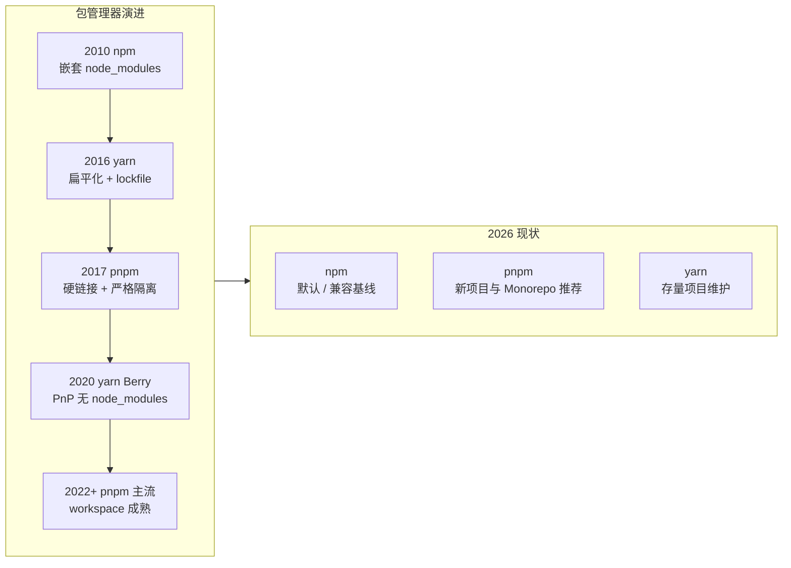

# Node 包管理工具教程

Node 生态的成功极大程度上归功于 **npm  registry**——全球最大的软件包仓库（200 万+ 包）。但要真正把这个生态用好，光会 `npm install` 远远不够。

本教程从**日常高频命令**出发，逐步深入到大多数人踩坑却说不清原理的部分：依赖版本怎么解析、`node_modules` 为什么长得那么奇怪、pnpm 为什么又快又省空间、Monorepo 怎么组织、包怎么安全发布。

## 谁适合看这份教程

- 会写 Node/前端，但只用过 `npm install` 和 `npm run dev`
- 遇到过 `ERESOLVE` 报错只能靠删 `node_modules` 解决
- 想搞清楚 npm / yarn / pnpm 到底该选哪个
- 需要维护 Monorepo 或发布自己的 npm 包

## 四大工具速览

| 工具 | 定位 | 核心特点 | 当前状态 |
| --- | --- | --- | --- |
| **npm** | Node 官方自带，事实标准 | 兼容性最好，npm 7+ 支持 workspace | 默认选择，生态基准 |
| **npx** | npm 5.2+ 附带的执行器 | 免安装运行包命令 | 已被 `npm exec` 取代但命令仍在 |
| **yarn** | Facebook 出品，一度是速度标杆 | Berry（v2+）的 PnP 模式激进创新 | v1 广泛存量，v4 小众但强 |
| **pnpm** | 后起之秀，磁盘与速度双赢 | 硬链接 + 符号链接，严格依赖隔离 | 新项目推荐，Monorepo 首选 |

## 章节 {.cards}

- [第一章：包管理器全景与环境配置](/docs/node-pkg-manager/01-overview-setup/) — 演进史、四工具对比、Node 与 Corepack、`.npmrc` 与镜像源
- [第二章：npm 命令详解](/docs/node-pkg-manager/02-npm-commands/) — install/ci/run/ls/outdated/audit/cache 全家桶 + `package.json` 字段
- [第三章：npx 深度解析](/docs/node-pkg-manager/03-npx/) — 执行原理、与 `npm exec` 的关系、缓存与安全
- [第四章：SemVer、依赖类型与依赖解析原理](/docs/node-pkg-manager/04-deps-semver/) — 版本范围、5 种依赖类型、lockfile、node_modules 结构、幽灵依赖
- [第五章：Yarn 深度解析](/docs/node-pkg-manager/05-yarn/) — Yarn 1 vs Berry、PnP 模式、命令对照与选型
- [第六章：pnpm 深度解析](/docs/node-pkg-manager/06-pnpm/) — 硬链接存储原理、命令、workspace、迁移与避坑
- [第七章：Monorepo 与 Workspaces](/docs/node-pkg-manager/07-monorepo/) — 三大工具 workspace 对比、Turborepo/Nx、Changesets 发布
- [第八章：包发布、私有仓库、安全与排错](/docs/node-pkg-manager/08-publish-security/) — 发布全流程、verdaccio、依赖安全、CI 优化、排错速查

## 阅读建议

- **只想要能用**：第 1、2、3 章足够覆盖 90% 的日常场景。
- **想搞懂原理**：第 4 章是整份教程的核心，`node_modules` 的一切奇怪现象都能在那里找到答案。
- **要做技术选型**：第 5、6 章对比 yarn 与 pnpm，第 7 章讲 Monorepo。
- **要发包或做基建**：第 8 章。

> 文中所有命令以 Linux/macOS 为主，Windows 用户在 PowerShell 中执行效果一致。涉及路径的命令会同时给出 Windows 的 `%LocalAppData%` 位置。
