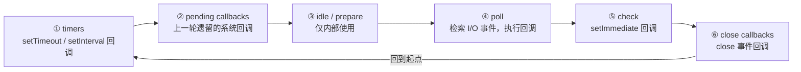
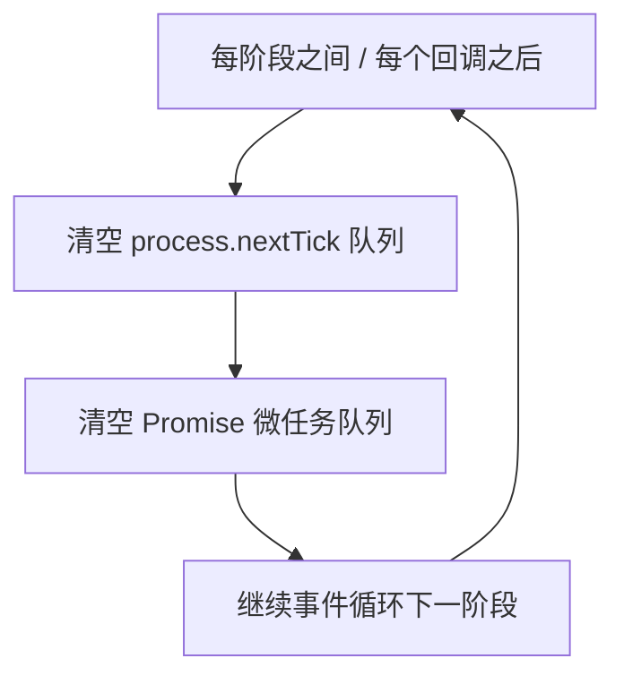

# 异步编程与事件循环

Node.js 采用**单线程 + 事件循环**模型处理高并发 I/O，一切都围绕异步非阻塞展开。

## 回调函数 {#callback}

最基础的异步写法是通过回调函数在任务完成时通知：

```js
const fs = require("fs");

// 异步读取文件，完成后执行回调
fs.readFile("data.txt", "utf8", (err, data) => {
  if (err) {
    console.error("读取失败：", err);
    return;
  }
  console.log(data);
});
```

回调嵌套过多会导致「回调地狱」，难以维护：

```js
// 不推荐：层层嵌套
fs.readFile("a.txt", (err, a) => {
  fs.readFile("b.txt", (err2, b) => {
    fs.readFile("c.txt", (err3, c) => {
      console.log(a, b, c);
    });
  });
});
```

## Promise {#promise}

`Promise` 表示一个异步操作的最终结果，有三种状态：pending / fulfilled / rejected：

```js
function readFilePromise(path) {
  return new Promise((resolve, reject) => {
    fs.readFile(path, "utf8", (err, data) => {
      if (err) reject(err);
      else resolve(data);
    });
  });
}

readFilePromise("data.txt")
  .then((data) => console.log(data))
  .catch((err) => console.error(err));
```

`Promise.all` 并发等待多个任务，`Promise.race` 取最先完成的一个：

```js
Promise.all([
  readFilePromise("a.txt"),
  readFilePromise("b.txt"),
]).then(([a, b]) => console.log(a, b));
```

## async/await {#async-await}

`async/await` 是建立在 Promise 之上的语法糖，让异步代码像同步一样易读：

```js
async function main() {
  try {
    const a = await readFilePromise("a.txt");
    const b = await readFilePromise("b.txt");
    console.log(a, b);
  } catch (err) {
    console.error("出错了：", err);
  }
}

main();
```

并发执行以缩短耗时：

```js
async function main() {
  const [a, b] = await Promise.all([
    readFilePromise("a.txt"),
    readFilePromise("b.txt"),
  ]);
  console.log(a, b);
}
```

## 事件循环机制 {#event-loop}

Node.js 的事件循环由 **libuv** 驱动，按固定阶段循环执行回调。它比浏览器多了几个阶段，理解每个阶段做什么，是排查 I/O 时序问题的关键。

### 六个阶段 {#phases}



- **timers**：执行到期的 `setTimeout`/`setInterval` 回调。
- **pending callbacks**：执行延迟到下一轮的系统级回调（如 TCP 错误）。
- **idle / prepare**：仅供 libuv 内部使用，开发者接触不到。
- **poll（核心）**：检索并执行 I/O 事件回调；若 poll 队列为空，会在此「等待」新事件，同时检查是否有到期的定时器或 `setImmediate` 需要跳到对应阶段。
- **check**：执行 `setImmediate` 注册的回调。
- **close callbacks**：执行 `socket.on('close', ...)` 等关闭回调。

### 微任务与 process.nextTick {#microtask-nexttick}

在**每个阶段之间**（以及每个回调执行完后），Node 会优先清空两类「插队」任务：`process.nextTick` 队列和 `Promise` 微任务队列，且 `nextTick` 又优先于 `Promise`：



完整执行顺序示例：

```js
console.log("1");                               // 同步
setTimeout(() => console.log("2"), 0);          // 宏任务（timers 阶段）
Promise.resolve().then(() => console.log("3")); // 微任务
process.nextTick(() => console.log("4"));       // nextTick，比微任务更早

console.log("5");
// 输出顺序：1 5 4 3 2
```

> [!TIP]
> 记忆口诀：**同步 → nextTick → Promise 微任务 → 事件循环各阶段**。`nextTick` 比 `Promise.then` 更靠前。

### setImmediate 与 setTimeout 的经典坑 {#setimmediate-vs-settimeout}

`setImmediate`（check 阶段）和 `setTimeout(0)`（timers 阶段）谁先执行，取决于调用位置：

```js
const fs = require("fs");

fs.readFile("file.txt", () => {
  // 在 poll 阶段的 I/O 回调里，setImmediate 一定先于 setTimeout 执行
  setTimeout(() => console.log("timeout"), 0);
  setImmediate(() => console.log("immediate"));
});
// 稳定输出：immediate → timeout
```

**原因**：`readFile` 回调在 poll 阶段执行，poll 结束立刻进入 check 阶段（`setImmediate`），而 `setTimeout` 要等到下一轮循环回到 timers 阶段才执行。

但如果在**主模块顶层**直接调用，顺序则不确定（受进程启动与定时器阈值影响）：

```js
setTimeout(() => console.log("timeout"), 0);
setImmediate(() => console.log("immediate"));
// 顺序不定，两种都可能出现
```

> [!WARNING]
> 不要在顶层依赖 `setTimeout(0)` 与 `setImmediate` 的相对顺序；需要确定性时，把比较放到一个 I/O 回调里（如上例的 `readFile`）。

### 与浏览器事件循环的区别 {#vs-browser}

| 维度 | 浏览器 | Node.js |
| --- | --- | --- |
| 驱动 | 渲染引擎 + 事件循环 | libuv（六阶段） |
| 额外阶段 | 有渲染/rAF 环节 | 有 poll/check 等 I/O 阶段 |
| 额外插队 | 无 | `process.nextTick`（优先于微任务） |
| 宏任务类型 | `setTimeout`/I/O/rAF/UI 事件 | `setTimeout`/`setImmediate`/I/O |

两者都遵循「微任务优先于下一个宏任务」的大原则，只是 Node 把「宏任务」拆成了更细的阶段。

## 小结 {#summary}

回调、Promise 与 async/await 逐步演进使异步代码更清晰，而事件循环决定了它们的执行时序。下一章用核心模块进行实战。
