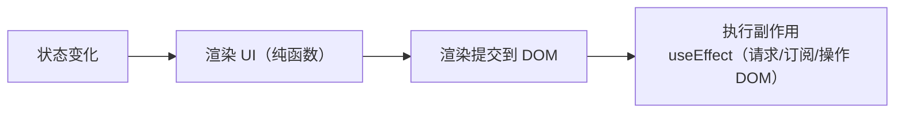

# 副作用与 useEffect

组件的职责是「根据 state 渲染 UI」，但真实应用还需要**副作用（side effect）**：请求数据、订阅事件、操作 DOM、写日志等。`useEffect` 让你在「渲染之后」执行这些副作用。

## 什么是副作用 {#what-is-effect}

副作用指「渲染之外、会影响外部世界」的操作。React 把「渲染」和「副作用」分离：



纯渲染应可重复执行且无副作用；而数据获取、订阅、定时器这些「副作用」交给 `useEffect` 在渲染后统一处理。

## useEffect 基础 {#basic}

```jsx
import { useEffect, useState } from 'react';

function UserProfile({ userId }) {
  const [user, setUser] = useState(null);

  useEffect(() => {
    // 副作用：请求数据
    fetch(`/api/users/${userId}`)
      .then(r => r.json())
      .then(setUser);

    // 可选：返回清理函数
    return () => { /* 清理 */ };
  }, [userId]);   // 依赖数组

  return <div>{user ? user.name : '加载中...'}</div>;
}
```

`useEffect` 的两个参数：

1. **副作用函数**：渲染后执行。
2. **依赖数组**：决定何时重新执行。

## 依赖数组的三种情况 {#dependencies}

这是 `useEffect` 最核心、也最容易出错的部分：

| 写法 | 执行时机 |
|------|---------|
| `useEffect(fn)` 无依赖 | 每次渲染后都执行 |
| `useEffect(fn, [])` 空数组 | 仅**首次渲染后**执行一次 |
| `useEffect(fn, [a, b])` 有依赖 | 首次 + 依赖变化时执行 |

```jsx
// 1. 每次渲染都执行（很少用，容易死循环）
useEffect(() => {
  console.log('每次渲染都打印');
});

// 2. 仅挂载时执行一次（初始化：加载数据、订阅、启动定时器）
useEffect(() => {
  const timer = setInterval(() => console.log('tick'), 1000);
  return () => clearInterval(timer);   // 卸载时清理
}, []);

// 3. 依赖变化时执行（响应 props/state 变化）
useEffect(() => {
  document.title = `你有 ${count} 条消息`;
}, [count]);
```

> [!WARNING]
> **遗漏依赖是最常见的 bug**。若副作用里用了外部变量（state/props），却没写进依赖数组，会造成「读到旧值」或「不更新」。可用 ESLint 的 `react-hooks/exhaustive-deps` 规则自动检查。

## 清理函数 {#cleanup}

副作用返回的函数会在「下一次执行前」和「组件卸载时」被调用，用于清理资源：

```jsx
useEffect(() => {
  // 订阅
  const subscription = api.subscribe(userId);
  const timer = setTimeout(() => check(), 1000);

  // 清理：取消订阅、清除定时器
  return () => {
    subscription.unsubscribe();
    clearTimeout(timer);
  };
}, [userId]);
```

典型需要清理的副作用：定时器、事件监听、订阅、WebSocket 连接、`fetch` 的 AbortController。

## 实战：数据获取 {#data-fetching}

### 基础版本 {#basic-fetch}

```jsx
function PostList() {
  const [posts, setPosts] = useState([]);
  const [loading, setLoading] = useState(true);
  const [error, setError] = useState(null);

  useEffect(() => {
    let cancelled = false;   // 防竞态：组件卸载后不再 setState

    async function load() {
      try {
        setLoading(true);
        const res = await fetch('/api/posts');
        const data = await res.json();
        if (!cancelled) setPosts(data);
      } catch (err) {
        if (!cancelled) setError(err.message);
      } finally {
        if (!cancelled) setLoading(false);
      }
    }

    load();

    return () => { cancelled = true; };   // 清理：标记已取消
  }, []);

  if (loading) return <p>加载中...</p>;
  if (error) return <p>出错了：{error}</p>;
  return <ul>{posts.map(p => <li key={p.id}>{p.title}</li>)}</ul>;
}
```

### 用 AbortController 真正取消请求 {#abort}

```jsx
useEffect(() => {
  const controller = new AbortController();

  fetch(`/api/posts?q=${keyword}`, { signal: controller.signal })
    .then(r => r.json())
    .then(setPosts)
    .catch(err => {
      if (err.name !== 'AbortError') setError(err.message);
    });

  return () => controller.abort();   // 依赖变化或卸载时取消请求
}, [keyword]);
```

> [!NOTE]
> 两个经典问题：**竞态（race）**——快速切换筛选条件，慢的旧请求可能覆盖新结果，用 `cancelled` 标记或 `AbortController` 解决；**闭包陷阱**——副作用里直接用 state 可能读到旧值，应把它写进依赖数组或使用函数式更新。

## 常见错误模式 {#anti-patterns}

### 1. 在 useEffect 里同步设置 state 导致死循环

```jsx
// ❌ 死循环：每次渲染都设置 state，又触发渲染
useEffect(() => {
  setCount(count + 1);
});   // 无依赖数组，每次都跑
```

### 2. 不需要 useEffect 却用了

```jsx
// ❌ 可以直接在渲染时计算，不必用 effect
useEffect(() => {
  setFullName(first + ' ' + last);
}, [first, last]);

// ✅ 直接计算即可
const fullName = first + ' ' + last;
```

> [!TIP]
> 判断是否需要 `useEffect`：**只有在「渲染后需要与外部世界交互」时才用**。能从 state 直接派生的值，直接在渲染时算，别用 effect 中转。

## 小结 {#summary}

本章掌握了 `useEffect` 的核心：它处理「渲染之后的副作用」，依赖数组决定执行时机（空数组=仅一次，有依赖=变化时），清理函数负责释放资源。实战中数据获取要防竞态和闭包陷阱。记住：**能在渲染时算的别用 effect，用了 effect 就要管好依赖和清理**。下一章详解其余常用 Hooks。
