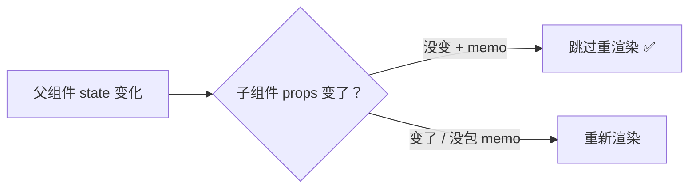

# 进阶与 React 19

这一章进入进阶主题：并发渲染相关的性能 Hook，以及 React 19 带来的新 Hook 与新特性，最后给出工程化的最佳实践。

## 性能优化：memo、useMemo、useCallback {#performance}

React 默认「父组件重渲染，子组件也跟着重渲染」。三个工具用来打破这个默认：



### React.memo：缓存组件 {#memo}

`memo` 让组件在 props 不变时跳过渲染（浅比较 props）：

```jsx
import { memo } from 'react';

const ExpensiveList = memo(function ExpensiveList({ items }) {
  // 仅当 items 引用变化时才重新渲染
  return <ul>{items.map(i => <li key={i}>{i}</li>)}</ul>;
});
```

配合 `useMemo`/`useCallback` 保持 props 引用稳定（见第四章），才能真正发挥作用。

## useTransition：标记非紧急更新 {#usetransition}

`useTransition` 把「耗时的状态更新」标记为**非紧急**，让 React 优先响应用户的紧急交互（如输入、点击）。

```jsx
import { useState, useTransition } from 'react';

function SearchList() {
  const [keyword, setKeyword] = useState('');
  const [results, setResults] = useState([]);
  const [isPending, startTransition] = useTransition();

  function handleChange(e) {
    const value = e.target.value;
    setKeyword(value);           // 紧急：立即更新输入框

    startTransition(() => {      // 非紧急：过滤大列表可以延后
      setResults(allItems.filter(i => i.includes(value)));
    });
  }

  return (
    <div>
      <input value={keyword} onChange={handleChange} />
      {isPending && <p>过滤中...</p>}
      <ul>{results.map(r => <li key={r}>{r}</li>)}</ul>
    </div>
  );
}
```

> [!NOTE]
> 关键收益：输入框的响应**不被大列表的过滤计算阻塞**，交互更流畅。`isPending` 还能展示「计算中」的状态。适用于搜索、Tab 切换、大量数据渲染等场景。

## useDeferredValue：延迟值 {#usedeferredvalue}

`useDeferredValue` 返回一个「延迟更新」的值，旧值先渲染，新值在空闲时跟上：

```jsx
import { useDeferredValue } from 'react';

function SearchList({ keyword }) {
  const deferredKeyword = useDeferredValue(keyword);   // 延迟的值

  // 用延迟值做昂贵计算，输入时保持流畅
  const results = useMemo(
    () => allItems.filter(i => i.includes(deferredKeyword)),
    [deferredKeyword]
  );

  return <ul>{results.map(r => <li key={r}>{r}</li>)}</ul>;
}
```

> [!TIP]
> `useDeferredValue` 与 `useTransition` 的区别：前者是「延迟**某个值**」（适合把值传给子组件/计算），后者是「延迟**某次更新**」（适合在事件里包裹 setState）。目标一致——让紧急更新优先。

## React 19 新特性 {#react-19}

React 19 是继 Hooks 之后最大的一次更新，核心是简化异步与表单处理。

### use()：在渲染中读取资源 {#use-hook}

`use()` 可以在渲染中直接「读取」Promise 或 Context，与 Suspense 配合，免去 `useEffect` + 加载状态：

```jsx
import { use, Suspense } from 'react';

function UserProfile({ userPromise }) {
  const user = use(userPromise);   // 直接读取，挂起直到 resolve
  return <h1>{user.name}</h1>;
}

function App() {
  const promise = fetchUser(1);
  return (
    <Suspense fallback={<p>加载中...</p>}>
      <UserProfile userPromise={promise} />
    </Suspense>
  );
}
```

> [!NOTE]
> `use()` 与普通 Hook 不同：**可以在条件语句中调用**（它不是真正的 Hook，不受调用顺序规则限制）。这打破了 Hooks「不能条件调用」的限制。

### Actions 与 useActionState：简化表单提交 {#actions}

React 19 的「Actions」把「提交状态 + 错误处理 + 数据提取」统一处理，替代手写 `useState` + `try/catch`：

```jsx
import { useActionState } from 'react';

function UpdateName() {
  // 返回 [state, formAction, isPending]
  const [error, submitAction, isPending] = useActionState(
    async (previousState, formData) => {
      const name = formData.get('name');
      const err = await updateName(name);   // 异步提交
      return err || null;                    // 返回新 state（错误信息）
    },
    null   // 初始 state
  );

  return (
    <form action={submitAction}>
      <input name="name" />
      <button disabled={isPending}>
        {isPending ? '提交中...' : '更新'}
      </button>
      {error && <p>{error}</p>}
    </form>
  );
}
```

### useOptimistic：乐观更新 {#useoptimistic}

用户操作后**立即更新 UI**，不用等服务端确认，失败再回滚：

```jsx
import { useOptimistic } from 'react';

function MessageList({ messages, sendMessage }) {
  const [optimisticMessages, addOptimistic] = useOptimistic(
    messages,
    (current, newMsg) => [...current, { ...newMsg, sending: true }]
  );

  async function handleSubmit(formData) {
    const text = formData.get('text');
    addOptimistic({ text });          // 立即乐观添加
    await sendMessage(text);          // 后台发送
  }

  return (
    <>
      {optimisticMessages.map(m => (
        <div key={m.id}>{m.text} {m.sending && '(发送中...)'}</div>
      ))}
      <form action={handleSubmit}>
        <input name="text" />
        <button>发送</button>
      </form>
    </>
  );
}
```

### useFormStatus：表单提交状态 {#useformstatus}

在表单**子组件**里读取父表单的提交状态，避免 prop 透传：

```jsx
import { useFormStatus } from 'react-dom';

function SubmitButton() {
  const { pending } = useFormStatus();   // 读取所在 form 的提交状态
  return <button disabled={pending}>{pending ? '保存中...' : '保存'}</button>;
}

function Form() {
  return (
    <form action={async () => { /* 提交 */ }}>
      <SubmitButton />   {/* 无需传 pending */}
    </form>
  );
}
```

### ref 作为 prop 传递 {#ref-as-prop}

React 19 中，`ref` 可以直接作为普通 prop 传给子组件，无需 `forwardRef`：

```jsx
// React 19：直接接收 ref prop，无需 forwardRef
function MyInput({ ref, ...props }) {
  return <input ref={ref} {...props} />;
}

function App() {
  const ref = useRef(null);
  return <MyInput ref={ref} />;
}
```

### 原生支持文档元数据 {#metadata}

```jsx
function Page() {
  return (
    <>
      <title>我的页面</title>          {/* 自动提升到 <head> */}
      <meta name="description" content="描述" />
    </>
  );
}
```

## 工程化最佳实践 {#best-practices}

1. **组件拆分**：单一职责，一个组件只做一件事，便于复用与测试。
2. **状态就近原则**：状态放在「使用它的最近父组件」，避免不必要的提升。
3. **不要在渲染中改 state**：渲染函数应是纯函数，副作用交给 `useEffect`。
4. **稳定 key**：列表 key 用唯一 id，别用 index。
5. **优先派生、其次缓存**：能算出来的直接算，别用 state 存；昂贵的再用 `useMemo`。
6. **避免过早优化**：先写清晰正确的代码，出现性能问题再用 `memo`/`useMemo` 优化（不要默认到处 memo）。

> [!TIP]
> React 编译器（React Compiler，原 React Forget）正在让 memo 化自动化，未来可能无需手写 `useMemo`/`useCallback`。但在编译器普及前，理解并手动优化仍是必备能力。

## 小结 {#summary}

本章完成了 React 的进阶学习：性能三件套（`memo`/`useMemo`/`useCallback`）、并发 Hook（`useTransition`/`useDeferredValue`），以及 React 19 的核心新特性——`use()` 读取资源、Actions/`useActionState` 简化表单、`useOptimistic` 乐观更新、`useFormStatus`、ref 作为 prop、原生元数据。至此五章教程结束，从基础到进阶，覆盖了现代 React 开发的核心知识体系。
