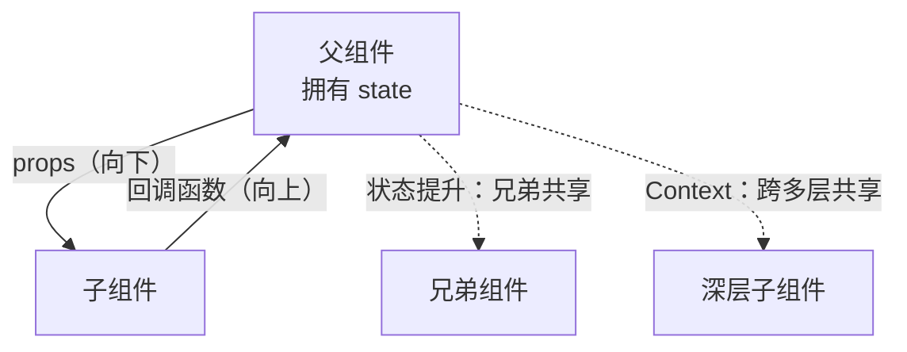
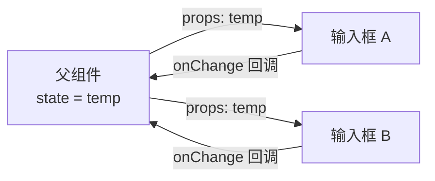
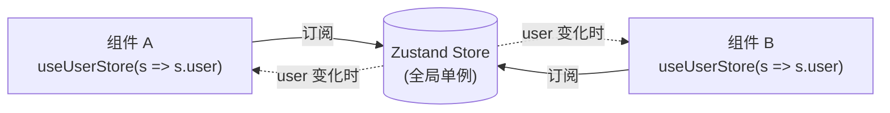
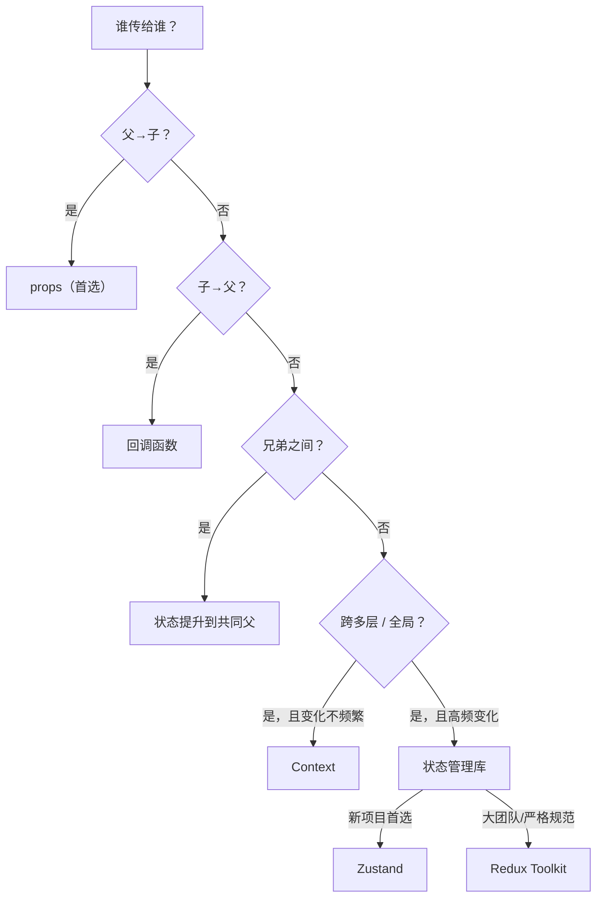

# 组件间状态与值传递

React 是「组件化」UI 库，**组件之间的数据怎么流动** 是日常开发绕不开的问题。本章把组件间通信的 6 种方式系统化讲一遍，配场景对照和决策树，让你碰到任何「A 组件要把值传给 B 组件」的需求都能快速选型。

## 数据流总览：单向数据流 {#data-flow}

React 的核心铁律是**单向数据流（unidirectional data flow）**：数据只能**从父组件向子组件**通过 props 流动，子组件**不能直接修改** props。如果子组件要改值，必须**通过回调通知父组件**，由父组件改 state，再流回来。



> [!NOTE]
> 单向数据流的好处：**数据来源单一、可追溯**。任何状态都归属于某个组件，调试时只需看那个组件的 state。其他方案（如双向绑定）容易让数据散落各处，调试时一头雾水。

> [!WARNING]
> 单向数据流不是说"完全不能改父级数据"。子组件可以**通过回调函数**把"想要怎么改"传给父组件，**真正修改 state 的永远是父组件**。这条边界要守住。

## 方式一：父 → 子（props）{#props-down}

这是最基础、最常用的方式，**第一章已经讲过**，这里回顾并补充进阶用法。

### 基础：单值与对象 props {#props-basic}

```jsx
// 父组件
function Parent() {
  return <Child name="Alice" age={18} info={{ city: '北京', job: '开发' }} />;
}

// 子组件：解构取值
function Child({ name, age, info }) {
  return <p>{name} {age} {info.city}</p>;
}
```

### children：插槽内容 {#children-slot}

`props.children` 是 React 内置的特殊 prop，表示「组件标签之间的内容」。非常适合写**布局型组件**：

```jsx
function Card({ title, children, footer }) {
  return (
    <div className="card">
      <div className="card-header">{title}</div>
      <div className="card-body">{children}</div>
      <div className="card-footer">{footer}</div>
    </div>
  );
}

// 使用：像写 HTML 一样自由组合内容
<Card
  title="用户信息"
  footer={<button>保存</button>}
>
  <p>这里是卡片主体内容</p>
  <p>可以放任意 JSX</p>
</Card>
```

> [!TIP]
> `children` 让组件保持「自闭合时也能用、包裹时也能用」的灵活性。对比一些 UI 库（如 Ant Design）的 `title`/`footer` props，`children` 更符合 JSX 的组合直觉。

### prop drilling：层层透传的问题 {#prop-drilling}

当深层子组件需要用某个值时，必须经过中间组件层层传递：

```jsx
// ❌ Prop drilling：Theme 透传三层，但中间组件完全不用 theme
function App() {
  const [theme, setTheme] = useState('light');
  return <Layout theme={theme}>           {/* Layout 不用，只是透传 */}
    <Sidebar theme={theme}>              {/* Sidebar 不用，只是透传 */}
      <Menu theme={theme} />             {/* Menu 才真正用 */}
    </Sidebar>
  </Layout>;
}
```

中间的 `Layout`、`Sidebar` 不得不接一个自己根本不用的 prop，**污染了它们的 props 接口**。当组件嵌套更深时，这种「透传」会变得很痛苦——这正是 Context 要解决的问题（见下文）。

## 方式二：子 → 父（回调函数）{#callback-up}

子组件要"通知父组件做某事"，把回调函数通过 props 传下去：

```jsx
// 父组件：定义回调，交给子组件调用
function Parent() {
  const [count, setCount] = useState(0);

  const handleIncrement = (step) => {
    setCount(c => c + step);   // 真正改 state 的是父组件
  };

  return (
    <div>
      <p>当前：{count}</p>
      <Child onIncrement={handleIncrement} />
    </div>
  );
}

// 子组件：通过 props 拿到回调，在合适时机调用
function Child({ onIncrement }) {
  return (
    <button onClick={() => onIncrement(1)}>+1</button>
  );
}
```

### 传值给父组件 {#callback-with-data}

子组件把内部状态（输入框值、选中项）传回父组件：

```jsx
function SearchInput({ onSearch }) {
  const [keyword, setKeyword] = useState('');

  function handleSubmit(e) {
    e.preventDefault();
    onSearch(keyword);          // 把当前输入回传给父
  }

  return (
    <form onSubmit={handleSubmit}>
      <input value={keyword} onChange={e => setKeyword(e.target.value)} />
      <button>搜索</button>
    </form>
  );
}
```

> [!TIP]
> 回调命名惯例：以 `on` 开头（`onClick`、`onChange`、`onSearch`）。父组件用 `handle` 开头（`handleClick`、`handleSearch`）。这只是约定，但团队统一后代码可读性显著提升。

## 方式三：兄弟组件（状态提升）{#lifting-state}

**两个兄弟组件要共享数据**，把状态提升到它们共同的父组件。父组件持 state，分别通过 props 下发给两个子组件；任一子组件通过回调让父组件更新 state。



```jsx
// 典型例子：摄氏度 ↔ 华氏度双向联动（第二章已讲过，这里展开）
function TemperatureInput({ scale, value, onChange }) {
  return (
    <fieldset>
      <legend>{scale === 'c' ? '摄氏度' : '华氏度'}</legend>
      <input
        value={value}
        onChange={e => onChange(e.target.value)}
      />
    </fieldset>
  );
}

function Calculator() {
  const [temp, setTemp] = useState('');
  const [scale, setScale] = useState('c');

  const celsius = scale === 'f' ? toCelsius(temp) : temp;
  const fahrenheit = scale === 'c' ? toFahrenheit(temp) : temp;

  return (
    <div>
      <TemperatureInput scale="c" value={celsius}
        onChange={t => { setTemp(t); setScale('c'); }} />
      <TemperatureInput scale="f" value={fahrenheit}
        onChange={t => { setTemp(t); setScale('f'); }} />
    </div>
  );
}
```

> [!NOTE]
> **状态提升的判定**：当两个组件需要**始终保持一致**（如摄氏/华氏、A/B 编辑同一对象），把状态提到最近的共同父组件。当状态**仅一个组件使用**，就留在该组件内部。原则：「状态就近」，能不放高就别放高。

## 方式四：跨多层（Context API）{#context}

当 prop drilling 太深（5 层、10 层）或某个数据是「全局级别」（主题、当前用户、语言），用 Context 跨越层级直接共享。

```jsx
import { createContext, useContext, useState } from 'react';

// 1. 创建 Context（默认值仅在没 Provider 时生效）
const ThemeContext = createContext('light');

// 2. 顶层用 Provider 提供值
function App() {
  const [theme, setTheme] = useState('light');
  return (
    <ThemeContext.Provider value={{ theme, setTheme }}>
      {/* 任意深度的子树都能消费 */}
      <Layout>
        <Sidebar>
            <Menu />     {/* 不需要透传 theme */}
        </Sidebar>
      </Layout>
    </ThemeContext.Provider>
  );
}

// 3. 任意深度的子组件直接消费
function Menu() {
  const { theme, setTheme } = useContext(ThemeContext);
  return (
    <button onClick={() => setTheme(theme === 'light' ? 'dark' : 'light')}>
      当前主题：{theme}
    </button>
  );
}
```

### Provider 嵌套：局部覆盖 {#nested-provider}

Context 允许多个 Provider 嵌套，**内层会覆盖外层**——适合做"主题局部覆盖"：

```jsx
<ThemeContext.Provider value="light">
  <Page />
  <ThemeContext.Provider value="dark">   {/* 这一块是 dark */}
    <Modal />                              {/* 这里用 dark */}
  </ThemeContext.Provider>
</ThemeContext.Provider>
```

### 性能陷阱：value 引用要稳定 {#context-perf}

Context 的 value 变化时，**所有消费它的组件都会重渲染**。所以：

```jsx
// ❌ 每次 App 渲染都新建对象，导致所有消费者都重渲染
<ThemeContext.Provider value={{ theme, setTheme }}>

// ✅ 用 useMemo 保持引用稳定
const value = useMemo(() => ({ theme, setTheme }), [theme]);
<ThemeContext.Provider value={value}>
```

或者把 state 和 setState 分开传：

```jsx
<ThemeContext.Provider value={theme}>
  <ThemeDispatchContext.Provider value={setTheme}>
    {/* 只需 theme 的组件不会因 setTheme 变化而重渲染 */}
  </ThemeDispatchContext.Provider>
</ThemeContext.Provider>
```

> [!WARNING]
> **Context ≠ 全局状态管理库**。Context 适合"全局但变化不频繁"的数据（主题、当前用户、语言、国际化文案）。如果用 Context 存"高频变化的共享状态"（表单数据、滚动位置、实时数据），所有消费者都会频繁重渲染——此时应改用状态管理库（见下文）。

## 方式五：复杂应用（状态管理库）{#state-library}

当应用规模大、状态分散在多个模块、多人协作时，Context 已不够用。需要**状态管理库**提供：中心化 store、细粒度订阅、devtools 调试、时间旅行。

### 主流选择对比 {#library-compare}

| 库 | 风格 | 体积 | 适合场景 |
|---|---|---|---|
| **Zustand** | 函数式、轻量 | ~1KB | 90% 项目首选，API 极简 |
| **Redux Toolkit** | 经典、严格 | ~10KB | 大团队、需要严格规范 |
| **Jotai** | 原子化 | ~3KB | 状态可拆成多个原子 |
| **Recoil** | 原子化（已停维护） | — | 不推荐新项目 |
| **MobX** | 响应式 | ~15KB | 喜欢 OOP 响应式编程 |

### Zustand 示例（推荐先学）{#zustand-example}

```jsx
import { create } from 'zustand';

// 1. 定义 store（一个函数返回的 hook）
const useUserStore = create((set) => ({
  user: null,
  login: (user) => set({ user }),
  logout: () => set({ user: null }),
}));

// 2. 任意组件直接用——无需 Provider
function Profile() {
  const user = useUserStore((s) => s.user);          // 订阅 user
  const login = useUserStore((s) => s.login);        // 订阅 action
  return <p>{user ? user.name : '未登录'}</p>;
}

function Header() {
  const logout = useUserStore((s) => s.logout);
  return <button onClick={logout}>退出</button>;
}
```



> [!TIP]
> Zustand 的核心优势：**按需订阅**。每个组件用 selector 只订阅自己关心的字段，**只有该字段变化时才重渲染**。这避开了 Context 那个"一变全变"的坑，对大型应用非常友好。

### 何时该用状态管理库 {#when-state-library}

满足以下任一条件时考虑引入：

- 多个不相关模块需要共享状态（如购物车、用户、主题各自独立）
- 状态更新逻辑复杂，需要中间件、持久化、撤销重做
- 大团队协作，需要明确的代码组织规范
- 频繁变化的共享状态（用 Context 会引发性能问题）

> [!NOTE]
> **不要过早引入**！小项目（一个文件就能写完）直接 `useState` + 状态提升；中等项目（10-20 组件）用 Context 完全够用；只有真正遇到"状态散落、频繁重渲染、跨模块共享"的痛点时再上状态管理库。

## 方式六：children 与 render props（可复用渲染）{#children-renderprops}

除了传数据，还可以把**"如何渲染"**作为 prop 传下去。这种模式适合写**可复用容器**——容器管数据，子组件管样式。

### children 渲染函数 {#children-function}

```jsx
// 可复用的数据获取容器
function DataFetcher({ url, children }) {
  const [data, setData] = useState(null);
  const [loading, setLoading] = useState(true);

  useEffect(() => {
    fetch(url).then(r => r.json()).then(d => {
      setData(d);
      setLoading(false);
    });
  }, [url]);

  return children({ data, loading });
}

// 使用方：完全掌控 UI，数据由容器提供
<DataFetcher url="/api/users">
  {({ data, loading }) => (
    loading ? <Spinner /> : <UserList users={data} />
  )}
</DataFetcher>
```

### render props 属性 {#render-props}

和 children 同理，只是把渲染函数换个 prop 名：

```jsx
function DataFetcher({ url, render }) {
  const [data, setData] = useState(null);
  // ... 同上
  return render({ data, loading });
}

<DataFetcher
  url="/api/users"
  render={({ data, loading }) => (
    loading ? <Spinner /> : <UserList users={data} />
  )}
/>
```

> [!TIP]
> children 渲染函数比 render props 属性更常用——JSX 嵌套结构更自然。但本质上是一样的：**父组件提供数据，子组件决定如何渲染**。

### 已被 Hook 取代 {#replaced-by-hook}

在现代 React 中，**render props 模式大多已被自定义 Hook 取代**——上面例子可以这样写：

```jsx
// 自定义 Hook：把数据获取逻辑抽出来
function useFetch(url) {
  const [data, setData] = useState(null);
  const [loading, setLoading] = useState(true);
  useEffect(() => { /* ... */ }, [url]);
  return { data, loading };
}

// 使用方
function UserPage() {
  const { data, loading } = useFetch('/api/users');
  return loading ? <Spinner /> : <UserList users={data} />;
}
```

Hook 更简洁、类型推断更友好、组合更灵活。**新项目优先用自定义 Hook** 而不是 render props。

## 组件通信决策树 {#decision-tree}

碰到"组件 A 和组件 B 要传值"时，按下面顺序决策：



快速对照表：

| 场景 | 方案 | 例子 |
|---|---|---|
| 父→子传值 | props | `<Child name={name} />` |
| 子→父通知 | 回调函数 | `<Child onChange={fn} />` |
| 兄弟共享 | 状态提升 | state 提到共同父 |
| 跨 3-5 层共享、低频 | Context | 主题、语言 |
| 高频共享、复杂业务 | 状态管理库 | Zustand、Redux |

## 实战：常见组合模式 {#patterns}

### 模式 1：受控组件的双向流 {#controlled-bidir}

```jsx
// 父组件控制 value，子组件通过 onChange 通知
function Form() {
  const [email, setEmail] = useState('');
  return (
    <Input value={email} onChange={setEmail} />
  );
}

function Input({ value, onChange }) {
  return <input value={value} onChange={e => onChange(e.target.value)} />;
}
```

`value + onChange` 是一对黄金组合：父组件单向向下传 `value`，子组件单向向上传 `onChange`——**单向数据流 + 双向编辑能力**。所有受控组件、表单组件都遵循这个模式。

### 模式 2：列表组件 + 选中项 {#list-selected}

```jsx
function ItemList({ items, selectedId, onSelect }) {
  return (
    <ul>
      {items.map(item => (
        <li
          key={item.id}
          className={item.id === selectedId ? 'active' : ''}
          onClick={() => onSelect(item.id)}
        >
          {item.name}
        </li>
      ))}
    </ul>
  );
}

function App() {
  const [selectedId, setSelectedId] = useState(null);
  return <ItemList items={items} selectedId={selectedId} onSelect={setSelectedId} />;
}
```

> [!NOTE]
> 这其实是"受控列表"的延伸：列表项的选中态**完全由父组件控制**，列表本身不持有 selectedId 状态。这样列表可以**无状态、可复用**——这是高质量 React 组件的标志。

### 模式 3：组合优于继承（composition）{#composition}

React 推崇"组合"而非"继承"：用 props + children 组合出不同变体，而不是写一堆继承类。

```jsx
// ❌ 继承思维：写一堆 Button 子类
// PrimaryButton extends Button
// DangerButton extends Button

// ✅ 组合思维：通过 variant + children 复用
function Button({ variant = 'default', children, ...rest }) {
  const className = `btn btn-${variant}`;
  return <button className={className} {...rest}>{children}</button>;
}

<Button variant="primary">提交</Button>
<Button variant="danger" onClick={handleDelete}>删除</Button>
```

或者用「容器 + 内容」拆分：

```jsx
function Dialog({ children }) {
  return <div className="dialog">{children}</div>;
}
Dialog.Title = ({ children }) => <h3 className="dialog-title">{children}</h3>;
Dialog.Body = ({ children }) => <div className="dialog-body">{children}</div>;
Dialog.Footer = ({ children }) => <div className="dialog-footer">{children}</div>;

// 使用：类似 HTML 的语义化组合
<Dialog>
  <Dialog.Title>删除确认</Dialog.Title>
  <Dialog.Body>此操作不可恢复</Dialog.Body>
  <Dialog.Footer>
    <Button variant="danger">确认删除</Button>
  </Dialog.Footer>
</Dialog>
```

这种"组件属性挂子组件"的写法（Ant Design 的 `Modal.confirm`、`Form.Item` 都这么做）兼顾了**灵活性与可读性**。

## 小结 {#summary}

本章系统梳理了 React 组件间通信的 6 种方式：

1. **props** —— 父→子，最基础。注意 prop drilling 问题。
2. **回调函数** —— 子→父，"子通知父改 state"的标准模式。
3. **状态提升** —— 兄弟组件共享数据，提到共同父组件。
4. **Context** —— 跨多层 / 全局低频共享（主题、语言、用户）。
5. **状态管理库** —— 跨模块、高频变化的复杂共享（Zustand、Redux Toolkit）。
6. **children 与 render props** —— "数据由父提供，渲染由子决定"的可复用容器（现代可由自定义 Hook 取代）。

**核心铁律**：单向数据流 + 数据来源单一。决策路径：**父子用 props，子父用回调，兄弟用提升，跨层用 Context，复杂共享用状态管理库**。掌握这个决策树，就能应对日常绝大多数组件通信需求。