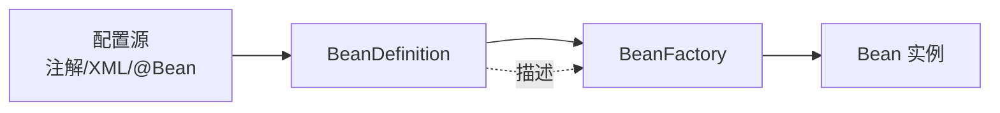
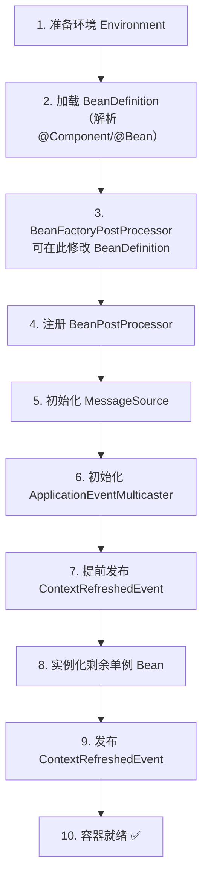

# Spring 概述与 IoC

## 什么是 Spring {#what-is-spring}

Spring 是一个**轻量级的 Java 企业级开发框架**，核心是**控制反转（Inversion of Control, IoC）** 和**依赖注入（Dependency Injection, DI）**。它让开发者专注于业务逻辑，而对象的创建、装配与生命周期交给容器统一管理。

> [!NOTE]
> Spring 于 2003 年诞生，由 Rod Johnson 在《Expert One-on-One J2EE Design and Development》中提出的理念演化而来，最初是为了解决 EJB 时代「重量级、侵入式、难测试」的复杂性问题。

经过二十年演进，Spring 已不再是单一的 IoC 容器，而是一整套**技术生态**：

- **Spring Framework 6.x**：核心容器、AOP、数据访问、Web（MVC）、测试等基础能力。
- **Spring Boot 3.x**：在 Framework 之上提供自动配置与起步依赖，是当下最主流的「快速开发基座」。
- **Spring Cloud**：面向微服务，解决注册中心、配置中心、网关、熔断等分布式问题。
- **Spring Security / Spring Data / Spring Batch** 等垂直模块。

本教程以 **Spring Boot 3.x / Spring Framework 6.x / Java 17+** 为语境，所有示例默认使用 Jakarta EE 命名空间（如 `jakarta.servlet`、`jakarta.validation`）。

## 控制反转与依赖注入 {#ioc-di}

要理解 IoC，先要理解它解决的问题：**对象之间的紧耦合**。

传统方式中，对象自己创建并持有它依赖的对象，调用方与实现类被编译期绑定：

```java
// 传统方式：类自己 new 依赖，硬编码实现
public class UserService {
    private UserRepository repo = new UserRepository(); // 直接依赖具体实现

    public User find(Long id) {
        return repo.findById(id);
    }
}
```

这段代码有两大问题：

1. **难以替换实现**：如果想把 `UserRepository` 换成基于 Redis 的实现，必须改源码。
2. **难以测试**：单元测试无法把 `repo` 替换成 Mock，只能连真实数据库。

IoC 的思想是：**「我需要什么依赖，由外部（容器）在运行时提供给我」，控制权由代码反转给容器**。这正是**依赖倒置原则（DIP）** 的体现——高层模块不应依赖低层模块，二者都应依赖抽象。

```java
// 面向接口编程 + 由容器注入
@Service
public class UserService {
    private final UserRepository repo; // 依赖抽象接口

    // 构造器注入：Spring 容器在创建 UserService 时自动提供 UserRepository 实例
    public UserService(UserRepository repo) {
        this.repo = repo;
    }

    public User find(Long id) {
        return repo.findById(id);
    }
}
```

> [!TIP]
> **可测试性收益**：测试时只需传入一个 `UserRepository` 的 Mock 实现（如 Mockito），即可脱离数据库对 `UserService` 做纯单元测试，这正是 IoC/DI 最被低估的价值。

DI 是 IoC 的一种具体实现手段。IoC 是「思想」，DI 是「手段」：容器通过构造器、setter 或字段，把依赖「注入」到目标对象中。

## 依赖注入的三种方式 {#di-ways}

Spring 支持三种注入方式，各有适用场景：

| 方式 | 说明 | 推荐程度 |
|------|------|----------|
| 构造器注入 | 通过构造方法传入依赖 | ✅ 强烈推荐（不可变、依赖明确、便于测试） |
| Setter 注入 | 通过 setter 方法注入 | 适合可选依赖或需运行时重新赋值 |
| 字段注入 | 通过 `@Autowired` 字段反射注入 | ❌ 不推荐（无法设 final、难测试、隐藏依赖） |

**为什么构造器注入是官方推荐方式？**

```java
@Service
public class OrderService {
    private final PaymentClient payment;  // final：一旦注入不可变
    private final StockClient stock;

    // 单一构造器时，@Autowired 可省略
    public OrderService(PaymentClient payment, StockClient stock) {
        this.payment = payment;
        this.stock = stock;
    }
}
```

好处有四点：

1. **不可变性**：依赖声明为 `final`，避免运行中被意外替换。
2. **依赖完整**：对象一旦构造完成即可用，不存在「部分初始化」状态。
3. **利于测试**：测试时直接 `new OrderService(mockPayment, mockStock)` 即可，无需启动容器。
4. **明确暴露契约**：构造参数就是类的全部依赖，一眼看清「这个组件需要什么」。

> [!WARNING]
> 字段注入 `@Autowired private UserRepository repo;` 看起来简洁，但依赖在对象创建后才被注入（可为 null），且无法通过构造器测试，IDE 也常给出「字段未初始化」警告。Spring 团队自 4.x 起就明确推荐构造器注入。

## 容器的两种实现 {#container}

Spring 的「容器」本质上就是**管理 Bean 的工厂**，核心接口有两个：

1. **BeanFactory** — 最基础的容器，按需（懒加载）创建 Bean，资源占用小，适合资源受限场景。
2. **ApplicationContext** — 在 BeanFactory 之上扩展，提供国际化（MessageSource）、事件发布（ApplicationEventPublisher）、环境抽象（Environment）、AOP 集成等能力，是**绝大多数应用的入口**。

```java
// 通过配置类创建容器（最基础用法，实际项目多由 Spring Boot 托管）
ApplicationContext context =
    new AnnotationConfigApplicationContext(AppConfig.class);
UserService service = context.getBean(UserService.class);
```

`ApplicationContext` 常用实现：

- `AnnotationConfigApplicationContext`：基于 Java 配置类。
- `ClassPathXmlApplicationContext`：基于 XML（历史项目）。
- `GenericWebApplicationContext`：Web 环境（Spring Boot 内部使用）。

Bean 的检索可以通过类型（`getBean(Class)`）、名称（`getBean("name")`）、或带类型的名称进行；推荐使用类型检索，避免硬编码字符串。

## 常用注解 {#annotations}

Spring 通过「 stereotype 注解」声明一个类由容器管理（成为 Bean）：

```java
@Component      // 通用组件，最基础的 Bean 声明
@Service        // 业务层（语义化 @Component）
@Repository     // 数据访问层，额外提供持久化异常转换
@Controller     // Web 层（返回视图）
@RestController // Web 层（返回 JSON，= @Controller + @ResponseBody）
@Configuration  // 配置类，内部 @Bean 方法返回的对象会被容器接管
@Bean           // 在配置类中声明一个 Bean
@Scope          // 作用域：singleton / prototype / request / session ...
```

要让这些注解生效，必须开启组件扫描。`@ComponentScan` 会递归扫描指定包及其子包下带上述注解的类：

```java
@Configuration
@ComponentScan("com.example.demo") // 扫描该包下所有 @Component 派生注解
public class AppConfig {
}
```

`@ComponentScan` 默认扫描**标注类所在包及其子包**；在 Spring Boot 中，`@SpringBootApplication` 已内置该扫描（扫描主类所在包）。

## Bean 的完整生命周期 {#bean-lifecycle}

理解 Bean 生命周期，是排查初始化异常、定制扩展行为的基础。一个单例 Bean 从诞生到销毁，会经历以下阶段：

```text
实例化(Instantiation)
   ↓
属性填充(Populate) —— @Autowired 注入依赖
   ↓
Aware 回调          —— BeanNameAware / BeanFactoryAware / ApplicationContextAware
   ↓
BeanPostProcessor 前置处理(postProcessBeforeInitialization)
   ↓
初始化(Initialization) —— @PostConstruct / InitializingBean.afterPropertiesSet()
   ↓
BeanPostProcessor 后置处理(postProcessAfterInitialization) —— AOP 代理在此生成
   ↓
★ Bean 就绪，被应用使用
   ↓
销毁(Destruction) —— @PreDestroy / DisposableBean.destroy()
```

关键节点说明：

1. **实例化**：容器通过构造器（或工厂方法）创建对象，此时属性还是默认值。
2. **属性填充**：完成依赖注入，把需要的其他 Bean 赋值给字段/构造参数。
3. **Aware 回调**：让 Bean 感知容器基础设施，例如拿到 Bean 名称或 ApplicationContext：

   ```java
   @Component
   public class DemoBean implements BeanNameAware, ApplicationContextAware {
       public void setBeanName(String name) {
           System.out.println("我的名字是：" + name);
       }
       public void setApplicationContext(ApplicationContext ctx) {
           System.out.println("拿到容器：" + ctx);
       }
   }
   ```
4. **BeanPostProcessor**：所有 Bean 的「统一拦截器」，贯穿初始化前后。AOP 的代理对象正是在**后置处理**阶段由 `AbstractAutoProxyCreator` 生成的——你拿到的「UserService」往往已经不是原生对象，而是被代理包装过的增强对象。
5. **初始化**：开发者自定义启动逻辑，推荐用 `@PostConstruct`（JSR-250 标准）：

   ```java
   @PostConstruct
   public void init() {
       // 例如：预热缓存、校验必填配置
   }
   ```
6. **销毁**：容器关闭时释放资源，推荐用 `@PreDestroy`。单例 Bean 默认随容器销毁触发；`prototype` 作用域的 Bean 容器不负责销毁。

## 作用域详解 {#bean-scope}

`@Scope` 决定 Bean 的「实例数量与存活范围」：

| 作用域 | 含义 | 典型场景 |
|--------|------|----------|
| `singleton`（默认） | 整个容器一个实例，线程共享 | 无状态 Service、DAO |
| `prototype` | 每次获取都新建一个实例 | 有状态对象、每次需新鲜的命令对象 |
| `request` | 每个 HTTP 请求一个实例 | Web 层请求级上下文 |
| `session` | 每个 HTTP Session 一个实例 | 用户会话级数据 |
| `application` | 整个 ServletContext 一个实例 | 全应用级共享（类似单例但更语义化） |

> [!WARNING]
> **经典坑：prototype 注入到 singleton**。
> 若把 `prototype` Bean 通过字段注入到 `singleton` Bean 中，由于 singleton 只初始化一次，注入的 prototype 实例也会被「固化」成单例——你每次拿到的都是同一个对象，prototype 的语义彻底失效。

```java
@Component
@Scope("singleton")
public class OrderProcessor {
    @Autowired
    private PrototypeTask task; // ❌ 这个 task 永远是第一次注入的那个实例
}
```

**三种解法：**

1. **`@Lookup` 方法注入**（容器在每次调用时返回新实例）：

   ```java
   @Component
   @Scope("singleton")
   public abstract class OrderProcessor {
       @Lookup
       public abstract PrototypeTask createTask(); // 每次调用返回新 prototype
   }
   ```

2. **`ObjectProvider`**（延迟、按需获取，最灵活）：

   ```java
   @Component
   @Scope("singleton")
   public class OrderProcessor {
       private final ObjectProvider<PrototypeTask> taskProvider;
       public OrderProcessor(ObjectProvider<PrototypeTask> taskProvider) {
           this.taskProvider = taskProvider;
       }
       public void run() {
           PrototypeTask task = taskProvider.getObject(); // 每次都是新实例
       }
   }
   ```

3. **`ApplicationContext.getBean(PrototypeTask.class)`**：在方法内显式向容器取实例。

## 循环依赖问题 {#circular-dependency}

当两个 Bean 互相依赖（A 依赖 B，B 又依赖 A）时，就可能产生循环依赖。

```java
@Service
public class A {
    private final B b;
    public A(B b) { this.b = b; }
}
@Service
public class B {
    private final A a;
    public B(A a) { this.a = a; }
}
```

**构造器注入的循环依赖会直接启动失败**：容器创建 A 需要 B，创建 B 又需要 A，无法破局——Spring 会抛出 `BeanCurrentlyInCreationException`。这其实是**好事**，它把设计问题在启动期就暴露出来，逼你重构（拆出公共依赖、用事件解耦等）。

**字段/Setter 注入的循环依赖可以「绕过去」**：Spring 用**三级缓存**提前暴露「半成品」Bean 的引用。但这只是兜底方案，不值得依赖。

**常见解法：**

- **重构解耦**：循环依赖往往是职责划分不清的信号，优先合并/拆分类。
- **`@Lazy` 延迟注入**：把其中一个依赖标记为懒加载，打破初始化期的相互等待：

  ```java
  @Service
  public class A {
      private final B b;
      public A(@Lazy B b) { this.b = b; } // B 首次使用时才真正创建
  }
  ```

> [!NOTE]
> **三级缓存简述**：Spring 内部用 `singletonObjects`（成品）/`earlySingletonObjects`（早期引用）/`singletonFactories`（早期工厂）三层结构，在 B 填充 A 时，通过工厂拿到 A 的早期引用完成闭环。该机制仅对**单例 + 字段/Setter 注入**有效，构造器注入与 `prototype` 均不适用。

## 配置方式演进 {#config-evolution}

Spring 的配置经历了三个阶段，理解它能看懂任何历史代码：

1. **XML 配置**（Spring 1.x-2.x）：在 `applicationContext.xml` 中声明 `<bean>`。冗长但直观。
2. **注解配置**（Spring 2.5+）：`@Component`/`@Autowired`/`@Service` 等，配合组件扫描。
3. **JavaConfig**（Spring 3.0+，现代主流）：用 Java 代码声明 Bean，类型安全、可重构。

```java
@Configuration          // 标记配置类
public class AppConfig {

    @Bean               // 方法返回值作为 Bean 注册到容器
    public DataSource dataSource() {
        HikariConfig cfg = new HikariConfig();
        cfg.setJdbcUrl("jdbc:mysql://localhost:3306/demo");
        return new HikariDataSource(cfg);
    }
}
```

`@Configuration` 类本身也是 Bean，其 `@Bean` 方法默认被容器**增强**（CGLIB 代理），保证多次调用 `dataSource()` 返回同一个单例，而不是每次 new 一个新对象。

`@Import` 可组合多个配置类，`@ComponentScan` 负责扫描注解 Bean，`@ImportResource` 可在过渡期引入遗留 XML——三者常配合使用。

## 条件装配 {#conditional}

同一个应用要在不同环境、不同依赖下加载不同 Bean，就需要「条件装配」。Spring Boot 的自动配置正是建立在条件注解之上。

**`@Profile` —— 按环境切换**：

```java
@Configuration
public class DataConfig {
    @Bean
    @Profile("dev")     // 仅 dev 环境生效
    public DataSource devDs() { /* H2 内存库 */ }

    @Bean
    @Profile("prod")    // 仅 prod 环境生效
    public DataSource prodDs() { /* MySQL 生产库 */ }
}
```

启动时通过 `spring.profiles.active=prod` 激活。

**`@ConditionalOnProperty` —— 按配置项开关**：

```java
@Bean
@ConditionalOnProperty(name = "feature.cache.enabled", havingValue = "true")
public CacheManager cacheManager() { /* 仅当配置开启时才创建 */ }
```

**`@ConditionalOnMissingBean` —— 允许用户覆盖默认实现**：

```java
@Bean
@ConditionalOnMissingBean   // 容器中已有该类型 Bean 时，本 @Bean 不生效
public CacheManager cacheManager() {
    return new SimpleCacheManager(); // 用户没自定义就用这个默认
}
```

这一机制是 Spring Boot「开箱即用、又可定制」体验的核心：它先留好默认实现，再允许你一键覆盖。

## 小结 {#summary}

IoC/DI 把「谁创建对象、谁装配依赖」的控制权从业务代码反转给了容器，是 Spring 解耦与可测试性的根基。通过 Bean 生命周期、作用域、循环依赖与条件装配等机制，容器在不同场景下都能给出合理的对象管理策略。下一章将学习建立在 IoC 之上的 AOP——它同样依赖容器为你「悄悄」生成代理对象。

## BeanDefinition：容器眼中的 Bean {#bean-definition}

容器不直接持有「对象」，它先持有「BeanDefinition」（Bean 的定义信息），再按定义创建对象。理解这一点是排查"为什么我的 Bean 没生效"的前提。

一个 `BeanDefinition` 至少包含：

- **beanClass**：实际类名。
- **scope**：作用域（singleton / prototype / request ...）。
- **isLazyInit**：是否懒加载。
- **autowireMode**：自动装配模式（按类型/按名称/不装配）。
- **initMethod / destroyMethod**：初始化/销毁方法名。
- **constructorArgumentValues**：构造器参数值。
- **propertyValues**：属性值集合（用 XML 配置时最直观）。



```java
// 编程式注册 BeanDefinition（极少使用，理解原理即可）
DefaultListableBeanFactory factory = new DefaultListableBeanFactory();
AbstractBeanDefinition def = BeanDefinitionBuilder
    .genericBeanDefinition(UserService.class)
    .setScope("singleton")
    .setLazyInit(false)
    .setInitMethodName("init")
    .setDestroyMethodName("destroy")
    .addPropertyValue("name", "默认名")
    .getBeanDefinition();
factory.registerBeanDefinition("userService", def);
```

> [!NOTE]
> 实际开发中我们几乎不会编程式注册 Bean——`@Component`/`@Bean` 等注解最终都会被 Spring 解析成 `BeanDefinition`。了解这层抽象的好处是：遇到"Bean 没被识别"时，能想到用 `BeanDefinitionRegistryPostProcessor` 介入注册过程（高级定制场景）。

## FactoryBean：工厂 Bean 的奥秘 {#factory-bean}

`FactoryBean` 是一个**特殊的 Bean**，它的作用是「生产其他 Bean」——即容器拿到的不是 `FactoryBean` 本身，而是它 `getObject()` 返回的对象。

```java
@Component
public class SqlSessionFactoryBean implements FactoryBean<SqlSession> {
    @Override
    public SqlSession getObject() {
        // 复杂的构建过程（读取配置、连接池、Mapper 扫描...）
        return buildSqlSession();
    }
    @Override
    public Class<?> getObjectType() { return SqlSession.class; }
    @Override
    public boolean isSingleton() { return true; }
}
```

**如何拿到真正的 FactoryBean 本身**？容器有特殊规则：取名为 `&sqlSessionFactoryBean` 时返回工厂本身，取 `sqlSessionFactoryBean` 时返回它生产的对象：

```java
// 拿到的是 SqlSession（生产物）
SqlSession session = context.getBean("sqlSessionFactoryBean", SqlSession.class);
// 拿到的是 SqlSessionFactoryBean（工厂本身）
SqlSessionFactoryBean factory = (SqlSessionFactoryBean)
    context.getBean("&sqlSessionFactoryBean");
```

> [!TIP]
> MyBatis-Spring 的 `SqlSessionFactoryBean`、Spring 内置的 `GatewayClientFactoryBean`、各种第三方缓存/数据库客户端都用此模式。它的核心价值是「把复杂构建逻辑封装到一个 Bean 里」，让普通 Bean 走依赖注入即可。

## ApplicationContext 完整初始化流程 {#init-flow}

`ApplicationContext.refresh()` 是容器初始化的"主流程"，所有 Spring Boot 启动最终都会调用它：



**关键节点说明**：

- **第 3 步 `BeanFactoryPostProcessor`**：唯一允许「在 Bean 创建前修改 BeanDefinition」的扩展点。典型应用：`PropertySourcesPlaceholderConfigurer`（解析 `${}` 占位符）、`ConfigurationClassPostProcessor`（解析 `@Configuration` 类）。
- **第 4 步 `BeanPostProcessor`**：所有 Bean 的统一拦截器（在第 8 步创建 Bean 时生效）。AOP 代理正是这里生成。
- **第 8 步**才真正创建单例 Bean。

> [!WARNING]
> 经常被问到的"为什么我的 `@Bean` 方法中调用其他 `@Bean` 方法返回的是同一个对象"——因为 `ConfigurationClassPostProcessor` 在第 3 步对 `@Configuration` 类做了 CGLIB 增强，多次调用会从容器取缓存。这正是 `@Configuration`（full）vs `@Component`（lite）的本质区别。

## ApplicationEvent：容器内的事件机制 {#event}

Spring 自带**观察者模式**实现：业务方发事件，监听器消费。解耦利器。

```java
// 1) 定义事件
public class OrderPaidEvent extends ApplicationEvent {
    private final Long orderId;
    public OrderPaidEvent(Object source, Long orderId) {
        super(source);
        this.orderId = orderId;
    }
    public Long getOrderId() { return orderId; }
}

// 2) 发布事件
@Service
public class OrderService {
    private final ApplicationEventPublisher publisher;

    public void pay(Long orderId) {
        // ... 支付逻辑
        publisher.publishEvent(new OrderPaidEvent(this, orderId));
    }
}

// 3) 监听事件（同步）
@Component
public class NotificationListener {
    @EventListener
    public void onOrderPaid(OrderPaidEvent e) {
        sendEmail(e.getOrderId());
    }
}

// 4) 监听事件（异步）
@Component
public class LogListener {
    @Async
    @EventListener
    public void onOrderPaid(OrderPaidEvent e) {
        log.info("订单支付: {}", e.getOrderId());
    }
}
```

**`@TransactionalEventListener`**：让监听器在事务**提交后**才触发（解决"事务还没提交就发消息"导致的下游读到旧数据问题）：

```java
@TransactionalEventListener(phase = TransactionPhase.AFTER_COMMIT)
public void onPaid(OrderPaidEvent e) {
    // 事务已提交，下游一定能查到最新数据
    mq.send("order-paid", e.getOrderId());
}
```

> [!TIP]
> 事件机制 vs MQ：事件在**单进程内**同步/异步派发；MQ 用于**跨进程/跨服务**。能本地用事件解耦的，不要上 MQ——同步性能高、无外部依赖、易追踪。

## Environment 与 Profile 详解 {#environment}

`Environment` 是 Spring 的"环境抽象"，统一管理**配置文件 + 系统环境变量 + JVM 参数**：

```java
@Component
public class EnvPrinter implements EnvironmentAware {
    @Override
    public void setEnvironment(Environment env) {
        // 1. 直接取值（按 key）
        String url = env.getProperty("spring.datasource.url");

        // 2. 类型转换（支持默认值）
        Integer port = env.getProperty("server.port", Integer.class, 8080);
        // 或者
        Integer port2 = env.getProperty("server.port", Integer.class);

        // 3. 占位符解析（与 PropertySourcesPlaceholderConfigurer 配合）
        String jdbc = env.resolvePlaceholders("${spring.datasource.url}");

        // 4. 判断激活的 profile
        if (env.acceptsProfiles(Profiles.of("dev", "test"))) {
            // 仅 dev/test 环境执行
        }
    }
}
```

**Profile 的加载机制**：

```yaml
# application.yml
spring:
  profiles:
    active: dev,region-east   # 同时激活多个，按顺序加载
```

```java
// 1. 在 application-prod.yml 中定义 prod 专属配置
// 2. 启动时通过 --spring.profiles.active=prod 激活
// 3. 同一 key 在多个 profile 中定义，后加载的覆盖先加载的
```

## 国际化 MessageSource {#i18n}

容器内置国际化能力。资源文件命名 `messages_语言_地区.properties`：

```properties
# src/main/resources/messages.properties（默认）
greeting=Hello

# src/main/resources/messages_zh_CN.properties
greeting=你好

# src/main/resources/messages_ja.properties
greeting=こんにちは
```

```java
@Autowired
private MessageSource messageSource;

public String greet() {
    Locale locale = LocaleContextHolder.getLocale();   // 由请求头 Accept-Language 决定
    return messageSource.getMessage("greeting", null, locale);
}
```

在 Spring Boot 中，`spring.messages.basename=messages,i18n/messages` 指定资源文件位置。

## BeanFactoryPostProcessor：修改 BeanDefinition {#bfpp}

`BeanFactoryPostProcessor`（BFPP）是**容器启动阶段**的扩展点，能在所有 Bean 实例化之前修改 BeanDefinition。最经典的应用就是 MyBatis-Spring 扫描 Mapper 接口注册为 Bean：

```java
@Component
public class MapperScannerConfigurer implements BeanFactoryPostProcessor {
    @Override
    public void postProcessBeanFactory(ConfigurableListableBeanFactory bf) {
        // 扫描 com.example.mapper 包下所有接口，生成 BeanDefinition 注册到容器
        ClassPathScanningCandidateComponentProvider scanner = new ClassPathScanningCandidateComponentProvider(false);
        scanner.addIncludeFilter(new AnnotationTypeFilter(Mapper.class));
        Set<BeanDefinition> candidates = scanner.findCandidateComponents("com.example.mapper");
        for (BeanDefinition bd : candidates) {
            ((BeanDefinitionRegistry) bf).registerBeanDefinition(
                bd.getBeanClassName(), bd);
        }
    }
}
```

**与 `BeanPostProcessor` 的区别**：

| 扩展点 | 时机 | 作用对象 |
|--------|------|----------|
| `BeanFactoryPostProcessor` | 所有 Bean **创建前** | `BeanDefinition`（元数据） |
| `BeanPostProcessor` | 每个 Bean **创建前后** | Bean 实例本身 |

## 小结（升级版） {#summary-updated}

IoC/DI 把「谁创建对象、谁装配依赖」的控制权从业务代码反转给了容器，是 Spring 解耦与可测试性的根基。本章深入了多个进阶主题：

- **BeanDefinition**：容器持有的是"Bean 的定义信息"，按定义创建对象。
- **FactoryBean**：特殊 Bean，"生产"其他对象；用 `&beanName` 拿到工厂本身。
- **ApplicationContext 初始化 10 步**：环境准备 → 加载定义 → BFPP → 注册 BPP → 实例化单例 → 事件广播。
- **ApplicationEvent**：容器内观察者模式，`@TransactionalEventListener` 在事务提交后触发。
- **Environment**：统一管理配置 + Profile + 占位符。
- **MessageSource**：国际化支持。
- **BeanFactoryPostProcessor**：唯一在 Bean 创建前修改定义的扩展点（MyBatis Mapper 扫描的原理）。

下一章进入 AOP——它依赖容器为你「悄悄」生成代理对象。
