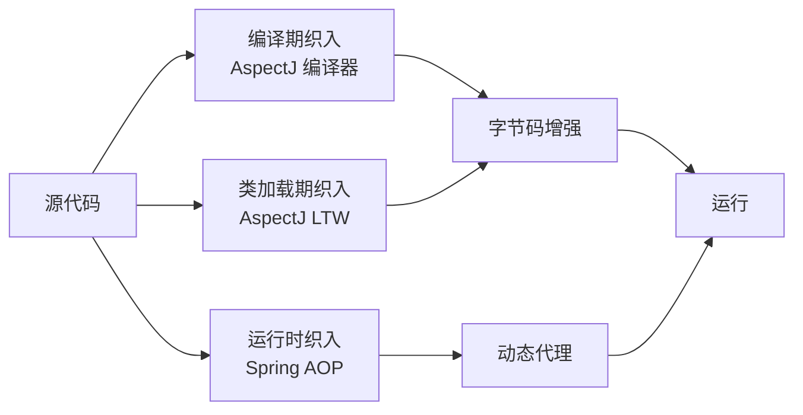

# AOP 面向切面编程

## 什么是 AOP {#what-is-aop}

AOP（Aspect-Oriented Programming，面向切面编程）把**横切关注点**（如日志、事务、安全、缓存）从业务逻辑中分离出来，避免这些逻辑散落在每个方法里造成重复与散乱。

> [!TIP]
> 日志、事务、权限校验这类逻辑与「业务是什么」无关，却「横切」在大量方法之上，是典型的横切关注点。AOP 让你把它们集中到一处维护，业务方法只关心业务。

AOP 不能替代 OOP，而是对它的补充：OOP 适合纵向的「对象/模块」划分，AOP 适合横向的「横跨多个对象的同一类逻辑」。

## 核心概念 {#concepts}

- **切面（Aspect）**：横切关注点的模块化，如 `LoggingAspect`、`TransactionAspect`。
- **连接点（Join Point）**：程序执行的某个点（Spring AOP 中仅支持「方法执行」这一种连接点）。
- **切点（Pointcut）**：定义在「哪些连接点」上织入通知，是切面的「作用范围」。
- **通知（Advice）**：切面在切点处执行的动作（前/后/环绕等）。
- **织入（Weaving）**：把切面逻辑「缝」进目标代码的过程。Spring 在**运行时**通过代理织入（区别于 AspectJ 的编译期/类加载期织入）。
- **目标对象（Target）**：被增强的原始对象；Spring AOP 中你拿到的往往是它的**代理对象**。

## 底层原理：JDK 动态代理与 CGLIB {#proxy-mechanism}

Spring AOP 的织入本质是「为 Bean 创建一个代理对象，调用时先走代理，再走原方法」。代理有两种实现：

| 代理方式 | 适用条件 | 特点 |
|----------|----------|------|
| JDK 动态代理 | 目标类**实现了接口** | 基于接口生成代理，无需额外依赖 |
| CGLIB | 目标类**没有接口**（或代理类本身） | 基于子类继承生成代理，需字节码增强 |

```text
JDK 代理：Proxy.newProxyInstance(...)  → 实现同一接口
CGLIB 代理：Enhancer.create(...)        → 继承目标类，重写方法
```

**关键变化**：在 Spring Boot 2.x 之前，有接口用 JDK 代理、无接口用 CGLIB；**Spring Boot 3.x 默认统一使用 CGLIB**（`spring.aop.proxy-target-class=true` 已成默认）。好处是行为一致、且能代理没有接口的类。

> [!WARNING]
> CGLIB 通过「继承目标类」生成代理，因此**无法代理 `final` 类与 `final` 方法**（被 final 修饰的方法无法被重写）。若某类需要被 AOP 增强，请勿声明为 final。同时，私有方法也不会被织入。

## 切点表达式语法详解 {#pointcut-syntax}

切点是 AOP 的「瞄准镜」。`execution` 是最常用也最强大的指示器，完整格式为：

```text
execution([修饰符] 返回类型 [包名.类名.]方法名(参数) [异常])
```

逐段说明：

- **修饰符**：可省略（如 `public`），省略表示匹配任意。
- **返回类型**：`*` 匹配任意返回类型；`void`、`String` 匹配具体类型。
- **包/类**：可用 `*` 通配包，`..` 表示「当前包及所有子包」。
- **方法名**：`*` 匹配任意方法。
- **参数**：`()` 无参，`(..)` 任意参数，`(*,String)` 两个参数且第二个为 String。
- **异常**：几乎不写。

```java
// 匹配 com.example.service 包及其子包下，所有 public、返回任意、任意类任意方法、任意参数
@Pointcut("execution(public * com.example.service..*.*(..))")
public void serviceLayer() {}

// 匹配所有以 save 开头、返回 User、接收 Long 参数 的方法
@Pointcut("execution(com.example.entity.User com.example..*.save*(Long))")
public void saveMethods() {}
```

其他常用指示器：

- **`within`**：按「类型所在包/类」匹配（粗粒度，比 execution 快）。

  ```java
  @Pointcut("within(com.example.service..*)") // service 包下所有类的方法
  public void inService() {}
  ```

- **`@annotation`**：按「方法是否带某注解」匹配（最灵活，推荐自定义注解驱动切面）。

  ```java
  @Pointcut("@annotation(com.example.anno.Loggable)") // 标了 @Loggable 的方法
  public void loggable() {}
  ```

- **`args`**：按「运行时参数类型」匹配（注意与 execution 中写死类型不同）。
- **逻辑组合**：切点可用 `&&`、`||`、`!` 组合，如 `serviceLayer() && !loggable()`。

## 各通知类型深入 {#advice-types}

| 通知 | 时机 | 注解 |
|------|------|------|
| 前置 | 方法执行前 | `@Before` |
| 后置返回 | 方法**正常返回后** | `@AfterReturning` |
| 异常 | 方法**抛异常后** | `@AfterThrowing` |
| 最终 | 无论是否异常**都执行**（类似 finally） | `@After` |
| 环绕 | 包裹整个方法，可控制是否执行、修改返回值 | `@Around` |

**`@Around`（最强大）**：通过 `ProceedingJoinPoint.proceed()` 手动决定原方法何时执行，可在前后织入逻辑、改变返回值、吞掉/转换异常：

```java
@Around("serviceLayer()")
public Object around(ProceedingJoinPoint pjp) throws Throwable {
    long start = System.currentTimeMillis();
    try {
        Object result = pjp.proceed();        // 执行原方法（不调用则方法被「拦截」）
        return result;
    } finally {
        long cost = System.currentTimeMillis() - start;
        log.info("{} 耗时 {}ms", pjp.getSignature(), cost);
    }
}
```

**`@AfterReturning` 拿返回值**：通过 `returning` 绑定原方法返回值变量名：

```java
@AfterReturning(pointcut = "serviceLayer()", returning = "ret")
public void afterReturn(JoinPoint jp, Object ret) {
    log.info("{} 返回 {}", jp.getSignature(), ret);
}
```

**`@AfterThrowing` 拿异常**：

```java
@AfterThrowing(pointcut = "serviceLayer()", throwing = "ex")
public void afterThrow(JoinPoint jp, Exception ex) {
    log.error("{} 抛异常", jp.getSignature(), ex);
}
```

> [!WARNING]
> `@Around` 必须**调用 `proceed()` 返回其结果**，否则目标方法不会执行、且返回值丢失。`@Around` 的返回类型应与目标方法一致（通常用 `Object`）。一个切面里同时写 `@Around` 和 `@After` 时，执行顺序为：环绕前 → 前置 → 原方法 → 环绕后 → 最终。

## 多切面顺序与 `@Order` {#aspect-order}

当多个切面作用在同一方法时，需要明确「谁先谁后」。用 `@Order`（值越小越先执行）或实现 `Ordered` 接口：

```java
@Aspect
@Order(1)           // 先执行：事务
@Component
public class TransactionAspect { /* ... */ }

@Aspect
@Order(2)           // 后执行：日志
@Component
public class LoggingAspect { /* ... */ }
```

执行顺序口诀（同一连接点）：**`@Order` 小的，环绕「前」与前置先跑；环绕「后」与后置/最终后跑**。用表格表示（Order 1 先、Order 2 后）：

```text
Order1.@Around前 → Order1.@Before → Order2.@Around前 → Order2.@Before
        → 原方法
Order2.@After/Return → Order2.@Around后 → Order1.@After/Return → Order1.@Around后
```

## 自调用失效问题 {#self-invocation}

这是 AOP 最常见的「坑」：**同一个类内部，方法 A 调用方法 B，若 B 上有切面注解，则该注解不会生效**。

原因：Spring AOP 基于代理。外部调用走的是「代理对象」，代理会先执行切面再转发给目标；而**类内部 `this.b()` 是直接调用原生对象的方法，根本没经过代理**，自然没有增强。

```java
@Service
public class UserService {
    public void register(User u) {
        // ❌ 同类内部调用，save 上的 @Transactional/@Loggable 不生效
        this.save(u);
    }

    @Transactional
    public void save(User u) { /* ... */ }
}
```

**三种解法：**

1. **拆类（最干净）**：把 `save` 抽到另一个 `@Service` 中，让调用跨 Bean（跨代理）自然生效。
2. **注入自身 / 用 ApplicationContext 取代理**：

   ```java
   @Service
   public class UserService {
       private final UserService self; // 注入的是代理对象（自依赖）
       public UserService(UserService self) { this.self = self; }

       public void register(User u) {
           self.save(u); // ✅ 走代理，切面生效
       }
       @Transactional
       public void save(User u) { /* ... */ }
   }
   ```
3. **`AopContext.currentProxy()`**：开启暴露代理后直接取当前代理（需 `@EnableAspectJAutoProxy(exposeProxy = true)`），但不推荐——它把代码与 AOP 基础设施耦合。

> [!TIP]
> 原则：**需要增强的方法，永远从「代理」进入**。最稳妥的设计是让不同职责落在不同 Bean 上。

## 事务与 AOP 的关系 {#transaction-and-aop}

`@Transactional` 本身就是 AOP 的典型实现——Spring 为标注了注解的 Bean 生成代理，在方法执行前开启事务、`proceed()` 后提交、抛异常则回滚。理解这一点，就能解释「为什么同类自调用事务会失效」（见上节）。本章只点出关系，事务细节在第五章展开。

## 实际场景：统一耗时统计与日志 {#real-example}

下面用一个完整切面，演示「接口耗时统计 + 入参脱敏日志」，并配合自定义注解驱动：

```java
// 1) 自定义注解，作为切点触发条件
@Target(ElementType.METHOD)
@Retention(RetentionPolicy.RUNTIME)
public @interface Loggable {
    String value() default "";
}

// 2) 切面
@Slf4j
@Aspect
@Component
@Order(10)
public class ApiLogAspect {

    // 切点：任意标了 @Loggable 的方法
    @Pointcut("@annotation(com.example.anno.Loggable)")
    public void loggable() {}

    @Around("loggable() && @annotation(anno)")
    public Object around(ProceedingJoinPoint pjp, Loggable anno) throws Throwable {
        String method = pjp.getSignature().toShortString();
        Object[] args = pjp.getArgs();
        long start = System.currentTimeMillis();
        log.info("[{}] 入参={}", anno.value(), args);
        try {
            Object result = pjp.proceed();
            log.info("[{}] 耗时={}ms 出参={}", anno.value(),
                     System.currentTimeMillis() - start, result);
            return result;
        } catch (Throwable t) {
            log.error("[{}] 异常 耗时={}ms", anno.value(),
                      System.currentTimeMillis() - start, t);
            throw t;
        }
    }
}

// 3) 使用
@Service
public class UserService {
    @Loggable("创建用户")
    public User create(User user) { /* 业务 */ return user; }
}
```

同类思路可复制到**权限校验**（前置检查角色）、**缓存**（环绕里先查缓存再 `proceed`）、**限流/幂等**（环绕里先判令牌）等场景。

## 小结 {#summary}

Spring AOP 在运行时为 Bean 生成（默认 CGLIB）代理，将横切逻辑织入切点匹配的方法；掌握切点表达式、通知顺序与「自调用失效」三大要点，才能把日志、事务、权限等切面写对、写好。下一章学习 Spring MVC——它正是建立在 IoC 与 AOP 之上的 Web 层。

## 完整切点指示器详解 {#pointcut-designators}

Spring AOP 支持 9 种切点指示器（Pointcut Designators, PCD），分两类：**execution 家族**（基于方法签名）+ **args 家族**（基于运行时类型）。合理组合可以表达几乎任意复杂规则。

### execution：方法签名匹配（最强大）

完整语法（所有段都可省略）：

```text
execution(
    [@注解]    // 可选：方法级注解
    [修饰符]    // 可选：public/protected
    返回类型    // 必填
    [包名.类名.]方法名(参数) [throws 异常]
)
```

实战模板：

```java
// 1. 匹配任意 public 方法
@Pointcut("execution(public * *(..))")
public void anyPublic() {}

// 2. 匹配某包下任意方法（含子包）
@Pointcut("execution(* com.example.service..*.*(..))")
public void inService() {}

// 3. 匹配以 save 开头的方法
@Pointcut("execution(* com.example..*.save*(..))")
public void saveMethods() {}

// 4. 匹配特定参数类型
@Pointcut("execution(* com.example.service.*.*(Long, String))")
public void specificArgs() {}

// 5. 匹配带某注解的方法
@Pointcut("execution(* com.example..*.*(..)) && @annotation(com.example.anno.Loggable)")
public void loggableMethods() {}
```

### @annotation：按方法注解匹配（最实用）

```java
@Pointcut("@annotation(com.example.anno.Loggable)")
public void loggable() {}
```

**优势**：业务代码用 `@Loggable` 显式标记，比按"包路径"匹配更可控；重构路径时切面不用改。

### within：按类所在包/类匹配（粗粒度）

```java
// com.example.service 包下所有类的所有方法（性能比 execution 略快）
@Pointcut("within(com.example.service..*)")
public void inService() {}

// 某个具体类
@Pointcut("within(com.example.service.OrderService)")
public void inOrderService() {}
```

### bean：按 Bean 名称匹配（Spring 独有）

```java
@Pointcut("bean(orderService)")
public void orderServiceMethods() {}

// Bean 名称通配
@Pointcut("bean(*Service)")
public void allServiceMethods() {}
```

> [!TIP]
> `bean` 指示器是 Spring 特有（AspectJ 没有），适合"按 Bean 切"，尤其在配置文件里需要临时给某些 Bean 加增强时。

### @within / @target / @args：类级注解匹配

```java
// @within：方法所在类标了某注解（@Target(ElementType.TYPE)）
@Pointcut("@within(com.example.anno.Service)")
public void inServiceClass() {}

// @target：运行时目标对象标了某注解（注意运行时才判断）
@Pointcut("@target(com.example.anno.Auditable)")
public void onAuditableInstance() {}

// @args：方法参数类型标了某注解
@Pointcut("@args(com.example.anno.Validated)")
public void validatedArgs() {}
```

### this / target：代理 vs 目标对象

```java
// this：当前调用方法的对象（AOP 代理）类型
@Pointcut("this(com.example.service.UserService)")
public void proxyIsUserService() {}

// target：目标对象（被代理的真实对象）类型
@Pointcut("target(com.example.service.UserService)")
public void targetIsUserService() {}
```

绝大多数情况两者无差别，但在 **JDK 代理 vs CGLIB 代理混用** 时有微妙差异（如目标对象未实现接口）。

### args：按运行时参数类型匹配

```java
// 任意以 String 为第一个参数的方法
@Pointcut("args(String, ..)")
public void firstArgIsString() {}
```

**vs execution 中的参数写法**：execution 是**编译期签名匹配**，args 是**运行时类型匹配**。对带泛型的方法要用 args。

### 组合使用：完整示例

```java
@Aspect
@Component
public class RepositoryAspect {

    // 匹配 "service 包下，所有类，所有方法，但 NOT 标了 @Loggable 的方法"
    @Pointcut("execution(* com.example.service..*.*(..)) "
            + "&& !@annotation(com.example.anno.Loggable)")
    public void serviceLayerButNotLogged() {}

    // 匹配 "以 Service/ServiceImpl 结尾的 Bean 的所有方法"
    @Pointcut("bean(*Service) || bean(*ServiceImpl)")
    public void allServices() {}

    // 上面定义过的切点可被通知引用
    @Around("serviceLayerButNotLogged()")
    public Object around(ProceedingJoinPoint pjp) throws Throwable {
        // ...
    }
}
```

## 引介增强 @DeclareParents {#declare-parents}

**引介（Introduction）** 让 AOP 不仅能"增强现有方法"，还能**给目标类动态添加新接口实现**：

```java
// 1. 定义要"加"给目标类的接口
public interface Auditable {
    void audit(String action);
}

@Component
public class DefaultAuditable implements Auditable {
    @Override public void audit(String action) {
        log.info("审计: {}", action);
    }
}

// 2. 用 @DeclareParents 把接口"加"给所有 Service 包下的类
@Aspect
@Component
public class AuditableIntroduction {

    @DeclareParents(
        value = "com.example.service..*",
        defaultImpl = DefaultAuditable.class)
    public Auditable auditable;   // 类型 = 要加的接口

    // 之后任意该包的 Bean 都可以强转为 Auditable：
    // Auditable auditable = (Auditable) orderService;
    // auditable.audit("创建订单");
}
```

> [!NOTE]
> 引介增强的实现机制：代理对象在 CGLIB/JDK 代理生成时，让它多实现一个 `Auditable` 接口（接口代理很容易实现多接口）。但**字段类本身没有真的修改**——只是在代理层"假装"实现了接口。这是引介与继承的本质区别。

## 织入时机对比：Spring AOP vs AspectJ {#weaving-timing}

AOP 的核心是「织入」——把切面逻辑缝进目标代码。三种织入时机性能、可维护性差异显著：



| 维度 | 编译期织入（AspectJ） | 类加载期织入（LTW） | 运行时织入（Spring AOP） |
|------|---------------------|---------------------|------------------------|
| **时机** | javac 阶段 | 类加载时（JVM 钩子） | 容器创建 Bean 时 |
| **侵入性** | 需要专门的编译器 | 需要 javaagent | 无（应用层） |
| **性能** | 启动时一次性开销，运行零开销 | 启动时一次性开销，运行零开销 | 每次调用都有反射/代理开销 |
| **支持范围** | 任意连接点（字段、构造器、静态方法） | 仅方法执行 | 仅方法执行 |
| **典型场景** | 高性能需求、需切入非 Spring Bean | 旧应用 AOP 化 | **绝大多数 Spring 项目** |
| **生态** | 独立语言/工具链 | AspectJ 框架 | 与 Spring 无缝 |

> [!TIP]
> **绝大多数项目用 Spring AOP 就够**——无需引入 AspectJ 工具链。只有以下场景考虑 AspectJ：①需要切入**非 Spring 管理的对象**（如 JDK 内部类）；②需要切入**字段访问/构造器**；③性能极度敏感、连代理开销都不能容忍。Spring 提供了 `@EnableAspectJAutoProxy` + AspectJ 语法支持，但不启用 LTW 时仍走运行时代理。

## Spring AOP 不支持的能力 {#limitations}

明确 AOP 的边界很重要。**以下场景 Spring AOP 织入不了**：

- ❌ **字段访问拦截**（getter/setter）—— AspectJ 支持。
- ❌ **构造器调用拦截**—— AspectJ 支持。
- ❌ **static 方法**—— Spring AOP 不支持（无代理）。
- ❌ **同类内部自调用**——见上节。
- ❌ **final 类/方法**—— CGLIB 无法继承。
- ❌ **非 Spring 容器管理的对象**——根本没有代理。

如果你的需求命中以上任意一项，要么**换思路**（如字段拦截改用事件驱动），要么**启用 AspectJ LTW**（`spring-instrument` + `javaagent`）。

## 小结（升级版） {#summary-updated}

Spring AOP 在运行时为 Bean 生成（默认 CGLIB）代理。本章进阶内容：

- **9 种切点指示器**完整讲解：execution（签名）/ within（包类）/ this & target（代理对象）/ args（运行时参数）/ @annotation（方法注解）/ @within / @target / @args（类级注解）/ bean（Spring 独有）。
- **引介增强 `@DeclareParents`**：在代理层给类动态添加接口实现。
- **三种织入时机对比**：编译期（AspectJ 编译器）/ 类加载期（LTW）/ 运行时（Spring AOP），按需选择。
- **Spring AOP 不支持的能力**：字段/构造器拦截、static 方法、final 类/方法、非容器管理对象——遇到这些场景要么改思路，要么启用 AspectJ。

下一章学习 Spring MVC——它正是建立在 IoC 与 AOP 之上的 Web 层。
