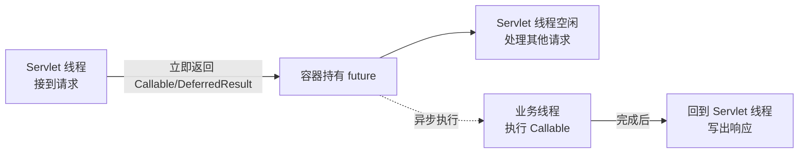

# Spring MVC

## 什么是 Spring MVC {#what-is-mvc}

Spring MVC 是 Spring 的 Web 框架，基于 **MVC（Model-View-Controller）** 模式，用于构建 Web 应用和 REST API。其核心是一个前端控制器 `DispatcherServlet`，它把请求统一接收后分发给不同的处理器（Controller），处理完再把响应写回客户端。

在前后端分离的今天，Spring MVC 绝大多数时候以 **REST API** 形式工作：Controller 方法直接返回 JSON（`@RestController`），不再渲染 JSP/Thymeleaf 视图。但 MVC 的「请求→分发→处理→响应」流程依然成立。

## 完整请求处理链路 {#request-flow}

一个请求从浏览器到 Controller 再回到浏览器，会经过 `DispatcherServlet` 协调的一系列组件：

```text
HTTP 请求
   ↓
DispatcherServlet（前端控制器，统一入口）
   ↓
HandlerMapping（根据 URL 找到对应的 Handler/Controller 方法）
   ↓
HandlerAdapter（适配并调用目标方法，完成参数绑定）
   ↓
Controller（执行业务，返回数据或 ModelAndView）
   ↓
HttpMessageConverter（把返回值序列化为 JSON / 视图渲染）
   ↓
HandlerExceptionResolver（若抛异常，统一解析为错误响应）
   ↓
HTTP 响应
```

各组件职责：

- **HandlerMapping**：维护「URL → Handler」的映射，最常用的是 `@RequestMapping` 注册到 `RequestMappingHandlerMapping`。
- **HandlerAdapter**：真正调用处理器，并把 HTTP 参数绑定到方法入参（类型转换、校验在此发生）。
- **HttpMessageConverter**：`@RequestBody` 的 JSON→对象、`@ResponseBody` 的对象→JSON 都靠它（默认 Jackson）。
- **HandlerExceptionResolver**：把 Controller 抛出的异常转换成响应（用 `@ExceptionHandler` 接管）。
- **ViewResolver**：渲染视图时定位模板（REST API 通常不走这一步）。

> [!TIP]
> 理解这条链路的价值：当你遇到「参数绑定失败」「415/400 错误」「异常没被全局捕获」等问题时，能精准定位到是哪个组件出了错，而不是盲目调试。

## 编写控制器 {#controller}

```java
@RestController
@RequestMapping("/api/users")
public class UserController {

    @GetMapping("/{id}")
    public User getUser(@PathVariable Long id) {
        return userService.findById(id);
    }

    @PostMapping
    @ResponseStatus(HttpStatus.CREATED)
    public User create(@RequestBody User user) {
        return userService.create(user);
    }

    @DeleteMapping("/{id}")
    @ResponseStatus(HttpStatus.NO_CONTENT)
    public void delete(@PathVariable Long id) {
        userService.delete(id);
    }
}
```

`@RestController` = `@Controller` + `@ResponseBody`，意味着每个方法返回值直接写入响应体（而非视图名）。`@RequestMapping` 的 `produces`/`consumes` 可约束收发内容类型。

## 参数绑定深入 {#parameter-binding}

Spring MVC 提供了丰富的参数绑定注解，由 `HandlerAdapter` 自动完成「HTTP 请求 → 方法参数」的映射：

| 注解 | 来源 | 示例 |
|------|------|------|
| `@PathVariable` | URL 路径片段 | `/users/{id}` → `Long id` |
| `@RequestParam` | 查询参数（?name=x） | `?page=1` → `int page` |
| `@RequestBody` | 请求体（JSON/XML） | POST 的 JSON → `User user` |
| `@RequestHeader` | 请求头 | `Authorization` → `String token` |
| `@CookieValue` | Cookie | `sessionId` → `String` |
| `@ModelAttribute` | 表单字段（非 JSON） | 表单字段 → `UserForm form` |
| `MultipartFile` | 文件上传 | 上传文件 → `MultipartFile file` |

**`@RequestBody` 与 Jackson**：请求体 JSON 经 `MappingJackson2HttpMessageConverter` 反序列化为对象；字段名不匹配可用 `@JsonProperty` 调整，日期可用 `@JsonFormat` 指定格式。

```java
@PostMapping("/upload")
public String upload(
        @RequestParam("file") MultipartFile file,   // 单个文件
        @RequestParam("dir") String dir) {
    if (file.isEmpty()) throw new IllegalArgumentException("文件为空");
    String name = file.getOriginalFilename();
    long size = file.getSize();
    // file.getInputStream() / transferTo(Path) 保存
    return "已上传 " + name + " 大小 " + size;
}
```

> [!WARNING]
> `@RequestParam` 默认 `required=true`，缺失会报 400。可选参数用 `@RequestParam(required = false)` 或声明为 `Optional<String>`。基本类型（int/long）若缺失且无法转换，会直接抛 `TypeMismatchException`。

**`@ModelAttribute` 与 `@RequestBody` 的区别**：前者用于 `application/x-www-form-urlencoded`（表单），后者用于 `application/json`。前端用 JSON 提交却用 `@ModelAttribute` 接收，会得到一堆 null 字段——这是高频错误。

## 数据校验 {#validation}

Spring MVC 集成 Jakarta Bean Validation（`jakarta.validation` 包），在参数绑定后自动执行约束校验。

```java
public class UserForm {
    @NotNull(message = "用户名不能为空")
    @Size(min = 2, max = 20, message = "用户名长度 2-20")
    private String username;

    @Email(message = "邮箱格式错误")
    private String email;

    @Min(value = 18, message = "年龄需满 18")
    private Integer age;
    // getters / setters
}
```

**在 Controller 中使用 `@Validated` + `BindingResult`**：

```java
@PostMapping
public ResponseEntity<?> create(@Validated @RequestBody UserForm form,
                                BindingResult result) {
    if (result.hasErrors()) {
        // 手动收集错误，避免抛出 MethodArgumentNotValidException
        List<String> errs = result.getFieldErrors()
            .stream().map(e -> e.getField() + ":" + e.getDefaultMessage())
            .toList();
        return ResponseEntity.badRequest().body(errs);
    }
    return ResponseEntity.ok(userService.create(form));
}
```

若不声明 `BindingResult`，校验失败会抛出 `MethodArgumentNotValidException`，交由全局异常处理器统一转换（见下节）。

**分组校验**：同一实体在不同场景约束不同（如「创建」时 id 可空、「更新」时 id 必填），用校验分组实现：

```java
public interface OnCreate {}   // 分组标记接口
public interface OnUpdate {}

public class UserForm {
    @Null(groups = OnCreate.class)
    @NotNull(groups = OnUpdate.class)
    private Long id;
}

@Validated(OnUpdate.class)   // 指定启用哪组约束
@PutMapping
public User update(@RequestBody UserForm form) { /* ... */ }
```

## 统一响应与异常处理 {#exception-handling}

生产项目需要**统一错误结构**，而不是把异常堆栈直接抛给前端。`@RestControllerAdvice` + `@ExceptionHandler` 是标准做法：

```java
// 1) 统一响应与错误码
public record ApiResult<T>(int code, String message, T data) {
    public static <T> ApiResult<T> ok(T data) { return new ApiResult<>(0, "ok", data); }
    public static ApiResult<Void> fail(int code, String msg) { return new ApiResult<>(code, msg, null); }
}

// 2) 自定义异常体系
public class BizException extends RuntimeException {
    private final int code;
    public BizException(int code, String msg) { super(msg); this.code = code; }
}
public class ResourceNotFoundException extends BizException {
    public ResourceNotFoundException(String msg) { super(404, msg); }
}

// 3) 全局异常处理器
@RestControllerAdvice
public class GlobalExceptionHandler {

    @ExceptionHandler(ResourceNotFoundException.class)
    @ResponseStatus(HttpStatus.NOT_FOUND)
    public ApiResult<Void> handleNotFound(ResourceNotFoundException e) {
        return ApiResult.fail(e.getCode(), e.getMessage());
    }

    @ExceptionHandler(MethodArgumentNotValidException.class)
    @ResponseStatus(HttpStatus.BAD_REQUEST)
    public ApiResult<List<String>> handleValid(MethodArgumentNotValidException e) {
        List<String> errs = e.getBindingResult().getFieldErrors()
            .stream().map(x -> x.getField() + ":" + x.getDefaultMessage()).toList();
        return ApiResult.fail(400, "参数校验失败");
    }

    @ExceptionHandler(Exception.class)
    @ResponseStatus(HttpStatus.INTERNAL_SERVER_ERROR)
    public ApiResult<Void> handleOther(Exception e) {
        log.error("未捕获异常", e);
        return ApiResult.fail(500, "服务器内部错误");
    }
}
```

要点：

- **异常粒度由细到粗**：具体异常处理器在前，兜底 `Exception` 在后，避免吞掉业务语义。
- **错误码设计**：建议用「业务域+序号」的枚举（如 `USER_NOT_FOUND(1001)`），而不是散落的魔法数字，便于前端与日志定位。
- `@RestControllerAdvice` 默认扫描全部 Controller；可用 `basePackages` 缩小范围。

## 拦截器 vs 过滤器 vs AOP {#filter-interceptor-aop}

三者都能「横切」请求处理，但作用层级不同，选错场景就会失效：

| 维度 | 过滤器 Filter | 拦截器 Interceptor | AOP |
|------|---------------|--------------------|-----|
| 所在层级 | Servlet 容器（最外层） | DispatcherServlet 内部 | Spring Bean 方法级 |
| 能否拿 Spring 上下文 | ❌ 早于容器 | ✅ | ✅ |
| 作用对象 | 所有 HTTP 请求 | 进入 Controller 的请求 | 任意 Spring Bean 方法 |
| 典型用途 | 编码、CORS、XSS 清洗 | 登录校验、权限、日志 | 事务、缓存、方法级日志 |

**`HandlerInterceptor`** 介入的是「请求已到 DispatcherServlet、尚未进入/刚离开 Controller」这一段：

```java
@Component
public class LoginInterceptor implements HandlerInterceptor {

    // 进入 Controller 前：返回 false 则中断请求
    @Override
    public boolean preHandle(HttpServletRequest req, HttpServletResponse res, Object handler) {
        String token = req.getHeader("Authorization");
        if (token == null || !token.startsWith("Bearer ")) {
            res.setStatus(HttpStatus.UNAUTHORIZED.value());
            return false;
        }
        return true;
    }

    // Controller 执行后、视图渲染前
    @Override
    public void postHandle(HttpServletRequest req, HttpServletResponse res, Object handler, ModelAndView mv) {}

    // 整个请求完成后（含异常）：做资源清理、耗时统计
    @Override
    public void afterCompletion(HttpServletRequest req, HttpServletResponse res, Object handler, Exception ex) {}
}
```

注册拦截器（并排除登录接口）：

```java
@Configuration
public class WebConfig implements WebMvcConfigurer {
    @Override
    public void addInterceptors(InterceptorRegistry registry) {
        registry.addInterceptor(new LoginInterceptor())
                .addPathPatterns("/api/**")
                .excludePathPatterns("/api/login");
    }
}
```

> [!NOTE]
> 经验法则：**与 HTTP 协议本身相关的（编码、CORS、HTTPS 跳转）用 Filter；与「是否放行到 Controller」相关（登录态、鉴权）用 Interceptor；与方法业务逻辑无关的（事务、缓存、方法耗时）用 AOP**。三者可叠加使用，执行顺序：Filter → Interceptor.preHandle → AOP → Controller → Interceptor.postHandle → Interceptor.afterCompletion → Filter。

## 内容协商与 HttpMessageConverter {#content-negotiation}

Spring MVC 支持**内容协商**：同一接口根据请求头 `Accept` 返回不同格式（JSON / XML）。默认由 `HttpMessageConverter` 列表驱动，Jackson 处理 JSON、Jaxb 处理 XML。

- `@ResponseBody` / `@RestController`：表示返回值直接写入响应体，由 Converter 序列化。
- 想同时支持 XML，引入 `jackson-dataformat-xml` 并在 `produces` 中声明 `application/xml` 即可，无需改业务代码。

```java
@GetMapping(value = "/{id}", produces = {"application/json", "application/xml"})
public User getUser(@PathVariable Long id) { return userService.findById(id); }
```

## 小结 {#summary}

Spring MVC 通过 `DispatcherServlet` 把请求分发、参数绑定、校验、序列化、异常处理拆成各司其职的组件，配合拦截器与 AOP 形成完整的 Web 处理链路。下一章学习 Spring Boot——它会把 Controller、配置、内嵌服务器等一切「开箱即用」地组装起来。

## WebMvcConfigurer 完整配置 {#webmvc-configurer}

`WebMvcConfigurer` 是 Spring MVC 的"统一配置入口"，覆盖拦截器之外的几乎所有 MVC 行为。实现它并标注 `@Configuration` 即可生效：

```java
@Configuration
public class WebConfig implements WebMvcConfigurer {

    @Override
    public void addInterceptors(InterceptorRegistry registry) { /* 拦截器 */ }

    @Override
    public void configureMessageConverters(List<HttpMessageConverter<?>> converters) { /* 消息转换器 */ }

    @Override
    public void configureContentNegotiation(ContentNegotiationConfigurer configurer) { /* 内容协商 */ }

    @Override
    public void addFormatters(FormatterRegistry registry) { /* 类型格式化 */ }

    @Override
    public void addResourceHandlers(ResourceHandlerRegistry registry) { /* 静态资源 */ }

    @Override
    public void addCorsMappings(CorsRegistry registry) { /* CORS 跨域 */ }

    @Override
    public void addViewControllers(ViewControllerRegistry registry) { /* 直接映射视图 */ }
}
```

### 静态资源配置

```java
@Override
public void addResourceHandlers(ResourceHandlerRegistry registry) {
    // /static/** 映射到 classpath:/static/
    registry.addResourceHandler("/static/**")
            .addResourceLocations("classpath:/static/")
            .setCachePeriod(3600);          // 缓存 1 小时

    // /upload/** 映射到本地文件系统（头像、PDF 等）
    registry.addResourceHandler("/upload/**")
            .addResourceLocations("file:/var/www/upload/");
}
```

### 视图直跳

```java
@Override
public void addViewControllers(ViewControllerRegistry registry) {
    // 一些纯静态跳转（如登录页），省去写 Controller
    registry.addViewController("/login").setViewName("login");
    registry.addRedirectViewController("/home", "/dashboard");
}
```

### 自定义消息转换器

```java
@Override
public void configureMessageConverters(List<HttpMessageConverter<?>> converters) {
    // 加入自定义的 Converter，如 Protobuf、Excel 导出等
    converters.add(0, new ProtobufHttpMessageConverter());
}
```

> [!WARNING]
> `configureMessageConverters` 完全覆盖默认；`extendMessageConverters` 是在默认基础上追加。**99% 的场景用 `extendMessageConverters`**——只增不改，避免误删 Jackson 等关键转换器。

## 跨域 CORS 完整方案 {#cors}

跨域是前后端分离必踩的坑。Spring 提供**三档配置**：

### 1. 全局 CORS（推荐）

```java
@Configuration
public class WebConfig implements WebMvcConfigurer {
    @Override
    public void addCorsMappings(CorsRegistry registry) {
        registry.addMapping("/api/**")               // 匹配路径
                .allowedOriginPatterns("*")           // 允许的源（* 表示所有）
                .allowedMethods("GET", "POST", "PUT", "DELETE", "OPTIONS")
                .allowedHeaders("*")
                .exposedHeaders("Authorization")     // 暴露给前端读的自定义响应头
                .allowCredentials(true)              // 允许 cookie
                .maxAge(3600);                        // 预检缓存 1 小时
    }
}
```

### 2. Controller 级 CORS

```java
@RestController
@RequestMapping("/api/users")
@CrossOrigin(origins = "https://example.com", maxAge = 3600)
public class UserController { /* ... */ }
```

### 3. 方法级 CORS（最精细）

```java
@PostMapping("/login")
@CrossOrigin(origins = "*", methods = RequestMethod.POST)
public Result login(@RequestBody LoginForm form) { /* ... */ }
```

> [!TIP]
> **预检请求**：浏览器发现"非简单请求"（非 GET/HEAD/POST，或 Content-Type 是 application/json 等）会先发一个 OPTIONS 预检。`maxAge` 告诉浏览器多久内不必再预检——这个值太小会让每个请求都多一次往返。

## 异步 MVC：处理长耗时请求 {#async-mvc}

默认 Spring MVC 用**同步阻塞**模型——Servlet 线程要等业务完成才释放。当业务需要远程调用/等待外部资源时，会**长时间占用**线程，导致 Tomcat 线程耗尽。异步 MVC 让 Servlet 线程**立即返回**（先去处理其他请求），业务完成后**异步写回响应**。

### 三种返回值

```java
// 1) Callable<T>：适合简单的"等待另一个线程的结果"
@GetMapping("/async/callable")
public Callable<User> callable() {
    return () -> {
        Thread.sleep(2000);  // 模拟耗时
        return userService.findById(1L);
    };
}

// 2) DeferredResult<T>：复杂异步（结果由其他线程/事件产生）
@GetMapping("/async/deferred")
public DeferredResult<User> deferred() {
    DeferredResult<User> dr = new DeferredResult<>(5000L); // 5s 超时
    // 在另一个线程/事件里 setResult
    executor.submit(() -> dr.setResult(userService.findById(1L)));
    return dr;
}

// 3) ResponseBodyEmitter：流式输出（SSE 风格）
@GetMapping("/stream")
public ResponseBodyEmitter stream() {
    ResponseBodyEmitter emitter = new ResponseBodyEmitter();
    executor.submit(() -> {
        for (int i = 0; i < 10; i++) {
            emitter.send("event " + i);
            emitter.complete();
        }
    });
    return emitter;
}
```

### 异步配置

```yaml
spring:
  mvc:
    async:
      request-timeout: 30000      # 异步请求总超时（毫秒）
  task-execution:
    pool:
      core-size: 8
      max-size: 64
      queue-capacity: 200         # 异步任务线程池
```



> [!TIP]
> **SSE（Server-Sent Events）** 是浏览器原生支持的"服务器推"协议，结合 `ResponseBodyEmitter` 或 `SseEmitter` 即可实现。适用于实时通知、股票报价、AI 流式输出等场景，比 WebSocket 简单很多（单向、HTTP 友好）。

## Servlet API 与 Spring MVC 集成 {#servlet-api}

Spring MVC 基于 Servlet 规范（Spring 5+ 起也支持 Reactive/WebFlux）。Controller 方法参数支持直接注入 Servlet 原生对象，便于处理 cookie、流等场景：

```java
@GetMapping("/download")
public void download(HttpServletRequest req,
                     HttpServletResponse resp,
                     @CookieValue("token") String token) throws IOException {
    resp.setContentType("application/octet-stream");
    resp.setHeader("Content-Disposition", "attachment; filename=data.zip");
    Files.copy(Paths.get("/tmp/data.zip"), resp.getOutputStream());
}
```

**常用 Servlet 对象**：

| 类型 | 用途 |
|------|------|
| `HttpServletRequest` | 读取请求头、参数、body 流 |
| `HttpServletResponse` | 写响应头、流 |
| `HttpSession` | 读写 session |
| `ServletInputStream` / `OutputStream` | 原始流 |
| `Locale` / `TimeZone` | 本地化与时区 |

> [!TIP]
> 多数场景用 `@RequestBody`/`@ResponseBody`/Spring 数据绑定即可；只在需要细粒度控制（流式下载、二进制输出、cookie 手动管理）才需要直接接 Servlet API。

## 静态资源与缓存策略 {#static-resources}

```java
// application.yml
spring:
  mvc:
    static-path-pattern: /static/**        # 静态资源匹配模式
  web:
    resources:
      cache:
        cachecontrol:
          max-age: 31536000                # 浏览器强缓存 1 年（带 hash 的文件名最佳）
          cache-public: true
```

```java
// 自定义 ResourceHandler 时的缓存
@Override
public void addResourceHandlers(ResourceHandlerRegistry registry) {
    registry.addResourceHandler("/static/**")
            .addResourceLocations("classpath:/static/")
            .setCacheControl(CacheControl.maxAge(30, TimeUnit.DAYS).cachePublic())
            .resourceChain(true);          // 启用版本化（ResourceResolver）
}
```

**生产建议**：用 `nginx` 或 CDN 处理静态资源；Spring Boot 仅作后端 API 时，可禁用静态资源：

```yaml
spring:
  web:
    resources:
      add-mappings: false                  # 不处理 /static/**，交给 nginx
```

## @ControllerAdvice 高级用法 {#controller-advice-advanced}

### basePackages 限定生效范围

```java
@RestControllerAdvice(basePackages = "com.example.api")
public class AdminApiAdvice { /* 只对 com.example.api 包生效 */ }
```

### 与 @Order 配合优先级

```java
@RestControllerAdvice
@Order(1)               // 数值越小优先级越高
public class GlobalAdvice { /* 全局兜底 */ }

@RestControllerAdvice(basePackages = "com.example.api")
@Order(2)               // 特定业务异常优先匹配
public class ApiAdvice { /* 业务异常 */ }
```

### 与 @InitBinder 配合请求预处理

```java
@ControllerAdvice
public class GlobalBinder {

    // 给所有 @ModelAttribute 绑定的 String 自动 trim
    @InitBinder
    public void initBinder(WebDataBinder binder) {
        binder.registerCustomEditor(String.class, new StringTrimmerEditor(true));
    }
}
```

## 小结（升级版） {#summary-updated}

Spring MVC 通过 `DispatcherServlet` 把请求分发、参数绑定、校验、序列化、异常处理拆成各司其职的组件。本章进阶内容：

- **WebMvcConfigurer 完整配置**：拦截器、静态资源、视图跳转、消息转换器、CORS。
- **CORS 三档配置**：全局 / Controller 级 / 方法级；理解预检与缓存。
- **异步 MVC**：`Callable` / `DeferredResult` / `ResponseBodyEmitter`，避免长请求占满线程池。
- **Servlet API 集成**：直接读写请求/响应/cookie/流的场景与最佳实践。
- **静态资源**：浏览器强缓存、生产 nginx 托管配置。
- **@ControllerAdvice 高级**：basePackages 范围限定、@Order 优先级、@InitBinder 预处理。

下一章学习 Spring Boot——它把 Controller、配置、内嵌服务器等一切"开箱即用"地组装起来。
