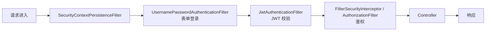

# Spring Security 安全框架

Spring Security 是事实上的 Java 安全框架。从认证（你是谁）到授权（你能做什么），从 Web 请求到方法调用，覆盖完整安全体系。Spring Boot 3 配套的是 Spring Security 6.x。

## 快速上手 {#quick-start}

加依赖即可开启安全防护（默认所有路径需要认证）：

```xml
<dependency>
    <groupId>org.springframework.boot</groupId>
    <artifactId>spring-boot-starter-security</artifactId>
</dependency>
```

启动后访问任何接口会跳转登录页（HTTP Basic）。开发期可以临时关闭：

```yaml
spring:
  security:
    user:
      name: admin
      password: admin123    # ⚠️ 仅开发用，生产必须改
```

## SecurityFilterChain：现代配置入口 {#security-filter-chain}

Spring Security 6 推荐**用 Bean 配置**，不再继承 `WebSecurityConfigurerAdapter`（已废弃）：

```java
@Configuration
@EnableWebSecurity
public class SecurityConfig {

    @Bean
    public SecurityFilterChain filterChain(HttpSecurity http) throws Exception {
        return http
            .csrf(csrf -> csrf.disable())    // 前后端分离通常关掉
            .authorizeHttpRequests(auth -> auth
                .requestMatchers("/api/public/**").permitAll()
                .requestMatchers("/api/admin/**").hasRole("ADMIN")
                .anyRequest().authenticated()
            )
            .formLogin(form -> form
                .loginProcessingUrl("/api/login")
                .successHandler((req, resp, auth) -> {
                    resp.setContentType("application/json;charset=utf-8");
                    resp.getWriter().write("{\"token\":\"xxx\"}");
                })
                .failureHandler((req, resp, ex) -> {
                    resp.setStatus(401);
                })
            )
            .logout(logout -> logout
                .logoutUrl("/api/logout")
                .logoutSuccessHandler((req, resp, auth) -> {
                    resp.setStatus(200);
                })
            )
            .exceptionHandling(eh -> eh
                .authenticationEntryPoint((req, resp, ex) -> {
                    resp.setStatus(401);
                    resp.getWriter().write("{\"code\":401,\"msg\":\"未登录\"}");
                })
            )
            .sessionManagement(sm -> sm
                .sessionCreationPolicy(SessionCreationPolicy.STATELESS)  // JWT 模式必须无状态
            )
            .build();
    }

    @Bean
    public PasswordEncoder passwordEncoder() {
        return new BCryptPasswordEncoder();
    }
}
```

## 核心架构与过滤器链 {#filter-chain}

Spring Security 是**过滤器链**模式——每个 Filter 负责一项任务，链式处理：



**关键过滤器职责**：

| 过滤器 | 职责 |
|--------|------|
| `SecurityContextPersistenceFilter` | 加载/保存 SecurityContext |
| `UsernamePasswordAuthenticationFilter` | 表单登录（用户名/密码） |
| `JwtAuthenticationFilter` | JWT Token 校验（自定义） |
| `FilterSecurityInterceptor` / `AuthorizationFilter` | 检查"当前用户能否访问此路径" |
| `ExceptionTranslationFilter` | 把认证/授权异常转为 401/403 响应 |

## 认证（Authentication）：你是谁 {#authentication}

### 三种认证方式对比

| 方式 | 流程 | 适用场景 |
|------|------|----------|
| **表单登录** | 用户名 + 密码 | 传统 Web 应用 |
| **HTTP Basic** | 请求头 `Authorization: Basic base64(user:pass)` | 内部接口、调试 |
| **JWT / Token** | 请求头 `Authorization: Bearer xxx` | 前后端分离、REST API |
| **OAuth2 / OIDC** | 第三方登录（微信/Google） | 接入第三方身份 |

### JWT 实战（前后端分离主流）

**1) 加依赖**：

```xml
<dependency>
    <groupId>io.jsonwebtoken</groupId>
    <artifactId>jjwt-api</artifactId>
    <version>0.12.5</version>
</dependency>
<dependency>
    <groupId>io.jsonwebtoken</groupId>
    <artifactId>jjwt-impl</artifactId>
    <version>0.12.5</version>
    <scope>runtime</scope>
</dependency>
<dependency>
    <groupId>io.jsonwebtoken</groupId>
    <artifactId>jjwt-jackson</artifactId>
    <version>0.12.5</version>
    <scope>runtime</scope>
</dependency>
```

**2) JWT 工具类**：

```java
@Component
public class JwtUtil {
    @Value("${jwt.secret}")
    private String secret;        // 至少 32 字节

    @Value("${jwt.expire-hours:24}")
    private long expireHours;

    public String generate(Long userId, String username) {
        return Jwts.builder()
            .subject(String.valueOf(userId))
            .claim("username", username)
            .issuedAt(new Date())
            .expiration(new Date(System.currentTimeMillis() + 
                    expireHours * 3600 * 1000))
            .signWith(Keys.hmacShaKeyFor(secret.getBytes()))
            .compact();
    }

    public Claims parse(String token) {
        return Jwts.parser()
            .verifyWith(Keys.hmacShaKeyFor(secret.getBytes()))
            .build()
            .parseSignedClaims(token)
            .getPayload();
    }
}
```

**3) JWT 过滤器**：解析请求头、设置 SecurityContext：

```java
@Component
public class JwtAuthenticationFilter extends OncePerRequestFilter {

    @Autowired private JwtUtil jwtUtil;
    @Autowired private UserDetailsService userDetailsService;

    @Override
    protected void doFilterInternal(HttpServletRequest req,
                                     HttpServletResponse resp,
                                     FilterChain chain) 
            throws ServletException, IOException {
        String header = req.getHeader("Authorization");
        if (header != null && header.startsWith("Bearer ")) {
            String token = header.substring(7);
            try {
                Claims claims = jwtUtil.parse(token);
                Long userId = Long.valueOf(claims.getSubject());
                UserDetails userDetails = 
                    userDetailsService.loadUserByUsername(String.valueOf(userId));

                UsernamePasswordAuthenticationToken auth = 
                    new UsernamePasswordAuthenticationToken(
                        userDetails, null, userDetails.getAuthorities());
                SecurityContextHolder.getContext().setAuthentication(auth);
            } catch (Exception e) {
                // Token 无效，不设置 SecurityContext，后续被 401 拦截
            }
        }
        chain.doFilter(req, resp);
    }
}
```

**4) 注册过滤器**：

```java
http.addFilterBefore(jwtAuthenticationFilter, 
                     UsernamePasswordAuthenticationFilter.class);
```

### UserDetailsService：从数据库加载用户

```java
@Service
public class JpaUserDetailsService implements UserDetailsService {

    @Autowired
    private UserRepository userRepo;

    @Override
    public UserDetails loadUserByUsername(String username) 
            throws UsernameNotFoundException {
        User user = userRepo.findByUsername(username)
            .orElseThrow(() -> new UsernameNotFoundException("用户不存在"));
        return org.springframework.security.core.userdetails.User
            .withUsername(user.getUsername())
            .password(user.getPassword())
            .roles(user.getRoles().stream().map(Role::getName).toArray(String[]::new))
            .build();
    }
}
```

## 授权（Authorization）：你能做什么 {#authorization}

### URL 级授权

```java
.authorizeHttpRequests(auth -> auth
    .requestMatchers("/api/public/**").permitAll()      // 公开
    .requestMatchers("/api/admin/**").hasRole("ADMIN")  // 需要 ADMIN 角色
    .requestMatchers("/api/users/**").hasAnyRole("ADMIN", "USER")
    .requestMatchers(HttpMethod.DELETE, "/**").hasAuthority("DELETE")
    .anyRequest().authenticated()
)
```

**注意**：`hasRole("ADMIN")` 等价于 `hasAuthority("ROLE_ADMIN")`——Spring 自动加 `ROLE_` 前缀。

### 方法级授权

在方法上声明权限，最精细：

```java
@Service
public class OrderService {

    @PreAuthorize("hasRole('ADMIN')")
    public void deleteAll() { /* ... */ }

    @PreAuthorize("#userId == authentication.principal.id")
    public Order getOrder(Long userId, Long orderId) {
        // 只允许查询自己的订单
        return orderRepo.findById(orderId).filter(o -> o.getUserId().equals(userId))
                        .orElseThrow(() -> new ResourceNotFoundException("订单不存在"));
    }

    @PostAuthorize("returnObject.userId == authentication.principal.id")
    public Order findOne(Long orderId) { /* ... */ }   // 返回后校验

    @PostFilter("filterObject.userId == authentication.principal.id")
    public List<Order> listAll() { /* ... */ }         // 集合过滤
}
```

启用：

```java
@EnableMethodSecurity(prePostEnabled = true)   // Spring Security 6 默认开启
```

### 注解 vs URL 授权

| 维度 | URL 授权 | 方法注解 |
|------|----------|----------|
| 适用 | 粗粒度路径权限 | 细粒度业务规则（"只能改自己的"） |
| 配置位置 | 集中 SecurityConfig | 分散在业务代码 |
| 动态判断 | 较难 | 容易（SpEL） |

> [!TIP]
> **最佳实践**：URL 授权管"哪些路径需要登录"，方法注解管"业务规则"。两者结合，覆盖完整授权场景。

## 密码加密 {#password-encoding}

```java
@Bean
public PasswordEncoder passwordEncoder() {
    return new BCryptPasswordEncoder();        // 默认 10 轮
}

// 注册时
String encoded = passwordEncoder.encode(rawPassword);
user.setPassword(encoded);

// 登录时自动比对（无需手动比对）
// DaoAuthenticationProvider 内部调 passwordEncoder.matches(rawInput, encoded)
```

**强度调整**：

```java
return new BCryptPasswordEncoder(12);   // 12 轮 = 4 倍慢，安全与性能的折中
```

> [!NOTE]
> **永远不要存明文密码**！BCrypt 自动加盐（每次哈希结果不同），单向加密无法反解。数据库泄露后也无法直接拿到密码。

## CSRF 保护 {#csrf}

CSRF（Cross-Site Request Forgery）：诱导用户在已登录的浏览器中发请求。**默认开启**——所有 POST/PUT/DELETE 必须带 CSRF token。

```java
// 前后端分离项目：通常关闭 CSRF（用 JWT/CORS 替代）
http.csrf(csrf -> csrf.disable());

// 传统 SSR 项目：保留默认 + 模板自动注入 token
// <input type="hidden" name="_csrf" value="${_csrf.token}"/>
```

## SecurityContextHolder 与 ThreadLocal {#security-context}

认证信息存在 `SecurityContextHolder`（底层 `ThreadLocal`）：

```java
// 在 Service 中获取当前用户
@GetMapping("/me")
public User me() {
    Authentication auth = SecurityContextHolder.getContext().getAuthentication();
    String username = auth.getName();
    return userService.findByUsername(username);
}

// 或更优雅：在 Controller 注入
@GetMapping("/me")
public User me(@AuthenticationPrincipal UserDetails user) {
    return userService.findByUsername(user.getUsername());
}
```

> [!WARNING]
> **异步线程丢失 SecurityContext**：默认 `@Async` 新开线程时 `SecurityContext` 不传递。解决方法：

```java
@Bean
public TaskExecutor taskExecutor() {
    ThreadPoolTaskExecutor executor = new ThreadPoolTaskExecutor();
    executor.setTaskDecorator(new DelegatingSecurityContextAsyncTaskExecutor());  // 装饰器
    executor.initialize();
    return executor;
}
```

## 记住我 Remember-Me {#remember-me}

```java
http.rememberMe(rm -> rm
    .tokenRepository(persistentTokenRepository())
    .tokenValiditySeconds(7 * 24 * 3600)    // 7 天
);

@Bean
public PersistentTokenRepository persistentTokenRepository(DataSource ds) {
    JdbcTokenRepositoryImpl repo = new JdbcTokenRepositoryImpl();
    repo.setDataSource(ds);
    return repo;
}
```

```sql
-- Spring Security 内置的 token 表结构
CREATE TABLE persistent_logins (
    username VARCHAR(64) NOT NULL,
    series   VARCHAR(64) PRIMARY KEY,
    token    VARCHAR(64) NOT NULL,
    last_used TIMESTAMP NOT NULL
);
```

## CORS 与 CSRF 的取舍 {#cors-csrf}

```java
http
    .csrf(csrf -> csrf.disable())   // 1. 关 CSRF（前后端分离）
    .cors(cors -> cors.configurationSource(corsConfigurationSource()))   // 2. 开 CORS
    .sessionManagement(sm -> sm
        .sessionCreationPolicy(SessionCreationPolicy.STATELESS));  // 3. 无状态
```

```java
@Bean
public CorsConfigurationSource corsConfigurationSource() {
    CorsConfiguration config = new CorsConfiguration();
    config.setAllowedOriginPatterns(List.of("https://example.com"));
    config.setAllowedMethods(List.of("*"));
    config.setAllowedHeaders(List.of("*"));
    config.setAllowCredentials(true);
    config.setMaxAge(3600L);

    UrlBasedCorsConfigurationSource source = new UrlBasedCorsConfigurationSource();
    source.registerCorsConfiguration("/**", config);
    return source;
}
```

> [!TIP]
> **生产配置心法**：前后端分离 → 关 CSRF + 开 CORS + 无状态 Session + JWT。传统 SSR → 开 CSRF + 不需要 CORS（同源）+ 启用 Remember-Me。

## 集成 OAuth2 / 第三方登录 {#oauth2}

Spring Security 内置 OAuth2 Client 支持：

```xml
<dependency>
    <groupId>org.springframework.boot</groupId>
    <artifactId>spring-boot-starter-oauth2-client</artifactId>
</dependency>
```

```yaml
spring:
  security:
    oauth2:
      client:
        registration:
          github:
            client-id: xxx
            client-secret: xxx
            scope: read:user,user:email
          google:
            client-id: xxx
            client-secret: xxx
            scope: openid,profile,email
```

```java
http.oauth2Login(oauth2 -> oauth2
    .loginPage("/login")
    .defaultSuccessUrl("/home")
);
```

## 常见安全配置模板 {#templates}

### 内部系统：HTTP Basic + IP 白名单

```java
http.authorizeHttpRequests(auth -> auth
    .requestMatchers("/actuator/**").hasIpAddress("127.0.0.1")  // 仅本机
    .anyRequest().authenticated()
).httpBasic(Customizer.withDefaults());
```

### API 服务：JWT + 无状态

```java
http.csrf(csrf -> csrf.disable())
    .cors(cors -> {})
    .sessionManagement(sm -> sm.sessionCreationPolicy(STATELESS))
    .authorizeHttpRequests(auth -> auth
        .requestMatchers("/api/auth/**").permitAll()
        .anyRequest().authenticated()
    )
    .addFilterBefore(jwtAuthenticationFilter, 
                     UsernamePasswordAuthenticationFilter.class)
    .exceptionHandling(eh -> eh
        .authenticationEntryPoint(/* 401 JSON */)
        .accessDeniedHandler(/* 403 JSON */)
    );
```

### 传统 Web：表单登录 + 记住我

```java
http.formLogin(Customizer.withDefaults())
    .rememberMe(Customizer.withDefaults())
    .logout(Customizer.withDefaults());
```

## 安全最佳实践 {#best-practices}

1. **永远不存明文密码**——BCrypt/Argon2。
2. **JWT 必须有过期时间**——access token 15-60 分钟，refresh token 7-30 天。
3. **生产关闭 actuator 全部端点**——或叠加 Spring Security 鉴权。
4. **最小权限原则**——默认全部 `authenticated`，业务按需放开。
5. **敏感端点额外加 IP 白名单**——管理后台、监控端点。
6. **密码强度**——至少 8 位 + 复杂度校验，或强制用户改密。
7. **统一异常处理**——401/403 走 `GlobalExceptionHandler`，不泄露细节。
8. **日志审计**——登录、登出、权限错误都记日志。
9. **会话安全**——生产用 HTTPS（`server.servlet.session.cookie.secure=true`）。
10. **依赖扫描**——用 OWASP Dependency-Check 或 Snyk 定期扫漏洞。

## 小结 {#summary}

Spring Security 6 通过 `SecurityFilterChain` Bean 配置，覆盖认证、授权、CSRF、Remember-Me、OAuth2 完整链路。本章重点：

- **现代配置**：`SecurityFilterChain` Bean（替代旧的 `WebSecurityConfigurerAdapter`）。
- **认证**：表单 / HTTP Basic / JWT / OAuth2 四种方式，JWT 是前后端分离主流。
- **授权**：URL 级（粗粒度）+ 方法注解 `@PreAuthorize/@PostAuthorize`（细粒度），两者结合覆盖完整场景。
- **密码加密**：BCrypt 自动加盐单向加密，生产必用。
- **CSRF**：传统 SSR 开、API 关；异步线程要 `DelegatingSecurityContextAsyncTaskExecutor` 传递 SecurityContext。
- **三套生产配置模板**：HTTP Basic 内部 / JWT API / 表单登录传统 Web。
- **安全最佳实践**：10 条高频规范（密码、Token、权限、审计、HTTPS、依赖扫描）。

至此 Spring 教程 7 章全部完成——从 IoC/AOP 基础到 MVC、Web Boot、数据访问、异步缓存、安全，完整覆盖了现代 Spring 开发的知识体系。建议结合示例项目动手实践，并阅读 Spring 源码加深理解。