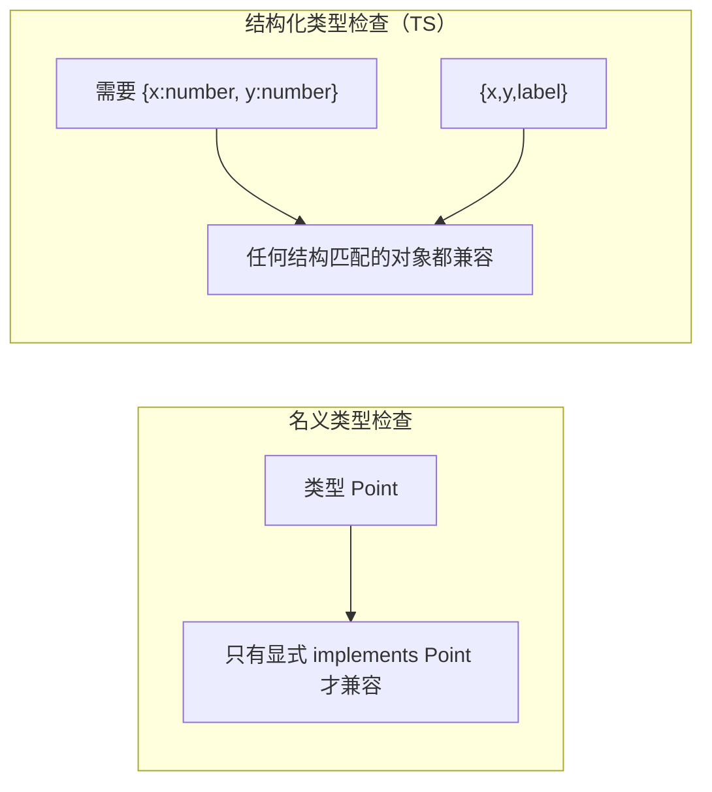

# 基础与类型注解

TypeScript 的核心理念是「**在编译期发现错误**」。它不改变 JS 运行时行为，只是在上层增加了一套类型系统。理解这套类型系统（尤其是**结构化类型检查**）是写好 TS 的前提。

## 为什么需要 TypeScript {#why-ts}

JavaScript 是动态类型语言，很多错误要到运行时才暴露：

```javascript
// JS：运行时才报错
const user = { name: 'Alice' };
console.log(user.nmae.toUpperCase());  // TypeError: Cannot read properties of undefined
```

TypeScript 在**编译期**就能发现这类拼写、类型错误：

```typescript
const user = { name: 'Alice' };
// ❌ 编译报错：Property 'nmae' does not exist on type '{ name: string; }'
console.log(user.nmae.toUpperCase());
```

> [!NOTE]
> TS 的价值：①**提前发现错误**（拼写、类型不匹配、空值）；②**更好的 IDE 体验**（自动补全、跳转、重构）；③**代码即文档**（类型本身就是最精确的说明）。类型检查只在编译期，运行时擦除。

## 安装与使用 {#setup}

```bash
npm install -g typescript        # 全局安装
tsc --version                    # 查看版本
```

```bash
# 初始化项目，生成 tsconfig.json
tsc --init

# 编译单个文件
tsc hello.ts            # 生成 hello.js

# 监听模式（开发常用）
tsc --watch

# 只做类型检查，不产出文件（CI/编辑器常用）
tsc --noEmit
```

## 基本类型 {#basic-types}

```typescript
// 原始类型
let isDone: boolean = false;
let count: number = 42;
let name: string = 'Alice';

// 数组（两种写法等价）
let list1: number[] = [1, 2, 3];
let list2: Array<number> = [1, 2, 3];

// 元组：固定长度 + 固定类型
let tuple: [string, number] = ['Alice', 18];

// 枚举（见第五章）
enum Color { Red, Green, Blue }

// 特殊类型
let notSure: any = 4;        // 任意类型（尽量少用）
let unknown: unknown = 4;    // 未知类型（安全版 any）
let nothing: null = null;
let missing: undefined = undefined;
let never: never;            // 永不返回（如抛异常/死循环）

// void：无返回值
function warn(): void {
  console.log('warning');
}

// never：函数永远不会正常结束
function error(message: string): never {
  throw new Error(message);
}
```

## 类型注解 vs 类型推断 {#annotation-inference}

TS 会**自动推断**类型，大部分情况下不必显式写注解：

```typescript
let num = 42;          // 推断为 number
let str = 'hello';     // 推断为 string
const arr = [1, 2, 3]; // 推断为 number[]

// 只有在推断不出、或需要更精确时才显式注解
let user: { name: string; age: number } = { name: 'Alice', age: 18 };

function add(a: number, b: number): number {
  return a + b;        // 返回值也能推断，但建议显式标注
}
```

> [!TIP]
> 经验法则：**能推断的就别写注解**（减少冗余），但**函数参数和返回值建议显式标注**（作为 API 契约）。类型推断是 TS 强大的原因之一——不加注解也能获得大部分类型安全。

## any vs unknown vs never {#any-unknown-never}

这是最容易混淆的三个特殊类型：

| 类型 | 含义 | 能否赋给任意类型 | 能否访问属性 |
|------|------|:---:|:---:|
| `any` | 完全关闭类型检查 | ✓（危险） | ✓ |
| `unknown` | 类型未知（安全） | ✗（需收窄） | ✗（需收窄） |
| `never` | 永不存在的值 | ✓（never 是任何类型的子类型） | — |

```typescript
let a: any = 'hello';
a.foo.bar();        // 不报错，运行时可能崩

let u: unknown = 'hello';
// u.toUpperCase();  // ❌ 报错：unknown 不能直接调用
if (typeof u === 'string') {
  u.toUpperCase();   // ✅ 收窄后可用
}
```

> [!WARNING]
> **永远优先用 `unknown` 而非 `any`**。`any` 会「传染」——任何与它交互的表达式都失去类型检查，等于在类型系统上开了后门。`unknown` 强制你先收窄类型再使用，是安全的「未知」。

## 核心：结构化类型检查（鸭子类型） {#structural-typing}

这是 TypeScript 与 Java/C# 等语言**最根本的区别**，也是本教程要强调的重点。

TypeScript 的类型检查是**结构化（structural）的**，而非**名义（nominal）的**：判断一个类型是否「兼容」，看的是它的**结构（有哪些成员）**，而不是它的**名字/声明关系**。

```typescript
interface Point {
  x: number;
  y: number;
}

function printPoint(p: Point) {
  console.log(`${p.x}, ${p.y}`);
}

// 这个对象没有「声明」它是 Point，但结构相同，所以兼容 ✅
const myPoint = { x: 10, y: 20, label: 'A' };  // 多一个 label 也没关系
printPoint(myPoint);   // 合法！因为结构上满足 Point

// 这体现了「鸭子类型」：长得像鸭子、叫起来像鸭子，那就是鸭子
```



> [!NOTE]
> **结构化类型检查**（又称鸭子类型 duck typing）的含义：TS 关注的是「值的形状（shape）」，而非「类型的名字」。只要一个对象的成员满足目标类型的要求，它就是兼容的——无需继承、无需显式 `implements`。这是理解 TS 一切类型行为（函数兼容、赋值兼容、泛型约束）的基石。

### 结构化的实际影响 {#structural-implication}

```typescript
interface Named {
  name: string;
}

class Person {
  name: string;
  constructor(name: string) { this.name = name; }
}

let p: Named;
p = new Person('Alice');   // ✅ Person 结构上满足 Named，即使没有 implements
```

```typescript
// 函数参数也遵循结构化：多传属性到「直接字面量」会报错，但变量不会
interface Config { width: number; }

// 直接传对象字面量：多余属性报错（excess property check）
// createConfig({ width: 100, height: 200 });  // ❌ height 多余

// 先存到变量再传：不报错（结构化检查允许额外属性）
const cfg = { width: 100, height: 200 };
createConfig(cfg);   // ✅
```

> [!WARNING]
> 上面这个「多余属性检查」是新手常困惑的点：**对象字面量直接传入会做严格的多余属性检查**，而先赋给变量再传则不检查。本质仍是结构化（变量类型是 `{width,height}`，它满足 `{width}`），只是字面量有额外限制。

## 小结 {#summary}

本章建立了 TypeScript 的基础：安装编译、基本类型、类型注解与推断，以及 `any`/`unknown`/`never` 的区别。最核心的是理解了 **结构化类型检查（鸭子类型）**——TS 按「结构」而非「名字」判断类型兼容，这是它与名义类型语言的根本区别，也是后续所有类型知识的基石。下一章学习接口与类型别名。
