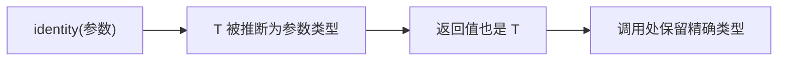

# 泛型与工具类型

泛型（generics）让类型「参数化」，一次定义、多处复用；工具类型（utility types）是 TS 内置的常用类型变换。这两者是写出「高质量类型」的关键。

## 泛型函数 {#generic-function}

泛型用 `<T>` 声明类型参数，让函数能处理多种类型，同时保持类型安全：

```typescript
// 不用泛型：返回 any，丢失类型信息
function identity(arg: any): any {
  return arg;
}
const a = identity('hello');   // a 是 any

// 用泛型：保留类型
function identity<T>(arg: T): T {
  return arg;
}
const b = identity('hello');   // b 是 string（自动推断）
const c = identity<number>(42); // 也可显式指定
```



### 泛型约束 extends {#generic-constraint}

用 `extends` 限制类型参数必须满足某结构：

```typescript
// T 必须具有 length 属性
function logLength<T extends { length: number }>(arg: T): T {
  console.log(arg.length);
  return arg;
}

logLength('hello');      // ✅ string 有 length
logLength([1, 2, 3]);    // ✅ 数组有 length
// logLength(42);        // ❌ number 没有 length
```

```typescript
// 用 keyof 约束属性名（常用）
function getProperty<T, K extends keyof T>(obj: T, key: K): T[K] {
  return obj[key];
}

const user = { name: 'Alice', age: 18 };
getProperty(user, 'name');   // ✅ 返回 string
getProperty(user, 'age');    // ✅ 返回 number
// getProperty(user, 'xxx'); // ❌ 'xxx' 不是 user 的 key
```

### 泛型默认值 {#generic-default}

```typescript
interface ApiResponse<T = unknown> {
  code: number;
  data: T;
}

const r1: ApiResponse = { code: 0, data: 'anything' };  // 不指定则 unknown
const r2: ApiResponse<string> = { code: 0, data: 'hi' };
```

## 泛型接口与类 {#generic-interface}

```typescript
interface Repository<T> {
  find(id: number): T;
  save(entity: T): void;
}

class UserRepo implements Repository<User> {
  find(id: number): User { /* ... */ }
  save(user: User): void { /* ... */ }
}
```

## 内置工具类型 {#utility-types}

TS 提供了一批内置的「类型变换」工具，日常开发高频使用：

### Partial / Required：可选与必选 {#partial-required}

```typescript
interface User {
  name: string;
  age: number;
  email: string;
}

type PartialUser = Partial<User>;   // 所有属性变可选
// { name?: string; age?: number; email?: string }

type RequiredUser = Required<Partial<User>>;  // 所有属性变必选

// 常见场景：更新接口只需传部分字段
function updateUser(id: number, patch: Partial<User>) {
  // patch 里的字段都是可选的
}
updateUser(1, { age: 19 });   // ✅ 只传 age
```

### Pick / Omit：挑选与剔除 {#pick-omit}

```typescript
type UserBasic = Pick<User, 'name' | 'age'>;
// { name: string; age: number }

type UserWithoutEmail = Omit<User, 'email'>;
// { name: string; age: number }
```

### Record：构造键值映射 {#record}

```typescript
// Record<K, V>：键为 K、值为 V 的对象
type Role = 'admin' | 'user' | 'guest';
type Permissions = Record<Role, boolean>;
// { admin: boolean; user: boolean; guest: boolean }

const perms: Permissions = {
  admin: true,
  user: false,
  guest: false,
};
```

### ReturnType / Parameters：从函数取类型 {#returntype-parameters}

```typescript
function getUser() {
  return { id: 1, name: 'Alice' };
}

type User = ReturnType<typeof getUser>;   // 取函数返回值类型
// { id: number; name: string }

type Args = Parameters<typeof getUser>;   // 取函数参数类型（元组）
// []
```

```typescript
// 从已有函数「反推」类型，避免重复定义
type Config = ReturnType<typeof loadConfig>;
```

### 其他常用工具类型 {#more-utility}

```typescript
interface User { name: string; age: number; email: string; }

type ReadonlyUser = Readonly<User>;       // 所有属性只读
type NullableUser = Partial<User>;        // 同 Partial
type NonNull<T> = NonNullable<T>;         // 去除 null/undefined

// 提取联合类型的某部分
type Status = 'success' | 'error' | 'pending';
type SuccessOrError = Exclude<Status, 'pending'>;   // 'success' | 'error'
type ErrorOnly = Extract<Status, 'error'>;          // 'error'
```

## 自定义工具类型 {#custom-utility}

理解工具类型，就能自己写。核心是 `keyof` + 映射类型（详见第五章）：

```typescript
// 自定义：把某类型的所有属性变成可选且可 null
type Nullable<T> = { [K in keyof T]: T[K] | null };

interface User { name: string; age: number; }
type NullableUser = Nullable<User>;
// { name: string | null; age: number | null }
```

## 类型守卫 type guard {#type-guard}

类型守卫是「收窄类型」的可复用函数。用 `is` 关键字定义：

```typescript
interface Fish { swim(): void; }
interface Bird { fly(): void; }

// 自定义类型守卫：返回 arg is Fish
function isFish(animal: Fish | Bird): animal is Fish {
  return 'swim' in animal;
}

function move(animal: Fish | Bird) {
  if (isFish(animal)) {
    animal.swim();   // 收窄为 Fish
  } else {
    animal.fly();    // 收窄为 Bird
  }
}
```

> [!NOTE]
> `x is Type` 是类型谓词（type predicate），告诉编译器「当函数返回 true 时，参数就是 Type」。它把「判断逻辑」封装成「可复用的收窄」，避免在每处重复写 `in`/`typeof` 判断。

## 小结 {#summary}

本章掌握了泛型（类型参数化）与工具类型（类型变换）：泛型函数/约束 `extends`/默认值、泛型接口，以及 `Partial`/`Required`/`Pick`/`Omit`/`Record`/`ReturnType` 等高频内置工具类型，并学习了自定义类型守卫。核心价值：**让类型可复用、可变换，减少重复、保持精确**。下一章学习高级类型（条件类型、映射类型）与工程实践。
