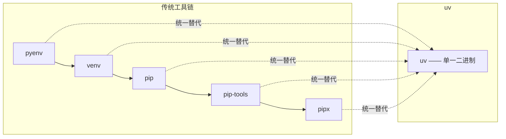

# 简介与安装

uv 由 Astral 团队（Python 生态明星工具 Ruff 的作者）用 Rust 编写，目标是用**一个命令替代整个 Python 工具链**。它速度快、内存占用低、且功能整合度高，是当前 Python 开发者最值得上手的工具之一。

## 为什么需要 uv {#why-uv}

传统的 Python 工具链是「多个工具拼凑」起来的，各管一摊、互不兼容：

| 需求 | 传统工具 | uv 对应命令 |
|------|---------|-----------|
| 安装 Python 版本 | pyenv | `uv python install` |
| 创建虚拟环境 | venv / virtualenv | `uv venv` |
| 安装依赖 | pip | `uv add` / `uv pip install` |
| 锁定依赖 | pip-tools | `uv lock` |
| 同步依赖 | `pip install -r` | `uv sync` |
| 运行一次性工具 | pipx | `uv tool run` / `uvx` |
| 项目管理 | poetry / pdm | `uv init` + `uv run` |

uv 的核心价值：

- **极快**：Rust 实现 + 全局缓存 + 并行下载，冷安装比 pip 快 10–100 倍。
- **统一**：Python 版本、虚拟环境、依赖、项目、工具，一个二进制全搞定。
- **可靠**：严格的依赖解析器，锁文件保证可复现构建。



## 安装 {#install}

uv 提供预编译二进制，无需依赖已有的 Python 环境即可安装。

### macOS / Linux {#install-unix}

```bash
curl -LsSf https://astral.sh/uv/install.sh | sh
```

### Windows {#install-windows}

```powershell
powershell -ExecutionPolicy ByPass -c "irm https://astral.sh/uv/install.ps1 | iex"
```

### 其他方式 {#install-alt}

```bash
# 用 pip 安装（若已有 Python）
pip install uv

# 用 pipx 安装
pipx install uv

# macOS Homebrew
brew install uv

# 用已有的 uv 更新自己
uv self update
```

### 验证安装 {#verify}

```bash
uv --version
# uv 0.12.x
```

> [!NOTE]
> uv 是**静态编译的单文件**，安装后无需配置 Python 即可运行。它会把可执行文件放到 `~/.local/bin`（Unix）或 `~\.local\bin`（Windows），确保该目录在 `PATH` 里即可。

## 与 pip / poetry 的对比 {#comparison}

| 维度 | pip | poetry | uv |
|------|-----|--------|-----|
| 实现 | Python | Python | **Rust** |
| 速度 | 慢 | 较慢 | **极快（10–100x）** |
| Python 版本管理 | 无（需 pyenv） | 无 | **内置** |
| 虚拟环境 | 需 venv | 内置 | **内置（自动）** |
| 锁文件 | 无（靠 pip-tools） | poetry.lock | **uv.lock（更规范）** |
| 项目管理 | 无 | 有 | **有** |
| 依赖解析 | 简单回溯 | 有 | **严格、快速** |

> [!TIP]
> uv 不是「又一个 pip 替代品」，而是**整合了 pip + venv + pyenv + pipx + poetry 的整体解决方案**。老项目可以用 `uv pip` 无缝兼容 pip 的工作流，新项目用 `uv init` 获得完整的项目管理体验。

## 关键概念速览 {#concepts}

- **环境（environment）**：即虚拟环境，隔离每个项目的依赖。
- **项目（project）**：含 `pyproject.toml` 的目录，uv 会识别并自动管理其环境。
- **锁文件（uv.lock）**：记录解析后的精确版本，保证团队/CI 构建一致。
- **缓存（cache）**：`~/.cache/uv`，跨项目复用下载，是「快」的关键。

## 小结 {#summary}

本章认识了 uv 的定位——用 Rust 统一 Python 工具链的极速工具，并完成了安装。它内置 Python 版本管理、虚拟环境、依赖解析与项目管理，比 pip 快 10–100 倍。下一章学习如何用 uv 管理 Python 版本和虚拟环境。
