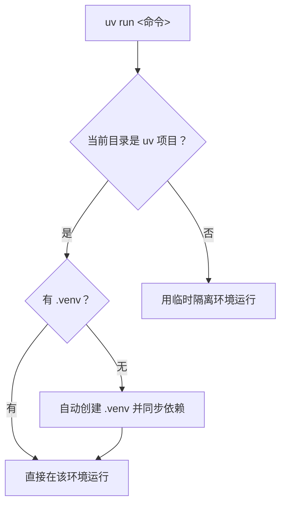

# Python 与虚拟环境管理

uv 内置了 Python 版本管理（替代 pyenv）和虚拟环境管理（替代 venv），并且能**自动**为项目创建和激活环境，省去手动 `source activate` 的繁琐。

## 管理 Python 版本 {#python-versions}

### 列出可安装的版本 {#list-python}

```bash
uv python list           # 列出所有可下载的 Python 版本
uv python list --all     # 含所有 patch 版本
```

### 安装指定版本 {#install-python}

```bash
uv python install 3.12        # 安装最新 3.12.x
uv python install 3.11.8      # 安装精确版本
uv python install 3.12 3.13   # 一次装多个
```

### 查找已安装的 Python {#find-python}

```bash
uv python find 3.12    # 查找本机某版本的 Python 路径
```

> [!NOTE]
> uv 会优先使用系统已有的 Python；找不到时自动从官方渠道下载**预编译**的 CPython，无需本机编译。也支持 PyPy：`uv python install pypy`。

## 创建虚拟环境 {#venv}

### 显式创建 {#create-venv}

```bash
uv venv                # 在当前目录创建 .venv（用默认 Python）
uv venv myenv          # 指定环境目录名
uv venv --python 3.12  # 用指定 Python 版本创建
```

### 激活环境 {#activate}

激活后，`python`、`pip` 等命令指向虚拟环境：

```bash
# Unix
source .venv/bin/activate

# Windows
.venv\Scripts\activate
```

退出用 `deactivate`。

> [!TIP]
> 传统 `venv` 需要手动 `source activate`，而 uv 的 `uv run` 可以**免激活**直接在该项目环境里运行命令，见下一节。

## 免激活：uv run 自动环境 {#uv-run-env}

这是 uv 最爽的体验之一——**不需要手动激活**，用 `uv run` 直接在项目环境里执行：

```bash
uv run python script.py        # 在项目虚拟环境里运行
uv run pytest                  # 运行环境里的 pytest
uv run python -c "import sys; print(sys.prefix)"   # 看用的是哪个环境
```

`uv run` 的行为：

1. 若当前目录是 uv 项目（有 `pyproject.toml`），自动使用（或创建）项目的 `.venv`。
2. 若命令依赖未安装，会**自动同步** `uv.lock` 里的依赖再运行。
3. 若无项目，则在临时隔离环境里运行。



## 指定项目使用的 Python 版本 {#pin-python}

在 `pyproject.toml` 里声明项目需要的 Python 版本，uv 会自动找/装对应版本：

```toml
[project]
name = "my-app"
version = "0.1.0"
requires-python = ">=3.12"    # 项目要求 Python ≥ 3.12
```

之后 `uv run`、`uv sync` 都会优先使用满足该约束的 Python；若本地没有，uv 会自动下载。

> [!NOTE]
> `requires-python` 是 PEP 621 标准字段，声明了**项目支持的 Python 版本范围**。uv 据此选择解释器，并用于依赖解析（排除不兼容该范围的包版本）。

## 清理缓存与 Python {#cleanup}

```bash
uv cache clean            # 清理依赖缓存
uv python uninstall 3.11  # 卸载某 Python 版本
```

## 小结 {#summary}

本章掌握了用 uv 管理 Python 版本（`uv python install/list/find`）与虚拟环境（`uv venv`），以及杀手级特性 `uv run` 的免激活自动环境。记住核心：**uv 能自动创建和激活环境，`uv run` 让你告别手动 activate**。
