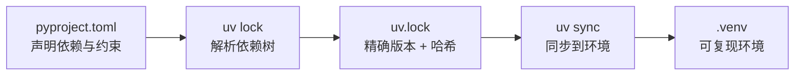

# 依赖管理

uv 的依赖管理分两套接口：**项目接口**（`uv add`/`uv remove`/`uv sync`，面向 uv 项目）和 **pip 兼容接口**（`uv pip install` 等，面向老项目/临时环境）。新项目推荐用项目接口。

## 项目接口：uv add / remove {#add-remove}

### 添加依赖 {#add}

```bash
uv add requests            # 添加最新版 requests
uv add "django>=5.0"       # 带版本约束
uv add "fastapi[all]"      # 带 extras
uv add --dev pytest        # 添加为开发依赖（不进发布依赖）
```

执行 `uv add` 会同时做三件事：写入 `pyproject.toml`、更新 `uv.lock`、安装到环境。

### 删除依赖 {#remove}

```bash
uv remove requests
```

### 查看依赖树 {#tree}

```bash
uv tree                    # 查看完整依赖树
uv tree --depth 1          # 限制深度
uv tree --invert flask     # 反向查看「谁依赖了 flask」
```

## uv sync 同步依赖 {#sync}

`uv sync` 让环境**精确匹配** `uv.lock`：安装缺失的、卸载多余的、保持版本一致。

```bash
uv sync                    # 同步默认 + dev 依赖
uv sync --no-dev           # 跳过 dev 依赖（生产部署常用）
uv sync --frozen           # 严格按 lock 文件，不重新解析
```

> [!NOTE]
> `uv sync` 的语义类似「声明式同步」：环境最终状态由锁文件决定。团队协作时，你 `git pull` 后跑一次 `uv sync` 即可获得与他人完全一致的环境。

## uv lock 锁定依赖 {#lock}

```bash
uv lock                    # 解析依赖并生成/更新 uv.lock
uv lock --check            # 只检查 lock 是否最新，不修改（CI 常用）
```

`uv.lock` 是**跨平台**的锁文件，记录精确版本与哈希，保证可复现构建。它应提交进版本库。



## 依赖来源与约束 {#sources}

### 指定来源（Git、路径、本地） {#sources}

```bash
# 从 Git 仓库安装
uv add "package @ git+https://github.com/user/repo.git"

# 从本地路径安装（开发本地库）
uv add "mylib @ ../mylib"

# 从文件
uv add "pkg @ file:///path/to/pkg.whl"
```

### 版本约束语法 {#constraints}

```bash
uv add "requests>=2,<3"     # 范围
uv add "requests==2.31.0"   # 精确
uv add "requests~=2.31"     # 兼容版本（>=2.31,<3.0）
uv add "requests!=2.31.0"   # 排除
```

## pip 兼容接口 {#pip-compat}

对于**没有 pyproject.toml 的老项目**，或想无缝从 pip 迁移，uv 提供了 `uv pip` 子命令，用法与 pip 几乎一致：

```bash
uv pip install requests flask          # 安装（自动用当前环境/.venv）
uv pip install -r requirements.txt     # 从 requirements 安装
uv pip install "django>=5.0"
uv pip uninstall requests              # 卸载
uv pip list                            # 列出
uv pip freeze > requirements.txt       # 导出
uv pip compile requirements.in         # 类似 pip-tools，生成锁定文件
```

> [!TIP]
> `uv pip` 需要**先激活虚拟环境**或指定 `VIRTUAL_ENV`，否则会装到系统 Python（与 pip 行为一致）。项目接口（`uv add`）则无此顾虑，会自动管理环境。

### 迁移：从 pip 到 uv {#migrate}

```bash
# 老项目：用 uv pip 无缝替换 pip，体验提速
uv pip install -r requirements.txt

# 进阶：迁移到 uv 项目管理
uv init                    # 生成 pyproject.toml
uv add -r requirements.txt # 把 requirements 里的依赖加入项目
uv sync
```

## 小结 {#summary}

本章掌握了 uv 的两套依赖接口：项目接口（`uv add`/`remove`/`sync`/`lock`/`tree`，声明式、自动管理环境）和 pip 兼容接口（`uv pip ...`，平滑迁移老项目）。核心记住 `uv add` 改依赖、`uv sync` 同步环境、`uv.lock` 保证可复现。
