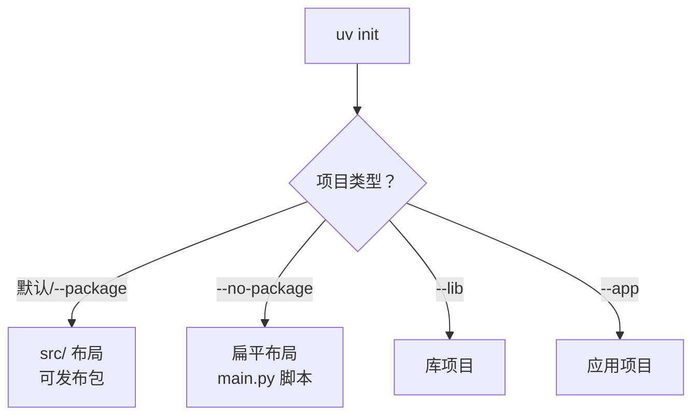

# 项目管理

uv 不只是包管理器，还能像 poetry 一样**管理整个项目**：初始化项目结构、声明元数据与依赖、用 `uv run` 统一运行命令。

## uv init 创建项目 {#init}

```bash
uv init my-app        # 在当前目录下创建 my-app 项目
cd my-app
uv init               # 或在已有目录里初始化
```

生成的结构（**uv 0.12+ 默认**）：

```text
my-app/
├── pyproject.toml
├── README.md
├── uv.lock            # 首次 sync 后生成
└── src/
    └── my_app/
        └── __init__.py
```

> [!WARNING]
> uv 0.12（2026-07）起，`uv init` **默认把新项目创建成「可发布包」**（src 布局 + `uv_build` 构建后端）。若你只想写个脚本或内部工具，用 `--no-package` 得到旧的扁平结构。老项目不受影响。

### 选择项目布局 {#layout}

```bash
uv init my-app               # 默认：src 布局（可发布包）
uv init --no-package my-app  # 扁平布局：main.py + 无构建系统（脚本/内部工具）
uv init --package my-app     # 显式指定包布局（= 默认）
uv init --lib my-app         # 库项目
uv init --app my-app         # 应用项目
```



## pyproject.toml 结构 {#pyproject}

`uv init` 生成的 `pyproject.toml` 遵循 PEP 621 标准：

```toml
[project]
name = "my-app"
version = "0.1.0"
description = "Add your description here"
readme = "README.md"
requires-python = ">=3.12"
dependencies = []              # uv add 会写到这里

[dependency-groups]            # 开发依赖组
dev = []

[build-system]                 # 0.12 默认用 uv_build
requires = ["uv_build"]
build-backend = "uv_build"
```

> [!NOTE]
> `dependencies` 是**运行依赖**，`[dependency-groups].dev` 是**开发依赖**（等价 poetry 的 dev-dependencies）。`uv add --dev xxx` 会写到 dev 组。

## uv run 运行项目 {#run}

`uv run` 是项目的统一入口，自动使用项目环境：

```bash
uv run main.py                 # 运行脚本
uv run python main.py          # 用项目环境运行
uv run pytest                  # 运行项目里的测试
uv run streamlit run app.py    # 运行任意已安装的 CLI
```

对于声明了入口脚本（`[project.scripts]`）的包项目，可直接运行：

```toml
[project.scripts]
my-app = "my_app:main"
```

```bash
uv run my-app    # 直接调用入口命令
```

## 定义可执行脚本入口 {#scripts}

包项目可在 `pyproject.toml` 声明命令行入口：

```toml
[project.scripts]
hello = "my_app.cli:main"
```

安装后（`uv sync` 或 `uv tool install`），即可在终端用 `hello` 命令。

## uv tool：管理全局 CLI 工具 {#tool}

`uv tool` 替代 pipx，用来安装**可独立运行的 CLI 工具**（如 ruff、black、httpie）：

```bash
uv tool install ruff           # 安装到隔离环境
uv tool install "ruff>=0.5"
uvx ruff --version             # 免安装临时运行（类似 pipx run）
uv tool run ruff check .       # 等价 uvx
uv tool list                   # 列出已安装工具
uv tool uninstall ruff         # 卸载
```

> [!TIP]
> `uvx` 是 `uv tool run` 的简写，适合「临时跑一下某个工具」而不永久安装。日常格式化/检查代码：`uvx ruff format .`、`uvx black .`。

## 小结 {#summary}

本章掌握了 uv 的项目管理能力：`uv init` 创建项目（注意 0.12 默认 src 布局）、`pyproject.toml` 的 PEP 621 结构、`uv run` 统一运行、`[project.scripts]` 定义入口、`uv tool`/`uvx` 管理全局 CLI 工具。这些让 uv 成为一个完整的项目工作流，而非单纯的「装包工具」。
